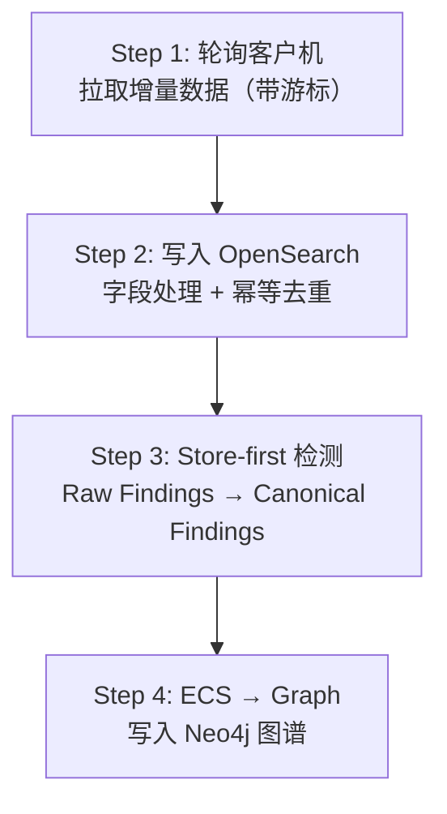

# Attack Trace Analyzer（恶意攻击行为溯源分析系统）

Attack Trace Analyzer (ATA) 是一个分布式安全监控与溯源分析系统：
在客户机侧采集主机行为 / 系统日志 / 网络流量，在中心机侧完成检测融合、图谱构建与可视化溯源。

- 中心机：`backend/`（FastAPI）+ `frontend/`（Next.js）
- 客户机：`client/`（Falco/Filebeat(+Sigma)/Suricata + RabbitMQ + Go 后端）
- 课程交付文档（唯一正式文档）：`new-docs/`

## 快速链接

- 文档入口：`new-docs/README.md`
- 一键编排（靶场 / 演示固定流程）：`new-docs/90-运维与靶场/92-一键编排.md`
- 环境变量与配置规范（权威口径）：`new-docs/80-规范/89-环境变量与配置规范.md`
- 后端测试说明：`backend/tests/README.md`

## 核心能力（概览）

- 多源采集：Falco（主机行为）/ Filebeat（系统日志）/ Suricata（网络流量）
- 数据规范：ECS 字段归一化 + 幂等去重
- 双引擎存储：OpenSearch（事件/告警检索）+ Neo4j（实体关系图谱）
- 溯源分析：前端点选节点 → 创建异步任务 → 图算法计算 → 结果回写图谱 → 前端轮询展示
- APT 相似度（可选）：基于 MITRE ATT&CK CTI（离线 STIX bundle）做 TTP 相似度匹配

## 架构概览（中心机侧）

中心机采用“单定时器四步流水线”，每个 tick 严格顺序执行：



更完整的机制、数据分层与验收/复现剧本，请直接阅读 `new-docs/`（README 只保留“怎么跑起来”）。

## 快速启动（本地单机：中心机）

本节面向本地开发/演示：启动 OpenSearch + Neo4j + 后端 API + 前端 UI。

### 0) 先决条件

- Docker Desktop（或 Linux Docker Engine）+ Docker Compose v2（`docker compose`）
- Python 3.12+（后端）+ `uv`
- Node.js（建议 20+ LTS）+ `npm`

macOS（Homebrew）常用安装方式：

```bash
brew install uv node
```

### 1) 启动中心机依赖（OpenSearch + Neo4j）

`backend/docker-compose.yml` 需要 `backend/.env`（用于 `env_file`）。仓库已提供模板：

```bash
cd backend
cp .env.example .env
docker compose up -d
```

验证：

- OpenSearch：`https://localhost:9200`（开发环境为自签名证书；用 `curl -k`）
- OpenSearch Dashboards：`http://localhost:5601`
- Neo4j Browser：`http://localhost:7474`

### 2) 下载 MITRE ATT&CK CTI（推荐）

TTP 相似度分析依赖本地离线 CTI 数据（仓库默认不提交大文件，已在 `.gitignore` 中忽略）。

```bash
cd backend
./scripts/fetch_mitre_attack_cti.sh
```

默认会下载到：
`backend/app/services/analyze/ttp_similarity/cti/enterprise-attack.json`

你也可以用 `ATTACK_CTI_PATH` 指定输出路径（脚本支持 `--force` 强制刷新）。

### 3) 启动后端（FastAPI）

```bash
cd backend
uv sync
uv run uvicorn main:app --reload --host 0.0.0.0 --port 8000
```

后端会在启动时：初始化 OpenSearch 索引、启动客户机轮询、启动溯源任务 runner。

常用访问地址：

- 后端根路由：`http://localhost:8000/`
- 健康检查：`http://localhost:8000/health`
- API 文档（Swagger UI）：`http://localhost:8000/docs`

注意：后端应用不会自动加载 `backend/.env`。如果你修改了 Docker Compose 中的账号/密码/地址，需要在启动后端时显式导出：

- OpenSearch：`OPENSEARCH_NODE` / `OPENSEARCH_USERNAME` / `OPENSEARCH_PASSWORD`
- Neo4j：`NEO4J_URI` / `NEO4J_USER` / `NEO4J_PASSWORD`

另外，LLM 默认配置为 `deepseek`（仅部分分析模块使用）。本地离线开发建议：

```bash
export LLM_PROVIDER=mock
```

### 4) 启动前端（Next.js）

前端通过服务端路由代理调用后端，需要配置 `BACKEND_BASE_URL`。

```bash
cd frontend
cp .env.example .env.local
npm install
npm run dev
```

访问：`http://localhost:3000`

如果看到 `BACKEND_BASE_URL is not configured.`，说明 `frontend/.env.local` 未生效或变量名写错。

## （可选）启动客户机采集栈（Linux 节点）

客户机侧 `docker-compose` 需要特权能力（Falco/Suricata），目标运行环境为 Linux 主机（不建议在 macOS 上直接跑）。

<details>
<summary>展开：单节点客户机快速启动</summary>

```bash
cd client
cp .env.example .env

# 重要：客户机 Go backend 启动时会向中心机注册（POST /api/v1/targets/register）。
# 本项目将 SERVER_IP / SELF_IP 固定写在 docker-compose.yml（backend 服务的 environment）里，
# 因此请根据你的靶场环境修改：
#   client/docker-compose.yml -> services.backend.environment.SERVER_IP / SELF_IP

docker compose up -d --build
```

</details>

多节点靶场、网络规划、固定演示启动顺序，请按文档执行：`new-docs/90-运维与靶场/92-一键编排.md`。

## 目录结构

| 目录 | 技术栈 | 说明 |
|---|---|---|
| `client/` | Docker + RabbitMQ + Go | 客户机侧采集/转换/缓冲与对外拉取接口 |
| `backend/` | Python FastAPI + uv | 中心机后端：轮询调度、检测融合、OpenSearch/Neo4j 与 API |
| `frontend/` | Next.js + TypeScript | 中心机前端：图谱可视化、溯源任务交互 |
| `deploy/` | Docker Compose | 靶场辅助组件（如 C2） |
| `new-docs/` | Markdown | 课程交付文档体系（唯一正式文档） |

## 开发与测试

后端测试（更多说明见 `backend/tests/README.md`）：

```bash
cd backend
uv run pytest -q
```

一键导入测试数据 + 运行 KillChain 分析（需要 Neo4j/OpenSearch 可用）：

```bash
cd backend
./scripts/run_test.sh
```

## 常见问题（Troubleshooting）

- OpenSearch 启动失败 / 很慢：优先检查 Docker 内存是否足够；可在 `backend/.env` 调小 `OPENSEARCH_JAVA_OPTS`。
- `curl https://localhost:9200` 报证书错误：开发环境是自签名证书，使用 `curl -k -u admin:...`。
- 后端连不上 OpenSearch/Neo4j：确认 `docker compose up -d` 已启动且端口未被占用；如修改过密码，记得导出对应环境变量。
- 报错 `ATT&CK Enterprise CTI file not found`：执行 `backend/scripts/fetch_mitre_attack_cti.sh` 下载 CTI bundle，或设置 `ATTACK_CTI_PATH`。
- 前端报 `BACKEND_BASE_URL is not configured.`：创建 `frontend/.env.local` 并设置 `BACKEND_BASE_URL=http://localhost:8000`。
- 客户机启动报 `SERVER_IP is required`：检查 `client/docker-compose.yml` 中 `services.backend.environment.SERVER_IP` 是否已按当前靶场配置。

## 免责声明

本仓库主要用于课程设计与安全实验演示，默认口令、开发配置与编排方式不适用于生产环境。
