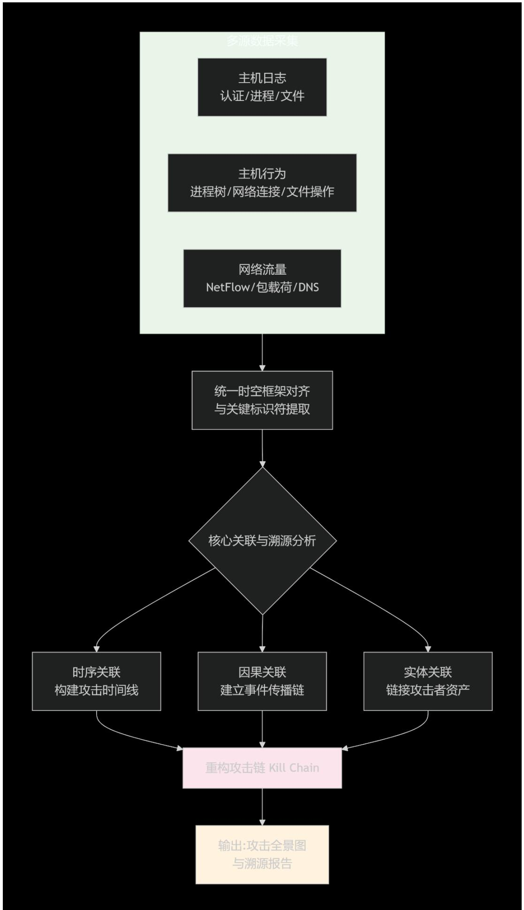

# 网络空间安全与信息安全课程设计要求

> 本仓库对应课程设计选题：**综合性题目｜题目2：基于主机日志、主机行为、网络流量的恶意攻击行为溯源分析系统设计与实现**。  
> 本文档整理了题目要求、组队规则与验收/提交信息，便于团队对齐需求与排期。

## 一、课程设计题目

**题目2：基于主机日志、主机行为、网络流量的恶意攻击行为溯源分析系统设计与实现**

### （1）多源数据采集与融合

**主机日志采集与分析**
- 日志的时间序列对齐：统一不同主机和设备的时钟源，确保事件时间准确性
- 日志范式解析：将不同格式的日志转换为统一范式
- 关键信息提取：识别日志中的关键实体（用户、进程、文件、注册表键值）
- 登录会话重建：通过登录/注销事件重建用户会话时间线和源 IP

**主机行为监控**
- 系统调用拦截：在内核层监控所有系统调用，捕获文件、进程、网络操作
- 进程行为链分析：构建进程父子关系树，识别异常进程创建模式
- 文件操作监控：监控文件创建、修改、删除、读取操作，检测敏感文件访问
- 内存行为分析：检测进程内存中的异常代码注入和反射加载

**网络流量分析**
- 流量捕获与解析
- 异常协议行为建模
- 网络会话重建
- 隐蔽信道检测：识别 DNS 隧道、HTTP 隐蔽信道、ICMP 隧道等

### （2）攻击链检测与关联分析

- **基于 ATT&CK 框架的攻击链识别**：将检测到的事件映射到 ATT&CK 的不同阶段；识别同一攻击者使用的多个技术之间的逻辑关系；与已知 APT 组织的攻击剧本进行相似性匹配
- **多源数据时间线关联分析**：通过在特定时间窗口内聚合相关事件，基于时间先后和逻辑关系推断事件因果关系，从而识别攻击各阶段的时间间隔和模式
- **实体关系图构建**：从日志和流量中抽取实体并建立链接关系

### （3）攻击溯源关键技术

**攻击路径重建**
- 通过边界设备日志识别初始入侵点
- 基于认证日志和网络连接追踪攻击者在内网的移动路径
- 分析权限提升路径，发现跟踪数据从存储到外传的完整路径

**攻击者身份溯源**
- 从攻击工具、脚本、配置文件中提取攻击者指纹特征
- 分析攻击者和 C2 服务器的基础设施关联信息，包括分析 C2 服务器的注册信息、历史记录、关联域名等
- 开展行为模式分析和组织特征匹配，与已知 APT 组织的 TTP 进行匹配分析

### （4）测试环境

搭建包含不少于 **5 个节点** 的靶场环境，在靶场环境中，开展主机日志、主机行为、网络流量等多源数据采集下的恶意攻击行为溯源分析结果验证。

### 参考设计实现思路

---

## 二、课程设计组队方法

综合性题目每个题目最多 **10 人**组成开发小组，合作完成。

可在班内或班间自由组合，在任务分工文件中详细描述各个成员的分工，以及相应的工作量占比。

---

## 三、课程设计考核方式

### 1. 报告提交要求

打包提交以下材料：
- 任务分工说明
- 作品技术原理介绍
- 概要设计报告
- 详细设计报告
- 测试分析报告
- 程序编译和安装使用文档
- 程序源代码
- PPT
- 截屏录像

**包命名方式**：组长班级 + 组长姓名 + 学号 `.rar/.zip`

### 2. 考核要求

采用 PPT + 现场产品展示的方式，PPT 和文档报告按照以下标准进行考核打分：
- 功能完成情况
- 技术可行性和合理性
- 技术的难度和工作量
- 内容条理性
- 格式规范性

现场作品根据以下标准给予打分：
- 小组提交程序的完成情况
- 完成的功能
- 稳定性
- 存在问题的多少
- 技术的合理性
- 技术的难度和自主性
- 程序的开发工作量

### 3. 分组表和答辩顺序

各班学委将分组表汇总到大班学委，大班学委将分组表发送到邮箱：
- yuanjie@bupt.edu.cn
- cuibj@bupt.edu.cn

**分组表需包含**：
- 分组序号
- 所选题目号
- 组长（留手机号）和组员的学号和姓名
- 班号（按照班号由小到大排序）

**答辩顺序**：按照组长的学号由小到大为顺序先后介绍。

### 4. 课程考核信息

- **时间**：2026 年 1 月 16 日
- **地点**：沙河校区 N108
- **形式**：每组进行 10 分钟的 PPT 介绍和作品演示（每组限制时间）
- **准备**：提前到教室来试好演示环境

**考核顺序**：
- 按照班号由小到大排序
- 每个班按照组长的学号由小到大为顺序先后介绍

**时间安排**：
- 上午 8:00–12:00
- 下午 1:00–全部答辩完

**提交要求**：按照老师意见修改并完成报告和提交材料，**晚上 20 点前**提交报告至邮箱：yuanjie@bupt.edu.cn

> 建议同学提前一天自行去教室测试环境和设备，保证验收时的正常演示。

---

## 四、授课老师联系方式

- 崔宝江：13611330827
- 苑洁：13810019079
- 李灵慧：15510108093

### 课程群二维码

群聊：2025 课程设计群

该二维码 7 天内（1 月 19 日前）有效，重新进入将更新。
