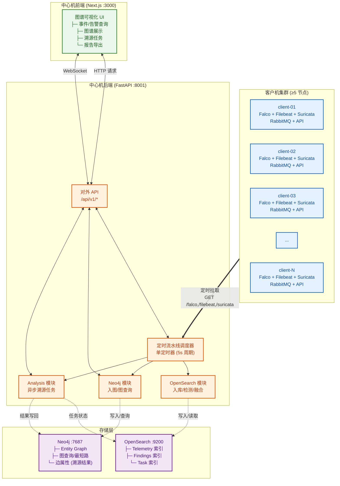
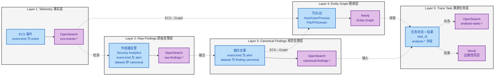
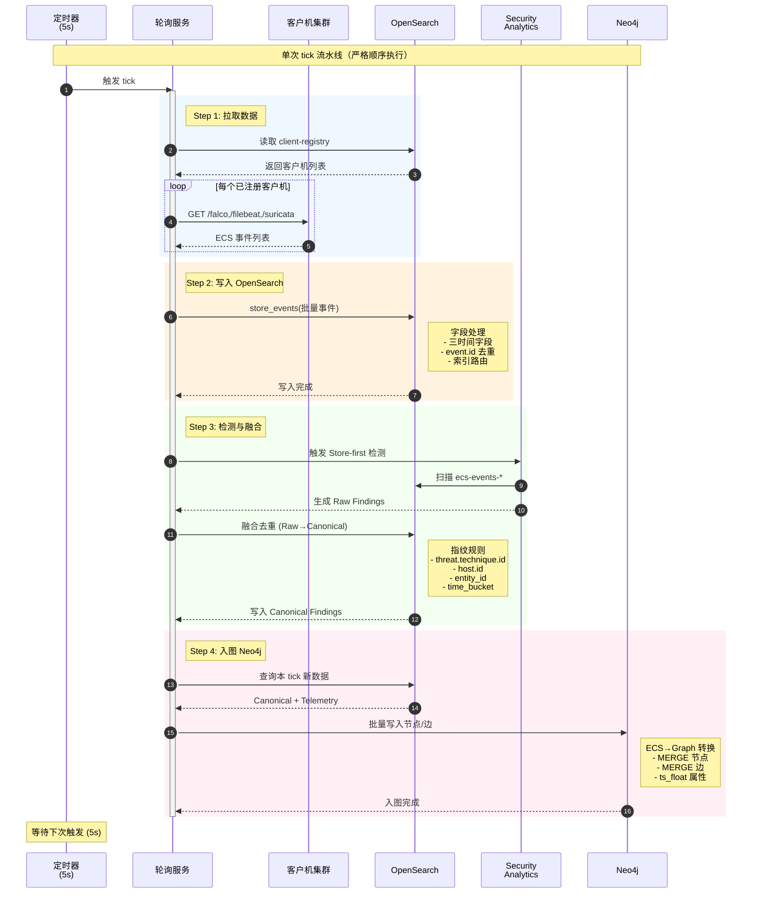
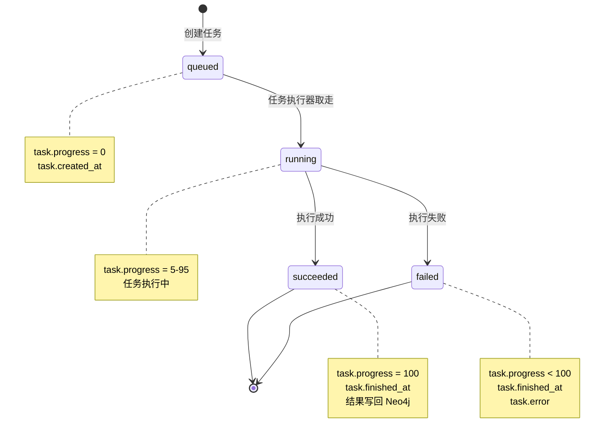

# 系统概要设计

## 0. 文档定位与引用关系

本文件定义系统的**总体架构与关键机制**，尤其是：

- 中心机"单定时器顺序流水线"架构；
- 前端可视化的查询链路；
- 面向老师交互的“异步溯源任务”模型；
- 三大模块（OpenSearch / Neo4j / Analysis）的边界与协作方式。

本文件不重复以下文档的细节：

- 字段口径：`../80-规范/81-ECS字段规范.md`
- 图谱口径：`../80-规范/84-Neo4j实体图谱规范.md`
- 环境变量：`../80-规范/89-环境变量与配置规范.md`
- 客户机与中心机接口：`../80-规范/87-客户机与中心机接口.md`
- OpenSearch 存储：`../50-详细设计/中心机/62-OpenSearch存储与索引治理.md`
- Neo4j 入图与图查询：`../50-详细设计/中心机/64-Neo4j入图与图查询.md`
- Analysis 任务模型：`../50-详细设计/分析/70-任务模型与状态机.md`

## 1. 总体架构

### 1.1 术语与缩略语

为保证文档表述的一致性，本节定义核心术语的含义：

| 术语 | 英文 | 定义 |
|------|------|------|
| **客户机（Client）** | Client | 部署在被监控主机上的数据采集与转换节点，负责采集 Falco、Filebeat、Suricata 三类数据源，转换为 ECS 格式并缓冲在本地队列 |
| **中心机（Center）** | Center Server | 汇聚数据、执行检测与分析的核心服务节点，负责轮询拉取、入库、检测融合、入图、对外 API 与异步溯源任务 |
| **Telemetry** | Telemetry | 遥测数据，指未经检测规则触发的原始观测事件，`event.kind="event"` |
| **Raw Finding** | Raw Finding | 由单一检测规则（如 Sigma 规则、Security Analytics 检测器）产生的初步告警，`event.kind="alert"` 且 `dataset!="canonical"` |
| **Canonical Finding** | Canonical Finding | 经融合去重后的标准化告警，`event.kind="alert"` 且 `dataset="finding.canonical"`，用于图谱入图与溯源分析主输入 |
| **溯源任务（Trace Task）** | Trace Task | 以目标节点为起点、时间窗为边界的溯源分析任务，异步执行并在完成后将结果写回 Neo4j 边属性 |
| **TTP** | Tactics, Techniques, and Procedures | 战术、技术与过程，指 MITRE ATT&CK 框架中对攻击行为的分类与描述 |
| **ECS** | Elastic Common Schema | Elastic 公司定义的通用事件字段规范，用于统一不同数据源的字段命名 |
| **实体图谱** | Entity Graph | 以 Host、User、Process、File、IP、Domain 等实体为节点、以事件为边构成的属性图，存储于 Neo4j |
| **关键路径** | Critical Path | 溯源任务计算出的攻击传播路径，边属性 `analysis.is_path_edge=true` 标记 |
| **顺序流水线** | Sequential Pipeline | 中心机使用单个定时器串行执行轮询、存储、检测、入图四个步骤的架构模式 |

### 1.2 系统组成

系统由"客户机侧"和"中心机侧"组成：

- 客户机侧负责：采集/转换/本地缓冲/对外提供拉取接口；
- 中心机侧负责：定时拉取、入库、检测、融合、入图、对外 API、异步溯源与报告。

### 1.3 系统架构图（逻辑视图）

## 2. 核心数据分层（中心机视角）

### 2.1 数据分层架构

系统只承认以下数据层次（从底到顶）：

### 2.2 数据层次说明

| 层次 | 名称 | 判定条件 | 存储位置 | 用途 |
|------|------|----------|----------|------|
| **Layer 1** | Telemetry（事实层） | `event.kind="event"` | OpenSearch `ecs-events-*` | 原始事件检索、检测输入 |
| **Layer 2** | Raw Findings（原始告警层） | `event.kind="alert"` 且 `dataset!="canonical"` | OpenSearch `raw-findings-*` | 原始告警审计、融合输入 |
| **Layer 3** | Canonical Findings（规范告警层） | `event.kind="alert"` 且 `dataset="canonical"` | OpenSearch `canonical-findings-*` | 图谱与溯源主输入 |
| **Layer 4** | Entity Graph（图谱层） | Telemetry + Canonical 转换 | Neo4j 节点/边 | 图查询、路径分析 |
| **Layer 5** | Trace Task（溯源任务层） | 异步任务创建 | OpenSearch `analysis-tasks-*` + Neo4j 边属性 | 任务状态、溯源结果 |

> 说明：攻击链作为"展示结构"由图谱与任务结果共同承载：前端展示时以图谱边序列+边属性为主，不依赖单独的"链路索引"。

## 3. 中心机定时流水线（单定时器顺序流水线）

### 3.1 调度原则

- 中心机必须使用**单一**定时器触发流水线。
- 定时器周期由环境变量 `CENTER_POLL_INTERVAL_SECONDS` 控制，默认值为 `5` 秒。
- 同一时间只允许存在一个流水线实例在运行：当上一次流水线未结束时，新的定时触发必须被跳过，避免并发写入导致的数据漂移与重复工作。

### 3.1.1 设计决策：为什么采用单定时器顺序流水线架构

**决策内容**：采用单个定时器串行执行轮询、存储、检测、入图四个步骤，而非并发或事件驱动架构。

**决策依据**：

1. **数据一致性保证**：串行执行避免了并发写入导致的事件顺序错乱，确保 Telemetry → Raw → Canonical → Graph 的严格因果顺序
2. **资源可控性**：单线程模型使得 CPU、内存、网络带宽消耗可预测，避免高并发场景下的资源竞争
3. **故障排查简化**：串行流水线的调用链清晰，便于通过日志追踪问题根因
4. **实现简洁性**：避免引入分布式锁、消息队列去重等复杂机制

**代价与权衡**：

- 吞吐量上限受限于单线程处理速度，预计可支撑 ~10 客户机规模
- 单步骤故障会导致后续步骤阻塞，需通过快速失败与错误隔离缓解

### 3.3 流水线输入与输出

- 输入：所有“已注册客户机”的新数据（由轮询拉取接口返回，格式为 ECS 文档）。
- 输出：
  - OpenSearch：Telemetry / Raw Findings / Canonical Findings / Tasks
  - Neo4j：Entity Graph（含溯源任务写回的边属性）

### 3.4 四步顺序与职责（每次 tick 内严格顺序执行）

#### Step 1：从客户机拉取数据

对每个已注册客户机：

1) 中心机读取注册表条目（含 `listen_url`、`client_token_hash` 等元数据）。  
2) 调用客户机拉取接口（见 `../80-规范/87-客户机与中心机接口.md`）。  
3) 客户机从 RabbitMQ 队列中取出消息并返回 ECS 文档列表：
   - 队列为空则返回空数组
   - 拉取行为会消费队列中的消息（队列语义保证“增量”）

#### Step 2：写入 OpenSearch（字段处理）

中心机必须对每条 ECS 文档做字段处理（细节见 `../50-详细设计/中心机/62-OpenSearch存储与索引治理.md` 与 `../80-规范/81-ECS字段规范.md`）：

- 三时间字段补齐与覆盖规则；
- `event.kind` 与 `event.dataset` 校验；
- `event.id` 补齐与幂等去重；
- 按 `event.kind/event.dataset` 路由写入对应索引。

#### Step 3：Store-first 检测 + Raw→Canonical 融合

中心机必须在每个 tick 内执行：

1) 触发 Store-first 检测：由 OpenSearch Security Analytics 对 Telemetry 索引执行扫描；  
2) 读取检测产生的 Findings，并转换为 ECS Finding 文档，写入 `raw-findings-*`；  
3) 对“指定时间窗内”的 Raw Findings 做融合去重，生成 Canonical Findings，写入 `canonical-findings-*`。

融合去重的指纹规则、provider 合并规则与幂等规则由 `../50-详细设计/中心机/62-OpenSearch存储与索引治理.md` 定义。

> 实现口径（与当前代码对齐）：Step 3 在每个 tick 内固定执行（不提供开关），用于持续产出 Raw→Canonical 的规范告警层。

#### Step 4：触发 ECS→Graph 写入 Neo4j

中心机必须在每个 tick 内执行入图：

1) 以 Canonical Findings 为主，补充必要的 Telemetry（用于补边与证据回溯）；  
2) 对每条输入文档执行 ECS→Graph 转换；  
3) 将节点/边写入 Neo4j，并满足 `../80-规范/84-Neo4j实体图谱规范.md` 的唯一键与边属性规范；  
4) 边必须写入 `ts_float`（数值时间戳），支撑时间窗查询与图算法投影。

> 实现口径（与当前代码对齐）：Step 4 在每个 tick 内固定执行；入图以 `event.ingested`（中心机入库时间）为窗口边界，确保本 tick 生成的数据不会遗漏。

### 3.5 流水线时序图

## 4. 前端可视化查询链路

### 4.1 查询边界

- Telemetry / Findings 的检索由 OpenSearch 提供；
- 图谱可视化（节点/边）与路径查询由 Neo4j 提供；
- 前端不得直连数据库，只通过后端 API 访问。

### 4.2 图可视化最小闭环

1) 前端请求后端“图查询接口”（动作包含：时间窗边查询、告警边查询、时间窗最短路）。  
2) 后端调用 Neo4j 模块，返回图数据（nodes/edges）。  
3) 前端渲染图，允许老师点击节点查看其属性与相关边的证据引用。

对应 API 的对外形状由后端路由定义（实现已存在：`/api/v1/graph/query`），模块内部规则见 `../50-详细设计/中心机/64-Neo4j入图与图查询.md`。

## 5. 异步溯源任务（create_task）

### 5.1 为什么必须异步

节点溯源可能涉及：

- 子图扩展与多跳查询；
- 图算法（最短路、风险权重路径等）；
- 解释性生成（TTP 解释与文本说明）。

这些步骤的耗时不稳定，必须以异步任务执行，并对前端提供可轮询的进度状态。

### 5.2 任务模型（状态机）

每个溯源任务在 OpenSearch `analysis-tasks-*` 里保存一条任务文档，任务状态只能取以下值：

**状态说明**：

- `queued`：已创建，等待执行
- `running`：执行中
- `succeeded`：已完成
- `failed`：失败（含错误信息）

**状态转移约束**：
- 只允许 `queued → running → succeeded/failed` 单向转移
- 禁止回退与跳转（如 `running → queued`、`queued → succeeded`）

### 5.3 创建、执行与结果写回

1) 前端在图上选定目标节点后，请求后端创建任务；  
2) 后端立即返回 `task_id`；  
3) Analysis 模块异步执行任务：从 Neo4j 读取数据、执行算法、得到“关键边集合 + 风险评分 + Technique/Tactic 摘要 + 解释文本”；  
4) Analysis 模块把结果写回 Neo4j 边属性，形成“被标注的图”；  
5) 前端轮询任务状态，任务完成后再次请求图查询接口，读取边属性并展示溯源结果。

对应后端 API（固定）：

- 创建任务：`POST /api/v1/analysis/tasks`
- 查询任务状态：`GET /api/v1/analysis/tasks/{task_id}`
- 拉取写回边：`POST /api/v1/graph/query`（`analysis_edges_by_task` 或 `edges_in_window` + 前端过滤）

写回字段命名、覆盖规则与数据类型由 `../50-详细设计/分析/70-任务模型与状态机.md` 与 `../50-详细设计/中心机/64-Neo4j入图与图查询.md` 定义。

### 5.4 KillChain 分析（内部实现）

Analysis 模块的溯源任务内部使用 KillChain 算法重建攻击路径。

KillChain 算法基于 MITRE ATT&CK 战术分段，通过有限状态自动机 (FSA) 识别攻击阶段，并使用大语言模型 (LLM) 选择最合理的段间连接路径，生成完整攻击链解释。

**核心能力**：

1. **战术分段**：基于 MITRE ATT&CK 战术将攻击事件自动分段（Initial Access → Execution → Privilege Escalation → Lateral Movement → C2 → Impact）
2. **路径重建**：识别各战术阶段之间的连接路径
3. **智能选择**：使用 LLM 从候选路径中选择最合理的攻击链
4. **可解释性**：生成 10-20 句中文的全链解释，包含主谓宾结构
5. **置信度评估**：输出可信度评分（0.0-1.0）

**输出结果**：

- `segments[]`：战术分段列表，每个段包含状态、时间范围、锚点、异常边摘要
- `selected_paths[]`：段间连接路径列表
- `explanation`：LLM 生成的完整攻击链解释
- `confidence`：可信度评分

**持久化方式**：

- Neo4j 边属性：`custom.killchain.uuid`（ECS 合规字段）
- 任务文档：`task.result.killchain_uuid` 和 `task.result.killchain`

详细设计见：`50-详细设计/分析/69-KillChain概览设计.md` 和 `74-KillChain结果展示规范.md`

## 6. 安全与审计边界（课程演示）

- 运行环境：靶场内网。中心机所有服务与数据库端口只对靶场内可达网络开放。
- CTI 数据：使用离线 ATT&CK Enterprise CTI 数据包；运行时不依赖外网。
- 数据留痕：所有结论必须能回溯到 `event.id`，并能定位到数据源类型与时间窗范围（证据链）。
