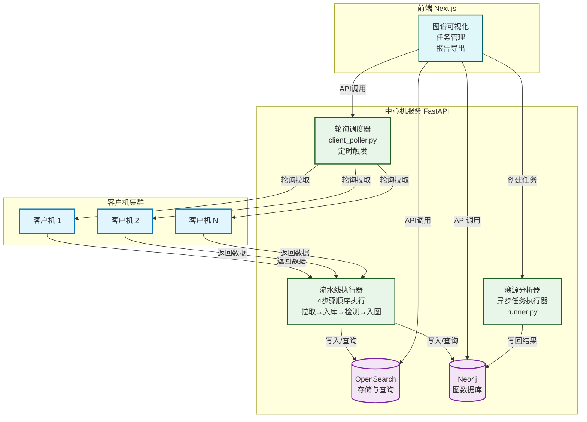
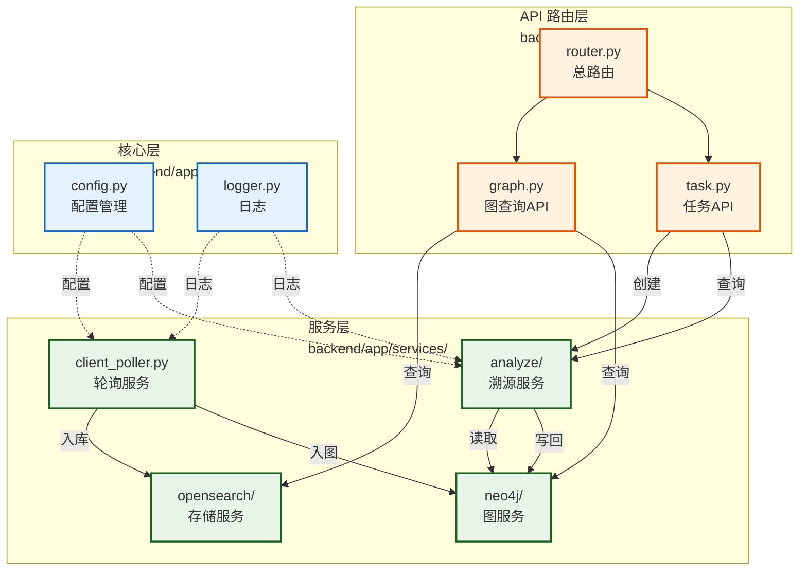
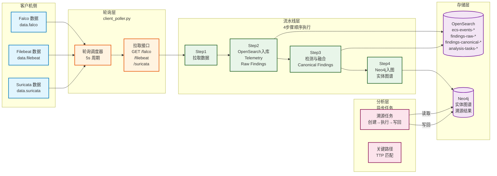

# 总体与代码结构

## 文档目的

本文件给出中心机后端的总体设计与代码结构，明确生命周期、后台任务、路由组织与模块集成点，并索引相关详细设计文档。

## 读者对象

- 负责中心机后端实现与联调的同学
- 负责演示与验收的同学

## 引用关系

- 前端与中心机接口（权威口径）：`../../80-规范/88-前端与中心机接口.md`
- 客户机与中心机接口（权威口径）：`../../80-规范/87-客户机与中心机接口.md`
- 环境变量与配置（权威口径）：`../../80-规范/89-环境变量与配置规范.md`
- OpenSearch 存储治理：`62-OpenSearch存储与索引治理.md`
- Neo4j 入图与图查询：`64-Neo4j入图与图查询.md`
- 检测与告警融合：`63-检测与告警融合.md`
- 注册与轮询：`61-注册与轮询.md`

## 1. 中心机职责边界

中心机作为系统核心组件，承担五项核心职责：

1. **注册管理**：接收客户机注册请求并维护 `client-registry` 注册表；
2. **数据汇聚**：通过周期性轮询从客户机拉取事件，统一写入 OpenSearch；
3. **检测分析**：执行检测引擎触发与告警融合，生成 Canonical Findings；
4. **接口服务**：为前端提供事件查询、告警查询、图查询、任务管理、报告导出等 API 能力；
5. **溯源执行**：运行溯源分析任务并将结果写回 Neo4j 图谱边属性。

## 2. FastAPI 应用生命周期

中心机后端为 FastAPI 应用，入口文件为：

- `backend/main.py`

应用启动后会启动两个后台任务：

1. 客户机轮询服务（轮询拉取并入库）
2. 溯源任务执行器（异步执行任务并写回）

生命周期细节以代码为准，相关模块入口位于：

### 2.1 中心机系统架构

中心机采用 FastAPI 框架构建，通过轮询调度器与流水线执行器协同工作，实现从数据拉取到溯源分析的端到端处理流程。



- `backend/app/services/client_poller.py`
- `backend/app/services/analyze/runner.py`

## 3. 代码目录结构

中心机后端核心代码位于 `backend/app/`：

```
backend/app/
  api/                 路由定义与请求响应模型
  core/                配置、日志、时间工具
  dto/                 DTO 定义
  schemas/             Pydantic schema
  services/
    client_poller.py   轮询服务
    opensearch/        OpenSearch 存储与分析
    neo4j/             Neo4j 入图与图查询
    analyze/           溯源算法与任务执行
```

### 3.1 模块依赖关系



## 4. API 路由组织

路由汇总入口：

- `backend/app/api/router.py`

对外 API 的权威定义见：

- `../../80-规范/88-前端与中心机接口.md`

本文件只说明路由模块的组织方式，不重复接口字段表。

### 4.1 端到端数据流



## 5. 模块集成点

### 5.1 OpenSearch

中心机写入与查询 OpenSearch 的统一入口为：

- `backend/app/services/opensearch/`

入库的字段规范化与去重由 `store_events()` 负责，详见 `62-OpenSearch存储与索引治理.md`。

### 5.2 Neo4j

中心机图查询与入图的入口为：

- `backend/app/services/neo4j/`

详见 `64-Neo4j入图与图查询.md` 与 `../../80-规范/84-Neo4j实体图谱规范.md`。

### 5.3 Analysis

中心机溯源任务与算法入口为：

- `backend/app/services/analyze/`

详见 `../../50-详细设计/分析/`。

## 6. 运维入口

中心机的启动、健康检查、数据清理与演示准备步骤统一在运维文档中定义：

- `../../90-运维与靶场/90-编译安装与使用.md`

