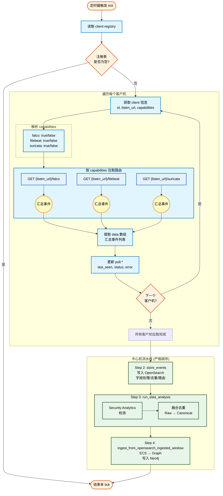
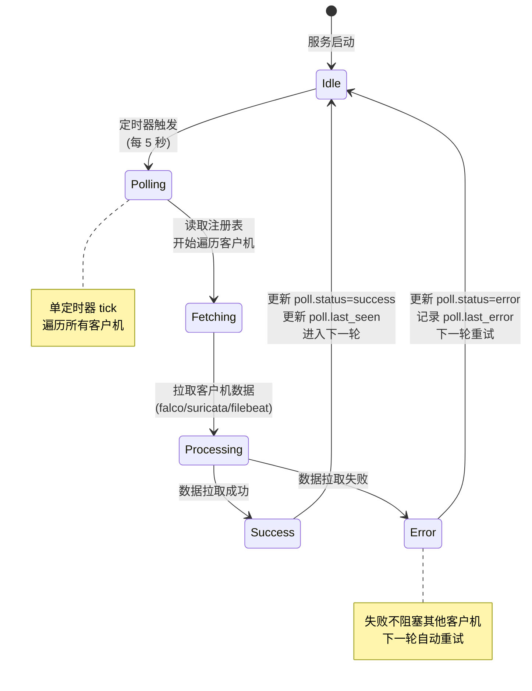
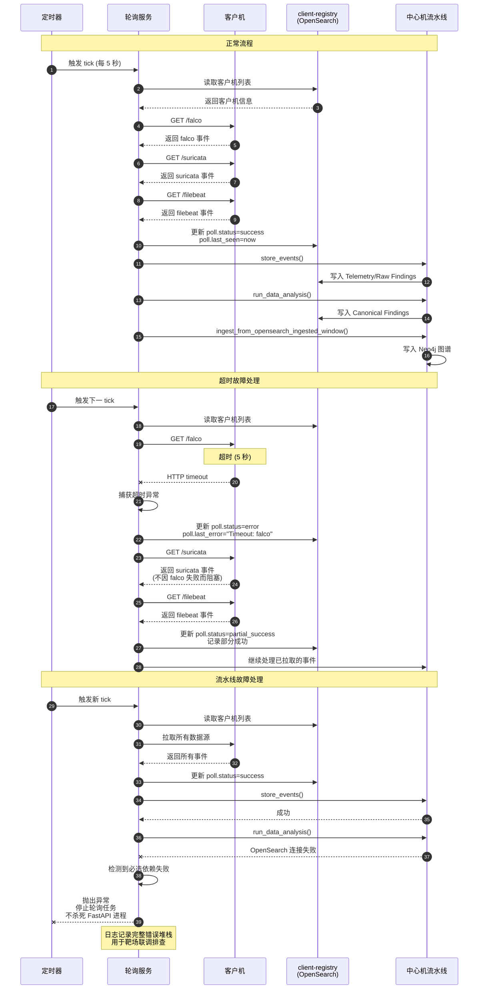

# 注册与轮询

## 文档目的

本文件定义中心机侧客户机注册、注册表结构、轮询调度与状态更新的固定行为，作为中心机“单定时轮询”的实现说明。

## 读者对象

- 负责中心机后端实现的同学
- 负责靶场联调与排障的同学

## 引用关系

- 权威接口规范：`../../80-规范/87-客户机与中心机接口.md`
- OpenSearch 索引规范：`../../80-规范/82-OpenSearch索引与Mapping规范.md`
- 中心机总体：`60-总体与代码结构.md`

## 1. 注册表结构

中心机以 OpenSearch 索引 `client-registry` 作为客户机注册表的唯一权威数据源。

注册表文档包含以下核心信息：

- `client.id`：客户机唯一 ID
- `client.listen_url`：客户机拉取接口基地址，例如 `http://10.0.0.11:8888`
- `client.capabilities`：三类数据源能力声明（falco、suricata、filebeat）
- `poll.last_seen`：最近一次轮询时间
- `poll.status`：最近一次轮询状态
- `poll.last_error`：最近一次轮询错误信息

字段结构与索引约束由 `../../80-规范/82-OpenSearch索引与Mapping规范.md` 与 `../../80-规范/87-客户机与中心机接口.md` 定义。

## 2. 注册流程

中心机提供客户机注册接口，注册成功后必须写入 `client-registry`：

- `POST /api/v1/clients/register`

接口请求与响应的权威定义见：

- `../../80-规范/87-客户机与中心机接口.md`

注册失败时不允许降级为“仅内存登记”，必须返回错误并保持注册表不变。

## 3. 轮询调度

### 3.1 实现位置

轮询服务实现文件：

- `backend/app/services/client_poller.py`

### 3.2 轮询周期与超时

轮询周期与超时由环境变量控制（默认值写死在代码中）：

- `CENTER_POLL_INTERVAL_SECONDS`：默认 `5`
- `CENTER_POLL_TIMEOUT_SECONDS`：默认 `5`

环境变量的权威清单与默认值见：

- `../../80-规范/89-环境变量与配置规范.md`

### 3.3 单轮询流程

轮询服务（单定时器 tick）的固定流程为：

**流程说明**：

1. **注册表读取**：从 OpenSearch 读取 `client-registry` 的客户机列表；
2. **客户机遍历**：对每个客户机解析 `client.id`、`client.listen_url`、`client.capabilities`；
3. **路由选择**：按 capabilities 选择要拉取的路由，路由集合固定为：`falco`、`suricata`、`filebeat`；
4. **HTTP 拉取**：逐路由发送 HTTP GET 请求：`{listen_url}/{route}`；
5. **事件提取**：提取响应体中的 `data[]` 事件列表并汇总为本 tick 的事件列表；
6. **状态更新**：逐客户机写回注册表的 `poll.*` 状态字段；
7. **事件存储**（Step 2）：调用 `store_events()` 将本 tick 的事件列表写入 OpenSearch（Telemetry/Raw Findings/Canonical 按路由入库）；
8. **数据分析**（Step 3）：调用 `run_data_analysis()` 执行检测与告警融合（Raw → Canonical），写回 OpenSearch；
9. **图谱入库**（Step 4）：调用 Neo4j 入图流程（Telemetry + Canonical），将本 tick 产生的数据写入图谱。

相关模块入口：

- Step 2：`backend/app/services/opensearch/storage.py:store_events()`
- Step 3：`backend/app/services/opensearch/analysis.py:run_data_analysis()`
- Step 4：`backend/app/services/neo4j/ingest.py:ingest_from_opensearch_ingested_window()`

## 4. 状态更新与错误处理

### 4.1 轮询状态机

轮询服务的状态转换逻辑：

**状态说明**：

- **Idle**：空闲等待状态，等待定时器触发；
- **Polling**：轮询进行中，从注册表读取客户机列表；
- **Fetching**：拉取客户机数据（HTTP 请求客户机接口）；
- **Processing**：处理拉取的数据（提取事件、更新状态）；
- **Success**：单个客户机轮询成功；
- **Error**：单个客户机轮询失败。

### 4.2 故障处理策略

轮询服务对每个客户机维护以下固定错误处理语义：

1. 任一数据源拉取失败不阻塞其他数据源拉取；
2. 任一客户机轮询失败不阻塞其他客户机轮询；
3. 失败信息写入 `poll.last_error`，状态写入 `poll.status`，下一轮继续重试；
4. 轮询循环永不因单个客户机异常退出；
5. OpenSearch / Neo4j 属于中心机必选依赖：当 Step 3 或 Step 4 失败时，**轮询任务应快速失败并暴露错误**（用于靶场联调/验收时及时发现问题），但**不应在后台任务里直接 `os._exit(1)` 杀死 FastAPI 进程**（会导致服务"看起来卡死/不可控退出"，也不利于排障与恢复）。

### 4.3 故障处理时序图

完整的超时、重试、错误记录流程：

**时序说明**：

1. **正常流程**：定时器触发轮询服务 → 拉取所有客户机的三个数据源 → 更新注册表 → 流水线处理（存储/分析/入图）；
2. **超时处理**：单个数据源超时（如 falco）不阻塞其他数据源（suricata/filebeat 继续拉取）→ 记录错误到 `poll.last_error` → 状态标记为 `partial_success` → 继续处理已拉取的事件；
3. **流水线故障**：当 OpenSearch/Neo4j 等必选依赖失败时 → 抛出异常停止轮询任务 → 记录完整错误堆栈 → 不杀死 FastAPI 进程（便于排障与恢复）。
