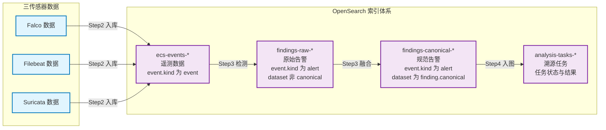
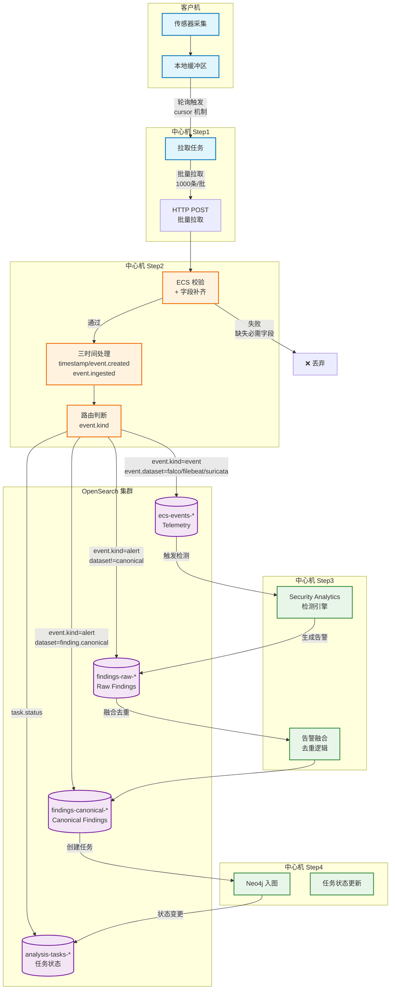

# OpenSearch存储与索引治理

## 文档目的

本文件从中心机实现角度描述 OpenSearch 的存储边界、索引组织、入库路由、字段规范化与去重治理。

## 读者对象

- 负责中心机后端实现的同学
- 负责数据验证与排障的同学

## 引用关系

- ECS 字段规范（权威口径）：`../../80-规范/81-ECS字段规范.md`
- OpenSearch 索引与 mapping 规范（权威口径）：`../../80-规范/82-OpenSearch索引与Mapping规范.md`
- 数据对象与生命周期（权威口径）：`../../80-规范/80-数据对象与生命周期.md`
- 检测与告警融合（详细设计）：`63-检测与告警融合.md`

## 1. 模块职责与边界

OpenSearch 模块承担中心机侧"事实/告警/任务元数据"的权威存储与检索职责，具体功能包括：

1. **索引治理**：定义索引命名规范、按日滚动策略、数据生命周期保留策略；
2. **智能路由**：根据 `event.kind` 与 `event.dataset` 字段自动将文档路由至正确索引；
3. **字段规范化**：对 ECS 文档执行三时间字段处理、扁平键兼容、基础字段校验；
4. **检测触发**：驱动 OpenSearch Security Analytics 扫描 Telemetry 数据并产出 Findings；
5. **告警融合**：将 Raw Findings 聚合融合为 Canonical Findings 并写回 OpenSearch；
6. **任务管理**：持久化溯源任务的状态与元数据，支持前端轮询查询。

本模块不负责：

- Neo4j 图谱建模与查询（见 `64-Neo4j入图与图查询.md` 与 `../../80-规范/84-Neo4j实体图谱规范.md`）；
- 溯源算法与结果写回（见 `../../50-详细设计/分析/` 与 `../../80-规范/85-溯源结果写回规范.md`）；
- 客户机采集与接口（见 `../../50-详细设计/客户机/` 与 `../../80-规范/87-客户机与中心机接口.md`）。

## 2. 索引体系与命名

### 2.1 索引清单（系统运行时必须存在）

| 索引模式 | 数据对象 | 写入方 | 用途 |
|---|---|---|---|
| `ecs-events-YYYY-MM-DD` | Telemetry | 中心机流水线 Step 2 | 事实事件检索、Store-first 检测输入 |
| `raw-findings-YYYY-MM-DD` | Raw Findings | 中心机流水线 Step 3 | 原始告警审计、融合输入 |
| `canonical-findings-YYYY-MM-DD` | Canonical Findings | 中心机流水线 Step 3 | 图谱与溯源的主输入 |
| `client-registry` | 客户机注册表 | 客户机注册 + 流水线更新 | 客户机列表、游标、在线状态 |
| `analysis-tasks-YYYY-MM-DD` | Trace Task | Analysis 模块 | 异步任务状态与进度轮询 |

> 说明：索引保留策略在第 6 节定义；ECS 字段口径在 `../../80-规范/81-ECS字段规范.md` 定义。

### 2.2 索引命名规则（必须遵守）

1. 所有按日滚动的索引必须使用连字符日期：`YYYY-MM-DD`。
2. 索引名不得出现点号日期（例如 `2026.01.13`），避免 Security Analytics 的 pattern 解析问题。
3. `client-registry` 不按日滚动，索引名固定为 `client-registry`。

### 2.3 索引体系架构

**架构说明**：
- **Telemetry 索引**（`ecs-events-*`）：接收 Falco、Filebeat、Suricata 三传感器原始事件
- **Raw Findings 索引**（`findings-raw-*`）：存储 Security Analytics 产出的原始告警
- **Canonical Findings 索引**（`findings-canonical-*`）：存储融合去重后的规范告警
- **Tasks 索引**（`analysis-tasks-*`）：存储异步溯源任务的状态与结果

## 3. 入库路由与字段处理

### 3.1 路由规则（权威）

对每条输入文档，中心机必须按以下规则路由（伪代码表达）：

- 当 `event.kind == "event"`：写入 `ecs-events-*`
- 当 `event.kind == "alert"` 且 `event.dataset == "finding.canonical"`：写入 `canonical-findings-*`
- 当 `event.kind == "alert"` 且 `event.dataset != "finding.canonical"`：写入 `raw-findings-*`

### 3.2 数据流向与写入流程

**流程说明**：
1. **客户机采集**：Falco/Filebeat/Suricata 传感器采集数据并写入本地缓冲区；
2. **中心机拉取**：Step1 通过 cursor 机制批量拉取客户机缓冲区数据（1000条/批）；
3. **字段处理**：Step2 执行 ECS 校验、三时间字段处理、路由判断（`event.kind`）；
4. **OpenSearch 写入**：按路由规则写入对应索引，使用 `event.id` 实现幂等去重；
5. **检测与融合**：Step3 触发 Security Analytics 检测引擎，将 Raw Findings 融合为 Canonical Findings；
6. **任务管理**：Step4 创建溯源任务并持续更新任务状态到 `analysis-tasks-*` 索引。

### 3.3 三时间字段处理（必须执行）

中心机在写入 OpenSearch 前必须确保三时间字段符合 `../../80-规范/81-ECS字段规范.md` 规范：

- **`@timestamp`**：主时间轴字段。若缺失则从 `event.created` 推导；若仍无法获取有效时间戳，中心机必须丢弃该文档并记录日志。
- **`event.created`**：事件首次观察时间。若缺失则回填为 `@timestamp` 的值。
- **`event.ingested`**：中心机入库时间。必须覆盖为当前入库时间（UTC 毫秒时间戳），不得使用上游传递的值。

### 3.4 ECS 字段映射与处理

中心机在写入 OpenSearch 前必须对关键字段进行映射和转换，确保符合 ECS 规范：

| ECS 字段 | 数据类型 | 必需 | 处理规则 | 说明 |
|---|---|---|---|---|
| `@timestamp` | date | ✅ | 优先使用原始值；缺失时从 `event.created` 推导；仍缺失则丢弃文档 | 主时间轴字段，用于日志检索和时序分析 |
| `event.id` | keyword | ✅ | 若缺失则生成 UUID：`{client_id}-{sensor_type}-{timestamp}-{seq}` | 幂等去重的唯一标识符 |
| `event.kind` | keyword | ✅ | 枚举值：`event` / `alert` / `state` | 路由判断的核心字段 |
| `event.category` | keyword | ❌ | 映射规则：`file` → `file`，`network` → `network`，`process` → `process` | 用于前端分类展示与过滤 |
| `event.dataset` | keyword | ✅ | 格式：`{sensor}.{type}`，如 `falco.syscall`、`finding.canonical` | 区分数据来源和告警类型 |
| `event.created` | date | ✅ | 缺失时回填为 `@timestamp` | 事件首次被观察的时间 |
| `event.ingested` | date | ✅ | 覆盖为当前入库时间（UTC 毫秒时间戳） | 中心机接收时间，用于监控数据延迟 |
| `source.ip` | ip | ❌ | 保持原值，支持 IPv4/IPv6 | 源地址，用于关联分析 |
| `source.port` | long | ❌ | 范围校验：0-65535 | 源端口 |
| `destination.ip` | ip | ❌ | 保持原值，支持 IPv4/IPv6 | 目标地址 |
| `destination.port` | long | ❌ | 范围校验：0-65535 | 目标端口 |
| `process.pid` | long | ❌ | 保持原值 | 进程 ID |
| `process.executable` | keyword | ❌ | 规范化绝对路径，统一使用 `/` 分隔符 | 进程可执行文件路径 |
| `file.path` | keyword | ❌ | 规范化绝对路径，统一使用 `/` 分隔符 | 文件路径 |
| `file.name` | keyword | ❌ | 从 `file.path` 中提取文件名 | 文件名 |
| `user.name` | keyword | ❌ | 保持原值 | 用户名 |
| `host.name` | keyword | ✅ | 使用客户机注册表中的 `hostname` | 主机名 |
| `host.ip` | ip | ❌ | 使用客户机注册表中的 `ip` | 主机 IP |
| `agent.type` | keyword | ✅ | 固定值：`falco` / `filebeat` / `suricata` | 传感器类型标识 |
| `agent.ephemeral_id` | keyword | ❌ | 保持原值 | 传感器实例 ID |
| `alert.severity` | long | ❌ | 范围映射：1-21 低 / 22-59 中 / 60-100 高 | 告警严重级别 |
| `alert.status` | keyword | ❌ | 枚举值：`active` / `resolved` / `suppressed` | 告警状态 |
| `threat.framework` | keyword | ❌ | 固定值：`MITRE ATT&CK` | 威胁框架标识 |
| `threat.tactic.id` | keyword | ❌ | 格式：`TAxxxx`，如 `TA0001` | 战术 ID |
| `threat.technique.id` | keyword | ❌ | 格式：`Txxxx`，如 `T1059` | 技术 ID |
| `rule.name` | keyword | ❌ | 保持原值 | 规则名称 |
| `rule.category` | keyword | ❌ | 映射到 MITRE 战术，如 `Execution` / `Persistence` | 规则分类 |
| `tags` | keyword | ❌ | 数组格式，自动去重 | 标签数组，用于快速过滤 |

**字段处理注意事项**：
1. **扁平键兼容**：保留 `_source` 中的扁平字段（如 `proc_name`），但查询时优先使用嵌套 ECS 字段；
2. **类型校验**：写入前校验字段类型，类型不匹配时记录警告并使用默认值或丢弃文档；
3. **缺失字段**：必需字段缺失时拒绝入库，非必需字段缺失时使用默认值或留空；
4. **数组字段**：`tags`、`threat.tactic.id` 等数组字段必须去重，避免重复标签影响查询准确性；
5. **IP 地址**：支持 IPv4 和 IPv6，自动识别并设置正确的 `ip` 类型。

### 3.5 幂等与去重（必须满足）

为确保数据一致性与避免重复存储，中心机写入遵循以下幂等性原则：

1. **唯一标识**：每条文档必须具备 `event.id` 作为唯一标识符；
2. **幂等写入**：中心机按 `event.id` 实现幂等写入，同一 `event.id` 重复写入不得产生重复文档；
3. **上游补齐**：对于无法保证 `event.id` 稳定的上游输入，必须在进入中心机前补齐稳定的 `event.id`（推荐格式：`{client_id}-{sensor_type}-{timestamp}-{seq}`）。

## 4. 检测与融合

OpenSearch 的检测触发、Raw Finding 生成与 Canonical Finding 融合去重规则在本项目中属于独立的详细设计章节：

- `63-检测与告警融合.md`

## 5. 保留策略与脚本

### 5.1 数据保留周期（固定）

数据保留周期的权威口径见：`../../80-规范/80-数据对象与生命周期.md`。

### 5.2 初始化与运维脚本（入口）

OpenSearch 侧的初始化流程固定为以下步骤：

1. **启动 OpenSearch 容器**：通过 Docker Compose 启动 OpenSearch 服务；
2. **索引初始化**：中心机后端启动时调用 `initialize_indices()` 自动创建/确保索引存在（包含 mapping 定义）；
3. **检测器配置**：配置 Security Analytics detector 并导入 Sigma 规则库。

脚本入口固定为以下文件：
- Sigma 规则导入：`backend/app/services/opensearch/scripts/import_sigma_rules.py`
- Security Analytics detector 配置：`backend/app/services/opensearch/scripts/setup_security_analytics.py`
