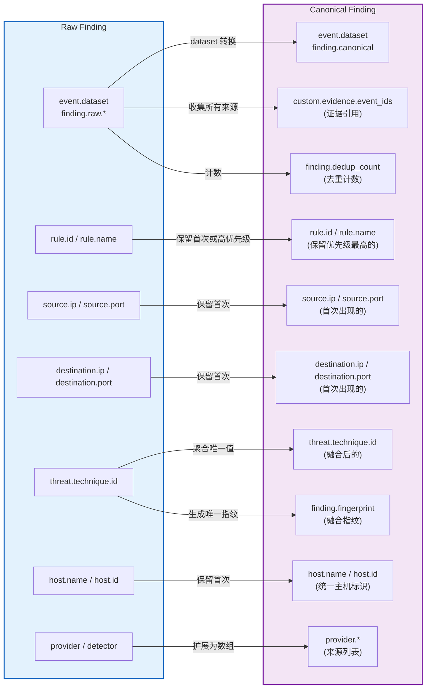
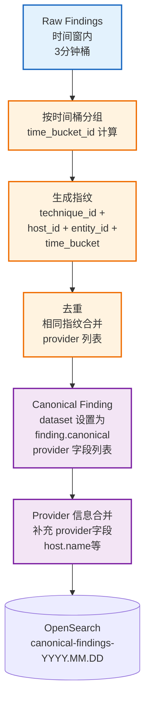

# 检测与告警融合

## 文档目的

本文件定义中心机侧检测触发、Raw Finding 生成、以及融合去重生成 Canonical Finding 的固定规则与审计口径。

## 读者对象

- 负责 OpenSearch 分析与融合实现的同学
- 负责数据验证与测试的同学

## 引用关系

- 告警数据规范（权威口径）：`../../80-规范/83-告警数据规范.md`
- OpenSearch 索引规范（权威口径）：`../../80-规范/82-OpenSearch索引与Mapping规范.md`
- ECS 字段规范（权威口径）：`../../80-规范/81-ECS字段规范.md`

## 1. 检测触发机制

中心机的检测与融合在**每个 tick 内固定执行（无开关）**：轮询服务完成 Step 1/2（拉取并入库）后，立即进入 Step 3（检测与融合）。

触发点（固定）：

- `backend/app/services/client_poller.py`

### 1.1 检测与融合入口（固定）

检测与融合的统一入口函数固定为：

- `backend/app/services/opensearch/analysis.py:run_data_analysis()`

该函数固定执行两段核心动作：

1. **Correlation 分析**：基于 Correlation Rules 做跨事件关联（必要时会自动创建/更新规则），用于产出高层攻击场景/关联告警；
2. **融合去重**：对 `raw-findings-*` 执行融合去重生成 Canonical Findings，写回 `canonical-findings-*`。

> 说明：底层调用 OpenSearch 插件 API（Security Analytics / Correlation Rules）的细节属于工程实现，可随版本调整；本文件只约束“入口、输入输出与审计口径”。

### 1.2 手动触发（仅调试）

开发/联调阶段允许手动调用 `run_data_analysis()` 单独执行一次，用于排障与回放；但靶场与验收的默认路径以“tick 内固定触发”为准。

## 2. Raw Finding 结构与写入

Raw Finding 由两类来源组成：

1. Filebeat Sigma detector / Falco / Suricata 直接产生的告警事件（客户机侧 `event.kind="alert"`）；
2. OpenSearch Security Analytics 产生的 findings（中心机侧拉取并转换为 ECS 告警事件）。

Raw Finding 的字段结构与最小必填字段由权威规范定义：

- `../../80-规范/83-告警数据规范.md`

### 2.1 Security Analytics finding 转换（固定）

当告警来源为 OpenSearch Security Analytics 时，中心机按固定规则将原始 finding 转换为 ECS 告警事件并写入 `raw-findings-*`：

- `event.kind="alert"`
- `event.dataset="finding.raw.security_analytics"`
- `rule.id/rule.name` 从 detector 信息派生
- `threat.*` 从 finding 的 ATT&CK tags 派生（或从固定映射表派生）

实现绑定点：`backend/app/services/opensearch/analysis.py:_convert_security_analytics_finding_to_ecs()`。

## 3. 融合指纹规则

融合去重以固定时间窗内的 Raw Finding 为输入，按指纹规则聚合生成 Canonical Finding。

指纹字段与生成规则由权威规范定义：

- `../../80-规范/83-告警数据规范.md`

### 3.1 时间桶参数（固定）

融合指纹使用固定时间桶参数：

- `TIME_WINDOW_MINUTES = 3`

实现绑定点：`backend/app/services/opensearch/analysis.py:TIME_WINDOW_MINUTES`。

#### 时间桶示意图

```mermaid
gantt
    title 5分钟时间桶聚合示例
    dateFormat X
    axisFormat %s

    section 时间桶0 (0-300s)
    Raw Finding 1    :0, 30
    Raw Finding 2    :50, 20
    Raw Finding 3    :200, 10

    section 时间桶1 (300-600s)
    Raw Finding 4    :300, 40
    Raw Finding 5    :350, 25
    Raw Finding 6    :450, 15

    section 时间桶2 (600-900s)
    Raw Finding 7    :600, 35
    Raw Finding 8    :700, 20
    Raw Finding 9    :800, 30
```

**说明**：
- X 轴表示 Unix 时间戳（秒）
- 每个 5 分钟桶（300 秒）内的 Raw Findings 会被分配到同一个桶中
- 同一个桶内的 Raw Findings 如果指纹相同，才会被融合
- 跨桶的 Raw Findings 即使内容相同也不会被融合

### 3.2 指纹构造要素（固定）

指纹 key 的构造要素固定为：

- `threat.technique.id`
- `host.id`
- `entity_id`（取值顺序固定为：`process.entity_id` → `destination.ip[/destination.domain]` → `file.hash.sha256`）
- `time_bucket`

实现绑定点：`backend/app/services/opensearch/analysis.py:generate_fingerprint()` 与 `fingerprint_id_from_key()`。

### 3.3 字段映射：Raw → Canonical

Raw Finding 转换为 Canonical Finding 时的关键字段映射关系：

**说明**：
- **event.dataset**：从 `finding.raw.*` 转换为 `finding.canonical`
- **provider 字段**：Raw Finding 中的单一 provider 扩展为数组 `provider.*`，记录所有来源
- **finding.fingerprint**：基于指纹要素生成唯一标识符
- **custom.evidence.event_ids**：收集所有融合的 Raw Finding 的 `event.id`
- **finding.dedup_count**：记录融合的 Raw Finding 数量

## 4. Canonical 生成与覆盖规则

Canonical Finding 的生成规则、`event.id` 生成规则、以及覆盖行为由权威规范定义：

- `../../80-规范/83-告警数据规范.md`

### 4.1 融合写入动作（固定）

融合写入动作固定为：

1. 从 `raw-findings-*` 拉取 Raw Findings；
2. 按指纹 key 分组；
3. 每组多条 Raw Findings 合并为一个 Canonical Finding；
4. 每组单条 Raw Finding 直接规范化为 Canonical Finding；
5. 批量写入 `canonical-findings-*` 并刷新索引。

实现绑定点：`backend/app/services/opensearch/analysis.py:deduplicate_findings()`。

### 4.2 融合算法流程

**流程说明**：
1. **Raw Findings 聚合**：从 `raw-findings-*` 索引中拉取时间窗内的所有 Raw Findings
2. **时间桶分组**：按 3 分钟桶分组，确保只有同一时间桶内的 Raw Findings 才会被融合
3. **指纹生成**：基于固定要素生成唯一指纹 key
4. **去重融合**：相同指纹的 Raw Findings 合并为一个 Canonical Finding
5. **Provider 信息合并**：将所有来源的 provider 信息合并到 `provider.*` 字段数组
6. **写入 OpenSearch**：批量写入 `canonical-findings-*` 索引

## 5. 审计与可回溯性

审计与可回溯性要求：

1. Raw 与 Canonical 必须包含证据引用 `custom.evidence.event_ids`；
2. Canonical 的证据引用必须能回溯到 Telemetry 的 `event.id`；
3. 任意 Canonical 必须能定位到其来源 providers 与融合指纹。

字段口径见：

- `../../80-规范/81-ECS字段规范.md`
