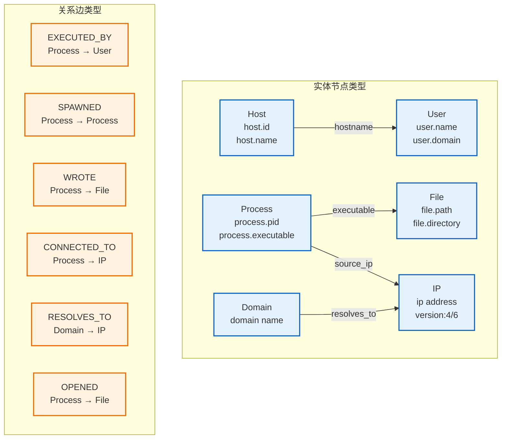
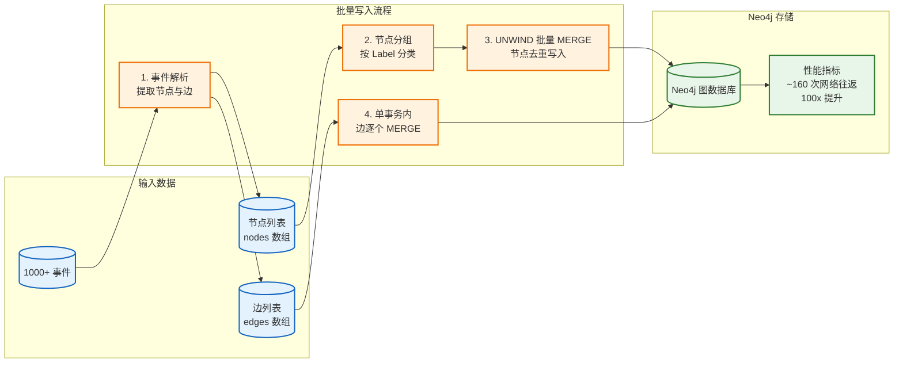
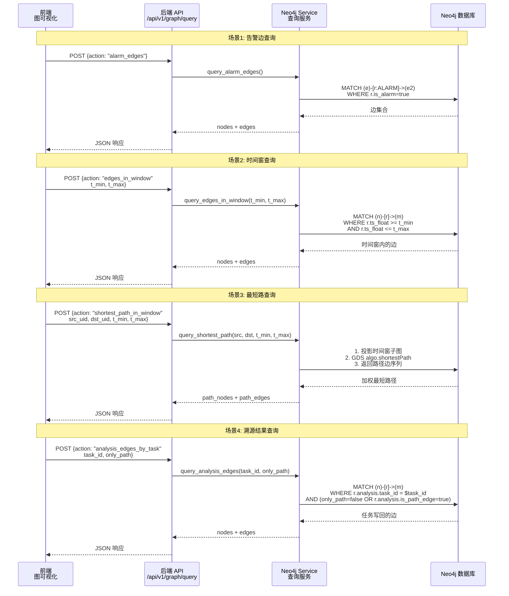

# Neo4j入图与图查询

## 文档目的

本文件从中心机实现角度描述 Neo4j 的入图边界、写入规则与图查询能力。

## 读者对象

- 负责 Neo4j 入图与查询实现的同学
- 负责前端图可视化与溯源联调的同学

## 引用关系

- ECS 字段规范（权威口径）：`../../80-规范/81-ECS字段规范.md`
- 图谱规范（权威口径）：`../../80-规范/84-Neo4j实体图谱规范.md`
- 溯源写回规范（权威口径）：`../../80-规范/85-溯源结果写回规范.md`
- 图谱回标与边属性（详细设计）：`65-图谱回标与边属性.md`

## 1. 模块职责与边界

Neo4j 模块承担"实体关系图（Entity Graph）"的权威存储与图查询职责，具体功能包括：

1. **Schema 管理**：创建并维护节点唯一约束、常用索引与图数据模型；
2. **入图写入**：将 ECS 文档解析为节点与边，通过批量 API 写入 Neo4j；
3. **时间窗查询**：支持按时间范围查询边集合，供图可视化与算法分析使用；
4. **图算法查询**：支持基于时间窗投影图的最短路径计算（Neo4j GDS）；
5. **结果承载**：持久化溯源任务写回的边属性，支持按节点查询溯源结果。

本模块不负责：

- OpenSearch 的检测与融合（见 `63-检测与告警融合.md`）；
- 溯源算法的具体执行（见 `../../50-详细设计/分析/`）；
- ECS 字段口径（见 `../../80-规范/81-ECS字段规范.md`）。

## 2. Schema 与约束

### 2.1 节点唯一约束（必须存在）

节点类型与唯一键由 `../../80-规范/84-Neo4j实体图谱规范.md` 定义。Neo4j 必须创建以下唯一约束（表达为"Label + 属性键"组合）：

| Label | 唯一键 |
|---|---|
| `Host` | `host.id` |
| `User` | `user.id` |
| `User` | `host.id + user.name` |
| `Process` | `process.entity_id` |
| `File` | `host.id + file.path` |
| `Domain` | `domain.name` |
| `IP` | `ip` |

**唯一键说明**：
- `User` 与 `File` 使用复合键避免跨主机误合并；
- 当事件包含 `user.id` 时优先使用 `user.id` 作为唯一键；
- 当事件不包含 `user.id` 时使用 `host.id + user.name` 作为唯一键。

### 2.2 图数据模型



### 2.3 索引（必须存在）

为支撑展示与排障，Neo4j 必须为以下属性建立索引：

- `Host.host.name`
- `User.user.name`
- `Process.process.executable`
- `File.file.path`
- `Domain.domain.name`
- `IP.ip`

## 3. 写入：ECS → Graph

### 3.1 入图输入范围（严格）

Neo4j 入图严格限定为两类 ECS 文档：

1. **Telemetry 事件**：`event.kind="event"`，来自传感器的原始遥测数据；
2. **Canonical Findings**：`event.kind="alert"` 且 `event.dataset="finding.canonical"`，经过融合去重的规范告警。

任何 Raw Findings（含传感器原始告警与 Security Analytics 原始 finding）不得直接入图，避免噪声数据污染图谱。

### 3.2 入图边属性（必须写入）

每条入图边必须写入以下属性（字段名与来源以 `../../80-规范/81-ECS字段规范.md` 与 `../../80-规范/84-Neo4j实体图谱规范.md` 为准）：

**基础属性**（所有边必须携带）：
- `ts` 或 `@timestamp`：边的事件时间（字符串时间戳）
- `ts_float`：数值时间戳（秒，float），用于时间窗过滤与 GDS 投影
- `custom.evidence.event_ids[]`：证据事件引用列表
- `event.kind` / `event.dataset` / `event.id`：用于回溯与区分来源

**告警边属性**（Canonical Finding 特有）：
- `is_alarm=true`：标记该边为告警边
- `rule.*`、`threat.*`、`event.severity`、`custom.finding.*`：用于前端展示与溯源解释

### 3.3 写入幂等边界

Neo4j 入图遵循以下幂等性原则：

- **节点写入**：必须使用 MERGE 语句实现幂等写入，以唯一键去重避免重复节点；
- **边写入**：采用"按证据追加"语义，允许同类型边多次存在，但每条边必须携带唯一的 `event.id` 与证据列表，支持后续去重与回放。

边的去重逻辑属于 Analysis 模块职责，在"展示层"与"任务结果写回层"通过属性过滤实现干净展示。

### 3.4 批量写入优化（v2.1+）

从 v2.1 开始，Neo4j 模块支持批量写入 API 以提升入图性能：

**批量 API**：
- `add_nodes_and_edges(nodes, edges)` - 在单个事务中批量写入节点和边

**性能优化策略**：
- **节点批量写入**：按节点类型分组，使用 UNWIND 批量 MERGE
- **边批量写入**：在单个事务中逐个 MERGE（需匹配起终点）
- **性能提升**：1000 事件从 ~16000 次网络往返降至 ~160 次（100x 提升）

**使用示例**：
```python
from app.services.neo4j import db

# 批量写入
nodes = [host_node(host_id="h-001"), user_node(user_id="u-001")]
edges = [logon_edge(user, host)]
db.add_nodes_and_edges(nodes, edges)
```

**向后兼容性**：
- 保留 `add_node()` 和 `add_edge()` 单条 API，旧代码无需修改
- 批量 API 与单条 API 具有相同的幂等性保证

**实施位置**：
- 代码：`backend/app/services/neo4j/db.py:200-400`
- 测试：`backend/tests/unit/test_services_neo4j/test_db_batch.py`



## 4. 查询：可视化与算法的图查询

### 4.1 图查询能力清单（必须支持）

Neo4j 模块提供以下核心查询能力：

1. **告警边查询**：返回所有 `is_alarm=true` 的边集合，用于前端展示所有告警关联关系；
2. **时间窗边查询**：给定时间范围 `[t_min, t_max]`（秒），返回该时间窗内的边集合，并支持按关系类型过滤；
3. **时间窗最短路**：给定起点 `src_uid`、终点 `dst_uid`、时间窗 `[t_min, t_max]` 与风险权重表，使用 Neo4j GDS 算法返回时间窗内的加权最短路径边序列。

### 4.2 后端对外 API 绑定（固定）

后端对外提供统一的图查询入口：
- `POST /api/v1/graph/query`

该接口支持以下查询动作：
- `alarm_edges`：查询告警边
- `edges_in_window`：时间窗边查询
- `shortest_path_in_window`：时间窗最短路查询
- `analysis_edges_by_task`：按任务查询溯源写回边

接口请求/响应字段由后端实现固定，Neo4j 模块负责提供稳定的查询语义与返回结构（包含 nodes/edges 的 uid、rtype、props 字段）。

**`analysis_edges_by_task` 查询说明**：
- 按 `analysis.task_id` 拉取该溯源任务写回的边集合；
- 当请求参数 `only_path=true` 时，只返回 `analysis.is_path_edge=true` 的关键路径边；
- 当请求参数 `only_path=false` 时，返回该任务写回的全部边（包含非关键路径边）。



## 5. 结果写回：边属性规范

溯源结果写回属于“图谱回标与边属性”的详细设计范围：

- 写回数据结构（权威口径）：`../../80-规范/85-溯源结果写回规范.md`
- 工程实现与读取口径：`65-图谱回标与边属性.md`
