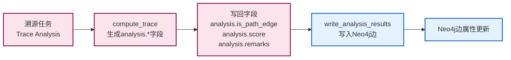

# 图谱回标与边属性

## 文档目的

本文件定义告警如何映射到图谱边，以及溯源任务如何写回边属性并被前端读取展示。

## 读者对象

- 负责 Neo4j 入图与查询的同学
- 负责溯源算法与写回的同学
- 负责前端展示的同学

## 引用关系

- 图谱规范：`../../80-规范/84-Neo4j实体图谱规范.md`
- 溯源写回规范：`../../80-规范/85-溯源结果写回规范.md`
- 图查询接口：`../../80-规范/88-前端与中心机接口.md`

## 1. 告警映射与回标规则

### 1.1 输入边界（固定）

Neo4j 入图严格限定为两类 ECS 文档：

1. **Telemetry 事件**：`event.kind="event"`，来自传感器的原始遥测数据；
2. **Canonical Finding**：`event.kind="alert"` 且 `event.dataset="finding.canonical"`，经过融合去重的规范告警。

该边界属于图谱口径的强制性要求，详见：
- `../../80-规范/84-Neo4j实体图谱规范.md` 第 0.1 节

### 1.2 Canonical Finding → 告警边（固定）

Canonical Finding 在入图阶段被映射为一组关系边，边属性遵循以下规则：

**基础属性**（所有边必须携带）：
- `event.id`：告警唯一标识符
- `event.kind` / `event.dataset`：事件类型与数据集标识
- `ts_float`：数值时间戳，用于时间窗过滤
- `custom.evidence.event_ids[]`：证据事件引用列表

**告警标识**（Canonical Finding 特有）：
- `is_alarm=true`：标记该边为告警边

**解释字段**（用于前端展示与溯源分析）：
- `rule.*`：检测规则信息
- `threat.*`：MITRE ATT&CK 威胁情报
- `event.severity`：告警严重级别
- `custom.finding.*`：自定义告警属性

实现绑定点（以代码为准）：

- 入图转换：`backend/app/services/neo4j/ecs_ingest.py:ecs_event_to_graph()`
- 告警边标记：`backend/app/services/neo4j/ecs_ingest.py` 中 `edge_props.setdefault("is_alarm", True)`

### 1.3 证据引用缺失的处理（固定）

Canonical Finding 必须携带 `custom.evidence.event_ids[]` 字段，否则该事件将被拒绝入图，等价于"无效告警"。

该约束确保告警边的完整性与可回溯性，避免丢失证据引用的告警污染图谱。

实现绑定点：
- `backend/app/services/neo4j/ecs_ingest.py` 中对 `event_kind=="alert"` 的 `evidence_ids` 校验

## 2. 写回字段集合与覆盖规则

### 2.1 属性写回流程

**流程说明**：
1. **溯源任务启动**：创建 Trace Analysis 任务，指定起点与终点节点；
2. **计算分析**：调用 `compute_trace()` 执行图算法，生成 `analysis.*` 字段；
3. **字段准备**：封装写回字段（`is_path_edge`、`score`、`remarks`、`task_id`）；
4. **写回执行**：调用 `write_analysis_results()` 将字段写入 Neo4j 边属性；
5. **属性更新**：Neo4j 边属性更新完成，前端可查询结果。

### 2.2 字段映射关系

| 算法生成字段 | Neo4j 边属性 | 说明 |
|------------|-------------|------|
| `analysis.is_path_edge` | `analysis.is_path_edge` | 是否为关键路径边的布尔标记 |
| `analysis.score` | `analysis.score` | 边的权重评分（用于风险计算） |
| `analysis.remarks` | `analysis.remarks` | 备注信息（用于人工审核） |
| `task_id` | `analysis.task_id` | 关联的溯源任务 ID（用于查询分组） |

### 2.3 工程实现绑定点

写回字段集合与覆盖规则属于规范文档的权威口径，本文件不重复字段表，只说明工程实现绑定点。

**权威写回规范**：
- 字段口径：`../../80-规范/85-溯源结果写回规范.md`

**写回实现**：
- 写回入口：`backend/app/services/neo4j/db.py:write_analysis_results()`
- 覆盖写实现：`backend/app/services/neo4j/db.py:_write_analysis_result_tx()`（先清空字段，再写入新值）

**算法侧生成字段**：
- 字段生成：`backend/app/services/analyze/trace.py:compute_trace()`（生成 `analysis.*` 字段）
- 写回调用：`backend/app/services/analyze/pipeline.py:run_analysis_task()`（调用写回方法）

## 3. 前端读取与过滤规则

前端通过统一的图查询接口读取"告警边"与"溯源写回边"，使用不同的 `action` 参数区分查询类型：

1. **告警边展示**：`POST /api/v1/graph/query`，参数 `action="alarm_edges"`
2. **任务写回结果**：`POST /api/v1/graph/query`，参数 `action="analysis_edges_by_task"`，并传入 `task_id`

**`analysis_edges_by_task` 查询参数说明**：
- `only_path=true`：只返回 `analysis.is_path_edge=true` 的关键路径边（用于突出显示攻击路径）；
- `only_path=false`：返回该任务写回的全部边（包含非关键路径边，用于完整展示分析结果）。

接口字段的权威定义见：
- `../../80-规范/88-前端与中心机接口.md`
