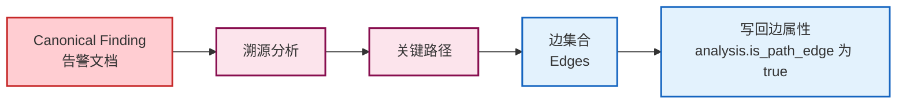
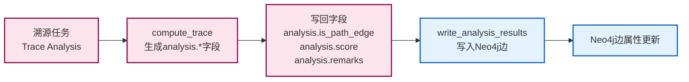

# 图谱回标与边属性

## 文档目的

本文件定义告警如何映射到图谱边，以及溯源任务如何写回边属性并被前端读取展示。

## 读者对象

- 负责 Neo4j 入图与查询的同学
- 负责溯源算法与写回的同学
- 负责前端展示的同学

## 引用关系

- 图谱规范：`../../80-规范/84-Neo4j实体图谱规范.md`
- 溯源写回规范：`../../80-规范/85-溯源结果写回规范.md`
- 图查询接口：`../../80-规范/88-前端与中心机接口.md`

## 1. 告警映射与回标规则

### 1.1 输入边界（固定）

Neo4j 的入图只接受两类 ECS 文档（严格）：

1. Telemetry：`event.kind="event"`
2. Canonical Finding：`event.kind="alert"` 且 `event.dataset="finding.canonical"`

该边界是图谱口径的一部分，见：

- `../../80-规范/84-Neo4j实体图谱规范.md` 0.1

### 1.2 Canonical Finding → 告警边（固定）

Canonical Finding 在入图阶段会被映射为一组关系边，边属性满足以下固定规则：

1. 每条边都携带 `event.id`、`event.kind`、`event.dataset`、`ts_float`、`custom.evidence.event_ids[]`；
2. 当输入为 Canonical Finding 时，每条边额外携带 `is_alarm=true`；
3. Canonical Finding 的解释字段会写入边属性，用于前端展示与溯源解释：
   - `rule.*`
   - `threat.*`
   - `event.severity`
   - `custom.finding.*`

实现绑定点（以代码为准）：

- 入图转换：`backend/app/services/neo4j/ecs_ingest.py:ecs_event_to_graph()`
- 告警边标记：`backend/app/services/neo4j/ecs_ingest.py` 中 `edge_props.setdefault("is_alarm", True)`

### 1.3 证据引用缺失的处理（固定）

Canonical Finding 必须携带 `custom.evidence.event_ids[]`，否则该事件不会入图，等价于“无效告警”。

实现绑定点：

- `backend/app/services/neo4j/ecs_ingest.py` 中对 `event_kind=="alert"` 的 `evidence_ids` 校验

## 2. 写回字段集合与覆盖规则

### 2.1 属性写回流程

### 2.2 字段映射关系

| 算法生成字段 | Neo4j 边属性 | 说明 |
|------------|-------------|------|
| `analysis.is_path_edge` | `analysis.is_path_edge` | 是否为关键路径边 |
| `analysis.score` | `analysis.score` | 边的权重评分 |
| `analysis.remarks` | `analysis.remarks` | 备注信息 |
| `task_id` | `analysis.task_id` | 关联的溯源任务ID |

### 2.3 工程实现绑定点

写回字段集合与覆盖规则属于规范文档的权威口径，本文件不重复字段表，只说明工程实现绑定点：

- 权威写回字段口径：`../../80-规范/85-溯源结果写回规范.md`
- 写回入口（工程实现）：`backend/app/services/neo4j/db.py:write_analysis_results()`
- 覆盖写实现：`backend/app/services/neo4j/db.py:_write_analysis_result_tx()`（先清空字段，再写入）

溯源任务在算法侧生成写回字段的入口：

- `backend/app/services/analyze/trace.py:compute_trace()`（生成 `analysis.*` 字段）
- `backend/app/services/analyze/pipeline.py:run_analysis_task()`（调用写回）

## 3. 前端读取与过滤规则

前端读取“告警边”与“溯源写回边”使用不同的固定动作：

1. 告警边展示：`POST /api/v1/graph/query`，`action="alarm_edges"`
2. 任务写回结果：`POST /api/v1/graph/query`，`action="analysis_edges_by_task"`，并传入 `task_id`

当 `action="analysis_edges_by_task"` 时：

- `only_path=true`：只返回 `analysis.is_path_edge=true` 的关键路径边
- `only_path=false`：返回该任务写回的全部边（包含非关键路径边）

接口字段权威定义见：

- `../../80-规范/88-前端与中心机接口.md`
