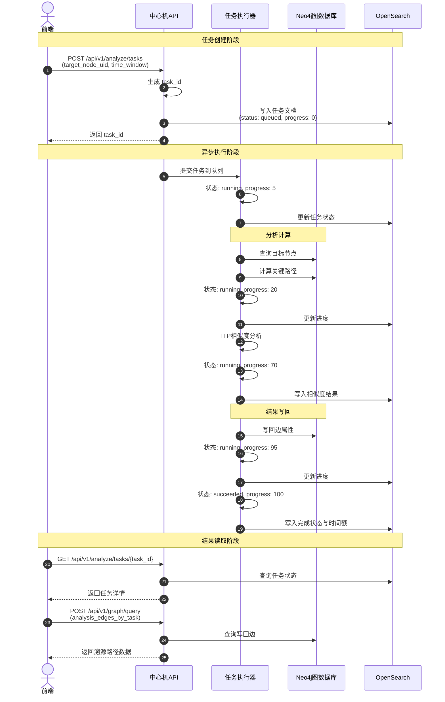
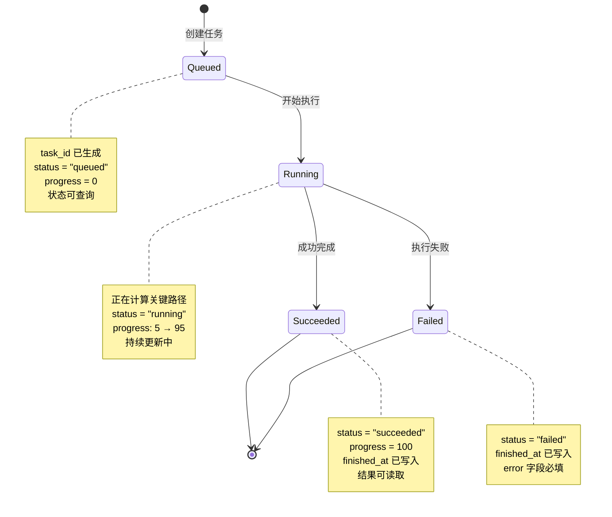
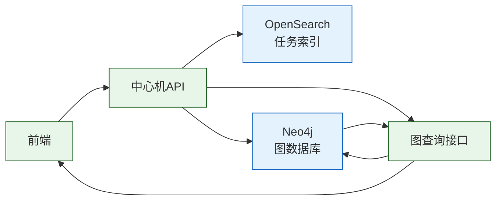

# 任务模型与状态机

## 文档目的

本文件定义溯源任务的任务模型、状态机、任务文档结构与进度更新规则，作为前端触发溯源与后端异步执行的统一约束。

## 读者对象

- 负责溯源任务与算法实现的同学
- 负责前端任务交互与轮询的同学
- 负责测试与验收的同学

## 引用关系

- 前端与中心机接口（权威口径）：`../../80-规范/88-前端与中心机接口.md`
- OpenSearch 索引规范（权威口径）：`../../80-规范/82-OpenSearch索引与Mapping规范.md`
- 溯源写回规范（权威口径）：`../../80-规范/85-溯源结果写回规范.md`
- Neo4j 入图与图查询：`../中心机/64-Neo4j入图与图查询.md`

## 1. 触发方式

溯源任务只通过前端点选节点触发创建：

1. 前端在图中选择目标节点；
2. 调用中心机创建任务接口；
3. 中心机立即返回 `task_id`；
4. 中心机后台执行任务并持续更新任务状态；
5. 任务完成后，前端通过图查询接口读取写回结果。

### 任务执行时序图



## 2. taskid 规则

`task_id` 格式固定为：

```bash
trace-<uuid_v4>
```

**示例**：

```json
{
  "task_id": "trace-550e8400-e29b-41d4-a716-446655440000"
}
```

实现入口：

- `backend/app/services/analyze/pipeline.py` 的 `new_task_id()`

## 3. 任务文档存储

任务状态存储在 OpenSearch 的按日滚动索引：

```bash
analysis-tasks-YYYY-MM-DD
```

**示例**：

```bash
analysis-tasks-2026-01-16
analysis-tasks-2026-01-17
```

索引创建与 mapping 入口：

- `backend/app/services/opensearch/mappings.py` 的 `analysis_tasks_mapping`

## 4. 任务文档字段

### 4.1 任务文档结构图

```mermaid
graph TD
    Task[任务文档 Document]

    Task --> Meta[元数据字段]
    Task --> Info[基本信息]
    Task --> Time[时间窗口]
    Task --> Status[状态信息]
    Task --> Result[分析结果]

    Meta --> TS["@timestamp<br/>创建时间"]
    Info --> ID["task.id<br/>任务ID"]
    Info --> Target["task.target.node_uid<br/>目标节点"]

    Time --> Start["task.window.start_ts<br/>窗口起点"]
    Time --> End["task.window.end_ts<br/>窗口终点"]

    Status --> StatusVal["task.status<br/>状态值"]
    Status --> Progress["task.progress<br/>进度 0-100"]
    Status --> Started["task.started_at<br/>开始时间"]
    Status --> Finished["task.finished_at<br/>结束时间"]
    Status --> Error["task.error<br/>失败原因"]

    Result --> Summary["task.result.summary<br/>结果摘要"]
    Result --> TTP["TTP相似度"]
    Result --> Trace["溯源路径"]

    TTP --> Tactics["ttp_similarity.attack_tactics"]
    TTP --> Techniques["ttp_similarity.attack_techniques"]
    TTP --> APTs["ttp_similarity.similar_apts"]

    Trace --> Updated["trace.updated_edges"]
    Trace --> Path["trace.path_edges"]

    style Task fill:#fce4ec,stroke:#880e4f,stroke-width:3px
    style Meta fill:#e3f2fd,stroke:#1565c0
    style Info fill:#e3f2fd,stroke:#1565c0
    style Time fill:#e3f2fd,stroke:#1565c0
    style Status fill:#e8f5e9,stroke:#1b5e20
    style Result fill:#fce4ec,stroke:#880e4f
    style TTP fill:#fce4ec,stroke:#880e4f
    style Trace fill:#fce4ec,stroke:#880e4f
```



### 4.2 字段定义表

任务文档字段集合固定为：

| 字段路径 | 类型 | 说明 | 示例值 |
|---------|------|------|--------|
| `@timestamp` | string | 任务创建时间（RFC3339） | `2026-01-16T10:30:00Z` |
| `task.id` | string | 任务唯一标识 | `trace-550e8400-...` |
| `task.status` | string | 任务状态 | `queued` / `running` / `succeeded` / `failed` |
| `task.progress` | integer | 任务进度（0-100） | `85` |
| `task.target.node_uid` | string | 目标节点 UID | `node-123` |
| `task.window.start_ts` | string | 分析时间窗起点 | `2026-01-16T00:00:00Z` |
| `task.window.end_ts` | string | 分析时间窗终点 | `2026-01-16T23:59:59Z` |
| `task.started_at` | string | 任务开始时间 | `2026-01-16T10:30:05Z` |
| `task.finished_at` | string | 任务结束时间 | `2026-01-16T10:35:10Z` |
| `task.error` | string | 失败原因 | `Neo4j connection timeout` |
| `task.result.summary` | string | 任务结果摘要 | `Found 3 attack paths` |

任务级结构化结果字段固定为：

| 字段路径 | 类型 | 说明 |
|---------|------|------|
| `task.result.ttp_similarity.attack_tactics` | array | 匹配的攻击战术列表 |
| `task.result.ttp_similarity.attack_techniques` | array | 匹配的攻击技术列表 |
| `task.result.ttp_similarity.similar_apts` | array | 相似 APT 组织列表 |
| `task.result.trace.updated_edges` | array | 更新的边属性集合 |
| `task.result.trace.path_edges` | array | 溯源路径边集合 |

### 4.3 任务文档示例

```json
{
  "@timestamp": "2026-01-16T10:30:00Z",
  "task": {
    "id": "trace-550e8400-e29b-41d4-a716-446655440000",
    "status": "succeeded",
    "progress": 100,
    "target": {
      "node_uid": "node-malicious-ssh-123"
    },
    "window": {
      "start_ts": "2026-01-16T00:00:00Z",
      "end_ts": "2026-01-16T23:59:59Z"
    },
    "started_at": "2026-01-16T10:30:05Z",
    "finished_at": "2026-01-16T10:35:10Z",
    "error": null,
    "result": {
      "summary": "成功识别3条攻击路径，匹配2个APT组织",
      "ttp_similarity": {
        "attack_tactics": ["TA0001", "TA0002"],
        "attack_techniques": ["T1190", "T1021"],
        "similar_apts": ["APT28", "APT29"]
      },
      "trace": {
        "updated_edges": 15,
        "path_edges": ["edge-1", "edge-2", "edge-3"]
      }
    }
  }
}
```

以上字段由任务执行流水线写入，入口为：

- `backend/app/services/analyze/pipeline.py` 的 `run_analysis_task()`

## 5. 状态机与进度更新

### 5.1 状态机

状态转移规则固定为：



**状态转移规则**：

| 当前状态 | 可转移状态 | 触发条件 |
|---------|-----------|---------|
| `queued` | `running` | 任务执行器开始处理 |
| `running` | `succeeded` | 分析完成且无错误 |
| `running` | `failed` | 分析过程出现异常 |

**禁止操作**：

- ❌ `succeeded` → `running`（已完成任务不可重入）
- ❌ `failed` → `running`（失败任务需重新创建）
- ❌ `queued` → `succeeded`（跳过执行直接完成）
- ❌ 任何状态的回退操作

### 5.2 进度更新规则

任务进度由中心机流水线更新：

| 进度值 | 状态 | 阶段描述 | 更新时机 |
|--------|------|---------|---------|
| 0 | `queued` | 任务已创建 | 写入任务文档时 |
| 5 | `running` | 开始执行 | 启动任务执行器时 |
| 20 | `running` | 准备并行计算 | 数据加载完成后 |
| 70 | `running` | 写入相似度结果 | TTP 分析完成时 |
| 95 | `running` | 写回图边属性 | Neo4j 更新完成时 |
| 100 | `succeeded` | 任务完成 | 所有步骤成功时 |

**进度更新示例**：

```json
// 阶段 1: 创建任务
{
  "task": {
    "status": "queued",
    "progress": 0,
    "started_at": null,
    "finished_at": null
  }
}

// 阶段 2: 开始执行
{
  "task": {
    "status": "running",
    "progress": 5,
    "started_at": "2026-01-16T10:30:05Z",
    "finished_at": null
  }
}

// 阶段 3: 计算中
{
  "task": {
    "status": "running",
    "progress": 70,
    "started_at": "2026-01-16T10:30:05Z",
    "finished_at": null
  }
}

// 阶段 4: 完成
{
  "task": {
    "status": "succeeded",
    "progress": 100,
    "started_at": "2026-01-16T10:30:05Z",
    "finished_at": "2026-01-16T10:35:10Z"
  }
}
```

**失败处理**：

当任务执行失败时，必须写入以下字段：

| 字段 | 要求 | 说明 |
|------|------|------|
| `status` | 必须为 `failed` | 标记任务失败 |
| `finished_at` | 必须写入 | 记录失败时间 |
| `error` | 必须写入且非空 | 描述失败原因 |

**失败示例**：

```json
{
  "task": {
    "status": "failed",
    "progress": 35,
    "started_at": "2026-01-16T10:30:05Z",
    "finished_at": "2026-01-16T10:31:20Z",
    "error": "Neo4j query timeout: execution exceeded 30000ms"
  }
}
```

## 6. 结果读取方式

任务完成后，前端通过图查询接口读取写回结果，方式固定为以下一种：

### 6.1 查询接口

调用 `POST /api/v1/graph/query` 的 `analysis_edges_by_task` 动作，按 `task_id` 拉取写回边集合。

**请求示例**：

```json
{
  "action": "analysis_edges_by_task",
  "params": {
    "task_id": "trace-550e8400-e29b-41d4-a716-446655440000"
  }
}
```

**响应示例**：

```json
{
  "status": "success",
  "data": {
    "edges": [
      {
        "edge_uid": "edge-1",
        "source": "node-ssh-server",
        "target": "node-malicious-ssh-123",
        "relationship": "CONNECTED_TO",
        "properties": {
          "task_id": "trace-550e8400-e29b-41d4-a716-446655440000",
          "path_order": 1,
          "is_attack_path": true
        }
      },
      {
        "edge_uid": "edge-2",
        "source": "node-malicious-ssh-123",
        "target": "node-lateral-move-456",
        "relationship": "EXECUTED_ON",
        "properties": {
          "task_id": "trace-550e8400-e29b-41d4-a716-446655440000",
          "path_order": 2,
          "is_attack_path": true
        }
      }
    ],
    "total": 2
  }
}
```

### 6.2 查询结果流程图



接口权威定义见：

- `../../80-规范/88-前端与中心机接口.md`

