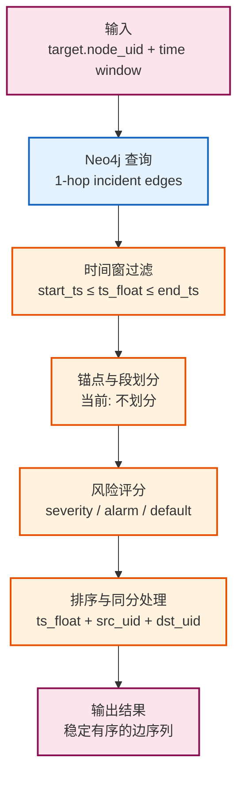
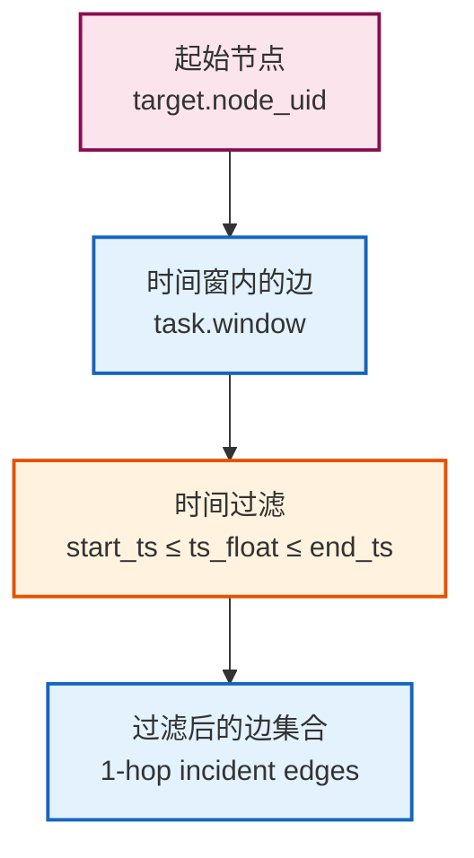
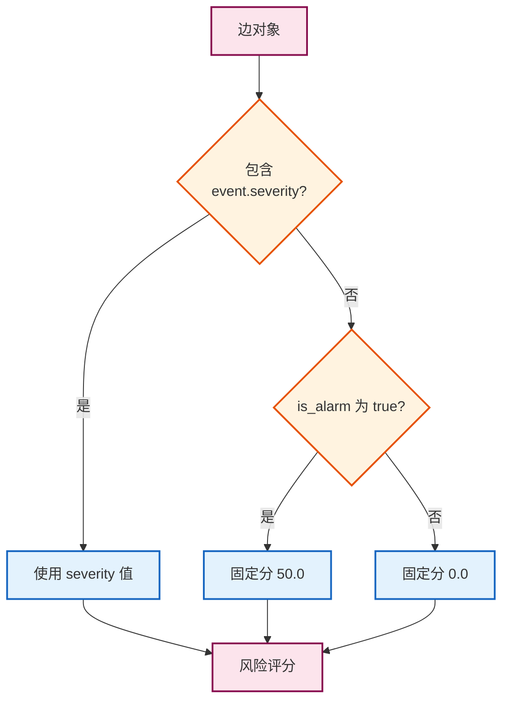
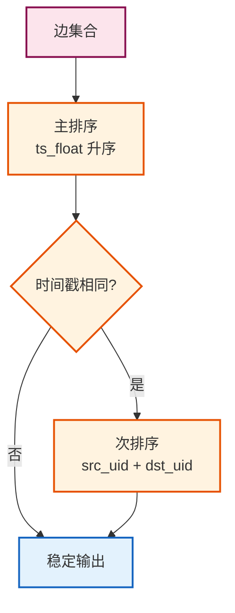

# 候选路径构造与评分

## 文档目的

本文件定义溯源算法中“候选路径构造与评分”的固定输入输出、时间窗过滤与风险评分规则。

## 读者对象

- 负责溯源算法实现的同学
- 负责测试与可解释性验证的同学

## 引用关系

- 溯源任务模型：`70-任务模型与状态机.md`
- 图谱规范：`../../80-规范/84-Neo4j实体图谱规范.md`

## 1. 输入子图定义

溯源算法的输入由 Neo4j 提供：

- 目标节点 UID：`task.target.node_uid`
- 时间窗：`[task.window.start_ts, task.window.end_ts]`

算法从目标节点的 1-hop incident edges 中获取边集合。

### 算法总览



### 输入配置示例

```json
{
  "target": {
    "node_uid": "process-12345"
  },
  "window": {
    "start_ts": 1704067200.0,
    "end_ts": 1704153600.0
  }
}
```

实现入口：

- `backend/app/services/analyze/trace.py` 的 `compute_trace()`

## 2. 时间窗过滤（固定）

输入边集合必须按 `ts_float` 过滤到时间窗内（闭区间语义）：

- `task.window.start_ts <= edge.ts_float <= task.window.end_ts`

时间窗的单位与转换规则由 Neo4j 模块统一处理；算法侧只处理 `ts_float` 数值比较。



## 3. 锚点与段划分（固定）

当前实现不进行攻击阶段段划分；边集合按事件时间排序后直接用于写回与展示。

## 4. 风险评分与排序（固定）

风险评分使用固定的兜底策略：

1. 若边属性包含 `event.severity`，风险分取其数值；
2. 否则若 `is_alarm=true`，风险分取 `50.0`；
3. 其他边风险分取 `0.0`。

### 评分规则可视化



### 评分示例

| 场景 | event.severity | is_alarm | 风险评分 |
|------|----------------|----------|----------|
| 高危事件 | 90.0 | false | **90.0** |
| 告警边（无 severity） | null | true | **50.0** |
| 普通事件 | null | false | **0.0** |
| 中危事件 | 60.0 | true | **60.0** |

### 代码示例

```python
def _derive_risk_score(edge: Edge) -> float:
    """计算边的风险评分"""
    if hasattr(edge, 'event') and edge.event.severity is not None:
        return float(edge.event.severity)
    if edge.is_alarm:
        return 50.0
    return 0.0
```

实现位置：

- `backend/app/services/analyze/trace.py` 的 `_derive_risk_score()`

## 5. 同分处理规则

同分处理规则固定为：

1. 先按 `ts_float` 时间升序排序；
2. 时间相同按边的 `src_uid` 与 `dst_uid` 字符串排序，保证输出稳定。

### 排序流程



### 排序示例

假设有以下边集合：

```python
edges = [
    Edge(ts_float=1000, src_uid="B", dst_uid="D"),
    Edge(ts_float=900, src_uid="A", dst_uid="C"),
    Edge(ts_float=1000, src_uid="A", dst_uid="B"),
    Edge(ts_float=1000, src_uid="A", dst_uid="C"),
]
```

排序后的结果：

| 顺序 | ts_float | src_uid | dst_uid | 排序依据 |
|------|----------|---------|---------|----------|
| 1 | 900 | A | C | 时间戳最小 |
| 2 | 1000 | A | B | 时间相同，src_uid 最小 |
| 3 | 1000 | A | C | 时间相同，src_uid 相同，dst_uid 排序 |
| 4 | 1000 | B | D | 时间相同，src_uid 较大 |
