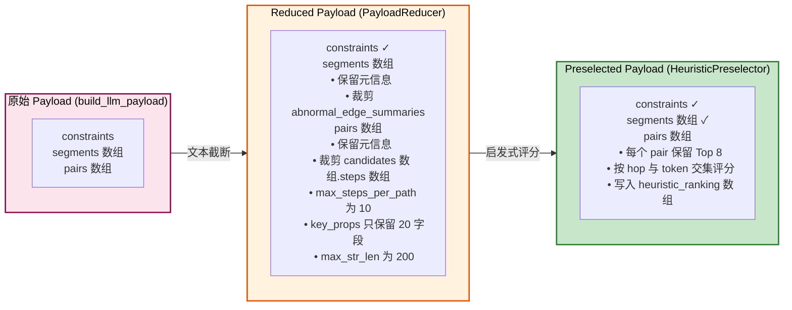
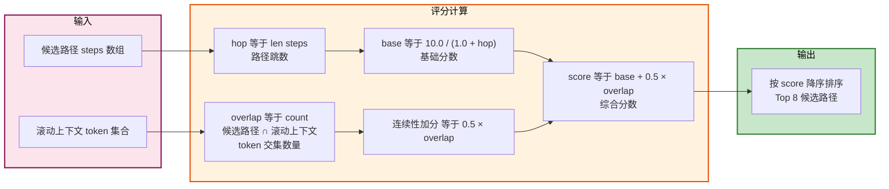
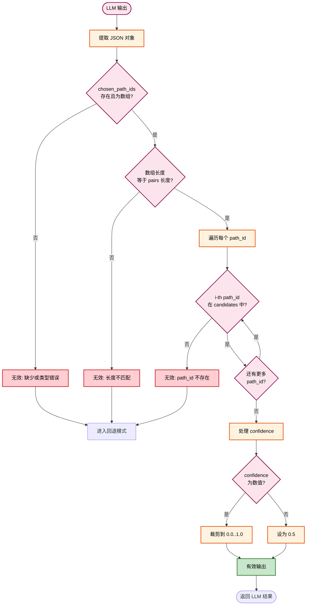
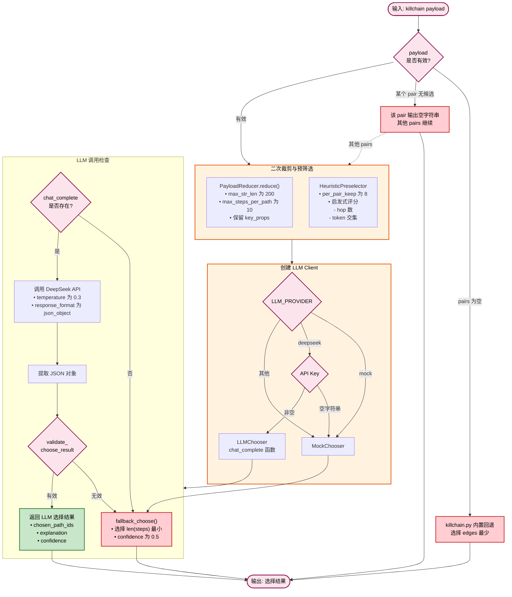
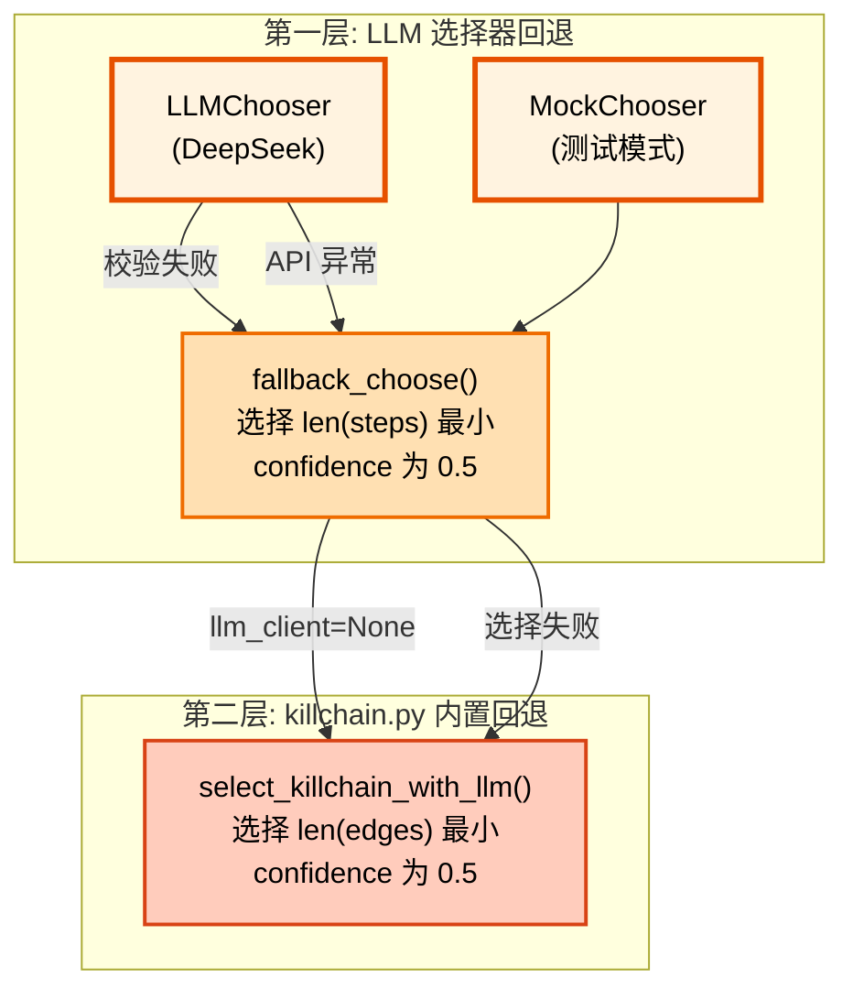

# LLM选择器与回退机制

## 文档目的

本文件定义 LLM 选择器的输入裁剪、输出结构、校验规则与失败判定，并定义固定的本地回退机制以保证可复现与可演示。

## 读者对象

- 负责溯源算法与 LLM 集成的同学
- 负责部署与稳定性保障的同学

## 引用关系

- 配置规范：`../../80-规范/89-环境变量与配置规范.md`
- 候选路径构造：`71-候选路径构造与评分.md`

## 1. 输入裁剪规则

LLM 选择器的输入由 `killchain.py` 生成，再由 `killchain_llm.py` 做二次裁剪。裁剪规则保证以下三点：

1. **输入体积受控**：字段与文本长度受控；
2. **可回溯性**：输入仍可回溯到图中的边与路径（保留 `path_id` 与关键步骤）；
3. **可复现性**：输入在回退模式下完全可复现（不依赖外部服务）。

实现绑定点（以代码为准）：

- 原始输入生成：`backend/app/services/analyze/killchain.py:build_llm_payload()`
- 二次裁剪：`backend/app/services/analyze/killchain_llm.py:PayloadReducer.reduce()`
- 启发式预筛：`backend/app/services/analyze/killchain_llm.py:HeuristicPreselector.preselect()`

### 1.1 原始输入结构（固定）

`build_llm_payload()` 生成的 payload 为一个 JSON 对象，顶层字段固定为：

- `constraints`：全局约束（时间窗、锚点等）；
- `segments 数组`：按 ATT&CK 战术分段的异常摘要；
- `pairs 数组`：相邻分段之间的“锚点对”及候选连接路径。

其中：

- `segments 数组.abnormal_edge_summaries 数组` 的元素来自边摘要（用于解释与选择）；
- `pairs 数组.candidates[]` 的元素为候选路径（每条路径为 `steps 数组`）。

### 1.2 二次裁剪（PayloadReducer，固定参数）

二次裁剪将大 payload 压缩为 reduced payload。压缩规则与参数固定：

1. 文本截断长度：`max_str_len = 200`；
2. 每条路径最多保留步骤数：`max_steps_per_path = 10`；
3. 每个 step 的 `key_props` 只保留固定字段集合（见下表）。

实现绑定点：`backend/app/services/analyze/killchain_llm.py:LLMChooseConfig` 与 `DEFAULT_EDGE_KEYS_KEEP`。

#### 1.2.1 Reduced Payload 顶层结构（固定）

裁剪后的结构固定为：

- `constraints`：原样保留（转为普通 dict）；
- `segments 数组`：保留段元信息与裁剪后的异常摘要；
- `pairs 数组`：保留段对元信息与裁剪后的候选路径步骤。

#### 1.2.2 steps.key_props 保留字段集合（固定）

每条 step 的 `key_props` 只保留以下键（其余键丢弃）：

- `edge_id`
- `ts`
- `src_uid`
- `dst_uid`
- `rel`
- `event.id`
- `event.dataset`
- `event.action`
- `rule.name`
- `threat.tactic.name`
- `threat.technique.name`
- `host.id`
- `host.name`
- `user.name`
- `process.entity_id`
- `process.name`
- `process.command_line`
- `source.ip`
- `destination.ip`
- `dns.question.name`
- `domain.name`

#### 1.2.3 Payload 裁剪流程



### 1.3 启发式预筛（HeuristicPreselector，固定参数）

在 reduced payload 的基础上，系统执行启发式预筛选，进一步裁剪每个段对的候选路径数量。

**固定参数**

- 每个段对最多保留候选数：`per_pair_keep = 8`

**启发式评分规则**

1. 以 `hop=len(steps)` 表示路径跳数；
2. 基础分：`base = 10.0 / (1.0 + hop)`；
3. 连续性分：统计当前候选与"全链滚动上下文 token 集合"的交集数量 `overlap`，加分项为 `0.5 * overlap`；
4. 综合分：`score = base + 0.5 * overlap`。

滚动上下文 token 集合固定包含以下维度：

- `proc`：`process.entity_id`
- `host`：`host.id`
- `user`：`user.name`
- `ip`：`source.ip` 与 `destination.ip`
- `domain`：`dns.question.name` 与 `domain.name`

预筛输出行为固定为：

1. 每个 `pair.candidates[]` 按 score 降序排序；
2. 截断为 Top `per_pair_keep` 候选；
3. 在 `pair.heuristic_ranking 数组` 中写入评分与原因，便于调试与解释。

#### 1.3.1 启发式评分公式



#### 1.3.2 评分示例

| hop | base | overlap | 连续性加分 | score | 说明 |
|-----|------|---------|-----------|-------|------|
| 1 | 5.0 | 3 | 1.5 | 6.5 | 最短路径，高连续性 |
| 2 | 3.33 | 2 | 1.0 | 4.33 | 中等路径，中等连续性 |
| 3 | 2.5 | 1 | 0.5 | 3.0 | 较长路径，低连续性 |
| 5 | 1.67 | 0 | 0.0 | 1.67 | 长路径，无连续性 |

## 2. 输出结构与校验规则

LLM chooser 对外输出为 JSON 对象（Python dict），字段集合与校验规则固定。

实现绑定点：

- 输出校验：`backend/app/services/analyze/killchain_llm.py:validate_choose_result()`
- JSON 提取：`backend/app/services/analyze/killchain_llm.py:_extract_json_obj()`

### 2.1 输出结构（固定字段）

返回对象字段固定为：

1. `chosen_path_ids: list[str]`
2. `explanation: str`
3. `confidence: float`（范围 `0.0..1.0`）
4. `pair_explanations: list[object]`

字段语义固定：

- `chosen_path_ids[i]` 表示第 `i` 个 `pairs[i]` 被选中的 `path_id`；
- `explanation` 为整条攻击链的全局解释文本；
- `confidence` 表示对整条攻击链解释的置信度；
- `pair_explanations` 为逐段对的解释数组，用于前端分段展示。

### 2.2 校验规则（固定）

输出满足以下全部条件才判定为"有效 LLM 输出"：

1. `chosen_path_ids` 存在且类型为 `list[str]`；
2. `len(chosen_path_ids) == len(pairs)`；
3. 对每个 `i`，`chosen_path_ids[i]` 必须属于 `pairs[i].candidates[].path_id` 集合。

**confidence 的处理规则**

- 当 LLM 输出 `confidence` 为数值时，系统将其裁剪到 `0.0..1.0`；
- 当 LLM 未输出 `confidence` 或类型不正确时，系统固定写入 `0.5`。

#### 2.2.1 输出校验流程



## 3. 失败判定条件

系统在以下任一条件满足时进入回退模式：

### 3.1 Payload 层失败（固定）

1. `pairs 数组` 为空（只包含单段攻击阶段，不需要段间连接）；
2. `pairs 数组` 非空但某个段对没有任何候选路径（该段对输出空字符串）。

### 3.2 LLM 调用层失败（固定）

1. 未注入 `chat_complete`（即没有可用的大模型调用函数）；
2. `chat_complete(messages)` 抛出异常；
3. 大模型返回内容无法提取 JSON 对象；
4. 提取出的 JSON 对象未通过 `validate_choose_result()` 校验。

### 3.3 Provider 创建失败（固定）

LLM client 的创建入口为 `create_llm_client()`，provider 选择规则固定：

1. 当 `LLM_PROVIDER="mock"` 时，返回 `MockChooser`；
2. 当 `LLM_PROVIDER="deepseek"` 且 `DEEPSEEK_API_KEY` 为空字符串时，返回 `MockChooser`；
3. 当 `LLM_PROVIDER="deepseek"` 且 `DEEPSEEK_API_KEY` 非空时，返回带 `chat_complete` 的 `LLMChooser`；
4. 当 `LLM_PROVIDER` 为其它值时，返回 `MockChooser`。

实现绑定点：`backend/app/services/analyze/killchain_llm.py:create_llm_client()`。

### 3.4 上层兜底失败（固定）

当 `create_llm_client()` 由于依赖缺失等原因抛出异常时，上层 `analyze_killchain()` 会将 `llm_client` 置为 `None`，最终由 `killchain.py` 的内置回退逻辑完成段对连接。

实现绑定点：

- 上层入口：`backend/app/services/analyze/__init__.py:analyze_killchain()`
- 内置回退：`backend/app/services/analyze/killchain.py:select_killchain_with_llm()`

### 3.5 LLM 选择器流程图



## 4. 回退算法

回退算法由两层组成：

1. `killchain_llm.py:fallback_choose()`：`LLMChooser` 与 `MockChooser` 的统一回退；
2. `killchain.py:select_killchain_with_llm()`：当上层未提供可用 chooser 时的回退。

### 4.0 回退层级结构



### 4.1 LLMChooser 回退（fallback_choose，固定）

回退算法对每个段对执行：

1. 在 `pair.candidates[]` 中选择 `len(steps)` 最小的候选路径；
2. 将该候选的 `path_id` 写入 `chosen_path_ids`；
3. 当某个段对候选为空时，该段对输出空字符串 `""`。

**回退输出字段**

- `confidence = 0.5`
- `pair_explanations = []`
- `explanation` 为 `fallback_choose()` 内置解释文本（不依赖外部输入）。

### 4.2 killchain.py 内置回退（固定）

当 `llm_client` 不存在或 LLM 选择失败时，`killchain.py` 会对每个段对在候选路径集合中选择边数最少（`len(edges)` 最小）的候选路径。

该回退输出的 `confidence` 固定为 `0.5`，解释文本由 `killchain.py` 内置常量生成。

### 4.3 回退机制对比

| LLM | 模型 | 用途 | 回退策略 | 触发条件 |
|-----|------|------|----------|----------|
| LLM-1 | DeepSeek | 主要解释 | 无回退 | `LLM_PROVIDER="deepseek"` 且 API Key 非空 |
| LLM-2 | Qwen | 备用解释 | LLM-1 失败时启用 | 预留扩展，当前未实现 |
| Rule-based | 规则引擎 | 兜底 | 所有 LLM 失败时启用 | • Payload 层失败<br/>• LLM 调用层失败<br/>• Provider 创建失败<br/>• 输出校验失败 |

## 5. 配置参数

### 5.1 模型选择参数

| 参数 | 类型 | 默认值 | 说明 |
|------|------|--------|------|
| `LLM_PROVIDER` | string | `"mock"` | LLM 提供商：`mock`、`deepseek` |
| `DEEPSEEK_API_KEY` | string | `""` | DeepSeek API 密钥，为空时使用 MockChooser |

### 5.2 裁剪参数

| 参数 | 类型 | 默认值 | 位置 | 说明 |
|------|------|--------|------|------|
| `max_str_len` | int | `200` | PayloadReducer | 文本字段最大长度 |
| `max_steps_per_path` | int | `10` | PayloadReducer | 每条路径最多保留步骤数 |
| `per_pair_keep` | int | `8` | HeuristicPreselector | 每个段对最多保留候选数 |

### 5.3 LLM 调用参数

| 参数 | 类型 | 默认值 | 说明 |
|------|------|--------|------|
| `temperature` | float | `0.3` | DeepSeek 温度参数 |
| `response_format` | string | `json_object` | 强制 JSON 输出 |
| `timeout` | int | - | API 调用超时（待实现） |
| `max_retries` | int | - | 最大重试次数（待实现） |

### 5.4 配置示例

#### 生产环境配置

```bash
# 使用 DeepSeek 进行 LLM 解释
export LLM_PROVIDER="deepseek"
export DEEPSEEK_API_KEY="sk-your-api-key-here"
```

#### 开发/测试环境配置

```bash
# 使用 Mock 模式（不调用真实 API）
export LLM_PROVIDER="mock"
export DEEPSEEK_API_KEY=""
```

#### 禁用 LLM 功能

```bash
# 设置为空或任意非 deepseek 值，系统自动回退到规则引擎
export LLM_PROVIDER=""
export DEEPSEEK_API_KEY=""
```

## 6. 可复现性保证

可复现性保证规则固定：

1. reduced payload 的裁剪参数固定（1.2 与 1.3）；
2. 回退算法只依赖 reduced payload 且不使用随机数；
3. 在候选路径 `steps` 数相同的情况下，Python 的稳定排序会保留原始候选顺序，因此回退结果对同一输入保持一致；
4. DeepSeek 调用固定使用 `temperature = 0.3` 且在支持时启用 `response_format={"type":"json_object"}`，并通过严格校验将异常输出统一收敛到回退模式。

DeepSeek 适配实现绑定点：`backend/app/services/analyze/killchain_llm.py:_create_llm_chat_complete()`。
