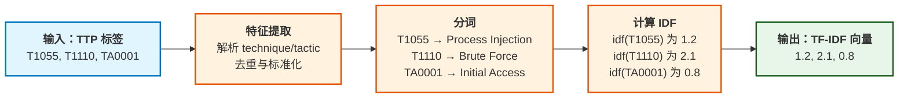
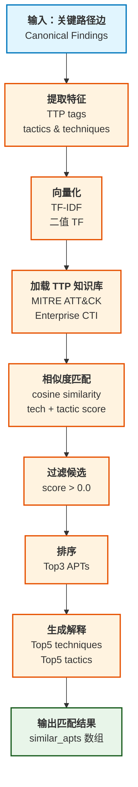

# TTP相似度匹配

## 文档目的

本文件定义基于 ATTCK CTI 的相似度匹配的输入输出、特征抽取与 Top3 输出口径。

## 读者对象

- 负责 TTP 相似度实现的同学
- 负责答辩讲解与测试的同学

## 引用关系

- ECS 字段规范：`../../80-规范/81-ECS字段规范.md`

## 1. 输入与特征抽取

TTP 相似度匹配以 Canonical Finding 作为输入样本，通过提取 ATT&CK tactic 与 technique 集合，计算与 CTI 中 intrusion-set（APT 组织）的相似度。

实现绑定点（以代码为准）：

- 入口服务：`backend/app/services/analyze/ttp_similarity/service.py`
- HTTP 接口：`backend/app/services/analyze/ttp_similarity/router.py`

### 1.1 输入参数（固定）

HTTP 接口输入字段固定为：

- `host_id`：ECS `host.id`
- `start_ts`：ISO 8601 起始时间（包含边界）
- `end_ts`：ISO 8601 结束时间（包含边界）

当 `end_ts < start_ts` 时，接口返回 HTTP 400。

### 1.2 Canonical Finding 拉取范围（固定）

系统从 OpenSearch 的 Canonical Findings 索引中拉取样本，查询条件固定：

- `event.dataset == "finding.canonical"`
- `host.id == host_id`
- `@timestamp` 在 `[start_ts, end_ts]`（包含边界）

实现绑定点：`backend/app/services/analyze/ttp_similarity/service.py:fetch_attack_ttps_from_canonical_findings()`。

### 1.3 Technique 提取与规范化（固定）

每条 Canonical Finding 的 technique 提取规则固定：

1. 读取顺序固定为：先读取嵌套字段 `threat.technique.id`；
2. 当嵌套字段不存在时读取平铺字段 `threat.technique.id`；
3. 将 technique id 标准化为大写，满足正则：`Tdddd` 或 `Tdddd.ddd`；
4. 过滤占位值：`UNKNOWN`、`TBD`、`T0000`、`T0000.xxx`；
5. 当 technique 为子技术（如 `T1055.012`）时，展开为集合 `{T1055.012, T1055}`。

实现绑定点：

- 解析与过滤：`backend/app/services/analyze/ttp_similarity/service.py:_normalize_technique_id()`
- 子技术展开：`backend/app/services/analyze/ttp_similarity/service.py:_expand_technique_ids()`

### 1.4 Tactic 提取与规范化（固定）

每条 Canonical Finding 的 tactic 提取规则固定：

1. 读取顺序固定为：先读取平铺字段 `threat.tactic.id`；
2. 当平铺字段不存在时读取嵌套字段 `threat.tactic.id`；
3. 标准化为大写，满足正则：`TAdddd`；
4. 过滤占位值：`UNKNOWN`、`TBD`、`TA0000`。

实现绑定点：`backend/app/services/analyze/ttp_similarity/service.py:_normalize_tactic_id()`。

## 2. CTI 数据与预处理

### 2.1 CTI 文件路径解析（固定）

系统加载本地 ATT&CK Enterprise CTI（STIX bundle JSON），路径解析规则固定：

1. 读取环境变量 `ATTACK_CTI_PATH`；
2. 当 `ATTACK_CTI_PATH` 为空字符串时，使用默认路径：
   - `backend/app/services/analyze/ttp_similarity/cti/enterprise-attack.json`
3. 当 `ATTACK_CTI_PATH` 为绝对路径时，直接使用该路径；
4. 当 `ATTACK_CTI_PATH` 为相对路径时，按顺序尝试：
   - 以当前工作目录为基准的相对路径；
   - 以 `backend` 根目录为基准的相对路径（当路径以 `backend/` 开头时会自动去除该前缀）。
5. 当最终路径不存在时抛出 `FileNotFoundError`，接口返回 HTTP 500。

实现绑定点：`backend/app/services/analyze/ttp_similarity/service.py:get_enterprise_cti_index()`。

### 2.2 CTI 索引构建（固定）

系统将 STIX bundle 构建为内存索引，索引内容固定：

1. `intrusion-set`：建立 `intrusion_set_stix_id -> (display_id, name)` 映射；其中 `display_id` 的取值规则固定为：当存在 ATT&CK 外部编号（`Gdddd`）时使用该编号，否则使用 stix id；
2. `attack-pattern`：建立 `attack_pattern_stix_id -> technique_id` 映射；technique id 来自 `external_references.source_name="mitre-attack"` 的 `external_id`；
3. `x-mitre-tactic`：建立 tactic shortname（或 name）到 tactic id（`TAdddd`）的映射；
4. `attack-pattern.kill_chain_phases`：派生 `technique_id -> tactics` 映射；子技术与父技术共享该 tactic 映射；
5. `relationship(uses)`：派生 `intrusion_set_stix_id -> techniques`（并将子技术展开到父技术）。

实现绑定点：`backend/app/services/analyze/ttp_similarity/service.py:build_enterprise_cti_index()`。

### 2.3 TF-IDF 权重（固定公式）

系统按 intrusion-set 集合作为"文档集合"计算 IDF：

- 设 intrusion-set 文档数为 `N`；
- 对任一 technique id，设文档频次为 `df`；
- technique 的 IDF 定义为：`idf = ln((N + 1) / (df + 1)) + 1.0`；
- tactic 的 IDF 使用同一公式（以 tactic 集合作为特征）。

并计算每个 intrusion-set 的 L2 范数：

- `group_norm`：technique TF-IDF 向量的 L2 范数；
- `group_tactic_norm`：tactic TF-IDF 向量的 L2 范数。

#### 2.3.1 向量化示意

TTP 标签到 TF-IDF 向量的转换过程：



## 3. 相似度计算

### 3.1 算法流程

TTP 相似度匹配的完整处理流程：



### 3.2 相似度向量（固定）

系统使用二值 TF（出现记 1，不出现记 0）的 TF-IDF 向量，并使用余弦相似度。

余弦分子 dot 的定义固定为：

- 仅对交集项求和：`dot = Σ (idf(t)^2)`。

实现绑定点：`backend/app/services/analyze/ttp_similarity/service.py:_cosine_from_intersection_weights()`。

### 3.3 综合分数（固定）

每个 intrusion-set 的综合相似度分数固定由两部分组成：

1. `tech_score`：attack techniques 与 intrusion-set techniques 的余弦相似度；
2. `tactic_score`：attack tactics 与 intrusion-set tactics 的余弦相似度。

**综合分数计算**

- `score = (1 - tactic_weight) * tech_score + tactic_weight * tactic_score`
- 其中 `tactic_weight = 0.5`

当 `score <= 0.0` 时，该 intrusion-set 不进入候选集合。

实现绑定点：`backend/app/services/analyze/ttp_similarity/service.py:rank_similar_intrusion_sets()`。

## 4. Top3 输出结构

### 4.1 TopK 与解释字段（固定）

**输出规则**

- TopK：`top_k = 3`
- 每个候选的解释字段个数：`explain_top_n = 5`

对于每个 TopK intrusion-set，系统输出：

1. `intrusion_set.id`：当 CTI 中存在 ATT&CK 外部编号（如 `G0016`）时输出该编号，否则输出 intrusion-set 的 stix id；
2. `intrusion_set.name`：组织名称；
3. `similarity_score`：综合相似度；
4. `top_techniques[]`：交集 technique 按 `technique_idf` 降序的前 `explain_top_n` 个；
5. `top_tactics[]`：交集 tactic 按 `tactic_idf` 降序的前 `explain_top_n` 个。

### 4.2 HTTP Response（固定字段）

接口返回字段固定为：

- `host_id`
- `start_ts`
- `end_ts`
- `attack_tactics[]`（排序后输出）
- `attack_techniques[]`（过滤后输出）
- `similar_apts[]`（最多 3 项）

#### 4.2.1 Top3 输出示例

```json
{
  "host_id": "i-0abc123def456",
  "start_ts": "2024-01-01T00:00:00Z",
  "end_ts": "2024-01-01T23:59:59Z",
  "attack_tactics": [
    {"id": "TA0001", "name": "Initial Access"},
    {"id": "TA0006", "name": "Credential Access"}
  ],
  "attack_techniques": [
    {"id": "T1078", "name": "Valid Accounts"},
    {"id": "T1110", "name": "Brute Force"},
    {"id": "T1021", "name": "Remote Services"}
  ],
  "similar_apts": [
    {
      "intrusion_set": {
        "id": "G0016",
        "name": "APT28"
      },
      "similarity_score": 0.85,
      "top_techniques": [
        {"technique_id": "T1078", "technique_idf": 2.1},
        {"technique_id": "T1110", "technique_idf": 1.8}
      ],
      "top_tactics": [
        {"tactic_id": "TA0001", "tactic_idf": 1.2},
        {"tactic_id": "TA0006", "tactic_idf": 0.9}
      ]
    },
    {
      "intrusion_set": {
        "id": "G0015",
        "name": "APT29"
      },
      "similarity_score": 0.72,
      "top_techniques": [
        {"technique_id": "T1078", "technique_idf": 2.1}
      ],
      "top_tactics": [
        {"tactic_id": "TA0001", "tactic_idf": 1.2}
      ]
    },
    {
      "intrusion_set": {
        "id": "G0035",
        "name": "Lazarus Group"
      },
      "similarity_score": 0.65,
      "top_techniques": [
        {"technique_id": "T1021", "technique_idf": 1.5}
      ],
      "top_tactics": []
    }
  ]
}
```

字段结构的权威口径见：

- `../../80-规范/88-前端与中心机接口.md`
