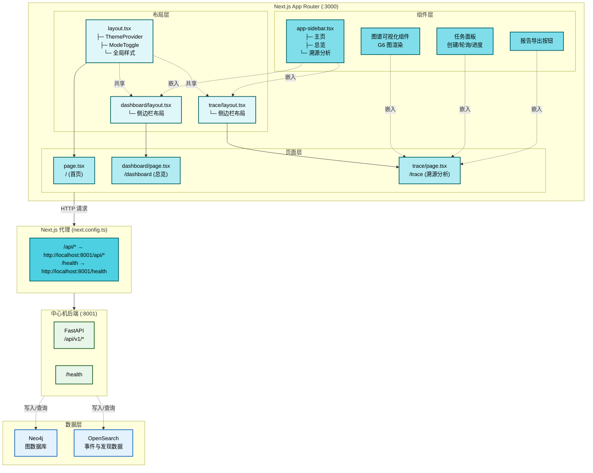
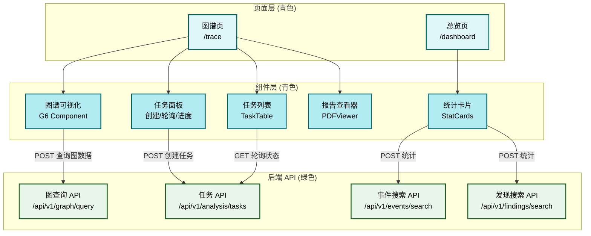
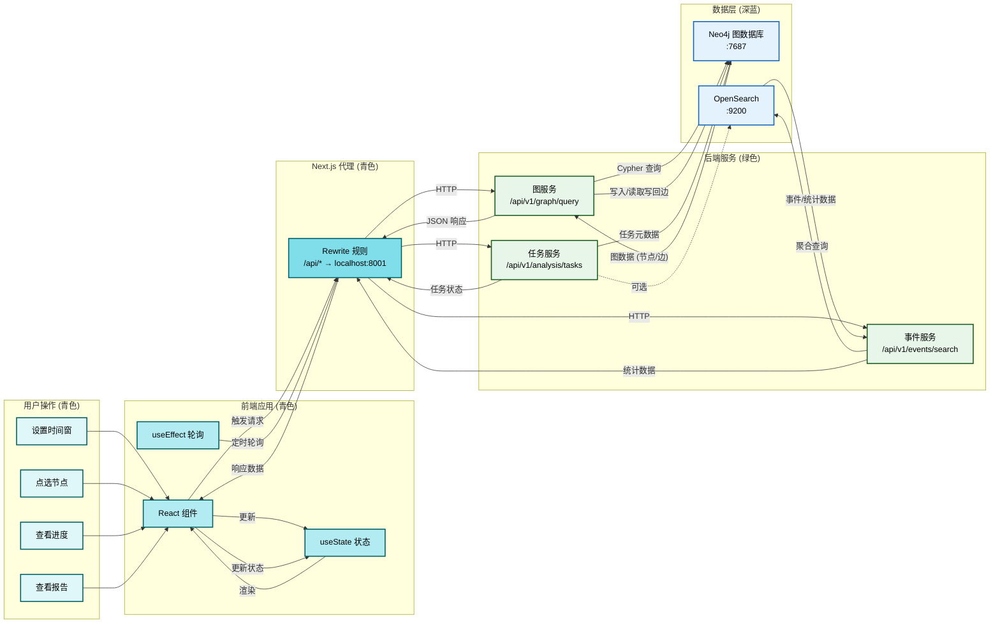

# 总体与页面结构

## 文档目的

本文档规定前端应用的页面架构、数据流向与后端接口绑定关系，为前端开发提供统一的实现规范。

## 读者对象

- 前端开发人员
- 演示准备与报告导出负责人

## 引用关系

- 前端与中心机接口：`../../80-规范/88-前端与中心机接口.md`

## 1. 页面架构

前端应用基于 Next.js App Router 架构（`frontend/app/`），页面路由与代码文件组织方式固定，确保代码结构清晰可维护。

### 1.1 页面层级结构



### 1.2 路由与文件映射（固定）

| 路由 | 页面功能 | 代码位置 |
|---|---|---|
| `/` | 项目首页与入口 | `frontend/app/page.tsx` |
| `/dashboard` | 总览大盘 | `frontend/app/dashboard/page.tsx` |
| `/trace` | 溯源分析主界面 | `frontend/app/trace/page.tsx` |

### 1.3 布局与导航（固定）

页面布局采用分层架构，导航组件复用确保用户体验一致：

1. **全局根布局**：`frontend/app/layout.tsx`
   - 注入主题切换能力（`ThemeProvider` + `ModeToggle`）
   - 统一全局样式管理

2. **侧边栏导航**：`frontend/components/sidebar/app-sidebar.tsx`
   - 菜单项固定包含：主页、总览、溯源分析
   - 在多个页面间共享

3. **页面级布局**：
   - `/dashboard` 与 `/trace` 共享侧边栏布局
   - 分别对应 `frontend/app/dashboard/layout.tsx` 和 `frontend/app/trace/layout.tsx`

### 1.4 组件关系图



## 2. 数据流与状态管理

前端采用"页面内状态 + 明确请求边界"的状态管理策略：

1. **最小状态原则**：页面状态仅保存渲染所需的最小数据集
2. **统一数据获取**：所有后端数据通过 `88-前端与中心机接口.md` 规范的接口获取
3. **显式状态更新**：状态变更由用户操作或定时轮询驱动，避免隐式副作用

### 2.1 Dashboard 数据流（固定）

Dashboard 页面展示四类概览卡片，数据来源与接口绑定关系固定：

- **Telemetry 统计**：`POST /api/v1/events/search`
- **Raw/Canonical 告警统计**：`POST /api/v1/findings/search`
- **任务统计**：`GET /api/v1/analysis/tasks`

Dashboard 页面为只读视图，仅获取聚合统计数据，不触发溯源任务和图查询操作。

### 2.2 Trace 数据流（固定）

Trace 页面数据流分为 4 个阶段，形成完整的溯源分析闭环：

1. **时间窗输入**：用户设定时间范围（最近 N 分钟）→ 图数据拉取
2. **交互触发**：用户点击节点 → 创建溯源任务
3. **进度跟踪**：任务轮询 → 读取写回边并高亮显示
4. **结果展示**：TTP 相似度分析 → 输出 Top-3 组织与解释说明

所有 HTTP 请求通过中心机后端完成，前端不直接访问 OpenSearch 和 Neo4j。

### 2.3 完整数据流图



### 2.4 数据流阶段说明

| 阶段 | 触发条件 | 数据流向 | 涉及组件 | 数据存储 |
|---|---|---|---|---|
| **初始化** | 页面加载 | 前端 → 后端 → Neo4j | 图谱组件 | 图节点与边 |
| **图查询** | 时间窗变更 | 前端 → 后端 → Neo4j | 图谱组件 | 时间窗内子图 |
| **任务创建** | 节点点击 | 前端 → 后端 → Neo4j | 任务面板 | 任务文档 |
| **进度轮询** | 自动触发 | 前端 → 后端 → Neo4j | 任务列表 | 任务状态字段 |
| **写回读取** | 任务完成 | 前端 → 后端 → Neo4j | 图谱组件 | analysis_edges_by_task |
| **TTP 分析** | 任务完成 | 前端 → 后端（缓存） | 报告查看器 | ttp_similarity 字段 |

## 3. 接口调用边界

### 3.1 前端网络边界（固定）

前端应用的网络边界明确限定为：

- **仅调用**中心机 HTTP API（`/api/v1/*` 与 `/health`）
- **不直连** OpenSearch（`:9200`）和 Neo4j（`:7687`）

### 3.2 Trace 页面接口绑定（固定）

Trace 页在不同阶段调用接口的绑定关系固定如下（字段结构以 `88-前端与中心机接口.md` 为准）：

| 阶段 | 触发动作 | 方法 | 路径 | 目的 |
|---|---|---|---|---|
| 图拉取 | 设置时间窗并刷新 | POST | `/api/v1/graph/query` | 获取时间窗图边与节点 |
| 创建任务 | 点选目标节点 | POST | `/api/v1/analysis/tasks` | 创建溯源任务并得到 `task_id` |
| 轮询任务 | 创建任务后自动开始 | GET | `/api/v1/analysis/tasks/{task_id}` | 获取任务状态与进度 |
| 读取写回 | 任务完成后自动触发 | POST | `/api/v1/graph/query` | 读取 `analysis_edges_by_task` 并高亮 |
| 相似度 | 任务完成后自动展示 | - | - | 优先从任务文档 `task.result.ttp_similarity.*` 读取并展示 Top-3；必要时可回落调用 `/api/v1/analysis/ttp-similarity` |

### 3.3 前端代理规则（固定）

前端应用运行在端口 `3000`，后端服务运行在端口 `8001`。为满足浏览器同源策略，前端通过 Next.js rewrite 规则将 API 请求转发到本地后端：

- `/api/*` → `http://localhost:8001/api/*`
- `/health` → `http://localhost:8001/health`

配置绑定点：`frontend/next.config.ts`

#### 代理配置示例

```typescript
// frontend/next.config.ts
import type { NextConfig } from "next";

const nextConfig: NextConfig = {
  async rewrites() {
    return [
      {
        source: "/api/:path*",
        destination: "http://localhost:8001/api/:path*",
      },
      {
        source: "/health",
        destination: "http://localhost:8001/health",
      },
    ];
  },
};

export default nextConfig;
```

#### 端口映射表

| 源端 | 目标端口 | 协议 | 说明 |
|---|---|---|---|
| `:3000` | `:8001` | HTTP | 前端 → 后端 API 请求 |
| `:8001` | `:7687` | Bolt | 后端 → Neo4j 图数据库 |
| `:8001` | `:9200` | HTTP | 后端 → OpenSearch 搜索引擎 |
