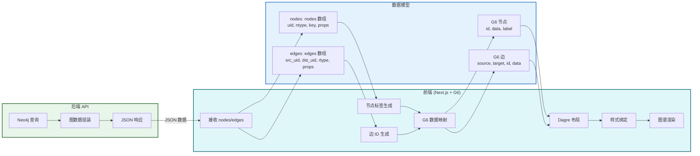
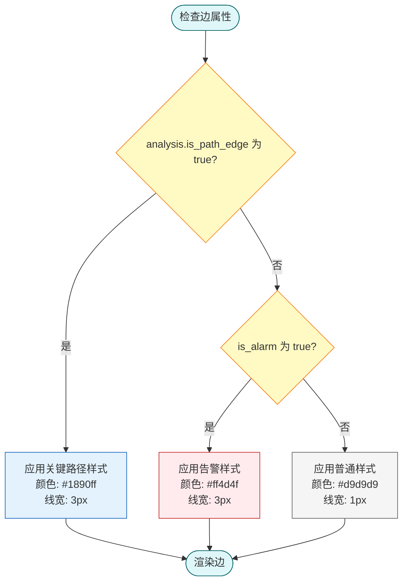
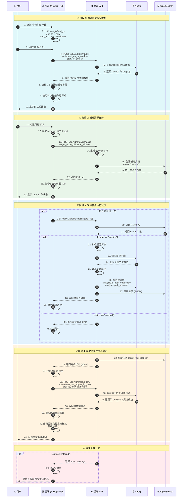

# 图谱可视化与交互

## 文档目的

本文件定义图谱可视化的渲染模型、筛选与高亮规则、以及点选节点触发溯源任务的交互流程。

## 读者对象

- 负责前端图可视化的同学
- 负责后端图查询接口的同学

## 引用关系

- 图查询接口：`../../80-规范/88-前端与中心机接口.md`
- 图谱规范：`../../80-规范/84-Neo4j实体图谱规范.md`

## 1. 图查询请求与时间窗

图谱页的数据来源固定为中心机图查询接口：`POST /api/v1/graph/query`。

### 1.1 视图模式（固定）

溯源分析页面固定提供三种视图模式：

1. 告警视图：`action="alarm_edges"`
2. 时间窗视图：`action="edges_in_window"`
3. 任务视图：`action="analysis_edges_by_task"`

其中：

- 告警视图用于展示 `is_alarm=true` 的边集合；
- 时间窗视图用于展示用户选定时间窗内的边集合；
- 任务视图用于展示某个溯源任务写回的边集合。

### 1.2 时间窗输入（固定）

后端接口的时间窗字段固定为两个字段（权威口径见 `88-前端与中心机接口.md`）：

- `start_ts`：ISO 8601（UTC）
- `end_ts`：ISO 8601（UTC）

前端页面**不提供高级时间选择器**，仅保留"最近 N 分钟"的快捷方式：

1. 用户选择 `N`（分钟）；
2. 在触发"刷新图谱"或"创建溯源任务"时，前端以当前时刻 `now` 计算：
   - `end_ts = now`
   - `start_ts = now - N minutes`
3. 将计算得到的 `start_ts/end_ts` 同时用于：
   - 时间窗视图（`action="edges_in_window"`）
   - 溯源任务创建（`POST /api/v1/analysis/tasks`）

该规则用于：限制图查询返回规模、保证任务输入与图展示口径一致，并保证报告导出的可复现性。

**时间窗计算示例**：

```javascript
// 时间窗计算函数
function calculateTimeWindow(minutes) {
  const now = new Date();
  const endTs = now.toISOString(); // 当前时间 UTC

  const startTime = new Date(now.getTime() - minutes * 60 * 1000);
  const startTs = startTime.toISOString(); // N 分钟前 UTC

  return {
    start_ts: startTs,
    end_ts: endTs,
  };
}

// 使用示例
const window = calculateTimeWindow(15);
console.log(window);
// 输出示例：
// {
//   start_ts: "2025-01-16T10:30:00.000Z",
//   end_ts: "2025-01-16T10:45:00.000Z"
// }
```

**时间窗快捷选项**：

| 选项名称 | 时间范围 | 典型场景 |
|---------|---------|---------|
| 最近 5 分钟 | N=5 | 实时监控 |
| 最近 15 分钟 | N=15 | 即时分析 |
| 最近 30 分钟 | N=30 | 短期溯源 |
| 最近 1 小时 | N=60 | 常规分析 |
| 最近 3 小时 | N=180 | 长周期溯源 |

### 1.3 请求字段固定值（固定）

为保证前端渲染所需字段完整，图查询请求固定携带：

- `allowed_reltypes=null`（不做关系类型裁剪）

时间窗视图在筛选告警边时固定使用：

- `only_alarm=true`

对应接口字段的权威口径见：`../../80-规范/88-前端与中心机接口.md`。

## 2. 渲染模型

前端图渲染使用 AntV G6（`@antv/g6`），图数据模型与样式绑定关系固定。

### 2.0 图谱渲染数据流（固定）



### 2.1 后端数据模型到 G6 的映射（固定）

后端 `graph/query` 返回：

- `nodes[]`：节点对象（含 `uid/ntype/key/props`）
- `edges[]`：边对象（含 `src_uid/dst_uid/rtype/props`）

G6 映射规则固定为：

1. G6 Node
   - `id = node.uid`
   - `data = node`（完整保留）
   - `label`：从 `node.props` 与 `node.uid` 生成（见 2.2）
2. G6 Edge
   - `source = edge.src_uid`
   - `target = edge.dst_uid`
   - `data = edge`（完整保留）
   - `id`：按固定规则生成（见 2.3）

**数据映射示例**：

| 数据层级 | 后端字段 | G6 字段 | 示例值 |
|---------|---------|---------|--------|
| **节点标识** | `uid` | `id` | `"host-12345"` |
| **节点类型** | `ntype` | `data.ntype` | `"Host"` |
| **节点键** | `key` | `data.key` | `"/proc/1234"` |
| **节点属性** | `props` | `data.props` | `{host.name: "web-01"}` |
| **节点标签** | - | `label` | `"web-01"` (从 props 生成) |
| **边源节点** | `src_uid` | `source` | `"host-12345"` |
| **边目标节点** | `dst_uid` | `target` | `"proc-67890"` |
| **边关系类型** | `rtype` | `data.rtype` | `"spawned"` |
| **边属性** | `props` | `data.props` | `{is_alarm: true}` |
| **边标识** | - | `id` | `"e-a3f5c9d2b1e4..."` (SHA1 生成) |

### 2.2 节点标签生成规则（固定）

节点展示标签固定由以下规则生成（从上到下依次匹配）：

1. Host 节点：
   - `props["host.name"]` 非空则用该值
   - 否则使用 `props["host.id"]`
2. Process 节点：
   - `props["process.name"]` 非空则用该值
   - 否则使用 `props["process.entity_id"]`
3. User 节点：
   - `props["user.name"]` 非空则用该值
   - 否则使用 `props["user.id"]`
4. IP 节点：`props["ip"]`
5. Domain 节点：`props["domain.name"]`
6. File 节点：`props["file.path"]`
7. 兜底：`node.uid`

### 2.3 边 ID 生成规则（固定）

后端边对象不提供独立的稳定 ID，前端为 G6 边生成稳定 `id`，规则固定为：

1. 构造原始串：`raw = src_uid + "|" + rtype + "|" + dst_uid + "|" + ts_float + "|" + event_id`
2. 计算 `sha1(raw)` 的前 16 位
3. 拼接为：`e-<sha1_16>`

其中：

- `ts_float` 取 `edge.props["ts_float"]`（数值，秒）
- `event_id` 取 `edge.props["event.id"]`（字符串）

**代码示例**：

```javascript
// 生成边 ID（前端实现）
function generateEdgeId(edge) {
  const raw = `${edge.src_uid}|${edge.rtype}|${edge.dst_uid}|` +
              `${edge.props["ts_float"]}|${edge.props["event.id"]}`;
  const sha1 = crypto.subtle.digest('SHA-1', raw);
  const hash16 = sha1.substring(0, 16);
  return `e-${hash16}`;
}
```

### 2.4 布局与交互能力（固定）

图布局固定采用有向层次布局（Dagre），参数固定：

- `rankdir="LR"`
- `nodesep=30`
- `ranksep=60`

**配置示例**：

```javascript
// G6 布局配置
const layout = {
  type: 'dagre',
  rankdir: 'LR',
  nodesep: 30,
  ranksep: 60,
};

// 交互模式配置
const modes = {
  default: [
    'drag-canvas',
    'zoom-canvas',
    'drag-node',
  ],
};
```

交互能力固定启用：

- 拖动画布
- 缩放画布
- 拖动节点

## 3. 交互规则

### 3.1 选中与详情面板（固定）

用户点选节点或边后，页面固定展示详情面板：

- Node 详情：展示 `uid/ntype/key/props`（JSON 展示）
- Edge 详情：展示 `src_uid/dst_uid/rtype/props`（JSON 展示）

详情面板用于现场演示的证据解释：必须展示 `event.id` 与 `custom.evidence.event_ids[]`。

### 3.2 高亮规则（固定）

边的颜色与线型高亮规则固定：

1. 告警边高亮：当 `edge.props.is_alarm=true` 时，边样式固定为红色加粗；
2. 关键路径边高亮：当 `edge.props["analysis.is_path_edge"]=true` 时，边样式固定为蓝色加粗；
3. 普通边：灰色细线。

当同一条边同时满足 1 与 2 时，关键路径边样式覆盖告警边样式。

**高亮效果示意**：

| 边类型 | 判断条件 | 样式配置 | 颜色值 | 线宽 |
|--------|----------|----------|--------|------|
| 告警边 | `is_alarm=true` | 红色加粗 | `#ff4d4f` | 3px |
| 关键路径边 | `analysis.is_path_edge=true` | 蓝色加粗 | `#1890ff` | 3px |
| 普通边 | 默认 | 灰色细线 | `#d9d9d9` | 1px |

**代码示例**：

```javascript
// 边样式映射函数
function getEdgeStyle(edge) {
  const props = edge.props || {};

  // 优先级：关键路径 > 告警 > 普通
  if (props["analysis.is_path_edge"] === true) {
    return {
      stroke: '#1890ff',
      lineWidth: 3,
      lineAppendWidth: 3,
    };
  }

  if (props.is_alarm === true) {
    return {
      stroke: '#ff4d4f',
      lineWidth: 3,
      lineAppendWidth: 3,
    };
  }

  // 普通边
  return {
    stroke: '#d9d9d9',
    lineWidth: 1,
    lineAppendWidth: 1,
  };
}
```

**样式优先级流程图**：



## 4. 任务触发与轮询

### 4.0 交互流程图（完整闭环）



### 4.1 任务触发（固定）

溯源任务触发动作固定为：

1. 用户在时间窗视图中选中一个节点；
2. 页面使用该节点的 `uid` 作为 `target_node_uid`；
3. 使用当前页面时间窗（由“最近 N 分钟”计算得到）作为 `start_ts/end_ts`；
4. 调用 `POST /api/v1/analysis/tasks` 创建任务。

### 4.2 轮询策略（固定）

任务创建成功后页面进入轮询，轮询策略固定：

- 轮询接口：`GET /api/v1/analysis/tasks/{task_id}`
- 轮询间隔：`1s`
- 停止条件：`task.status` 为 `succeeded` 或 `failed`

**轮询状态机**：

| 任务状态 | 含义 | 前端行为 | 后续动作 |
|---------|------|---------|---------|
| `queued` | 任务已创建，等待执行 | 显示"等待中" (0%) | 继续轮询 |
| `running` | 任务执行中 | 显示进度条 (5-95%) | 继续轮询 |
| `succeeded` | 任务成功完成 | 停止轮询，显示成功 | 查询写回边并高亮 |
| `failed` | 任务失败 | 停止轮询，显示错误 | 展示 error.message |

**轮询实现示例**：

```javascript
// 前端轮询实现
async function pollTaskStatus(taskId) {
  const pollInterval = 1000; // 1s
  let shouldStop = false;

  const timer = setInterval(async () => {
    try {
      const response = await fetch(`/api/v1/analysis/tasks/${taskId}`);
      const task = await response.json();

      // 更新进度 UI
      updateProgressBar(task.progress);

      // 检查终止条件
      if (task.status === 'succeeded') {
        clearInterval(timer);
        await loadAnalysisEdges(taskId);
        highlightCriticalPath();
      } else if (task.status === 'failed') {
        clearInterval(timer);
        showErrorMessage(task.error?.message || '任务失败');
      }
    } catch (error) {
      clearInterval(timer);
      showErrorMessage('网络请求失败');
    }
  }, pollInterval);
}
```

### 4.3 写回边读取与渲染（固定）

当 `task.status="succeeded"` 时，页面固定执行：

1. 调用 `POST /api/v1/graph/query`，参数：
   - `action="analysis_edges_by_task"`
   - `task_id=<task_id>`
   - `only_path=true`
2. 将返回边集合叠加到当前图中并触发关键路径高亮（见 3.2）。

当 `task.status="failed"` 时，页面固定展示失败原因（后端返回的 `error.message`）。

**API 响应示例**：

```json
// POST /api/v1/graph/query
// action=analysis_edges_by_task
{
  "nodes": [
    {
      "uid": "host-1921681110",
      "ntype": "Host",
      "key": null,
      "props": {
        "host.name": "web-01",
        "host.id": "192.168.1.110"
      }
    },
    {
      "uid": "proc-12345",
      "ntype": "Process",
      "key": "/proc/12345",
      "props": {
        "process.name": "nginx",
        "process.pid": 12345,
        "process.entity_id": "abcdef123456"
      }
    }
  ],
  "edges": [
    {
      "src_uid": "host-1921681110",
      "dst_uid": "proc-12345",
      "rtype": "spawned",
      "props": {
        "ts_float": 1737033600.123,
        "event.id": "event-67890",
        "is_alarm": false,
        "analysis.is_path_edge": true,
        "analysis.path_score": 0.95,
        "analysis.path_position": 3
      }
    }
  ]
}
```
