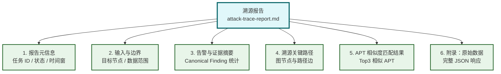
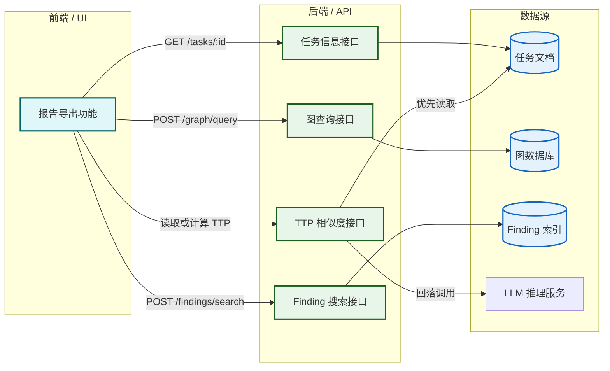
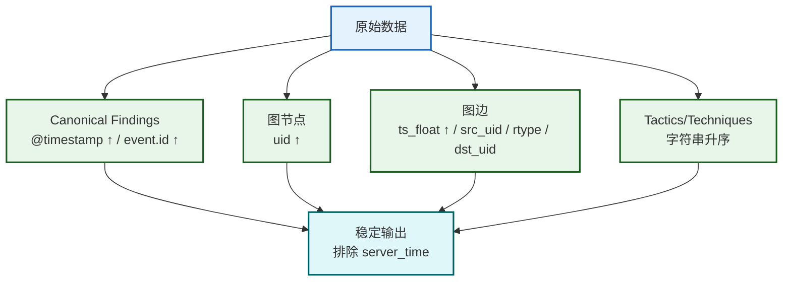
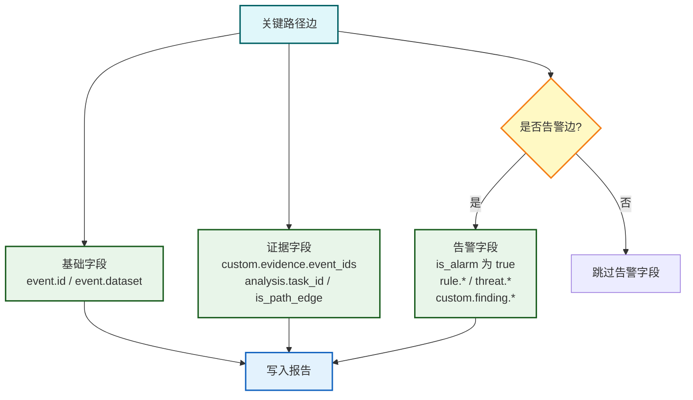

# 报告导出

## 文档目的

本文档规定前端报告导出的数据来源、内容结构与可复现性约束，确保导出结果规范一致。

## 读者对象

- 前端导出功能开发人员
- 答辩材料准备负责人

## 引用关系

- 验收标准：`../../20-需求与验收/21-验收标准与验收用例.md`

## 1. 导出内容结构

报告导出面向课程交付与现场答辩，导出产物格式、章节结构与字段口径固定。

### 1.1 导出产物（固定）

前端导出产物为单个 Markdown 文件：

- **文件名**：`attack-trace-report-<task_id>.md`
- **命名说明**：`<task_id>` 为溯源任务 ID（例如 `trace-aaaaaaaa-bbbb-cccc-dddd-eeeeeeeeeeee`）

### 1.2 报告章节结构（固定）

Markdown 报告章节结构固定为：

**章节清单：**

1. 报告元信息
2. 输入与边界
3. 告警与证据摘要
4. 溯源关键路径
5. APT 相似度匹配结果
6. 附录：原始数据（JSON）

### 1.3 字段口径（固定）

报告字段口径遵循以下规范：

- **ECS 字段**：`../../80-规范/81-ECS字段规范.md`
- **图查询与任务接口**：`../../80-规范/88-前端与中心机接口.md`
- **写回字段**：`../../80-规范/85-溯源结果写回规范.md`

## 2. 数据来源

报告导出数据全部来自中心机后端接口，数据来源固定为以下 4 类请求。

### 2.0 数据来源总览

### 报告数据映射表

| 报告章节 | 数据来源 | API 端点 | 核心字段 |
|---------|---------|---------|---------|
| 报告元信息 | 任务文档 | `GET /api/v1/analysis/tasks/{task_id}` | `task_id`, `status`, `time_window` |
| 溯源关键路径 | 图数据库 | `POST /api/v1/graph/query` | `nodes[]`, `edges[]` |
| 告警摘要 | Finding 索引 | `POST /api/v1/findings/search` | `tactic`, `technique`, `event.id` |
| TTP 相似度 | 任务文档/LLM | 任务文档或 `POST /api/v1/analysis/ttp-similarity` | `apt_id`, `similarity`, `reasoning` |

### 2.1 任务信息（固定）

- **方法**：`GET`
- **路径**：`/api/v1/analysis/tasks/{task_id}`
- **用途**：获取任务状态、时间窗与目标节点 UID

### 2.2 溯源关键路径（固定）

- **方法**：`POST`
- **路径**：`/api/v1/graph/query`
- **请求参数**：
  - `action="analysis_edges_by_task"`
  - `task_id=<task_id>`
  - `only_path=false`（默认值；前端按 `analysis.is_path_edge=true` 筛选关键路径边）
- **用途**：获取任务写回的关键路径边与涉及节点

> **说明**：后端响应固定包含 `nodes[]`（按边集合中的 UID 去重拉取），无需额外的 `include_nodes` 参数；字段结构以 `../../80-规范/88-前端与中心机接口.md` 为准。

### 2.3 Canonical Finding 摘要（固定）

- **方法**：`POST`
- **路径**：`/api/v1/findings/search`
- **请求参数**：
  - `stage="canonical"`
  - `start_ts/end_ts` 使用任务时间窗
  - `host_id` 为报告主机
- **用途**：获取时间窗内 Canonical Finding 的 tactic/technique 覆盖与证据引用

### 2.4 TTP 相似度（固定）

TTP 相似度读取采用优先级策略：

1. **优先读取**任务文档 `task.result.ttp_similarity.*`（保证与任务执行时结果一致，避免重复计算）
2. **回落计算**：当任务文档缺失该结果时，调用 `POST /api/v1/analysis/ttp-similarity` 重新计算（参数：`host_id + start_ts/end_ts`）

## 3. 生成规则与可复现性

### 3.0 生成流程

### 3.1 报告主机选择规则（固定）

报告主机 `host_id` 按以下优先级获取：

1. **UID 解析**：若 `task.target.node_uid` 中包含 `host.id`（如 `Host:host.id=...`、`File:host.id=...;file.path=...`），直接从 UID 解析
2. **节点查询**：从 `POST /api/v1/graph/query` 返回的 `nodes[]` 中定位目标节点（`uid == task.target.node_uid`），优先读取 `node.key["host.id"]`，其次读取 `node.props["host.id"]`
3. **错误处理**：当上述方法均无法获取 `host.id` 时，导出流程终止并提示错误

> **说明**：中心机后端将唯一键字段拆分为 `key` 与 `props` 两部分，部分节点的 `host.id` 可能出现在 `key` 中；为保证导出稳定性，必须按上述优先级读取。

### 3.2 排序与格式化（固定）

为确保同一输入导出结果一致，报告采用固定排序规则：

**排序规则详表：**

| 数据类型 | 主排序键 | 次排序键 | 第三排序键 |
|---------|---------|---------|-----------|
| Canonical Findings | `@timestamp` 升序 | `event.id` 升序 | - |
| 图节点 | `uid` 升序 | - | - |
| 图边 | `props.ts_float` 升序 | `src_uid` 升序 | `rtype` / `dst_uid` 升序 |
| Tactics/Techniques | 字符串升序 | - | - |

报告排除 `server_time` 字段，仅包含与输入相关的稳定字段，确保可复现性。

### 3.3 证据引用呈现（固定）

关键路径边在报告中包含以下字段：

**必呈字段清单：**

| 字段类别 | 必呈字段 | 说明 |
|---------|---------|------|
| 基础字段 | `event.id` | 事件唯一标识 |
|  | `event.dataset` | 数据集来源 |
| 证据字段 | `custom.evidence.event_ids[]` | 关联证据 ID 列表 |
|  | `analysis.task_id` | 所属溯源任务 |
|  | `analysis.is_path_edge` | 是否关键路径边 |
| 告警字段 （条件性） | `is_alarm 为 true` | 告警标识 |
|  | `rule.*` | 规则信息 |
|  | `threat.*` | 威胁情报 |
|  | `custom.finding.*` | Finding 扩展字段 |

这些字段支持现场演示中"从告警到证据再到路径"的解释闭环。
