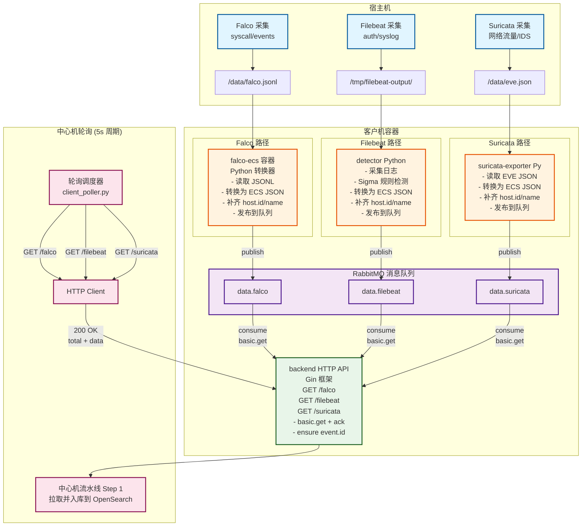

# 客户机总体设计

## 文档目的

本文档阐述客户机侧的总体架构，包括组件构成、数据流转、与中心机的交互边界，并索引各模块详细设计文档。

## 读者对象

- 客户机实现与部署人员
- 靶场联调与故障排查人员
- 验收与证据准备人员

## 引用关系

- ECS 字段规范（中心机入库后的权威口径）：`../../80-规范/81-ECS字段规范.md`
- 客户机与中心机接口（权威）：`../../80-规范/87-客户机与中心机接口.md`
- 环境变量与配置（权威）：`../../80-规范/89-环境变量与配置规范.md`
- 靶场部署与一键编排：`../../90-运维与靶场/`

## 1. 客户机职责边界

客户机侧承担以下职责：

1. 采集三类数据源：Falco、Filebeat、Suricata
2. 将各类数据转换为 ECS 子集字段，形成可被中心机入库的 JSON 事件
3. 将事件写入 RabbitMQ 队列作为本地缓冲
4. 对外提供拉取接口，支持中心机轮询获取增量数据

以下功能不在客户机侧职责范围：

- OpenSearch 的存储与查询
- Neo4j 的图谱建模与查询
- 溯源算法执行与写回

## 2. 组件清单与目录结构

客户机由以下容器组成（以 `client/docker-compose.yml` 为准）：

| 容器 | 作用 | 主要代码位置 |
|---|---|---|
| `rabbitmq` | 本地缓冲区 | `client/docker-compose.yml` |
| `falco` | 主机行为采集 | `client/docker-compose.yml` |
| `falco-ecs` | Falco ECS 转换并投递队列 | `client/sensor/falco/ecs-converter/` |
| `filebeat` | 主机日志采集 + Sigma 检测并投递队列 | `client/sensor/filebeat/` |
| `suricata` | 网络 IDS 与 EVE 输出 | `client/sensor/suricata/engine/` |
| `suricata-exporter` | EVE ECS 转换并投递队列 | `client/sensor/suricata/exporter/` |
| `backend` | 拉取 API（Gin） | `client/backend/` |

## 3. 端到端数据流

### 3.1 数据流图（完整视图）

### 3.2 三传感器数据流对比

| 传感器 | 采集方式 | 输出格式 | 转换器 | 队列名 | 特点 |
|--------|----------|----------|--------|--------|------|
| **Falco** | 内核钩子 | JSONL | `falco_json_to_ecs.py` | `data.falco` | 进程/文件/网络细粒度行为 |
| **Filebeat** | 日志文件 | ECS JSON | `detector.py` | `data.filebeat` | 认证日志 + Sigma 规则告警 |
| **Suricata** | 网络抓包 | EVE JSON | `exporter/app.py` | `data.suricata` | DNS/HTTP/Flow/IDS 告警 |

### 3.3 关键设计约束

1. **队列增量语义**：消息被 `ack` 后不再返回，保证中心机拉取的增量性
2. **event.id 稳定性**：在 backend 拉取接口中统一补齐，避免上游缺失
3. **host.id 一致性**：三传感器统一使用 `HOST_ID` 环境变量或通过 `host.name` hash 生成
4. **ECS 归一化**：三种不同格式最终统一为 ECS 子集，便于中心机入库

### 3.4 三传感器数据量规模对比

| 数据源 | 事件速率 | 单事件大小 | 每分钟数据量 | 主要字段 | 用途 |
|--------|---------|-----------|-------------|----------|------|
| **Falco** | ~100-500 events/min | ~2KB | ~0.2-1 MB | process、file、network | 进程树、文件访问链路 |
| **Filebeat** | ~10-50 lines/min | ~0.5KB | ~0.005-0.025 MB | user、source、event.outcome | 认证链路、登录失败 |
| **Suricata** | 取决于网络流量 | ~1-3KB | 变化大（典型：0.1-10 MB） | source/destination、dns、http | DNS解析、网络连接、IDS告警 |

**说明**：
- Falco 事件速率取决于系统活跃度，正常运行时约 100-500 events/min
- Filebeat 仅处理认证相关日志，速率较低
- Suricata 数据量与网络流量成正比，演示环境建议控制在 < 1Gbps

中心机的轮询逻辑见：

- `backend/app/services/client_poller.py`

## 4. 分模块详细设计索引

客户机侧各模块详细设计如下：

- **Falco**：`51-Falco采集与ECS转换.md`
- **Suricata**：`52-Suricata采集与ECS转换.md`
- **Filebeat**：`53-Filebeat采集与ECS转换.md`
- **RabbitMQ**：`54-RabbitMQ缓冲与队列语义.md`
- **拉取接口**：`55-拉取接口.md`

## 5. 与中心机的交互边界

1. 客户机仅暴露拉取接口（HTTP GET），接口形状与行为由 `../../80-规范/87-客户机与中心机接口.md` 定义
2. 客户机不保存中心机状态，不维护游标，增量语义由 RabbitMQ 队列保证
3. 客户机返回数据前必须保证事件包含稳定 `event.id`，补齐规则在拉取接口实现中完成

## 6. 运维与排障入口

客户机的部署、启动、验证、重置与排障操作详见运维文档：

- **编译安装与使用**：`../../90-运维与靶场/90-编译安装与使用.md`
- **靶场部署**：`../../90-运维与靶场/91-靶场部署.md`
- **一键编排**：`../../90-运维与靶场/92-一键编排.md`
- **验证清单**：`../../90-运维与靶场/94-验证清单.md`
- **重置复现与排障**：`../../90-运维与靶场/95-重置复现与排障.md`

