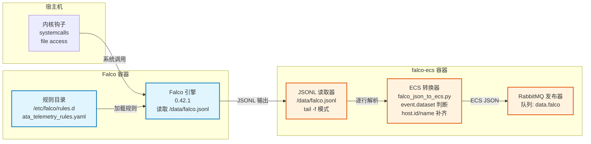

# Falco采集与ECS转换

## 文档目的

本文件定义客户机侧 Falco 的采集方式、原始输出、ECS 转换与投递到 RabbitMQ 队列的固定规则。

## 读者对象

- 负责客户机实现与部署的同学
- 负责字段与数据验证的同学

## 引用关系

- 客户机总体：`50-总体.md`
- ECS 字段规范（中心机入库后的权威口径）：`../../80-规范/81-ECS字段规范.md`
- 客户机与中心机接口（拉取结构）：`../../80-规范/87-客户机与中心机接口.md`

## 1. 组件与文件位置

| 组件 | 位置 | 说明 |
|---|---|---|
| Falco 引擎 | `client/docker-compose.yml` 的 `falco` 服务 | Falco 输出 JSONL 到共享卷 |
| ECS 转换器 | `client/sensor/falco/ecs-converter/falco_json_to_ecs.py` | 读取 JSONL，转换为 ECS JSON，发布到 RabbitMQ |

### 1.1 Falco 组件架构



## 2. 采集输入

### 2.1 Falco 输出文件

Falco 将事件以 JSONL 形式写入共享卷：

- 路径：`/data/falco.jsonl`
- 格式：每行一个 JSON 对象

该文件由 `falco` 容器产生，由 `falco-ecs` 容器消费。

### 2.2 Falco 容器关键配置

Falco 以特权模式运行并挂载宿主机关键目录，配置固定为：

```yaml
image: falcosecurity/falco:0.42.1
privileged: true
pid: host
volumes:
  - /var/run/docker.sock:/host/var/run/docker.sock
  - /dev:/host/dev
  - /proc:/host/proc:ro
  - /boot:/host/boot:ro
  - /lib/modules:/host/lib/modules:ro
  - /usr:/host/usr:ro
  - /etc:/host/etc:ro
  - /sys/kernel/debug:/sys/kernel/debug
  - /sys/kernel/tracing:/sys/kernel/tracing
  - ./data:/data
command:
  - falco
  - -o
  - json_output=true
  - -o
  - file_output.enabled=true
  - -o
  - file_output.filename=/data/falco.jsonl
```

### 2.3 Telemetry 规则（用于“能入图”）

Falco 默认规则集主要用于“检测/告警”，但图谱重建需要一定比例的“事实 Telemetry”。

本项目通过在 Falco 容器中加载额外的 Telemetry 规则文件来补齐以下能力：

- `execve/execveat`：产生 `hostlog.process`（用于进程树 / 父子进程）
- `open/openat/...`：产生 `hostbehavior.file` / `hostlog.file_registry`（用于文件访问链路）
- `connect`：产生 `hostbehavior.syscall`（用于 `Process → IP` 的网络连接边）

规则文件位置：

- `client/sensor/falco/rules.d/ata_telemetry_rules.yaml`

部署时通过容器挂载到 Falco 默认加载目录：

- `/etc/falco/rules.d`

## 3. ECS 转换规则

### 3.1 转换器运行方式

`falco-ecs` 容器以脚本 `falco_json_to_ecs.py` 启动，参数固定为：

```bash
--input /data/falco.jsonl
--follow
--queue data.falco
```

### 3.2 输出字段形态

Falco 转换器输出为**嵌套对象形态**（非点号扁平键）。

示例（节选）：

```json
{
  "@timestamp": "2026-01-14T12:00:00.000Z",
  "ecs": {"version": "9.2.0"},
  "event": {"kind": "event", "dataset": "hostlog.process"},
  "host": {"name": "client-01", "id": "h-1111111111111111"},
  "process": {"pid": 1234, "executable": "/usr/bin/bash"},
  "message": "...",
  "falco": { "...": "raw event payload" }
}
```

说明：

1. Falco 转换器输出 `ecs.version="9.2.0"`；中心机入库前仍会执行最终规范化，保证权威口径一致（见 `../../80-规范/81-ECS字段规范.md`）。
2. Falco 原始事件完整保存在 `falco` 字段中，用于审计与回放。
3. Telemetry 的 `event.dataset` 会根据事件类型选择为 `hostlog.process` / `hostbehavior.file` / `hostlog.file_registry` / `hostbehavior.syscall`，以满足 `../../80-规范/84-Neo4j实体图谱规范.md` 的抽取条件。
4. 为保证三传感器数据在同一主机上可关联，转换器支持：
   - 通过环境变量 `HOST_NAME` 覆盖 `host.name`（权威值见 `89-环境变量与配置规范.md`）
   - 优先使用环境变量 `HOST_ID` 覆盖 `host.id`；当 `HOST_ID` 缺失时，按 `81-ECS字段规范.md` 回退生成 `host.id`（`h-` + sha1(host.name)[:16]）。

### 3.3 eventkind 规则

Falco 转换器基于 `priority` 与阈值判断是否异常：

- 正常行为：`event.kind="event"`
- 异常行为：`event.kind="alert"`

阈值参数由转换器启动参数 `--abnormal-priority` 决定，默认值为 `WARNING`。

### 3.4 转换逻辑示例

以下代码展示 Falco 事件到 ECS 的核心转换逻辑：

```python
def falco_to_ecs(falco_event: dict) -> dict:
    """将 Falco JSONL 事件转换为 ECS 格式"""
    ecs_event = {
        "ecs": {"version": "9.2.0"},
        "event": {
            "kind": determine_event_kind(falco_event),  # 基于 priority 判断
            "dataset": map_dataset(falco_event),       # hostlog.process 等
        },
        "host": {
            "name": os.getenv("HOST_NAME", falco_event.get("host_name")),
            "id": get_or_generate_host_id()
        },
        "process": {
            "pid": falco_event.get("proc.pid"),
            "executable": falco_event.get("proc.exe"),
            "command": falco_event.get("proc.cmdline")
        },
        "message": falco_event.get("output", ""),
        "falco": falco_event  # 保留原始事件用于审计
    }
    return ecs_event

def determine_event_kind(falco_event: dict) -> str:
    """基于 priority 判断事件类型"""
    priority = falco_event.get("priority", "")
    if priority in ["WARNING", "ERROR", "CRITICAL"]:
        return "alert"
    return "event"

def map_dataset(falco_event: dict) -> str:
    """映射 event.dataset"""
    evt_type = falco_event.get("event_type", "")
    if evt_type == "execve":
        return "hostlog.process"
    elif evt_type in ["open", "openat"]:
        return "hostlog.file_registry"
    elif evt_type == "connect":
        return "hostbehavior.syscall"
    return "hostbehavior.default"
```

## 4. eventid 生成与幂等

### 4.1 eventid 的来源

Falco 转换器不强制生成 `event.id`。客户机对外拉取接口在返回数据前会补齐稳定 `event.id`：

- 当消息体已包含 `event.id`（扁平键或嵌套键）时直接透传；
- 当缺失 `event.id` 时，对消息体做 `sha1`，取前 16 位生成：`evt-<sha1[:16]>`。

该补齐逻辑位于：`client/backend/queue/client.go` 的 `ensureEventID`。

权威规则见：

- `../../80-规范/81-ECS字段规范.md`

### 4.2 幂等与重复处理

- RabbitMQ 队列层面保证拉取增量：消息被 `ack` 后不再重复返回。
- OpenSearch 写入以 `event.id` 为幂等键，重复写入不产生重复文档。

## 5. 队列投递

Falco 转换器投递到 RabbitMQ：

- AMQP：由 `RABBITMQ_URL` 指定
- 队列：由 `RABBITMQ_QUEUE` 指定，默认 `data.falco`

队列语义见：`54-RabbitMQ缓冲与队列语义.md`。

## 6. 故障处理

1. Falco 未产生日志文件时，转换器会持续等待输入文件出现后再开始处理。
2. RabbitMQ 连接断开时，转换器会重连后继续发布。
3. 任何无法解析的行会被跳过并继续处理后续行，保证持续运行。
