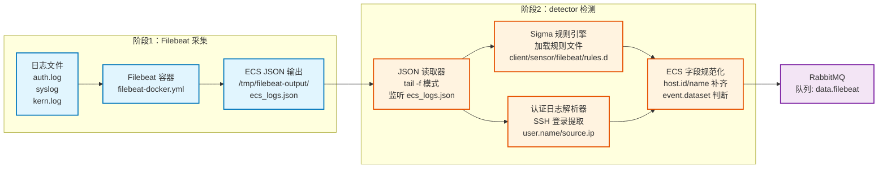
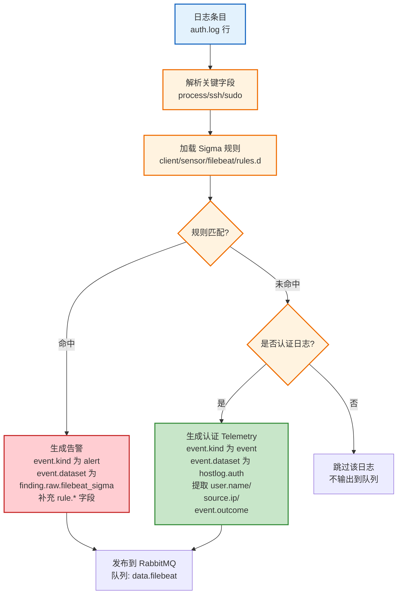

# Filebeat 采集与 ECS 转换

## 文档目的

本文档定义客户机侧 Filebeat 采集方式、日志输出格式、Sigma 规则检测流程、ECS 字段补齐规则以及投递到 RabbitMQ 队列的固定流程。

## 读者对象

- 客户机实现与部署人员
- 日志证据与验收人员

## 引用关系

- ECS 字段规范：`../../80-规范/81-ECS字段规范.md`
- 客户机总体：`50-总体.md`
- 客户机与中心机接口（拉取结构）：`../../80-规范/87-客户机与中心机接口.md`

## 1. 采集输入

### 1.1 采集来源

Filebeat 从宿主机挂载日志目录采集日志：

- `/var/log/host/auth.log`
- `/var/log/host/syslog`
- `/var/log/host/kern.log`

### 1.2 Filebeat 配置文件

容器使用配置文件：`client/sensor/filebeat/filebeat-docker.yml`

该配置将 Filebeat 输出写入容器内文件：`/tmp/filebeat-output/ecs_logs.json`

## 2. 解析与转换规则

### 2.1 两段式处理

Filebeat 采集链路由两个进程组成：

1. **Filebeat**：采集日志并写入 `/tmp/filebeat-output/ecs_logs.json`
2. **detector**：读取新增日志行，应用 Sigma 规则进行异常检测，并将结果发布到 RabbitMQ

detector 入口为：`client/sensor/filebeat/detector.py`

### 2.1.1 两段式处理流程



### 2.2 ECS 关键字段补齐

detector 会对每条日志执行以下固定补齐：

- `ecs.version` 固定写为 `9.2.0`
- `event.ingested` 缺失时写入当前时间

为保证三传感器数据可在中心机侧汇聚到同一 `Host`，detector 还会执行主机身份规范化：

- 支持通过环境变量 `HOST_NAME` 覆盖 `host.name`
- 优先使用环境变量 `HOST_ID` 覆盖 `host.id`；当 `HOST_ID` 缺失时，按 `81-ECS字段规范.md` 回退生成 `host.id`：`h-` + sha1(host.name)[:16]

当命中 Sigma 规则时，detector 将该事件标记为告警并补齐：

- `event.kind="alert"`
- `event.category=["intrusion_detection"]`
- `event.type=["indicator"]`
- `event.dataset="finding.raw.filebeat_sigma"`
- `rule.*`、`threat.*`、`custom.*` 等结构化字段

当日志来自 `auth.log` 且能够解析出 SSH 登录关键信息时，detector 还会输出 Telemetry（用于登录链路与横向移动线索）：

- `event.kind="event"`
- `event.dataset="hostlog.auth"`
- `event.category=["authentication"]`
- `event.action`：`user_login` / `user_logout` / `logon_failed`
- `event.outcome`：`success` / `failure`
- `event.type`：`start` / `end` / `info`
- `user.name`、`source.ip`：必须存在（若无法解析则不强制输出该 Telemetry，避免产生不符合 `81-ECS字段规范.md` 的无效事件）

### 2.2.1 Sigma 规则检测流程



### 2.2.2 Sigma 规则示例

以下是一个 SSH 登录失败检测的 Sigma 规则示例：

```yaml
title: SSH 登录失败
id: ssh-login-failed
description: 检测 SSH 登录失败尝试
status: experimental
author: ATA
date: 2026/01/14
logsource:
  service: auth
detection:
  keywords:
    - 'Failed password'
    - 'authentication failure'
  condition: keywords
level: low
tags:
  - attack.initial_access
  - attack.brute_force
fields:
  - user.name
  - source.ip
  - event.outcome
falsepositives:
  - 合法的登录失败
```

### 2.2.3 认证日志解析示例

以下展示 auth.log 原始行到 ECS 事件的转换。

**原始日志**：
```
Jan 14 12:00:00 victim sshd[1234]: Failed password for root from 10.0.0.1 port 12345 ssh2
```

**转换后的 ECS 事件**：
```json
{
  "event": {
    "kind": "event",
    "dataset": "hostlog.auth",
    "category": ["authentication"],
    "action": "user_login",
    "outcome": "failure",
    "type": "info"
  },
  "user": {"name": "root"},
  "source": {"ip": "10.0.0.1", "port": 12345},
  "host": {"name": "client-01", "id": "h-1111111111111111"},
  "message": "Failed password for root from 10.0.0.1 port 12345 ssh2"
}
```

## 3. 会话重建字段

会话与进程实体标识由中心机入库阶段补齐：

- `session.id`：在 `event.dataset="hostlog.auth"` 的 Telemetry 中生成
- `process.entity_id`：在 `event.dataset="hostlog.process"` 的 Telemetry 中生成

具体规则见 `../../80-规范/81-ECS字段规范.md`

## 4. 队列投递

Filebeat detector 投递到 RabbitMQ：

- 队列：`data.filebeat`
- 连接：`RABBITMQ_URL`
- 队列名：`RABBITMQ_QUEUE`

拉取接口返回前会补齐稳定 `event.id`，规则见 `../../80-规范/87-客户机与中心机接口.md`

## 5. 故障处理

1. detector 未加载到 Sigma 规则时直接退出，避免产生无规则意义的数据流
2. RabbitMQ 发布失败时重连后重试发布
3. 日志解析失败时跳过该行，继续处理后续行，保证持续运行
