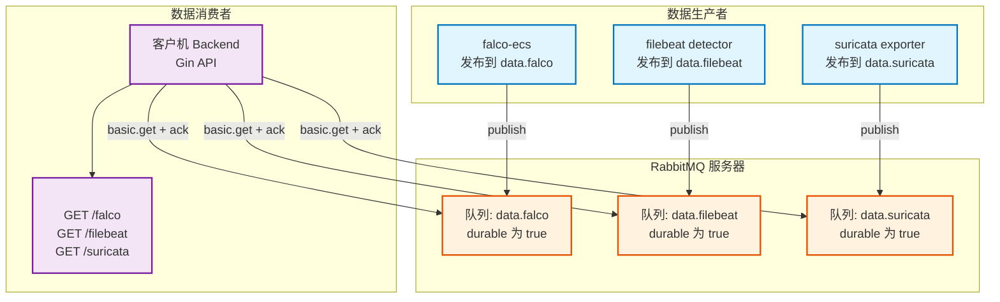
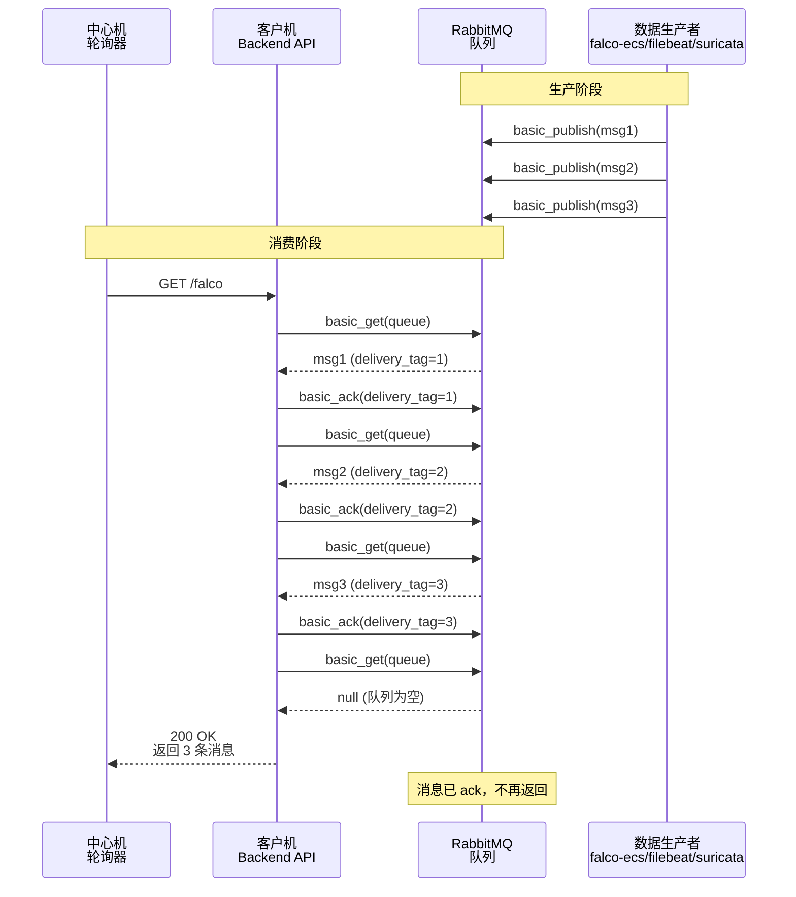

# RabbitMQ缓冲与队列语义

## 文档目的

本文件定义客户机侧 RabbitMQ 作为本地缓冲区的队列命名、消费语义、断连恢复与容量边界。

## 读者对象

- 负责客户机实现与部署的同学
- 负责稳定性与排障的同学

## 引用关系

- 客户机总体：`50-总体.md`
- 客户机与中心机接口：`../../80-规范/87-客户机与中心机接口.md`

## 1. 队列命名

客户机侧固定使用 3 个队列承载三类数据源：

| 数据源 | 默认队列名 | 环境变量 |
|---|---|---|
| Falco | `data.falco` | `FALCO_QUEUE` 或 `RABBITMQ_QUEUE` |
| Filebeat | `data.filebeat` | `FILEBEAT_QUEUE` 或 `RABBITMQ_QUEUE` |
| Suricata | `data.suricata` | `SURICATA_QUEUE` 或 `RABBITMQ_QUEUE` |

实际取值以 `client/docker-compose.yml` 为准。

### 1.1 消息流转架构

## 2. 消费语义与增量语义

中心机通过客户机拉取接口拉取数据时，客户机 Go 后端会从队列中逐条读取消息并确认：

- 使用 `basic.get` 从队列拉取
- 拉取到的消息在返回前执行 `ack`
- 当队列为空时，接口返回空数组

因此，增量语义由 RabbitMQ 队列保证，不使用游标机制。

### 2.1 队列消费时序

## 3. 幂等与重复处理

### 3.1 拉取层幂等

同一条消息被 `ack` 后不再被后续拉取返回，避免重复。

### 3.2 入库层幂等

中心机入库以 `event.id` 去重，重复写入不产生重复文档，见 `../../80-规范/81-ECS字段规范.md`。

## 4. 断连与恢复

RabbitMQ 连接断开时：

1. 客户机 Go 后端在下一次拉取请求到来时重连；
2. 重连失败时接口返回 500 错误并携带 `error` 字段；
3. 中心机会在下一轮轮询继续重试，并更新注册表中的错误信息。

## 5. 容量边界

RabbitMQ 的容量边界由宿主机磁盘与 RabbitMQ 默认策略决定。

为了保证演示稳定性：

1. 靶场运行前必须清理历史队列数据；
2. 复现与演示过程中，若出现磁盘空间不足，按 `../../90-运维与靶场/95-重置复现与排障.md` 执行清理后重跑。
