# 攻击溯源分析系统详细设计

> 本文档由以下文档合并而成：

### 客户机模块

- [50-总体.md](客户机/50-总体.md)

### 中心机模块

- [60-总体与代码结构.md](中心机/60-总体与代码结构.md)

### 分析模块

- [70-任务模型与状态机.md](分析/70-任务模型与状态机.md)

### 前端模块

- [74-总体与页面结构.md](前端/74-总体与页面结构.md)

---


---

# 二、客户机模块

# 1. 客户机职责边界
客户机侧职责固定为：

1. 采集三类数据源：Falco、Filebeat、Suricata；
2. 将各自输出转换为 ECS 子集字段，形成可被中心机入库的 JSON 事件；
3. 将事件写入 RabbitMQ 队列作为本地缓冲；
4. 对外提供拉取接口，供中心机轮询获取增量数据。

客户机侧不负责：

- OpenSearch 的存储与查询；
- Neo4j 的图谱建模与查询；
- 溯源算法执行与写回。

# 2. 组件清单与目录结构
客户机由以下容器组成（以 `client/docker-compose.yml` 为准）：

| 容器 | 作用 | 主要代码位置 |
|---|---|---|
| `rabbitmq` | 本地缓冲区 | `client/docker-compose.yml` |
| `falco` | 主机行为采集 | `client/docker-compose.yml` |
| `falco-ecs` | Falco ECS 转换并投递队列 | `client/sensor/falco/ecs-converter/` |
| `filebeat` | 主机日志采集 + Sigma 检测并投递队列 | `client/sensor/filebeat/` |
| `suricata` | 网络 IDS 与 EVE 输出 | `client/sensor/suricata/engine/` |
| `suricata-exporter` | EVE ECS 转换并投递队列 | `client/sensor/suricata/exporter/` |
| `backend` | 拉取 API（Gin） | `client/backend/` |

# 3. 端到端数据流
# 3.1 数据流图（完整视图）
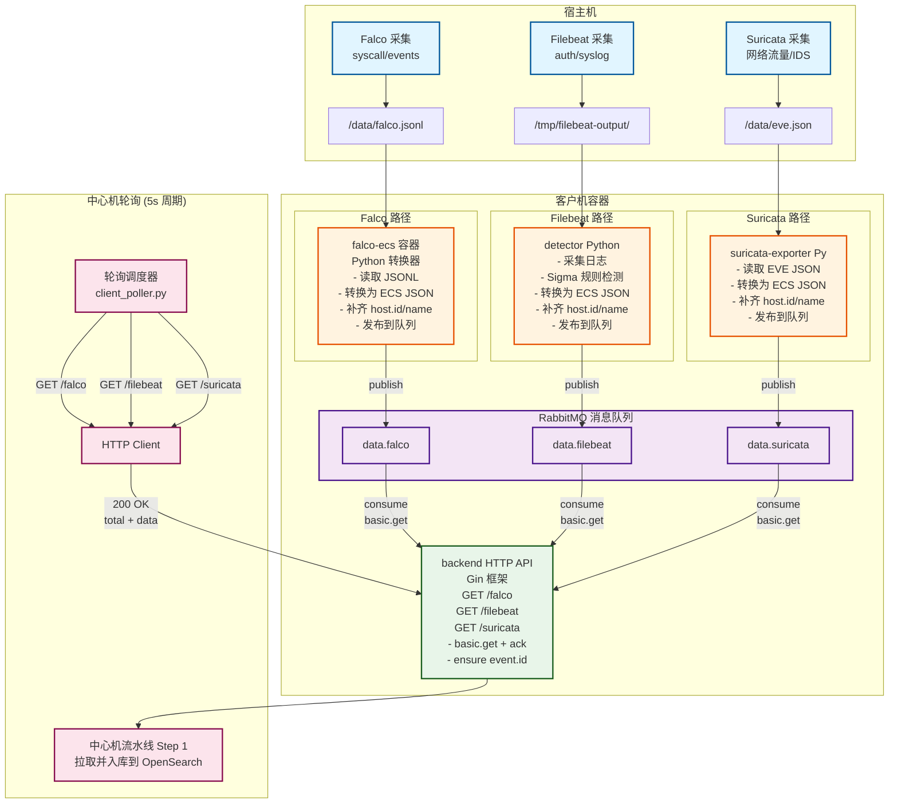
```mermaid
flowchart TD
    subgraph Host["宿主机"]
        Falco["Falco 采集<br/>syscall/events"]
        Filebeat["Filebeat 采集<br/>auth/syslog"]
        Suricata["Suricata 采集<br/>网络流量/IDS"]

        FalcoFile["/data/falco.jsonl"]
        FilebeatFile["/tmp/filebeat-output/"]
        SuricataFile["/data/eve.json"]

        Falco --> FalcoFile
        Filebeat --> FilebeatFile
        Suricata --> SuricataFile
    end

    subgraph ClientContainers["客户机容器"]
        subgraph FalcoPath["Falco 路径"]
            FalcoECS["falco-ecs 容器<br/>Python 转换器<br/>- 读取 JSONL<br/>- 转换为 ECS JSON<br/>- 补齐 host.id/name<br/>- 发布到队列"]
            FalcoFile --> FalcoECS
        end

        subgraph FilebeatPath["Filebeat 路径"]
            Detector["detector Python<br/>- 采集日志<br/>- Sigma 规则检测<br/>- 转换为 ECS JSON<br/>- 补齐 host.id/name<br/>- 发布到队列"]
            FilebeatFile --> Detector
        end

        subgraph SuricataPath["Suricata 路径"]
            SuricataExporter["suricata-exporter Py<br/>- 读取 EVE JSON<br/>- 转换为 ECS JSON<br/>- 补齐 host.id/name<br/>- 发布到队列"]
            SuricataFile --> SuricataExporter
        end

        subgraph RabbitMQ["RabbitMQ 消息队列"]
            QueueFalco["data.falco"]
            QueueFilebeat["data.filebeat"]
            QueueSuricata["data.suricata"]
        end

        FalcoECS -->|publish| QueueFalco
        Detector -->|publish| QueueFilebeat
        SuricataExporter -->|publish| QueueSuricata

        Backend["backend HTTP API<br/>Gin 框架<br/>GET /falco<br/>GET /filebeat<br/>GET /suricata<br/>- basic.get + ack<br/>- ensure event.id"]

        QueueFalco -->|consume<br/>basic.get| Backend
        QueueFilebeat -->|consume<br/>basic.get| Backend
        QueueSuricata -->|consume<br/>basic.get| Backend
    end

    subgraph CenterPolling["中心机轮询 (5s 周期)"]
        Poller["轮询调度器<br/>client_poller.py"]
        HTTPClient["HTTP Client"]
        Pipeline["中心机流水线 Step 1<br/>拉取并入库到 OpenSearch"]
    end

    Poller -->|GET /falco| HTTPClient
    Poller -->|GET /filebeat| HTTPClient
    Poller -->|GET /suricata| HTTPClient

    HTTPClient -->|200 OK<br/>total + data| Backend
    Backend --> Pipeline

    classDef sensorStyle fill:#e1f5ff,stroke:#01579b,stroke-width:2px
    classDef converterStyle fill:#fff3e0,stroke:#e65100,stroke-width:2px
    classDef queueStyle fill:#f3e5f5,stroke:#4a148c,stroke-width:2px
    classDef backendStyle fill:#e8f5e9,stroke:#1b5e20,stroke-width:2px
    classDef centerStyle fill:#fce4ec,stroke:#880e4f,stroke-width:2px

    class Falco,Filebeat,Suricata sensorStyle
    class FalcoECS,Detector,SuricataExporter converterStyle
    class QueueFalco,QueueFilebeat,QueueSuricata,RabbitMQ queueStyle
    class Backend backendStyle
    class Poller,HTTPClient,Pipeline centerStyle
```

# 3.2 三传感器数据流对比
| 传感器 | 采集方式 | 输出格式 | 转换器 | 队列名 | 特点 |
|--------|----------|----------|--------|--------|------|
| **Falco** | 内核钩子 | JSONL | `falco_json_to_ecs.py` | `data.falco` | 进程/文件/网络细粒度行为 |
| **Filebeat** | 日志文件 | ECS JSON | `detector.py` | `data.filebeat` | 认证日志 + Sigma 规则告警 |
| **Suricata** | 网络抓包 | EVE JSON | `exporter/app.py` | `data.suricata` | DNS/HTTP/Flow/IDS 告警 |

# 3.3 关键设计约束
1. **队列增量语义**: 消息被 `ack` 后不再返回，保证中心机拉取的增量性
2. **event.id 稳定性**: 在 backend 拉取接口中统一补齐，避免上游缺失
3. **host.id 一致性**: 三传感器统一使用 `HOST_ID` 环境变量或通过 `host.name` hash 生成
4. **ECS 归一化**: 三种不同格式最终统一为 ECS 子集，便于中心机入库

# 3.4 三传感器数据量规模对比
| 数据源 | 事件速率 | 单事件大小 | 每分钟数据量 | 主要字段 | 用途 |
|--------|---------|-----------|-------------|----------|------|
| **Falco** | ~100-500 events/min | ~2KB | ~0.2-1 MB | process、file、network | 进程树、文件访问链路 |
| **Filebeat** | ~10-50 lines/min | ~0.5KB | ~0.005-0.025 MB | user、source、event.outcome | 认证链路、登录失败 |
| **Suricata** | 取决于网络流量 | ~1-3KB | 变化大（典型：0.1-10 MB） | source/destination、dns、http | DNS解析、网络连接、IDS告警 |

**说明**：
- Falco 事件速率取决于系统活跃度，正常运行时约 100-500 events/min
- Filebeat 仅处理认证相关日志，速率较低
- Suricata 数据量与网络流量成正比，演示环境建议控制在 < 1Gbps

中心机的轮询逻辑见：

- `backend/app/services/client_poller.py`

# 4. 分模块详细设计索引
客户机侧详细设计按模块拆分如下：

- Falco：`51-Falco采集与ECS转换.md`
- Suricata：`52-Suricata采集与ECS转换.md`
- Filebeat：`53-Filebeat采集与ECS转换.md`
- RabbitMQ：`54-RabbitMQ缓冲与队列语义.md`
- 拉取接口：`55-拉取接口.md`

# 5. 与中心机的交互边界
1. 客户机只暴露拉取接口（HTTP GET），接口形状与行为由 `../../80-规范/87-客户机与中心机接口.md` 定义。
2. 客户机不保存中心机状态，不维护游标；增量语义由 RabbitMQ 队列保证。
3. 客户机返回数据前必须保证事件包含稳定 `event.id`，补齐规则在拉取接口实现中完成。

# 6. 运维与排障入口
客户机的部署、启动、验证、重置与排障统一在运维文档中定义：

- 编译安装与使用：`../../90-运维与靶场/90-编译安装与使用.md`
- 靶场部署：`../../90-运维与靶场/91-靶场部署.md`
- 一键编排：`../../90-运维与靶场/92-一键编排.md`
- 验证清单：`../../90-运维与靶场/94-验证清单.md`
- 重置复现与排障：`../../90-运维与靶场/95-重置复现与排障.md`


## 2.1 Falco 采集与 ECS 转换

## 1. 组件与文件位置
| 组件 | 位置 | 说明 |
|---|---|---|
| Falco 引擎 | `client/docker-compose.yml` 的 `falco` 服务 | Falco 输出 JSONL 到共享卷 |
| ECS 转换器 | `client/sensor/falco/ecs-converter/falco_json_to_ecs.py` | 读取 JSONL，转换为 ECS JSON，发布到 RabbitMQ |

## 1.1 Falco 组件架构
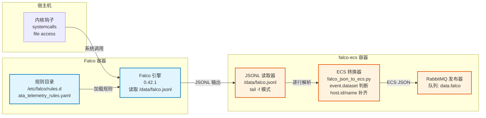
```mermaid
flowchart LR
    subgraph Host["宿主机"]
        Kernel[内核钩子<br/>systemcalls<br/>file access]
    end

    subgraph FalcoContainer["Falco 容器"]
        FalcoEngine[Falco 引擎<br/>0.42.1<br/>读取 /data/falco.jsonl]
        Rules[规则目录<br/>/etc/falco/rules.d<br/>ata_telemetry_rules.yaml]
    end

    subgraph Converter["falco-ecs 容器"]
        JSONLReader[JSONL 读取器<br/>/data/falco.jsonl<br/>tail -f 模式]
        ECSConverter[ECS 转换器<br/>falco_json_to_ecs.py<br/>event.dataset 判断<br/>host.id/name 补齐]
        RabbitPublisher[RabbitMQ 发布器<br/>队列: data.falco]
    end

    Kernel -->|系统调用| FalcoEngine
    Rules -->|加载规则| FalcoEngine
    FalcoEngine -->|JSONL 输出| JSONLReader
    JSONLReader -->|逐行解析| ECSConverter
    ECSConverter -->|ECS JSON| RabbitPublisher

    classDef sensorStyle fill:#e1f5fe,stroke:#0277bd,stroke-width:2px
    classDef converterStyle fill:#fff3e0,stroke:#e65100,stroke-width:2px

    class FalcoEngine,Rules sensorStyle
    class JSONLReader,ECSConverter,RabbitPublisher converterStyle
```

## 2. 采集输入
## 2.1 Falco 输出文件
Falco 将事件以 JSONL 形式写入共享卷：

- 路径：`/data/falco.jsonl`
- 格式：每行一个 JSON 对象

该文件由 `falco` 容器产生，由 `falco-ecs` 容器消费。

## 2.2 Falco 容器关键配置
Falco 以特权模式运行并挂载宿主机关键目录，配置固定为：

```yaml
image: falcosecurity/falco:0.42.1
privileged: true
pid: host
volumes:
  - /var/run/docker.sock:/host/var/run/docker.sock
  - /dev:/host/dev
  - /proc:/host/proc:ro
  - /boot:/host/boot:ro
  - /lib/modules:/host/lib/modules:ro
  - /usr:/host/usr:ro
  - /etc:/host/etc:ro
  - /sys/kernel/debug:/sys/kernel/debug
  - /sys/kernel/tracing:/sys/kernel/tracing
  - ./data:/data
command:
  - falco
  - -o
  - json_output=true
  - -o
  - file_output.enabled=true
  - -o
  - file_output.filename=/data/falco.jsonl
```

## 2.3 Telemetry 规则（用于“能入图”）
Falco 默认规则集主要用于“检测/告警”，但图谱重建需要一定比例的“事实 Telemetry”。

本项目通过在 Falco 容器中加载额外的 Telemetry 规则文件来补齐以下能力：

- `execve/execveat`：产生 `hostlog.process`（用于进程树 / 父子进程）
- `open/openat/...`：产生 `hostbehavior.file` / `hostlog.file_registry`（用于文件访问链路）
- `connect`：产生 `hostbehavior.syscall`（用于 `Process → IP` 的网络连接边）

规则文件位置：

- `client/sensor/falco/rules.d/ata_telemetry_rules.yaml`

部署时通过容器挂载到 Falco 默认加载目录：

- `/etc/falco/rules.d`

## 3. ECS 转换规则
## 3.1 转换器运行方式
`falco-ecs` 容器以脚本 `falco_json_to_ecs.py` 启动，参数固定为：

```bash
--input /data/falco.jsonl
--follow
--queue data.falco
```

## 3.2 输出字段形态
Falco 转换器输出为**嵌套对象形态**（非点号扁平键）。

示例（节选）：

```json
{
  "@timestamp": "2026-01-14T12:00:00.000Z",
  "ecs": {"version": "9.2.0"},
  "event": {"kind": "event", "dataset": "hostlog.process"},
  "host": {"name": "client-01", "id": "h-1111111111111111"},
  "process": {"pid": 1234, "executable": "/usr/bin/bash"},
  "message": "...",
  "falco": { "...": "raw event payload" }
}
```

说明：

1. Falco 转换器输出 `ecs.version="9.2.0"`；中心机入库前仍会执行最终规范化，保证权威口径一致（见 `../../80-规范/81-ECS字段规范.md`）。
2. Falco 原始事件完整保存在 `falco` 字段中，用于审计与回放。
3. Telemetry 的 `event.dataset` 会根据事件类型选择为 `hostlog.process` / `hostbehavior.file` / `hostlog.file_registry` / `hostbehavior.syscall`，以满足 `../../80-规范/84-Neo4j实体图谱规范.md` 的抽取条件。
4. 为保证三传感器数据在同一主机上可关联，转换器支持：
   - 通过环境变量 `HOST_NAME` 覆盖 `host.name`（权威值见 `89-环境变量与配置规范.md`）
   - 优先使用环境变量 `HOST_ID` 覆盖 `host.id`；当 `HOST_ID` 缺失时，按 `81-ECS字段规范.md` 回退生成 `host.id`（`h-` + sha1(host.name)[:16]）。

## 3.3 eventkind 规则
Falco 转换器基于 `priority` 与阈值判断是否异常：

- 正常行为：`event.kind="event"`
- 异常行为：`event.kind="alert"`

阈值参数由转换器启动参数 `--abnormal-priority` 决定，默认值为 `WARNING`。

## 3.4 转换逻辑示例
以下代码展示 Falco 事件到 ECS 的核心转换逻辑：

```python
def falco_to_ecs(falco_event: dict) -> dict:
    """将 Falco JSONL 事件转换为 ECS 格式"""
    ecs_event = {
        "ecs": {"version": "9.2.0"},
        "event": {
            "kind": determine_event_kind(falco_event),  # 基于 priority 判断
            "dataset": map_dataset(falco_event),       # hostlog.process 等
        },
        "host": {
            "name": os.getenv("HOST_NAME", falco_event.get("host_name")),
            "id": get_or_generate_host_id()
        },
        "process": {
            "pid": falco_event.get("proc.pid"),
            "executable": falco_event.get("proc.exe"),
            "command": falco_event.get("proc.cmdline")
        },
        "message": falco_event.get("output", ""),
        "falco": falco_event  # 保留原始事件用于审计
    }
    return ecs_event

def determine_event_kind(falco_event: dict) -> str:
    """基于 priority 判断事件类型"""
    priority = falco_event.get("priority", "")
    if priority in ["WARNING", "ERROR", "CRITICAL"]:
        return "alert"
    return "event"

def map_dataset(falco_event: dict) -> str:
    """映射 event.dataset"""
    evt_type = falco_event.get("event_type", "")
    if evt_type == "execve":
        return "hostlog.process"
    elif evt_type in ["open", "openat"]:
        return "hostlog.file_registry"
    elif evt_type == "connect":
        return "hostbehavior.syscall"
    return "hostbehavior.default"
```

## 4. eventid 生成与幂等
## 4.1 eventid 的来源
Falco 转换器不强制生成 `event.id`。客户机对外拉取接口在返回数据前会补齐稳定 `event.id`：

- 当消息体已包含 `event.id`（扁平键或嵌套键）时直接透传；
- 当缺失 `event.id` 时，对消息体做 `sha1`，取前 16 位生成：`evt-<sha1[:16]>`。

该补齐逻辑位于：`client/backend/queue/client.go` 的 `ensureEventID`。

权威规则见：

- `../../80-规范/81-ECS字段规范.md`

## 4.2 幂等与重复处理
- RabbitMQ 队列层面保证拉取增量：消息被 `ack` 后不再重复返回。
- OpenSearch 写入以 `event.id` 为幂等键，重复写入不产生重复文档。

## 5. 队列投递
Falco 转换器投递到 RabbitMQ：

- AMQP：由 `RABBITMQ_URL` 指定
- 队列：由 `RABBITMQ_QUEUE` 指定，默认 `data.falco`

队列语义见：`54-RabbitMQ缓冲与队列语义.md`。

## 6. 故障处理
1. Falco 未产生日志文件时，转换器会持续等待输入文件出现后再开始处理。
2. RabbitMQ 连接断开时，转换器会重连后继续发布。
3. 任何无法解析的行会被跳过并继续处理后续行，保证持续运行。

## 2.2 Suricata 采集与 ECS 转换

## 1. 采集输入
## 1.1 Suricata 引擎
Suricata 引擎由容器 `suricata` 运行，启动脚本为：

- `client/sensor/suricata/engine/run-suricata.sh`

Suricata 输出 EVE 日志文件，供导出器消费：

- 默认路径：`/data/eve.json`

## 1.2 关键运行参数
Suricata 运行参数由环境变量确定：

- `SURICATA_MODE`：运行模式（`live` 或 `pcap`）
- `SURICATA_INTERFACE`：抓包网卡名
- `SURICATA_HOME_NET`：HOME_NET 地址组

上述变量的取值与运行行为在 `client/sensor/suricata/engine/run-suricata.sh` 中实现。

## 1.3 EVE JSON 示例
以下是一个 DNS 查询事件的 EVE JSON 格式示例：

```json
{
  "timestamp": "2026-01-14T12:00:00.000Z",
  "event_type": "dns",
  "src_ip": "10.0.0.1",
  "src_port": 12345,
  "dest_ip": "8.8.8.8",
  "dest_port": 53,
  "proto": "UDP",
  "dns": {
    "type": "QUERY",
    "id": 12345,
    "query": "example.com",
    "query_type": "A",
    "query_class": "IN",
    "answers": [
      {"rrname": "example.com", "rrtype": "A", "rdata": "93.184.216.34"}
    ]
  }
}
```

## 2. 转换规则
## 2.1 导出器位置
Suricata EVE 导出器位于：

- `client/sensor/suricata/exporter/app.py`

导出器持续读取 EVE 文件新增内容，解析为 ECS 子集并发布到 RabbitMQ 队列。

## 2.2 输出字段形态
Suricata 导出器输出为**点号扁平键形态**（例如 `event.dataset`、`source.ip`），中心机会在入库前把点号键合并为嵌套对象形态。

## 2.2.1 主机身份（跨传感器关联）
为保证 Suricata 的网络 Telemetry 能与 Falco/Filebeat 的主机行为/日志在中心机侧汇聚到同一 `Host` 节点，导出器遵循以下规则：

- `host.name`：默认来自环境变量 `HOST_NAME`（见 `../../80-规范/89-环境变量与配置规范.md`）
- `host.id`：优先使用环境变量 `HOST_ID`；当 `HOST_ID` 缺失时回退为 `h-` + sha1(host.name)[:16]（见 `../../80-规范/81-ECS字段规范.md`）

## 2.3 dataset 取值范围
Suricata 导出器根据 `event_type` 映射 dataset，取值固定在以下集合中：

- `netflow.flow`
- `netflow.dns`
- `netflow.http`
- `netflow.tls`
- `netflow.icmp`

此外，Suricata 的 IDS 告警会以 `event.kind="alert"` 输出（导出器侧使用 `event.dataset="netflow.alert"` 表示来源），中心机入库时会规范化为 Raw Finding：

- `finding.raw.suricata`

## 2.4 event_type 与 dataset 映射表
| event_type | event.dataset | event.kind | 说明 |
|------------|---------------|------------|------|
| dns | netflow.dns | event | DNS 查询 Telemetry |
| http | netflow.http | event | HTTP 请求 Telemetry |
| flow | netflow.flow | event | 网络流 Telemetry |
| tls | netflow.tls | event | TLS 握手 Telemetry |
| icmp | netflow.icmp | event | ICMP 流量 Telemetry |
| alert | finding.raw.suricata | alert | IDS 告警（Raw Finding） |

## 2.5 EVE JSON 到 ECS 转换流程
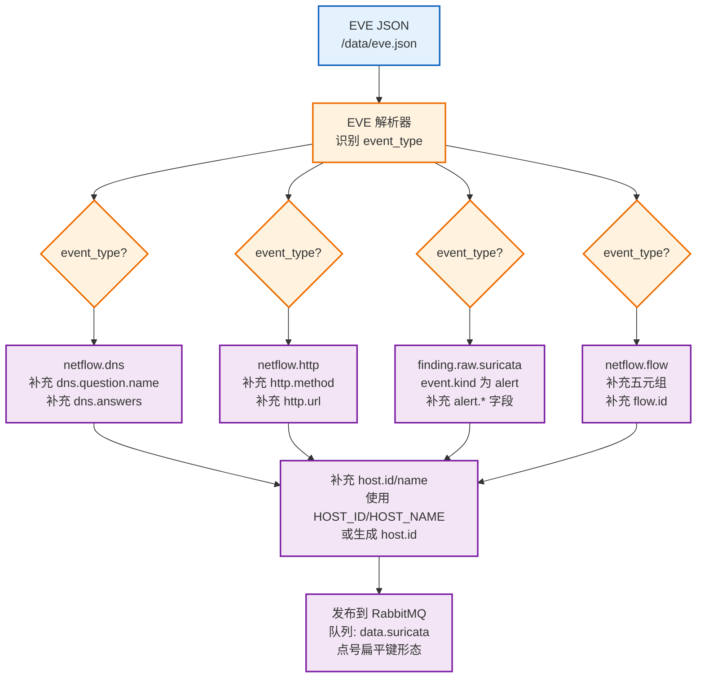
```mermaid
flowchart TD
    EVE[EVE JSON<br/>/data/eve.json] --> Parser[EVE 解析器<br/>识别 event_type]

    Parser --> DNS{event_type?}
    Parser --> HTTP{event_type?}
    Parser --> ALERT{event_type?}
    Parser --> FLOW{event_type?}

    DNS --> D1[netflow.dns<br/>补充 dns.question.name<br/>补充 dns.answers]
    HTTP --> H1[netflow.http<br/>补充 http.method<br/>补充 http.url]
    ALERT --> A1[finding.raw.suricata<br/>event.kind 为 alert<br/>补充 alert.* 字段]
    FLOW --> F1[netflow.flow<br/>补充五元组<br/>补充 flow.id]

    D1 --> HostID[补充 host.id/name<br/>使用 HOST_ID/HOST_NAME<br/>或生成 host.id]
    H1 --> HostID
    A1 --> HostID
    F1 --> HostID

    HostID --> Publish[发布到 RabbitMQ<br/>队列: data.suricata<br/>点号扁平键形态]

    classDef inputStyle fill:#e3f2fd,stroke:#1565c0,stroke-width:2px
    classDef processStyle fill:#fff3e0,stroke:#ef6c00,stroke-width:2px
    classDef outputStyle fill:#f3e5f5,stroke:#7b1fa2,stroke-width:2px

    class EVE inputStyle
    class Parser,DNS,HTTP,ALERT,FLOW processStyle
    class D1,H1,A1,F1,HostID,Publish outputStyle
```

## 3. 网络字段与证据引用
Suricata 导出器按以下规则写入网络相关字段：

- `source.ip`、`source.port`
- `destination.ip`、`destination.port`
- `network.transport`、`network.protocol`
- `flow.id`、`network.community_id`
- DNS 查询与解析（当 `event_type=dns`）：
  - `dns.question.name`
  - `dns.answers[]`（用于 `Domain → IP` 的 `RESOLVES_TO` 边）

字段口径见 `../../80-规范/81-ECS字段规范.md`。

## 4. 队列投递
Suricata 导出器投递到 RabbitMQ：

- 队列：`data.suricata`
- `RABBITMQ_URL`、`RABBITMQ_QUEUE` 由容器环境变量指定

拉取接口返回前会补齐稳定 `event.id`，规则见 `../../80-规范/87-客户机与中心机接口.md`。

## 5. 故障处理
1. EVE 文件不存在时，导出器会创建必要目录并持续等待。
2. RabbitMQ 发布失败时，导出器会重连后重试发布。
3. 任意单条 EVE 行解析失败时，导出器跳过该行并继续处理后续行。

## 2.3 Filebeat 采集与 ECS 转换

## 1. 采集输入
## 1.1 采集来源
Filebeat 从宿主机挂载日志目录采集日志：

- `/var/log/host/auth.log`
- `/var/log/host/syslog`
- `/var/log/host/kern.log`

## 1.2 Filebeat 配置文件
容器使用配置文件：

- `client/sensor/filebeat/filebeat-docker.yml`

该配置将 Filebeat 输出写入容器内文件：

- `/tmp/filebeat-output/ecs_logs.json`

## 2. 解析与转换规则
## 2.1 两段式处理
Filebeat 采集链路由两个进程组成：

1. Filebeat：采集日志并写入 `/tmp/filebeat-output/ecs_logs.json`
2. detector：读取新增日志行，应用 Sigma 规则进行异常检测，并将结果发布到 RabbitMQ

detector 入口为：`client/sensor/filebeat/detector.py`。

## 2.1.1 两段式处理流程
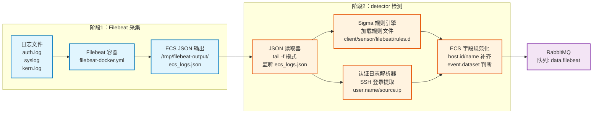
```mermaid
flowchart LR
    subgraph Stage1["阶段1：Filebeat 采集"]
        LogFiles[日志文件<br/>auth.log<br/>syslog<br/>kern.log]
        Filebeat[Filebeat 容器<br/>filebeat-docker.yml]
        ECSOutput[ECS JSON 输出<br/>/tmp/filebeat-output/<br/>ecs_logs.json]
    end

    subgraph Stage2["阶段2：detector 检测"]
        JSONReader[JSON 读取器<br/>tail -f 模式<br/>监听 ecs_logs.json]
        SigmaEngine[Sigma 规则引擎<br/>加载规则文件<br/>client/sensor/filebeat/rules.d]
        AuthParser[认证日志解析器<br/>SSH 登录提取<br/>user.name/source.ip]
        ECSNormalizer[ECS 字段规范化<br/>host.id/name 补齐<br/>event.dataset 判断]
    end

    LogFiles --> Filebeat
    Filebeat --> ECSOutput
    ECSOutput --> JSONReader
    JSONReader --> SigmaEngine
    JSONReader --> AuthParser
    SigmaEngine --> ECSNormalizer
    AuthParser --> ECSNormalizer
    ECSNormalizer --> RabbitQueue[RabbitMQ<br/>队列: data.filebeat]

    classDef stage1Style fill:#e1f5fe,stroke:#0277bd,stroke-width:2px
    classDef stage2Style fill:#fff3e0,stroke:#e65100,stroke-width:2px
    classDef queueStyle fill:#f3e5f5,stroke:#7b1fa2,stroke-width:2px

    class LogFiles,Filebeat,ECSOutput stage1Style
    class JSONReader,SigmaEngine,AuthParser,ECSNormalizer stage2Style
    class RabbitQueue queueStyle
```

## 2.2 ECS 关键字段补齐
detector 会对每条日志执行以下固定补齐：

- `ecs.version` 固定写为 `9.2.0`
- `event.ingested` 缺失时写入当前时间

为保证三传感器数据可在中心机侧汇聚到同一 `Host`，detector 还会执行主机身份规范化：

- 支持通过环境变量 `HOST_NAME` 覆盖 `host.name`
- 优先使用环境变量 `HOST_ID` 覆盖 `host.id`；当 `HOST_ID` 缺失时，按 `81-ECS字段规范.md` 回退生成 `host.id`：`h-` + sha1(host.name)[:16]

当命中 Sigma 规则时，detector 将该事件标记为告警并补齐：

- `event.kind="alert"`
- `event.category=["intrusion_detection"]`
- `event.type=["indicator"]`
- `event.dataset="finding.raw.filebeat_sigma"`
- `rule.*`、`threat.*`、`custom.*` 等结构化字段

当日志来自 `auth.log` 且能够解析出 SSH 登录关键信息时，detector 还会输出 Telemetry（用于登录链路与横向移动线索）：

- `event.kind="event"`
- `event.dataset="hostlog.auth"`
- `event.category=["authentication"]`
- `event.action`：`user_login` / `user_logout` / `logon_failed`
- `event.outcome`：`success` / `failure`
- `event.type`：`start` / `end` / `info`
- `user.name`、`source.ip`：必须存在（若无法解析则不强制输出该 Telemetry，避免产生不符合 `81-ECS字段规范.md` 的无效事件）

## 2.2.1 Sigma 规则检测流程
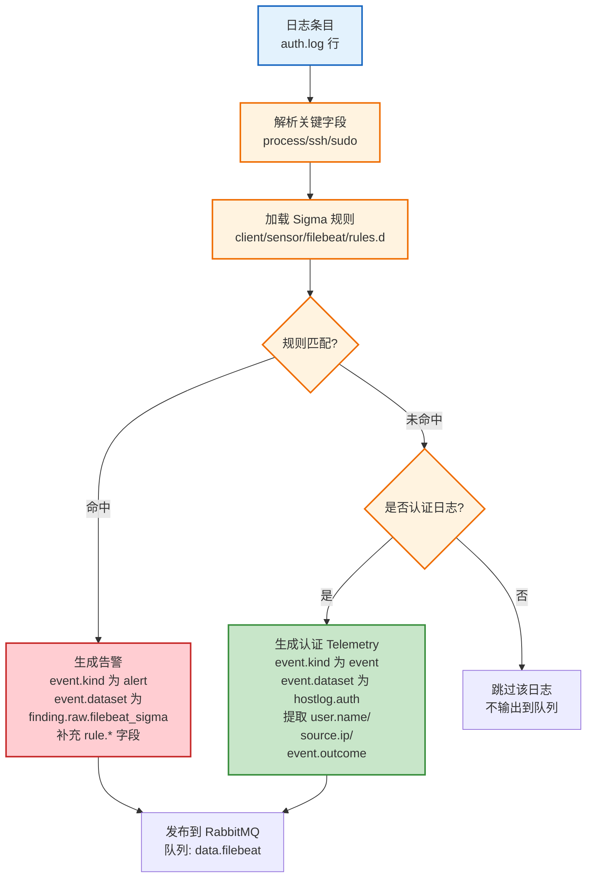
```mermaid
flowchart TD
    LogEntry[日志条目<br/>auth.log 行] --> ParseField[解析关键字段<br/>process/ssh/sudo]

    ParseField --> LoadRules[加载 Sigma 规则<br/>client/sensor/filebeat/rules.d]

    LoadRules --> Match{规则匹配?}

    Match -->|命中| Alert[生成告警<br/>event.kind 为 alert<br/>event.dataset 为<br/>finding.raw.filebeat_sigma<br/>补充 rule.* 字段]
    Match -->|未命中| CheckAuth{是否认证日志?}

    CheckAuth -->|是| AuthTelemetry[生成认证 Telemetry<br/>event.kind 为 event<br/>event.dataset 为 hostlog.auth<br/>提取 user.name/<br/>source.ip/<br/>event.outcome]
    CheckAuth -->|否| Skip[跳过该日志<br/>不输出到队列]

    Alert --> Publish
    AuthTelemetry --> Publish[发布到 RabbitMQ<br/>队列: data.filebeat]

    classDef inputStyle fill:#e3f2fd,stroke:#1565c0,stroke-width:2px
    classDef processStyle fill:#fff3e0,stroke:#ef6c00,stroke-width:2px
    classDef outputStyle fill:#c8e6c9,stroke:#388e3c,stroke-width:2px
    classDef alertStyle fill:#ffcdd2,stroke:#c62828,stroke-width:2px

    class LogEntry inputStyle
    class ParseField,LoadRules,Match,CheckAuth processStyle
    class AuthTelemetry outputStyle
    class Alert alertStyle
```

## 2.2.2 Sigma 规则示例
以下是一个 SSH 登录失败检测的 Sigma 规则示例：

```yaml
title: SSH 登录失败
id: ssh-login-failed
description: 检测 SSH 登录失败尝试
status: experimental
author: ATA
date: 2026/01/14
logsource:
  service: auth
detection:
  keywords:
    - 'Failed password'
    - 'authentication failure'
  condition: keywords
level: low
tags:
  - attack.initial_access
  - attack.brute_force
fields:
  - user.name
  - source.ip
  - event.outcome
falsepositives:
  - 合法的登录失败
```

## 2.2.3 认证日志解析示例
以下展示 auth.log 原始行到 ECS 事件的转换：

**原始日志**：
```
Jan 14 12:00:00 victim sshd[1234]: Failed password for root from 10.0.0.1 port 12345 ssh2
```

**转换后的 ECS 事件**：
```json
{
  "event": {
    "kind": "event",
    "dataset": "hostlog.auth",
    "category": ["authentication"],
    "action": "user_login",
    "outcome": "failure",
    "type": "info"
  },
  "user": {"name": "root"},
  "source": {"ip": "10.0.0.1", "port": 12345},
  "host": {"name": "client-01", "id": "h-1111111111111111"},
  "message": "Failed password for root from 10.0.0.1 port 12345 ssh2"
}
```

## 3. 会话重建字段
会话与进程实体标识由中心机入库阶段补齐：

- `session.id`：在 `event.dataset="hostlog.auth"` 的 Telemetry 中生成
- `process.entity_id`：在 `event.dataset="hostlog.process"` 的 Telemetry 中生成

具体规则见 `../../80-规范/81-ECS字段规范.md`。

## 4. 队列投递
Filebeat detector 投递到 RabbitMQ：

- 队列：`data.filebeat`
- 连接：`RABBITMQ_URL`
- 队列名：`RABBITMQ_QUEUE`

拉取接口返回前会补齐稳定 `event.id`，规则见 `../../80-规范/87-客户机与中心机接口.md`。

## 5. 故障处理
1. detector 未加载到 Sigma 规则时直接退出，避免产生无规则意义的数据流。
2. RabbitMQ 发布失败时重连后重试发布。
3. 日志解析失败时跳过该行，继续处理后续行，保证持续运行。

## 2.4 RabbitMQ 缓冲与队列语义

## 1. 队列命名
客户机侧固定使用 3 个队列承载三类数据源：

| 数据源 | 默认队列名 | 环境变量 |
|---|---|---|
| Falco | `data.falco` | `FALCO_QUEUE` 或 `RABBITMQ_QUEUE` |
| Filebeat | `data.filebeat` | `FILEBEAT_QUEUE` 或 `RABBITMQ_QUEUE` |
| Suricata | `data.suricata` | `SURICATA_QUEUE` 或 `RABBITMQ_QUEUE` |

实际取值以 `client/docker-compose.yml` 为准。

## 1.1 消息流转架构
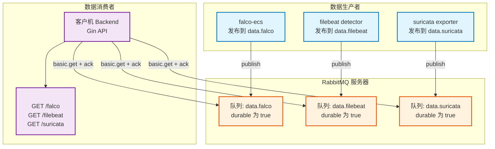
```mermaid
flowchart TD
    subgraph Producers["数据生产者"]
        FalcoECS[falco-ecs<br/>发布到 data.falco]
        FilebeatDetector[filebeat detector<br/>发布到 data.filebeat]
        SuricataExporter[suricata exporter<br/>发布到 data.suricata]
    end

    subgraph RabbitMQ["RabbitMQ 服务器"]
        QFalco[队列: data.falco<br/>durable 为 true]
        QFilebeat[队列: data.filebeat<br/>durable 为 true]
        QSuricata[队列: data.suricata<br/>durable 为 true]
    end

    subgraph Consumer["数据消费者"]
        Backend[客户机 Backend<br/>Gin API]
        APIS["<br/>GET /falco<br/>GET /filebeat<br/>GET /suricata"]
    end

    FalcoECS -->|publish| QFalco
    FilebeatDetector -->|publish| QFilebeat
    SuricataExporter -->|publish| QSuricata

    Backend -->|basic.get + ack| QFalco
    Backend -->|basic.get + ack| QFilebeat
    Backend -->|basic.get + ack| QSuricata

    Backend --> APIS

    classDef producerStyle fill:#e1f5fe,stroke:#0277bd,stroke-width:2px
    classDef queueStyle fill:#fff3e0,stroke:#e65100,stroke-width:2px
    classDef consumerStyle fill:#f3e5f5,stroke:#7b1fa2,stroke-width:2px

    class FalcoECS,FilebeatDetector,SuricataExporter producerStyle
    class QFalco,QFilebeat,QSuricata queueStyle
    class Backend,APIS consumerStyle
```

## 2. 消费语义与增量语义
中心机通过客户机拉取接口拉取数据时，客户机 Go 后端会从队列中逐条读取消息并确认：

- 使用 `basic.get` 从队列拉取
- 拉取到的消息在返回前执行 `ack`
- 当队列为空时，接口返回空数组

因此，增量语义由 RabbitMQ 队列保证，不使用游标机制。

## 2.1 队列消费时序
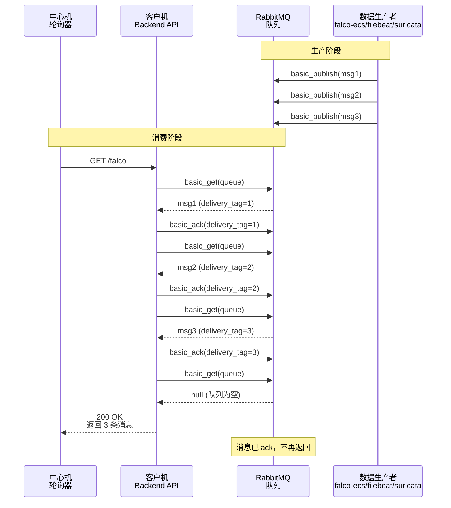
```mermaid
sequenceDiagram
    participant Center as 中心机<br/>轮询器
    participant Backend as 客户机<br/>Backend API
    participant Queue as RabbitMQ<br/>队列
    participant Producer as 数据生产者<br/>falco-ecs/filebeat/suricata

    Note over Producer,Queue: 生产阶段
    Producer->>Queue: basic_publish(msg1)
    Producer->>Queue: basic_publish(msg2)
    Producer->>Queue: basic_publish(msg3)

    Note over Center,Queue: 消费阶段
    Center->>Backend: GET /falco

    Backend->>Queue: basic_get(queue)
    Queue-->>Backend: msg1 (delivery_tag=1)

    Backend->>Queue: basic_ack(delivery_tag=1)

    Backend->>Queue: basic_get(queue)
    Queue-->>Backend: msg2 (delivery_tag=2)

    Backend->>Queue: basic_ack(delivery_tag=2)

    Backend->>Queue: basic_get(queue)
    Queue-->>Backend: msg3 (delivery_tag=3)

    Backend->>Queue: basic_ack(delivery_tag=3)

    Backend->>Queue: basic_get(queue)
    Queue-->>Backend: null (队列为空)

    Backend-->>Center: 200 OK<br/>返回 3 条消息

    Note over Queue: 消息已 ack，不再返回
```

## 3. 幂等与重复处理
## 3.1 拉取层幂等
同一条消息被 `ack` 后不再被后续拉取返回，避免重复。

## 3.2 入库层幂等
中心机入库以 `event.id` 去重，重复写入不产生重复文档，见 `../../80-规范/81-ECS字段规范.md`。

## 4. 断连与恢复
RabbitMQ 连接断开时：

1. 客户机 Go 后端在下一次拉取请求到来时重连；
2. 重连失败时接口返回 500 错误并携带 `error` 字段；
3. 中心机会在下一轮轮询继续重试，并更新注册表中的错误信息。

## 5. 容量边界
RabbitMQ 的容量边界由宿主机磁盘与 RabbitMQ 默认策略决定。

为了保证演示稳定性：

1. 靶场运行前必须清理历史队列数据；
2. 复现与演示过程中，若出现磁盘空间不足，按 `../../90-运维与靶场/95-重置复现与排障.md` 执行清理后重跑。


---

# 三、中心机模块

# 1. 中心机职责边界
中心机侧职责固定为：

1. 接收客户机注册并维护 `client-registry`；
2. 周期性轮询拉取客户机事件并入库 OpenSearch；
3. 执行检测与告警融合生成 Canonical Findings；
4. 提供面向前端的 API：事件查询、告警查询、图查询、任务创建与查询、报告导出；
5. 执行溯源任务并写回图谱边属性。

# 2. FastAPI 应用生命周期
中心机后端为 FastAPI 应用，入口文件为：

- `backend/main.py`

应用启动后会启动两个后台任务：

1. 客户机轮询服务（轮询拉取并入库）
2. 溯源任务执行器（异步执行任务并写回）

生命周期细节以代码为准，相关模块入口位于：

# 2.1 中心机系统架构
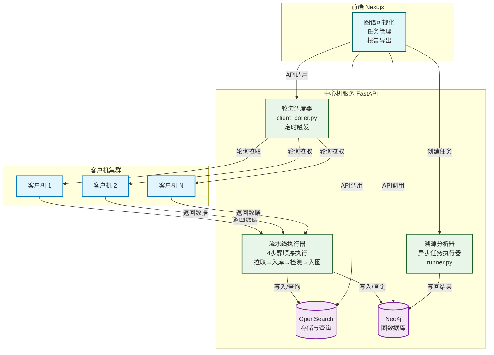
```mermaid
flowchart TB
    subgraph CenterServer["中心机服务 FastAPI"]
        Poller[轮询调度器<br/>client_poller.py<br/>定时触发]
        Pipeline[流水线执行器<br/>4步骤顺序执行<br/>拉取→入库→检测→入图]
        OpenSearchStore[(OpenSearch<br/>存储与查询)]
        Neo4jStore[(Neo4j<br/>图数据库)]
        Analysis[溯源分析器<br/>异步任务执行器<br/>runner.py]
    end

    subgraph Clients["客户机集群"]
        C1[客户机 1]
        C2[客户机 2]
        C3[客户机 N]
    end

    subgraph Frontend["前端 Next.js"]
        UI[图谱可视化<br/>任务管理<br/>报告导出]
    end

    Poller -->|轮询拉取| C1
    Poller -->|轮询拉取| C2
    Poller -->|轮询拉取| C3

    C1 -->|返回数据| Pipeline
    C2 -->|返回数据| Pipeline
    C3 -->|返回数据| Pipeline

    Pipeline -->|写入/查询| OpenSearchStore
    Pipeline -->|写入/查询| Neo4jStore

    UI -->|API调用| Poller
    UI -->|API调用| OpenSearchStore
    UI -->|API调用| Neo4jStore
    UI -->|创建任务| Analysis

    Analysis -->|写回结果| Neo4jStore

    classDef centerStyle fill:#e8f5e9,stroke:#1b5e20,stroke-width:2px
    classDef clientStyle fill:#e1f5fe,stroke:#0277bd,stroke-width:2px
    classDef frontendStyle fill:#e0f7fa,stroke:#006064,stroke-width:2px
    classDef dbStyle fill:#f3e5f5,stroke:#7b1fa2,stroke-width:2px

    class Poller,Pipeline,Analysis centerStyle
    class C1,C2,C3 clientStyle
    class UI frontendStyle
    class OpenSearchStore,Neo4jStore dbStyle
```

- `backend/app/services/client_poller.py`
- `backend/app/services/analyze/runner.py`

# 3. 代码目录结构
中心机后端核心代码位于 `backend/app/`：

```
backend/app/
  api/                 路由定义与请求响应模型
  core/                配置、日志、时间工具
  dto/                 DTO 定义
  schemas/             Pydantic schema
  services/
    client_poller.py   轮询服务
    opensearch/        OpenSearch 存储与分析
    neo4j/             Neo4j 入图与图查询
    analyze/           溯源算法与任务执行
```

# 3.1 模块依赖关系
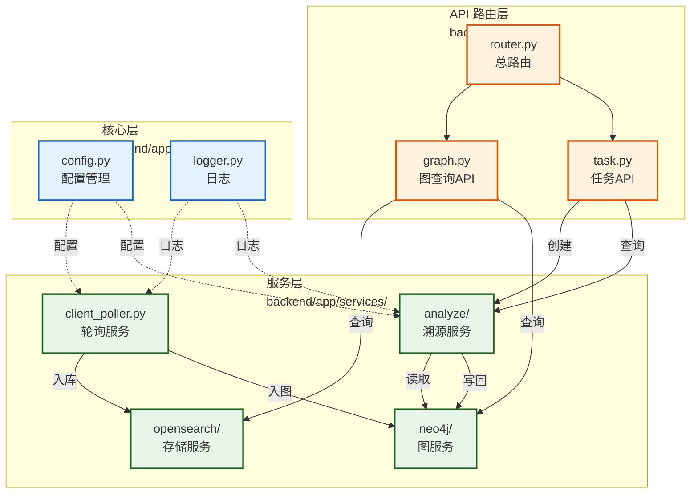
```mermaid
flowchart TB
    subgraph LayerAPI["API 路由层<br/>backend/app/api/"]
        Router[router.py<br/>总路由]
        GraphAPI[graph.py<br/>图查询API]
        TaskAPI[task.py<br/>任务API]
    end

    subgraph LayerServices["服务层<br/>backend/app/services/"]
        Poller[client_poller.py<br/>轮询服务]
        OpensearchSvc[opensearch/<br/>存储服务]
        Neo4jSvc[neo4j/<br/>图服务]
        AnalyzeSvc[analyze/<br/>溯源服务]
    end

    subgraph LayerCore["核心层<br/>backend/app/core/"]
        Config[config.py<br/>配置管理]
        Logger[logger.py<br/>日志]
    end

    Router --> GraphAPI
    Router --> TaskAPI

    GraphAPI -->|查询| OpensearchSvc
    GraphAPI -->|查询| Neo4jSvc

    TaskAPI -->|创建| AnalyzeSvc
    TaskAPI -->|查询| AnalyzeSvc

    Poller -->|入库| OpensearchSvc
    Poller -->|入图| Neo4jSvc

    AnalyzeSvc -->|读取| Neo4jSvc
    AnalyzeSvc -->|写回| Neo4jSvc

    Config -.->|配置| Poller
    Config -.->|配置| AnalyzeSvc
    Logger -.->|日志| Poller
    Logger -.->|日志| AnalyzeSvc

    classDef apiStyle fill:#fff3e0,stroke:#e65100,stroke-width:2px
    classDef serviceStyle fill:#e8f5e9,stroke:#1b5e20,stroke-width:2px
    classDef coreStyle fill:#e3f2fd,stroke:#1565c0,stroke-width:2px

    class Router,GraphAPI,TaskAPI apiStyle
    class Poller,OpensearchSvc,Neo4jSvc,AnalyzeSvc serviceStyle
    class Config,Logger coreStyle
```

# 4. API 路由组织
路由汇总入口：

- `backend/app/api/router.py`

对外 API 的权威定义见：

- `../../80-规范/88-前端与中心机接口.md`

本文件只说明路由模块的组织方式，不重复接口字段表。

# 4.1 端到端数据流
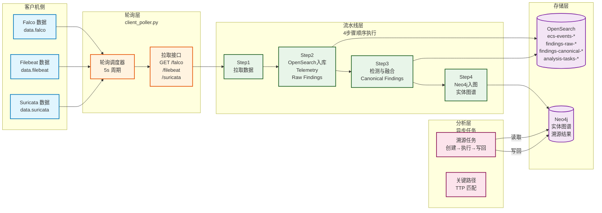
```mermaid
flowchart LR
    subgraph Clients["客户机侧"]
        Falco[Falco 数据<br/>data.falco]
        Filebeat[Filebeat 数据<br/>data.filebeat]
        Suricata[Suricata 数据<br/>data.suricata]
    end

    subgraph PollerLayer["轮询层<br/>client_poller.py"]
        Poller[轮询调度器<br/>5s 周期]
        Fetch[拉取接口<br/>GET /falco<br/>/filebeat<br/>/suricata]
    end

    subgraph PipelineLayer["流水线层<br/>4步骤顺序执行"]
        Step1[Step1<br/>拉取数据]
        Step2[Step2<br/>OpenSearch入库<br/>Telemetry<br/>Raw Findings]
        Step3[Step3<br/>检测与融合<br/>Canonical Findings]
        Step4[Step4<br/>Neo4j入图<br/>实体图谱]
    end

    subgraph StorageLayer["存储层"]
        OS[(OpenSearch<br/>ecs-events-*<br/>findings-raw-*<br/>findings-canonical-*<br/>analysis-tasks-*)]
        Neo4j[(Neo4j<br/>实体图谱<br/>溯源结果)]
    end

    subgraph AnalysisLayer["分析层<br/>异步任务"]
        Task[溯源任务<br/>创建→执行→写回]
        Result[关键路径<br/>TTP 匹配]
    end

    Falco --> Poller
    Filebeat --> Poller
    Suricata --> Poller

    Poller --> Fetch
    Fetch --> Step1
    Step1 --> Step2
    Step2 --> Step3
    Step3 --> Step4

    Step2 --> OS
    Step3 --> OS
    Step4 --> Neo4j

    Task -->|读取| Neo4j
    Task -->|写回| Neo4j

    classDef clientStyle fill:#e1f5fe,stroke:#0277bd,stroke-width:2px
    classDef pollerStyle fill:#fff3e0,stroke:#e65100,stroke-width:2px
    classDef pipelineStyle fill:#e8f5e9,stroke:#1b5e20,stroke-width:2px
    classDef storageStyle fill:#f3e5f5,stroke:#7b1fa2,stroke-width:2px
    classDef analysisStyle fill:#fce4ec,stroke:#880e4f,stroke-width:2px

    class Falco,Filebeat,Suricata clientStyle
    class Poller,Fetch pollerStyle
    class Step1,Step2,Step3,Step4 pipelineStyle
    class OS,Neo4j storageStyle
    class Task,Result analysisStyle
```

# 5. 模块集成点
# 5.1 OpenSearch
中心机写入与查询 OpenSearch 的统一入口为：

- `backend/app/services/opensearch/`

入库的字段规范化与去重由 `store_events()` 负责，详见 `62-OpenSearch存储与索引治理.md`。

# 5.2 Neo4j
中心机图查询与入图的入口为：

- `backend/app/services/neo4j/`

详见 `64-Neo4j入图与图查询.md` 与 `../../80-规范/84-Neo4j实体图谱规范.md`。

# 5.3 Analysis
中心机溯源任务与算法入口为：

- `backend/app/services/analyze/`

详见 `../../50-详细设计/分析/`。

# 6. 运维入口
中心机的启动、健康检查、数据清理与演示准备步骤统一在运维文档中定义：

- `../../90-运维与靶场/90-编译安装与使用.md`


## 3.1 注册与轮询

## 1. 注册表结构
中心机以 OpenSearch 索引 `client-registry` 作为客户机注册表的唯一权威数据源。

注册表文档包含以下核心信息：

- `client.id`：客户机唯一 ID
- `client.listen_url`：客户机拉取接口基地址，例如 `http://10.0.0.11:8888`
- `client.capabilities`：三类数据源能力声明（falco、suricata、filebeat）
- `poll.last_seen`：最近一次轮询时间
- `poll.status`：最近一次轮询状态
- `poll.last_error`：最近一次轮询错误信息

字段结构与索引约束由 `../../80-规范/82-OpenSearch索引与Mapping规范.md` 与 `../../80-规范/87-客户机与中心机接口.md` 定义。

## 2. 注册流程
中心机提供客户机注册接口，注册成功后必须写入 `client-registry`：

- `POST /api/v1/clients/register`

接口请求与响应的权威定义见：

- `../../80-规范/87-客户机与中心机接口.md`

注册失败时不允许降级为“仅内存登记”，必须返回错误并保持注册表不变。

## 3. 轮询调度
## 3.1 实现位置
轮询服务实现文件：

- `backend/app/services/client_poller.py`

## 3.2 轮询周期与超时
轮询周期与超时由环境变量控制（默认值写死在代码中）：

- `CENTER_POLL_INTERVAL_SECONDS`：默认 `5`
- `CENTER_POLL_TIMEOUT_SECONDS`：默认 `5`

环境变量的权威清单与默认值见：

- `../../80-规范/89-环境变量与配置规范.md`

## 3.3 单轮询流程
轮询服务（单定时器 tick）的固定流程为：

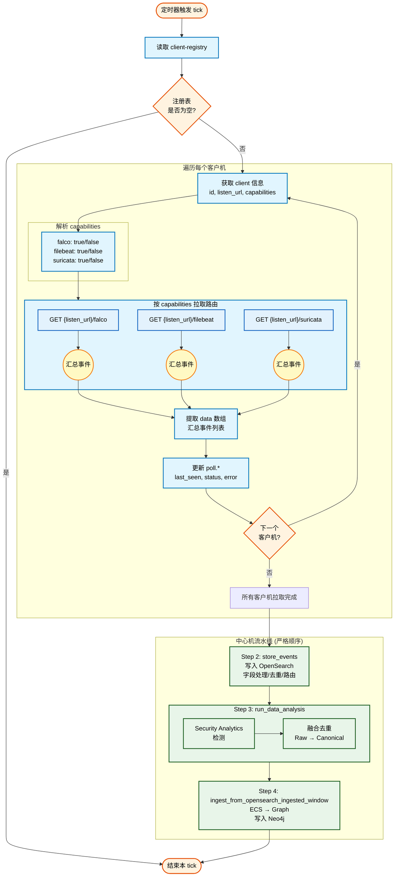
```mermaid
flowchart TD
    Start([定时器触发 tick]) --> ReadRegistry["读取 client-registry"]

    ReadRegistry --> CheckEmpty{注册表<br/>是否为空?}
    CheckEmpty -->|是| End([结束本 tick])
    CheckEmpty -->|否| LoopStart

    subgraph Loop["遍历每个客户机"]
        LoopStart["获取 client 信息<br/>id, listen_url, capabilities"] --> CapsContent

        subgraph ParseCaps["解析 capabilities"]
            CapsContent["falco: true/false<br/>filebeat: true/false<br/>suricata: true/false"]
        end

        CapsContent --> FetchRoutes

        subgraph FetchRoutes["按 capabilities 拉取路由"]
            direction LR
            F1["GET {listen_url}/falco"] --> E1
            F2["GET {listen_url}/filebeat"] --> E2
            F3["GET {listen_url}/suricata"] --> E3
            E1((汇总事件))
            E2((汇总事件))
            E3((汇总事件))
        end

        E1 & E2 & E3 --> ExtractData["提取 data 数组<br/>汇总事件列表"]
        ExtractData --> UpdateStatus["更新 poll.*<br/>last_seen, status, error"]
        UpdateStatus --> NextClient{下一个<br/>客户机?}
        NextClient -->|是| LoopStart
        NextClient -->|否| AllDone
    end

    AllDone["所有客户机拉取完成"] --> StoreEvents

    subgraph Pipeline["中心机流水线 (严格顺序)"]
        direction TB
        StoreEvents["Step 2: store_events<br/>写入 OpenSearch<br/>字段处理/去重/路由"]

        subgraph Step3["Step 3: run_data_analysis"]
            Detect["Security Analytics<br/>检测"]
            Fusion["融合去重<br/>Raw → Canonical"]
            Detect --> Fusion
        end

        Step4["Step 4: ingest_from_opensearch_ingested_window<br/>ECS → Graph<br/>写入 Neo4j"]

        StoreEvents --> Step3
        Step3 --> Step4
    end

    Step4 --> End

    %% 统一配色方案
    %% 后端/API：绿色 (#e8f5e9 / #1b5e20)
    %% 客户机：蓝色 (#e1f5fe / #0277bd)
    %% 数据库：深蓝 (#e3f2fd / #1565c0)

    classDef controlStyle fill:#fff3e0,stroke:#e65100,stroke-width:2px,color:#000
    classDef clientStyle fill:#e1f5fe,stroke:#0277bd,stroke-width:2px,color:#000
    classDef backendStyle fill:#e8f5e9,stroke:#1b5e20,stroke-width:2px,color:#000
    classDef dbStyle fill:#e3f2fd,stroke:#1565c0,stroke-width:2px,color:#000
    classDef eventStyle fill:#fff9c4,stroke:#f57f17,stroke-width:2px,color:#000

    class Start,End,CheckEmpty,NextClient controlStyle
    class ReadRegistry,LoopStart,CapsContent,FetchRoutes,ExtractData,UpdateStatus clientStyle
    class StoreEvents,Step3,Detect,Fusion,Step4 backendStyle
    class F1,F2,F3 dbStyle
    class E1,E2,E3 eventStyle
```

**流程说明**：

1. **注册表读取**：从 OpenSearch 读取 `client-registry` 的客户机列表；
2. **客户机遍历**：对每个客户机解析 `client.id`、`client.listen_url`、`client.capabilities`；
3. **路由选择**：按 capabilities 选择要拉取的路由，路由集合固定为：`falco`、`suricata`、`filebeat`；
4. **HTTP 拉取**：逐路由发送 HTTP GET 请求：`{listen_url}/{route}`；
5. **事件提取**：提取响应体中的 `data[]` 事件列表并汇总为本 tick 的事件列表；
6. **状态更新**：逐客户机写回注册表的 `poll.*` 状态字段；
7. **事件存储**（Step 2）：调用 `store_events()` 将本 tick 的事件列表写入 OpenSearch（Telemetry/Raw Findings/Canonical 按路由入库）；
8. **数据分析**（Step 3）：调用 `run_data_analysis()` 执行检测与告警融合（Raw → Canonical），写回 OpenSearch；
9. **图谱入库**（Step 4）：调用 Neo4j 入图流程（Telemetry + Canonical），将本 tick 产生的数据写入图谱。

相关模块入口：

- Step 2：`backend/app/services/opensearch/storage.py:store_events()`
- Step 3：`backend/app/services/opensearch/analysis.py:run_data_analysis()`
- Step 4：`backend/app/services/neo4j/ingest.py:ingest_from_opensearch_ingested_window()`

## 4. 状态更新与错误处理
## 4.1 轮询状态机
轮询服务的状态转换逻辑：

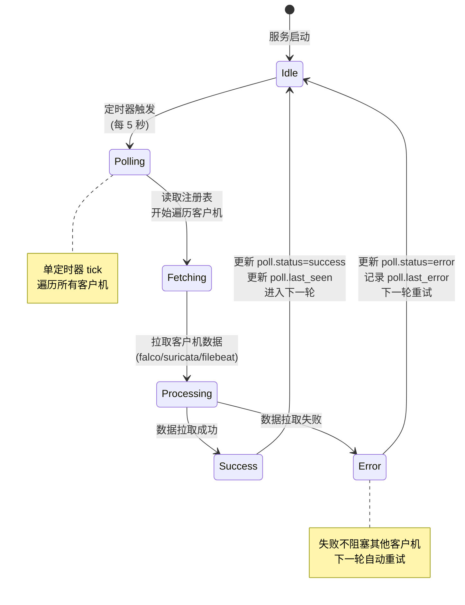
```mermaid
stateDiagram-v2
    [*] --> Idle: 服务启动

    Idle --> Polling: 定时器触发<br/>(每 5 秒)

    Polling --> Fetching: 读取注册表<br/>开始遍历客户机

    Fetching --> Processing: 拉取客户机数据<br/>(falco/suricata/filebeat)

    Processing --> Success: 数据拉取成功
    Processing --> Error: 数据拉取失败

    Success --> Idle: 更新 poll.status=success<br/>更新 poll.last_seen<br/>进入下一轮

    Error --> Idle: 更新 poll.status=error<br/>记录 poll.last_error<br/>下一轮重试

    note right of Polling
        单定时器 tick
        遍历所有客户机
    end note

    note right of Error
        失败不阻塞其他客户机
        下一轮自动重试
    end note
```

**状态说明**：

- **Idle**：空闲等待状态，等待定时器触发；
- **Polling**：轮询进行中，从注册表读取客户机列表；
- **Fetching**：拉取客户机数据（HTTP 请求客户机接口）；
- **Processing**：处理拉取的数据（提取事件、更新状态）；
- **Success**：单个客户机轮询成功；
- **Error**：单个客户机轮询失败。

## 4.2 故障处理策略
轮询服务对每个客户机维护以下固定错误处理语义：

1. 任一数据源拉取失败不阻塞其他数据源拉取；
2. 任一客户机轮询失败不阻塞其他客户机轮询；
3. 失败信息写入 `poll.last_error`，状态写入 `poll.status`，下一轮继续重试；
4. 轮询循环永不因单个客户机异常退出；
5. OpenSearch / Neo4j 属于中心机必选依赖：当 Step 3 或 Step 4 失败时，**轮询任务应快速失败并暴露错误**（用于靶场联调/验收时及时发现问题），但**不应在后台任务里直接 `os._exit(1)` 杀死 FastAPI 进程**（会导致服务"看起来卡死/不可控退出"，也不利于排障与恢复）。

## 4.3 故障处理时序图
完整的超时、重试、错误记录流程：

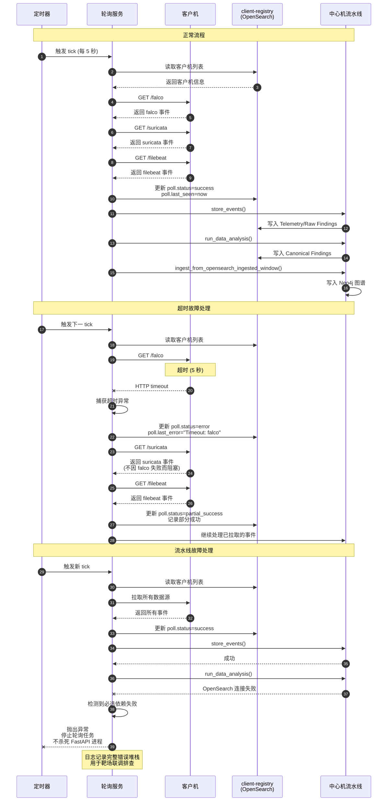
```mermaid
sequenceDiagram
    autonumber

    participant Timer as 定时器
    participant Poller as 轮询服务
    participant Client as 客户机
    participant Registry as client-registry<br/>(OpenSearch)
    participant Pipeline as 中心机流水线

    Note over Timer,Pipeline: 正常流程

    Timer->>Poller: 触发 tick (每 5 秒)
    Poller->>Registry: 读取客户机列表
    Registry-->>Poller: 返回客户机信息

    Poller->>Client: GET /falco
    Client-->>Poller: 返回 falco 事件

    Poller->>Client: GET /suricata
    Client-->>Poller: 返回 suricata 事件

    Poller->>Client: GET /filebeat
    Client-->>Poller: 返回 filebeat 事件

    Poller->>Registry: 更新 poll.status=success<br/>poll.last_seen=now

    Poller->>Pipeline: store_events()
    Pipeline->>Registry: 写入 Telemetry/Raw Findings

    Poller->>Pipeline: run_data_analysis()
    Pipeline->>Registry: 写入 Canonical Findings

    Poller->>Pipeline: ingest_from_opensearch_ingested_window()
    Pipeline->>Pipeline: 写入 Neo4j 图谱

    Note over Timer,Pipeline: 超时故障处理

    Timer->>Poller: 触发下一 tick
    Poller->>Registry: 读取客户机列表

    Poller->>Client: GET /falco
    Note over Client: 超时 (5 秒)
    Client--xPoller: HTTP timeout

    Poller->>Poller: 捕获超时异常
    Poller->>Registry: 更新 poll.status=error<br/>poll.last_error="Timeout: falco"

    Poller->>Client: GET /suricata
    Client-->>Poller: 返回 suricata 事件<br/>(不因 falco 失败而阻塞)

    Poller->>Client: GET /filebeat
    Client-->>Poller: 返回 filebeat 事件

    Poller->>Registry: 更新 poll.status=partial_success<br/>记录部分成功

    Poller->>Pipeline: 继续处理已拉取的事件

    Note over Timer,Pipeline: 流水线故障处理

    Timer->>Poller: 触发新 tick
    Poller->>Registry: 读取客户机列表
    Poller->>Client: 拉取所有数据源
    Client-->>Poller: 返回所有事件

    Poller->>Registry: 更新 poll.status=success

    Poller->>Pipeline: store_events()
    Pipeline-->>Poller: 成功

    Poller->>Pipeline: run_data_analysis()
    Pipeline--xPoller: OpenSearch 连接失败

    Poller->>Poller: 检测到必选依赖失败
    Poller--xTimer: 抛出异常<br/>停止轮询任务<br/>不杀死 FastAPI 进程

    Note over Poller: 日志记录完整错误堆栈<br/>用于靶场联调排查
```

**时序说明**：

1. **正常流程**：定时器触发轮询服务 → 拉取所有客户机的三个数据源 → 更新注册表 → 流水线处理（存储/分析/入图）；
2. **超时处理**：单个数据源超时（如 falco）不阻塞其他数据源（suricata/filebeat 继续拉取）→ 记录错误到 `poll.last_error` → 状态标记为 `partial_success` → 继续处理已拉取的事件；
3. **流水线故障**：当 OpenSearch/Neo4j 等必选依赖失败时 → 抛出异常停止轮询任务 → 记录完整错误堆栈 → 不杀死 FastAPI 进程（便于排障与恢复）。

## 3.2 OpenSearch 存储与索引治理

## 1. 模块职责与边界
OpenSearch 模块负责中心机侧“事实/告警/任务元数据”的权威存储与检索能力，具体职责固定为：

1. **索引体系**：定义索引命名、按日滚动策略、生命周期保留策略；
2. **入库路由**：根据 `event.kind` 与 `event.dataset` 将文档写入正确索引；
3. **字段处理**：对 ECS 文档执行三时间字段处理、扁平键兼容、基础校验；
4. **Store-first 检测**：触发 OpenSearch Security Analytics 扫描 Telemetry 并产出 Findings；
5. **融合去重**：将 Raw Findings 融合为 Canonical Findings 并写回 OpenSearch；
6. **任务存储**：保存溯源任务的状态与元数据，供前端轮询。

本模块不负责：

- Neo4j 图谱建模与查询（见 `64-Neo4j入图与图查询.md` 与 `../../80-规范/84-Neo4j实体图谱规范.md`）；
- 溯源算法与结果写回（见 `../../50-详细设计/分析/` 与 `../../80-规范/85-溯源结果写回规范.md`）；
- 客户机采集与接口（见 `../../50-详细设计/客户机/` 与 `../../80-规范/87-客户机与中心机接口.md`）。

## 2. 索引体系与命名
## 2.1 索引清单（系统运行时必须存在）
| 索引模式 | 数据对象 | 写入方 | 用途 |
|---|---|---|---|
| `ecs-events-YYYY-MM-DD` | Telemetry | 中心机流水线 Step 2 | 事实事件检索、Store-first 检测输入 |
| `raw-findings-YYYY-MM-DD` | Raw Findings | 中心机流水线 Step 3 | 原始告警审计、融合输入 |
| `canonical-findings-YYYY-MM-DD` | Canonical Findings | 中心机流水线 Step 3 | 图谱与溯源的主输入 |
| `client-registry` | 客户机注册表 | 客户机注册 + 流水线更新 | 客户机列表、游标、在线状态 |
| `analysis-tasks-YYYY-MM-DD` | Trace Task | Analysis 模块 | 异步任务状态与进度轮询 |

> 说明：索引保留策略在第 6 节定义；ECS 字段口径在 `../../80-规范/81-ECS字段规范.md` 定义。

## 2.2 索引命名规则（必须遵守）
1. 所有按日滚动的索引必须使用连字符日期：`YYYY-MM-DD`。
2. 索引名不得出现点号日期（例如 `2026.01.13`），避免 Security Analytics 的 pattern 解析问题。
3. `client-registry` 不按日滚动，索引名固定为 `client-registry`。

## 2.3 索引体系架构
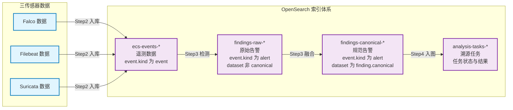
```mermaid
flowchart LR
    subgraph Indices["OpenSearch 索引体系"]
        Telemetry[ecs-events-*<br/>遥测数据<br/>event.kind 为 event]
        RawFindings[findings-raw-*<br/>原始告警<br/>event.kind 为 alert<br/>dataset 非 canonical]
        CanonicalFindings[findings-canonical-*<br/>规范告警<br/>event.kind 为 alert<br/>dataset 为 finding.canonical]
        Tasks[analysis-tasks-*<br/>溯源任务<br/>任务状态与结果]
    end

    subgraph DataSources["三传感器数据"]
        Falco[Falco 数据]
        Filebeat[Filebeat 数据]
        Suricata[Suricata 数据]
    end

    Falco -->|Step2 入库| Telemetry
    Filebeat -->|Step2 入库| Telemetry
    Suricata -->|Step2 入库| Telemetry

    Telemetry -->|Step3 检测| RawFindings
    RawFindings -->|Step3 融合| CanonicalFindings
    CanonicalFindings -->|Step4 入图| Tasks

    classDef sourceStyle fill:#e1f5fe,stroke:#0277bd,stroke-width:2px
    classDef indexStyle fill:#f3e5f5,stroke:#7b1fa2,stroke-width:2px

    class Falco,Filebeat,Suricata sourceStyle
    class Telemetry,RawFindings,CanonicalFindings,Tasks indexStyle
```

**架构说明**：
- **Telemetry 索引**（`ecs-events-*`）：接收 Falco、Filebeat、Suricata 三传感器原始事件
- **Raw Findings 索引**（`findings-raw-*`）：存储 Security Analytics 产出的原始告警
- **Canonical Findings 索引**（`findings-canonical-*`）：存储融合去重后的规范告警
- **Tasks 索引**（`analysis-tasks-*`）：存储异步溯源任务的状态与结果

## 3. 入库路由与字段处理
## 3.1 路由规则（权威）
对每条输入文档，中心机必须按以下规则路由（伪代码表达）：

- 当 `event.kind == "event"`：写入 `ecs-events-*`
- 当 `event.kind == "alert"` 且 `event.dataset == "finding.canonical"`：写入 `canonical-findings-*`
- 当 `event.kind == "alert"` 且 `event.dataset != "finding.canonical"`：写入 `raw-findings-*`

## 3.2 数据流向与写入流程
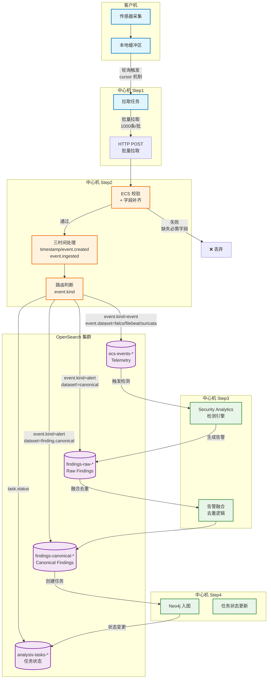
```mermaid
flowchart TD
    subgraph Client["客户机"]
        Sensors[传感器采集]
        Buffer[本地缓冲区]
    end

    subgraph Pull["中心机 Step1"]
        PullTask[拉取任务]
        HTTP[HTTP POST<br/>批量拉取]
    end

    subgraph Process["中心机 Step2"]
        Validate[ECS 校验<br/>+ 字段补齐]
        TimeProc[三时间处理<br/>timestamp/event.created<br/>event.ingested]
        Route[路由判断<br/>event.kind]
    end

    subgraph OS["OpenSearch 集群"]
        EventsIndex[(ecs-events-*<br/>Telemetry)]
        RawIndex[(findings-raw-*<br/>Raw Findings)]
        CanonicalIndex[(findings-canonical-*<br/>Canonical Findings)]
        TasksIndex[(analysis-tasks-*<br/>任务状态)]
    end

    subgraph Detect["中心机 Step3"]
        SA[Security Analytics<br/>检测引擎]
        Fusion[告警融合<br/>去重逻辑]
    end

    subgraph Graph["中心机 Step4"]
        Neo4j[Neo4j 入图]
        TaskState[任务状态更新]
    end

    Sensors --> Buffer
    Buffer -->|"轮询触发<br/>cursor 机制"| PullTask
    PullTask -->|"批量拉取<br/>1000条/批"| HTTP
    HTTP --> Validate
    Validate -->|"通过"| TimeProc
    Validate -->|"失败<br/>缺失必需字段"| DropInvalid[❌ 丢弃]

    TimeProc --> Route
    Route -->|"event.kind=event<br/>event.dataset=falco/filebeat/suricata"| EventsIndex
    Route -->|"event.kind=alert<br/>dataset!=canonical"| RawIndex
    Route -->|"event.kind=alert<br/>dataset=finding.canonical"| CanonicalIndex
    Route -->|"task.status"| TasksIndex

    EventsIndex -->|"触发检测"| SA
    SA -->|"生成告警"| RawIndex
    RawIndex -->|"融合去重"| Fusion
    Fusion --> CanonicalIndex

    CanonicalIndex -->|"创建任务"| Neo4j
    Neo4j -->|"状态变更"| TasksIndex

    classDef clientStyle fill:#e1f5fe,stroke:#0277bd,stroke-width:2px
    classDef processStyle fill:#fff3e0,stroke:#ef6c00,stroke-width:2px
    classDef osStyle fill:#f3e5f5,stroke:#7b1fa2,stroke-width:2px
    classDef detectStyle fill:#e8f5e9,stroke:#388e3c,stroke-width:2px

    class Sensors,PullTask,Buffer clientStyle
    class Validate,TimeProc,Route processStyle
    class EventsIndex,RawIndex,CanonicalIndex,TasksIndex osStyle
    class SA,Fusion,Neo4j,TaskState detectStyle
```

**流程说明**：
1. **客户机采集**：Falco/Filebeat/Suricata 采集数据并写入本地缓冲区
2. **中心机拉取**：Step1 通过 cursor 机制批量拉取客户机数据
3. **字段处理**：Step2 执行 ECS 校验、三时间处理、路由判断
4. **OpenSearch 写入**：按路由规则写入对应索引，使用 `event.id` 幂等去重
5. **检测与融合**：Step3 触发 Security Analytics 检测并融合告警
6. **任务管理**：Step4 创建溯源任务并持续更新任务状态

## 3.3 三时间字段处理（必须执行）
中心机写入 OpenSearch 前必须保证三时间字段满足 `../../80-规范/81-ECS字段规范.md`：

- `@timestamp`：主时间轴。若缺失，必须从 `event.created` 推导；若仍无法得到，中心机必须丢弃该文档。
- `event.created`：观察时间。若缺失，中心机必须回填为 `@timestamp`。
- `event.ingested`：入库时间。中心机必须覆盖为"当前入库时间"，不得使用上游携带值。

## 3.4 ECS 字段映射与处理
中心机在写入 OpenSearch 前必须对关键字段进行映射和转换，确保符合 ECS 规范：

| ECS 字段 | 数据类型 | 必需 | 处理规则 | 说明 |
|---|---|---|---|---|
| `@timestamp` | date | ✅ | 优先使用原始值；缺失时从 `event.created` 推导；仍缺失则丢弃文档 | 主时间轴，用于日志检索和时序分析 |
| `event.id` | keyword | ✅ | 若缺失则生成 UUID：`{client_id}-{sensor_type}-{timestamp}-{seq}` | 幂等去重的唯一标识 |
| `event.kind` | keyword | ✅ | 枚举值：`event` / `alert` / `state` | 路由判断的核心字段 |
| `event.category` | keyword | ❌ | 映射规则：`file` → `file`，`network` → `network`，`process` → `process` | 用于前端分类展示 |
| `event.dataset` | keyword | ✅ | 格式：`{sensor}.{type}`，如 `falco.syscall`、`finding.canonical` | 区分数据来源和告警类型 |
| `event.created` | date | ✅ | 缺失时回填为 `@timestamp` | 事件首次被观察到的时间 |
| `event.ingested` | date | ✅ | 覆盖为当前入库时间（UTC 毫秒时间戳） | 中心机接收时间，用于监控延迟 |
| `source.ip` | ip | ❌ | 保持原值，支持 IPv4/IPv6 | 源地址，用于关联分析 |
| `source.port` | long | ❌ | 范围校验：0-65535 | 源端口 |
| `destination.ip` | ip | ❌ | 保持原值，支持 IPv4/IPv6 | 目标地址 |
| `destination.port` | long | ❌ | 范围校验：0-65535 | 目标端口 |
| `process.pid` | long | ❌ | 保持原值 | 进程 ID |
| `process.executable` | keyword | ❌ | 规范化绝对路径，统一使用 `/` 分隔符 | 进程可执行文件路径 |
| `file.path` | keyword | ❌ | 规范化绝对路径，统一使用 `/` 分隔符 | 文件路径 |
| `file.name` | keyword | ❌ | 从 `file.path` 中提取文件名 | 文件名 |
| `user.name` | keyword | ❌ | 保持原值 | 用户名 |
| `host.name` | keyword | ✅ | 使用客户机注册表中的 `hostname` | 主机名 |
| `host.ip` | ip | ❌ | 使用客户机注册表中的 `ip` | 主机 IP |
| `agent.type` | keyword | ✅ | 固定值：`falco` / `filebeat` / `suricata` | 传感器类型标识 |
| `agent.ephemeral_id` | keyword | ❌ | 保持原值 | 传感器实例 ID |
| `alert.severity` | long | ❌ | 范围映射：1-21 低 / 22-59 中 / 60-100 高 | 告警严重级别 |
| `alert.status` | keyword | ❌ | 枚举值：`active` / `resolved` / `suppressed` | 告警状态 |
| `threat.framework` | keyword | ❌ | 固定值：`MITRE ATT&CK` | 威胁框架标识 |
| `threat.tactic.id` | keyword | ❌ | 格式：`TAxxxx`，如 `TA0001` | 战术 ID |
| `threat.technique.id` | keyword | ❌ | 格式：`Txxxx`，如 `T1059` | 技术 ID |
| `rule.name` | keyword | ❌ | 保持原值 | 规则名称 |
| `rule.category` | keyword | ❌ | 映射到 MITRE 战术，如 `Execution` / `Persistence` | 规则分类 |
| `tags` | keyword | ❌ | 数组格式，自动去重 | 标签数组，用于快速过滤 |

**字段处理注意事项**：
1. **扁平键兼容**：保留 `_source` 中的扁平字段（如 `proc_name`），但查询时优先使用嵌套 ECS 字段
2. **类型校验**：写入前校验字段类型，类型不匹配时记录警告并使用默认值或丢弃
3. **缺失字段**：必需字段缺失时拒绝入库，非必需字段缺失时使用默认值或留空
4. **数组字段**：`tags`、`threat.tactic.id` 等数组字段必须去重，避免重复标签
5. **IP 地址**：支持 IPv4 和 IPv6，自动识别并设置正确的 `ip` 类型

## 3.5 幂等与去重（必须满足）
1. 每条文档必须具备 `event.id`。  
2. 中心机写入必须按 `event.id` 幂等：同一 `event.id` 重复写入不得产生重复文档。  
3. 对于无法保证 `event.id` 稳定的上游输入，必须在进入中心机前补齐稳定 `event.id`。

## 4. 检测与融合
OpenSearch 的检测触发、Raw Finding 生成与 Canonical Finding 融合去重规则在本项目中属于独立的详细设计章节：

- `63-检测与告警融合.md`

## 5. 保留策略与脚本
## 5.1 数据保留周期（固定）
保留周期的权威口径见：`../../80-规范/80-数据对象与生命周期.md`。

## 5.2 初始化与运维脚本（入口）
OpenSearch 侧的初始化动作固定为：

1) 启动 OpenSearch 容器；  
2) 启动中心机后端，后端在启动阶段调用 `initialize_indices()` 创建/确保索引存在（包含 mapping）；  
3) 配置 Security Analytics detector，并导入 Sigma 规则。  

脚本入口固定为以下文件：

- Sigma 规则导入：`backend/app/services/opensearch/scripts/import_sigma_rules.py`
- Security Analytics detector 配置：`backend/app/services/opensearch/scripts/setup_security_analytics.py`

## 3.3 检测与告警融合

## 1. 检测触发机制
中心机的检测与融合在**每个 tick 内固定执行（无开关）**：轮询服务完成 Step 1/2（拉取并入库）后，立即进入 Step 3（检测与融合）。

触发点（固定）：

- `backend/app/services/client_poller.py`

## 1.1 检测与融合入口（固定）
检测与融合的统一入口函数固定为：

- `backend/app/services/opensearch/analysis.py:run_data_analysis()`

该函数固定执行两段核心动作：

1. **Correlation 分析**：基于 Correlation Rules 做跨事件关联（必要时会自动创建/更新规则），用于产出高层攻击场景/关联告警；
2. **融合去重**：对 `raw-findings-*` 执行融合去重生成 Canonical Findings，写回 `canonical-findings-*`。

> 说明：底层调用 OpenSearch 插件 API（Security Analytics / Correlation Rules）的细节属于工程实现，可随版本调整；本文件只约束“入口、输入输出与审计口径”。

## 1.2 手动触发（仅调试）
开发/联调阶段允许手动调用 `run_data_analysis()` 单独执行一次，用于排障与回放；但靶场与验收的默认路径以“tick 内固定触发”为准。

## 2. Raw Finding 结构与写入
Raw Finding 由两类来源组成：

1. Filebeat Sigma detector / Falco / Suricata 直接产生的告警事件（客户机侧 `event.kind="alert"`）；
2. OpenSearch Security Analytics 产生的 findings（中心机侧拉取并转换为 ECS 告警事件）。

Raw Finding 的字段结构与最小必填字段由权威规范定义：

- `../../80-规范/83-告警数据规范.md`

## 2.1 Security Analytics finding 转换（固定）
当告警来源为 OpenSearch Security Analytics 时，中心机按固定规则将原始 finding 转换为 ECS 告警事件并写入 `raw-findings-*`：

- `event.kind="alert"`
- `event.dataset="finding.raw.security_analytics"`
- `rule.id/rule.name` 从 detector 信息派生
- `threat.*` 从 finding 的 ATT&CK tags 派生（或从固定映射表派生）

实现绑定点：`backend/app/services/opensearch/analysis.py:_convert_security_analytics_finding_to_ecs()`。

## 3. 融合指纹规则
融合去重以固定时间窗内的 Raw Finding 为输入，按指纹规则聚合生成 Canonical Finding。

指纹字段与生成规则由权威规范定义：

- `../../80-规范/83-告警数据规范.md`

## 3.1 时间桶参数（固定）
融合指纹使用固定时间桶参数：

- `TIME_WINDOW_MINUTES = 3`

实现绑定点：`backend/app/services/opensearch/analysis.py:TIME_WINDOW_MINUTES`。

##### 时间桶示意图

```mermaid
gantt
    title 5分钟时间桶聚合示例
    dateFormat X
    axisFormat %s

    section 时间桶0 (0-300s)
    Raw Finding 1    :0, 30
    Raw Finding 2    :50, 20
    Raw Finding 3    :200, 10

    section 时间桶1 (300-600s)
    Raw Finding 4    :300, 40
    Raw Finding 5    :350, 25
    Raw Finding 6    :450, 15

    section 时间桶2 (600-900s)
    Raw Finding 7    :600, 35
    Raw Finding 8    :700, 20
    Raw Finding 9    :800, 30
```

**说明**：
- X 轴表示 Unix 时间戳（秒）
- 每个 5 分钟桶（300 秒）内的 Raw Findings 会被分配到同一个桶中
- 同一个桶内的 Raw Findings 如果指纹相同，才会被融合
- 跨桶的 Raw Findings 即使内容相同也不会被融合

## 3.2 指纹构造要素（固定）
指纹 key 的构造要素固定为：

- `threat.technique.id`
- `host.id`
- `entity_id`（取值顺序固定为：`process.entity_id` → `destination.ip[/destination.domain]` → `file.hash.sha256`）
- `time_bucket`

实现绑定点：`backend/app/services/opensearch/analysis.py:generate_fingerprint()` 与 `fingerprint_id_from_key()`。

## 3.3 字段映射：Raw → Canonical
Raw Finding 转换为 Canonical Finding 时的关键字段映射关系：

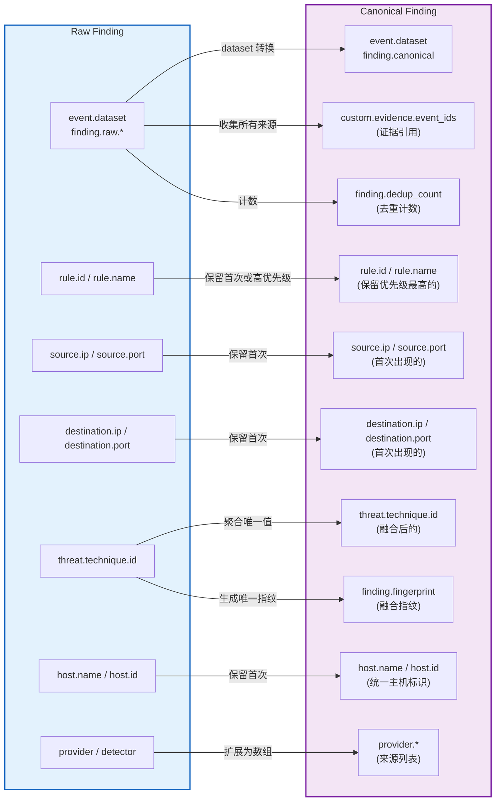
```mermaid
flowchart LR
    subgraph RawFinding["Raw Finding"]
        RF1["event.dataset<br/>finding.raw.*"]
        RF2["rule.id / rule.name"]
        RF3["source.ip / source.port"]
        RF4["destination.ip / destination.port"]
        RF5["threat.technique.id"]
        RF6["host.name / host.id"]
        RF7["provider / detector"]
    end

    subgraph CanonicalFinding["Canonical Finding"]
        CF1["event.dataset<br/>finding.canonical"]
        CF2["rule.id / rule.name<br/>(保留优先级最高的)"]
        CF3["source.ip / source.port<br/>(首次出现的)"]
        CF4["destination.ip / destination.port<br/>(首次出现的)"]
        CF5["threat.technique.id<br/>(融合后的)"]
        CF6["host.name / host.id<br/>(统一主机标识)"]
        CF7["provider.*<br/>(来源列表)"]
        CF8["finding.fingerprint<br/>(融合指纹)"]
        CF9["custom.evidence.event_ids<br/>(证据引用)"]
        CF10["finding.dedup_count<br/>(去重计数)"]
    end

    RF1 -->|"dataset 转换"| CF1
    RF2 -->|"保留首次或高优先级"| CF2
    RF3 -->|"保留首次"| CF3
    RF4 -->|"保留首次"| CF4
    RF5 -->|"聚合唯一值"| CF5
    RF6 -->|"保留首次"| CF6
    RF7 -->|"扩展为数组"| CF7
    RF5 -->|"生成唯一指纹"| CF8
    RF1 -->|"收集所有来源"| CF9
    RF1 -->|"计数"| CF10

    classDef rawStyle fill:#e3f2fd,stroke:#1565c0,stroke-width:2px
    classDef canonicalStyle fill:#f3e5f5,stroke:#7b1fa2,stroke-width:2px
    classDef arrowStyle stroke:#ef6c00,stroke-width:2px

    class RawFinding rawStyle
    class CanonicalFinding canonicalStyle
```

**说明**：
- **event.dataset**：从 `finding.raw.*` 转换为 `finding.canonical`
- **provider 字段**：Raw Finding 中的单一 provider 扩展为数组 `provider.*`，记录所有来源
- **finding.fingerprint**：基于指纹要素生成唯一标识符
- **custom.evidence.event_ids**：收集所有融合的 Raw Finding 的 `event.id`
- **finding.dedup_count**：记录融合的 Raw Finding 数量

## 4. Canonical 生成与覆盖规则
Canonical Finding 的生成规则、`event.id` 生成规则、以及覆盖行为由权威规范定义：

- `../../80-规范/83-告警数据规范.md`

## 4.1 融合写入动作（固定）
融合写入动作固定为：

1. 从 `raw-findings-*` 拉取 Raw Findings；
2. 按指纹 key 分组；
3. 每组多条 Raw Findings 合并为一个 Canonical Finding；
4. 每组单条 Raw Finding 直接规范化为 Canonical Finding；
5. 批量写入 `canonical-findings-*` 并刷新索引。

实现绑定点：`backend/app/services/opensearch/analysis.py:deduplicate_findings()`。

## 4.2 融合算法流程
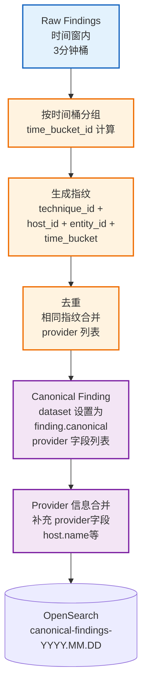
```mermaid
flowchart TD
    RawFindings[Raw Findings<br/>时间窗内<br/>3分钟桶] --> TimeBucket[按时间桶分组<br/>time_bucket_id 计算]
    TimeBucket --> Fingerprint[生成指纹<br/>technique_id +<br/>host_id + entity_id +<br/>time_bucket]
    Fingerprint --> Dedup[去重<br/>相同指纹合并<br/>provider 列表]
    Dedup --> Canonical[Canonical Finding<br/>dataset 设置为<br/>finding.canonical<br/>provider 字段列表]
    Canonical --> ProviderMerge[Provider 信息合并<br/>补充 provider字段<br/>host.name等]
    ProviderMerge --> OpenSearch[(OpenSearch<br/>canonical-findings-YYYY.MM.DD)]

    classDef inputStyle fill:#e3f2fd,stroke:#1565c0,stroke-width:2px
    classDef processStyle fill:#fff3e0,stroke:#ef6c00,stroke-width:2px
    classDef outputStyle fill:#f3e5f5,stroke:#7b1fa2,stroke-width:2px

    class RawFindings inputStyle
    class TimeBucket,Fingerprint,Dedup processStyle
    class Canonical,ProviderMerge outputStyle
```

**流程说明**：
1. **Raw Findings 聚合**：从 `raw-findings-*` 索引中拉取时间窗内的所有 Raw Findings
2. **时间桶分组**：按 3 分钟桶分组，确保只有同一时间桶内的 Raw Findings 才会被融合
3. **指纹生成**：基于固定要素生成唯一指纹 key
4. **去重融合**：相同指纹的 Raw Findings 合并为一个 Canonical Finding
5. **Provider 信息合并**：将所有来源的 provider 信息合并到 `provider.*` 字段数组
6. **写入 OpenSearch**：批量写入 `canonical-findings-*` 索引

## 5. 审计与可回溯性
审计与可回溯性要求：

1. Raw 与 Canonical 必须包含证据引用 `custom.evidence.event_ids`；
2. Canonical 的证据引用必须能回溯到 Telemetry 的 `event.id`；
3. 任意 Canonical 必须能定位到其来源 providers 与融合指纹。

字段口径见：

- `../../80-规范/81-ECS字段规范.md`

## 3.4 Neo4j 入图与图查询

## 1. 模块职责与边界
Neo4j 模块负责“实体关系图（Entity Graph）”的权威存储与图查询能力，具体职责固定为：

1. **Schema 管理**：创建并维持节点唯一约束与常用索引；
2. **入图写入**：将输入的 ECS 文档转换为节点/边，并写入 Neo4j；
3. **时间窗查询**：支持按时间窗查询边集合（供图可视化与算法使用）；
4. **图算法查询**：支持基于时间窗投影图的最短路（Neo4j GDS）；
5. **结果承载**：承载溯源任务写回的边属性，供后续“按节点查询溯源结果”。

本模块不负责：

- OpenSearch 的检测与融合（见 `63-检测与告警融合.md`）；
- 溯源算法的具体执行（见 `../../50-详细设计/分析/`）；
- ECS 字段口径（见 `../../80-规范/81-ECS字段规范.md`）。

## 2. Schema 与约束
## 2.1 节点唯一约束（必须存在）
节点类型与唯一键由 `../../80-规范/84-Neo4j实体图谱规范.md` 定义。Neo4j 必须落地以下唯一约束（表达为“Label + 属性键”）：

| Label | 唯一键 |
|---|---|
| `Host` | `host.id` |
| `User` | `user.id` |
| `User` | `host.id + user.name` |
| `Process` | `process.entity_id` |
| `File` | `host.id + file.path` |
| `Domain` | `domain.name` |
| `IP` | `ip` |

> 说明：`User` 与 `File` 的复合键用于避免跨主机误合并；当事件包含 `user.id` 时使用 `user.id` 作为唯一键；当事件不包含 `user.id` 时使用 `host.id + user.name` 作为唯一键。

## 2.2 图数据模型
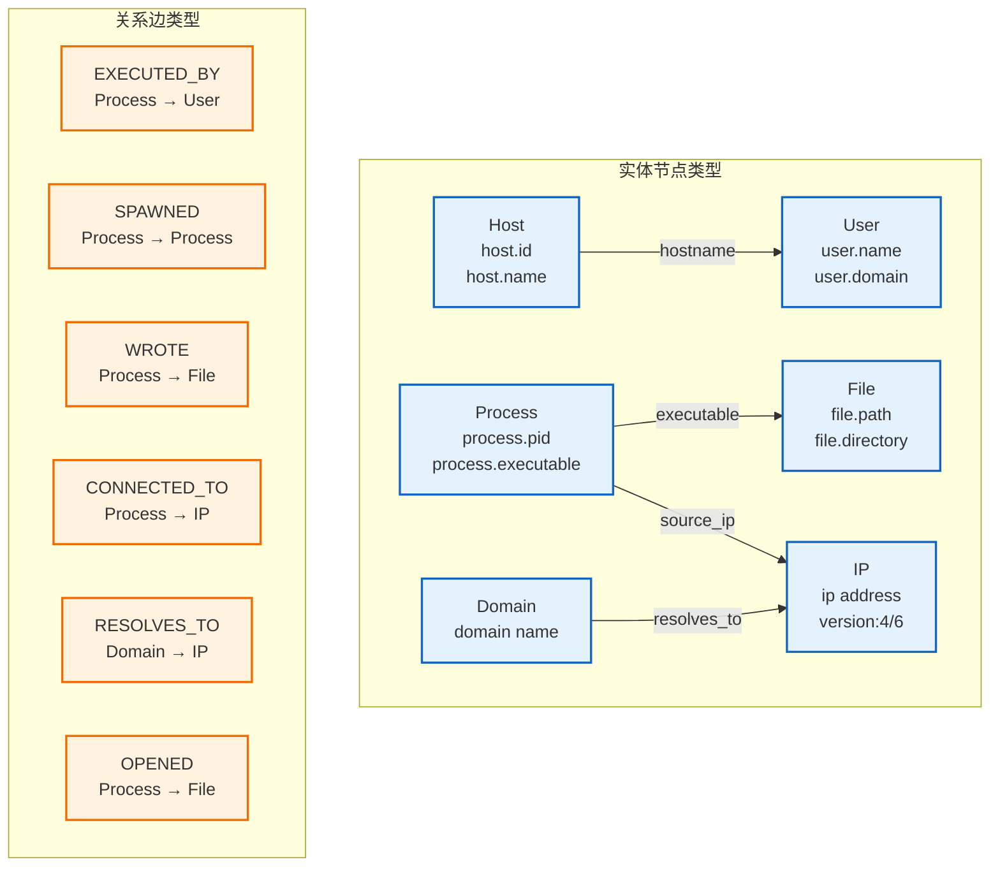
```mermaid
flowchart TB
    subgraph Nodes["实体节点类型"]
        Host[Host<br/>host.id<br/>host.name]
        User[User<br/>user.name<br/>user.domain]
        Process[Process<br/>process.pid<br/>process.executable]
        File[File<br/>file.path<br/>file.directory]
        IP[IP<br/>ip address<br/>version:4/6]
        Domain[Domain<br/>domain name]
    end

    subgraph Edges["关系边类型"]
        EXEC[EXECUTED_BY<br/>Process → User]
        SPAWNED[SPAWNED<br/>Process → Process]
        WROTE[WROTE<br/>Process → File]
        CONNECTED[CONNECTED_TO<br/>Process → IP]
        RESOLVED[RESOLVES_TO<br/>Domain → IP]
        OPENED[OPENED<br/>Process → File]
    end

    Host -->|hostname| User
    Process -->|executable| File
    Process -->|source_ip| IP
    Domain -->|resolves_to| IP

    classDef nodeStyle fill:#e3f2fd,stroke:#1565c0,stroke-width:2px
    classDef edgeStyle fill:#fff3e0,stroke:#ef6c00,stroke-width:2px

    class Host,User,Process,File,IP,Domain nodeStyle
    class EXEC,SPAWNED,WROTE,CONNECTED,RESOLVED,OPENED edgeStyle
```

## 2.3 索引（必须存在）
为支撑展示与排障，Neo4j 必须为以下属性建立索引：

- `Host.host.name`
- `User.user.name`
- `Process.process.executable`
- `File.file.path`
- `Domain.domain.name`
- `IP.ip`

## 3. 写入：ECS → Graph
## 3.1 入图输入范围（严格）
Neo4j 入图只接受两类 ECS 文档：

1. Telemetry：`event.kind="event"`
2. Canonical Findings：`event.kind="alert"` 且 `event.dataset="finding.canonical"`

任何 Raw Findings（含传感器原始告警与 Security Analytics 原始 finding）不得直接入图。

## 3.2 入图边属性（必须写入）
每条入图边必须写入以下属性（字段名与来源以 `../../80-规范/81-ECS字段规范.md` 与 `../../80-规范/84-Neo4j实体图谱规范.md` 为准）：

- `ts` 或 `@timestamp`：边的事件时间（字符串时间戳）
- `ts_float`：数值时间戳（秒，float），用于时间窗过滤与 GDS 投影
- `custom.evidence.event_ids[]`：证据事件引用列表
- `event.kind` / `event.dataset` / `event.id`：用于回溯与区分来源

当边来自 Canonical Finding 时，边必须额外写入：

- `is_alarm=true`
- `rule.*`、`threat.*`、`event.severity`、`custom.finding.*` 等字段（用于解释与可视化）

## 3.3 写入幂等边界
- 节点写入必须幂等（MERGE），以唯一键去重；
- 边写入是“按证据追加”的语义：边允许出现多条相同类型关系，但每条边必须携带其证据 `event.id` 与证据列表，便于后续去重/回放。

> 边去重属于 Analysis 的工作范围：在"展示层"与"任务结果写回层"通过属性与过滤实现干净展示。

## 3.4 批量写入优化（v2.1+）
从 v2.1 开始，Neo4j 模块支持批量写入 API 以提升入图性能：

**批量 API**：
- `add_nodes_and_edges(nodes, edges)` - 在单个事务中批量写入节点和边

**性能优化策略**：
- **节点批量写入**：按节点类型分组，使用 UNWIND 批量 MERGE
- **边批量写入**：在单个事务中逐个 MERGE（需匹配起终点）
- **性能提升**：1000 事件从 ~16000 次网络往返降至 ~160 次（100x 提升）

**使用示例**：
```python
from app.services.neo4j import db

## 批量写入nodes = [host_node(host_id="h-001"), user_node(user_id="u-001")]
edges = [logon_edge(user, host)]
db.add_nodes_and_edges(nodes, edges)
```

**向后兼容性**：
- 保留 `add_node()` 和 `add_edge()` 单条 API，旧代码无需修改
- 批量 API 与单条 API 具有相同的幂等性保证

**实施位置**：
- 代码：`backend/app/services/neo4j/db.py:200-400`
- 测试：`backend/tests/unit/test_services_neo4j/test_db_batch.py`

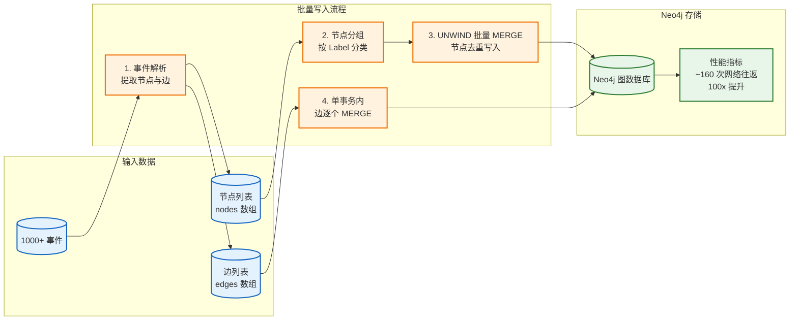
```mermaid
flowchart LR
    subgraph Input["输入数据"]
        Events[("1000+ 事件")]
        Nodes[("节点列表<br/>nodes 数组")]
        Edges[("边列表<br/>edges 数组")]
    end

    subgraph Process["批量写入流程"]
        Step1["1. 事件解析<br/>提取节点与边"]
        Step2["2. 节点分组<br/>按 Label 分类"]
        Step3["3. UNWIND 批量 MERGE<br/>节点去重写入"]
        Step4["4. 单事务内<br/>边逐个 MERGE"]
    end

    subgraph Output["Neo4j 存储"]
        Neo4j[("Neo4j 图数据库")]
        Metrics["性能指标<br/>~160 次网络往返<br/>100x 提升"]
    end

    Events --> Step1
    Step1 --> Nodes
    Step1 --> Edges
    Nodes --> Step2
    Step2 --> Step3
    Edges --> Step4
    Step3 --> Neo4j
    Step4 --> Neo4j
    Neo4j --> Metrics

    classDef inputStyle fill:#e3f2fd,stroke:#1565c0,stroke-width:2px
    classDef processStyle fill:#fff3e0,stroke:#ef6c00,stroke-width:2px
    classDef outputStyle fill:#e8f5e9,stroke:#2e7d32,stroke-width:2px

    class Events,Nodes,Edges inputStyle
    class Step1,Step2,Step3,Step4 processStyle
    class Neo4j,Metrics outputStyle
```

## 4. 查询：可视化与算法的图查询
## 4.1 图查询能力清单（必须支持）
Neo4j 模块必须提供以下查询能力：

1. **告警边查询**：返回所有 `is_alarm=true` 的边集合；
2. **时间窗边查询**：给定 `[t_min, t_max]`（秒），返回时间窗内的边集合，并支持按关系类型过滤；
3. **时间窗最短路**：给定 `src_uid`、`dst_uid`、`[t_min, t_max]` 与风险权重表，返回时间窗内的加权最短路边序列。

## 4.2 后端对外 API 绑定（固定）
后端对外提供统一的图查询入口：

- `POST /api/v1/graph/query`

该接口支持以下动作：

- `alarm_edges`
- `edges_in_window`
- `shortest_path_in_window`
- `analysis_edges_by_task`

接口的请求/响应字段由后端实现固定，Neo4j 模块负责提供稳定的查询语义与返回结构（nodes/edges 的 uid、rtype、props）。

其中：

- `analysis_edges_by_task`：按 `analysis.task_id` 拉取该任务写回的边集合；当请求参数 `only_path=true` 时只返回 `analysis.is_path_edge=true` 的关键路径边；当 `only_path=false` 时返回该任务写回的全部边。

```mermaid
sequenceDiagram
    participant Frontend as 前端<br/>图可视化
    participant API as 后端 API<br/>/api/v1/graph/query
    participant Service as Neo4j Service<br/>查询服务
    participant Neo4j as Neo4j 数据库

    Note over Frontend,Neo4j: 场景1: 告警边查询
    Frontend->>API: POST {action: "alarm_edges"}
    API->>Service: query_alarm_edges()
    Service->>Neo4j: MATCH (e)-[r:ALARM]->(e2)<br/>WHERE r.is_alarm=true
    Neo4j-->>Service: 边集合
    Service-->>API: nodes + edges
    API-->>Frontend: JSON 响应

    Note over Frontend,Neo4j: 场景2: 时间窗查询
    Frontend->>API: POST {action: "edges_in_window"<br/>t_min, t_max}
    API->>Service: query_edges_in_window(t_min, t_max)
    Service->>Neo4j: MATCH (n)-[r]->(m)<br/>WHERE r.ts_float >= t_min<br/>AND r.ts_float <= t_max
    Neo4j-->>Service: 时间窗内的边
    Service-->>API: nodes + edges
    API-->>Frontend: JSON 响应

    Note over Frontend,Neo4j: 场景3: 最短路查询
    Frontend->>API: POST {action: "shortest_path_in_window"<br/>src_uid, dst_uid, t_min, t_max}
    API->>Service: query_shortest_path(src, dst, t_min, t_max)
    Service->>Neo4j: 1. 投影时间窗子图<br/>2. GDS algo.shortestPath<br/>3. 返回路径边序列
    Neo4j-->>Service: 加权最短路径
    Service-->>API: path_nodes + path_edges
    API-->>Frontend: JSON 响应

    Note over Frontend,Neo4j: 场景4: 溯源结果查询
    Frontend->>API: POST {action: "analysis_edges_by_task"<br/>task_id, only_path}
    API->>Service: query_analysis_edges(task_id, only_path)
    Service->>Neo4j: MATCH (n)-[r]->(m)<br/>WHERE r.analysis.task_id = $task_id<br/>AND (only_path=false OR r.analysis.is_path_edge=true)
    Neo4j-->>Service: 任务写回的边
    Service-->>API: nodes + edges
    API-->>Frontend: JSON 响应
```

## 5. 结果写回：边属性规范
溯源结果写回属于“图谱回标与边属性”的详细设计范围：

- 写回数据结构（权威口径）：`../../80-规范/85-溯源结果写回规范.md`
- 工程实现与读取口径：`65-图谱回标与边属性.md`

## 3.5 图谱回标与边属性

## 1. 告警映射与回标规则
## 1.1 输入边界（固定）
Neo4j 的入图只接受两类 ECS 文档（严格）：

1. Telemetry：`event.kind="event"`
2. Canonical Finding：`event.kind="alert"` 且 `event.dataset="finding.canonical"`

该边界是图谱口径的一部分，见：

- `../../80-规范/84-Neo4j实体图谱规范.md` 0.1

## 1.2 Canonical Finding → 告警边（固定）
```mermaid
flowchart LR
    Alert[Canonical Finding<br/>告警文档] --> Analysis[溯源分析]
    Analysis --> Path[关键路径]
    Path --> Edges[边集合<br/>Edges]
    Edges --> WriteBack[写回边属性<br/>analysis.is_path_edge 为 true]

    style Alert fill:#ffcdd2,stroke:#c62828,stroke-width:2px
    style Analysis fill:#fce4ec,stroke:#880e4f,stroke-width:2px
    style Path fill:#fce4ec,stroke:#880e4f,stroke-width:2px
    style Edges fill:#e3f2fd,stroke:#1565c0,stroke-width:2px
    style WriteBack fill:#e3f2fd,stroke:#1565c0,stroke-width:2px
```

Canonical Finding 在入图阶段会被映射为一组关系边，边属性满足以下固定规则：

1. 每条边都携带 `event.id`、`event.kind`、`event.dataset`、`ts_float`、`custom.evidence.event_ids[]`；
2. 当输入为 Canonical Finding 时，每条边额外携带 `is_alarm=true`；
3. Canonical Finding 的解释字段会写入边属性，用于前端展示与溯源解释：
   - `rule.*`
   - `threat.*`
   - `event.severity`
   - `custom.finding.*`

实现绑定点（以代码为准）：

- 入图转换：`backend/app/services/neo4j/ecs_ingest.py:ecs_event_to_graph()`
- 告警边标记：`backend/app/services/neo4j/ecs_ingest.py` 中 `edge_props.setdefault("is_alarm", True)`

## 1.3 证据引用缺失的处理（固定）
Canonical Finding 必须携带 `custom.evidence.event_ids[]`，否则该事件不会入图，等价于“无效告警”。

实现绑定点：

- `backend/app/services/neo4j/ecs_ingest.py` 中对 `event_kind=="alert"` 的 `evidence_ids` 校验

## 2. 写回字段集合与覆盖规则
## 2.1 属性写回流程
```mermaid
flowchart LR
    Task[溯源任务<br/>Trace Analysis] --> Compute[compute_trace<br/>生成analysis.*字段]
    Compute --> Fields[写回字段<br/>analysis.is_path_edge<br/>analysis.score<br/>analysis.remarks]
    Fields --> Write[write_analysis_results<br/>写入Neo4j边]
    Write --> Edge[Neo4j边属性更新]

    style Task fill:#fce4ec,stroke:#880e4f,stroke-width:2px
    style Compute fill:#fce4ec,stroke:#880e4f,stroke-width:2px
    style Fields fill:#fce4ec,stroke:#880e4f,stroke-width:2px
    style Write fill:#e3f2fd,stroke:#1565c0,stroke-width:2px
    style Edge fill:#e3f2fd,stroke:#1565c0,stroke-width:2px
```

## 2.2 字段映射关系
| 算法生成字段 | Neo4j 边属性 | 说明 |
|------------|-------------|------|
| `analysis.is_path_edge` | `analysis.is_path_edge` | 是否为关键路径边 |
| `analysis.score` | `analysis.score` | 边的权重评分 |
| `analysis.remarks` | `analysis.remarks` | 备注信息 |
| `task_id` | `analysis.task_id` | 关联的溯源任务ID |

## 2.3 工程实现绑定点
写回字段集合与覆盖规则属于规范文档的权威口径，本文件不重复字段表，只说明工程实现绑定点：

- 权威写回字段口径：`../../80-规范/85-溯源结果写回规范.md`
- 写回入口（工程实现）：`backend/app/services/neo4j/db.py:write_analysis_results()`
- 覆盖写实现：`backend/app/services/neo4j/db.py:_write_analysis_result_tx()`（先清空字段，再写入）

溯源任务在算法侧生成写回字段的入口：

- `backend/app/services/analyze/trace.py:compute_trace()`（生成 `analysis.*` 字段）
- `backend/app/services/analyze/pipeline.py:run_analysis_task()`（调用写回）

## 3. 前端读取与过滤规则
前端读取“告警边”与“溯源写回边”使用不同的固定动作：

1. 告警边展示：`POST /api/v1/graph/query`，`action="alarm_edges"`
2. 任务写回结果：`POST /api/v1/graph/query`，`action="analysis_edges_by_task"`，并传入 `task_id`

当 `action="analysis_edges_by_task"` 时：

- `only_path=true`：只返回 `analysis.is_path_edge=true` 的关键路径边
- `only_path=false`：返回该任务写回的全部边（包含非关键路径边）

接口字段权威定义见：

- `../../80-规范/88-前端与中心机接口.md`


---

# 四、分析模块

# 1. 触发方式
溯源任务只通过前端点选节点触发创建：

1. 前端在图中选择目标节点；
2. 调用中心机创建任务接口；
3. 中心机立即返回 `task_id`；
4. 中心机后台执行任务并持续更新任务状态；
5. 任务完成后，前端通过图查询接口读取写回结果。

### 任务执行时序图
```mermaid
sequenceDiagram
    autonumber
    actor Frontend as 前端
    participant API as 中心机API
    participant Runner as 任务执行器
    participant Neo4j as Neo4j图数据库
    participant OS as OpenSearch

    Note over Frontend,OS: 任务创建阶段
    Frontend->>API: POST /api/v1/analyze/tasks<br/>(target_node_uid, time_window)
    API->>API: 生成 task_id
    API->>OS: 写入任务文档<br/>(status: queued, progress: 0)
    API-->>Frontend: 返回 task_id

    Note over Frontend,OS: 异步执行阶段
    API->>Runner: 提交任务到队列
    Runner->>Runner: 状态: running, progress: 5
    Runner->>OS: 更新任务状态

    Note over Runner,Neo4j: 分析计算
    Runner->>Neo4j: 查询目标节点
    Runner->>Neo4j: 计算关键路径
    Runner->>Runner: 状态: running, progress: 20
    Runner->>OS: 更新进度

    Runner->>Runner: TTP相似度分析
    Runner->>Runner: 状态: running, progress: 70
    Runner->>OS: 写入相似度结果

    Note over Runner,Neo4j: 结果写回
    Runner->>Neo4j: 写回边属性
    Runner->>Runner: 状态: running, progress: 95
    Runner->>OS: 更新进度

    Runner->>Runner: 状态: succeeded, progress: 100
    Runner->>OS: 写入完成状态与时间戳

    Note over Frontend,OS: 结果读取阶段
    Frontend->>API: GET /api/v1/analyze/tasks/{task_id}
    API->>OS: 查询任务状态
    API-->>Frontend: 返回任务详情

    Frontend->>API: POST /api/v1/graph/query<br/>(analysis_edges_by_task)
    API->>Neo4j: 查询写回边
    API-->>Frontend: 返回溯源路径数据
```

# 2. taskid 规则
`task_id` 格式固定为：

```bash
trace-<uuid_v4>
```

**示例**：

```json
{
  "task_id": "trace-550e8400-e29b-41d4-a716-446655440000"
}
```

实现入口：

- `backend/app/services/analyze/pipeline.py` 的 `new_task_id()`

# 3. 任务文档存储
任务状态存储在 OpenSearch 的按日滚动索引：

```bash
analysis-tasks-YYYY-MM-DD
```

**示例**：

```bash
analysis-tasks-2026-01-16
analysis-tasks-2026-01-17
```

索引创建与 mapping 入口：

- `backend/app/services/opensearch/mappings.py` 的 `analysis_tasks_mapping`

# 4. 任务文档字段
# 4.1 任务文档结构图
```mermaid
graph TD
    Task[任务文档 Document]

    Task --> Meta[元数据字段]
    Task --> Info[基本信息]
    Task --> Time[时间窗口]
    Task --> Status[状态信息]
    Task --> Result[分析结果]

    Meta --> TS["@timestamp<br/>创建时间"]
    Info --> ID["task.id<br/>任务ID"]
    Info --> Target["task.target.node_uid<br/>目标节点"]

    Time --> Start["task.window.start_ts<br/>窗口起点"]
    Time --> End["task.window.end_ts<br/>窗口终点"]

    Status --> StatusVal["task.status<br/>状态值"]
    Status --> Progress["task.progress<br/>进度 0-100"]
    Status --> Started["task.started_at<br/>开始时间"]
    Status --> Finished["task.finished_at<br/>结束时间"]
    Status --> Error["task.error<br/>失败原因"]

    Result --> Summary["task.result.summary<br/>结果摘要"]
    Result --> TTP["TTP相似度"]
    Result --> Trace["溯源路径"]

    TTP --> Tactics["ttp_similarity.attack_tactics"]
    TTP --> Techniques["ttp_similarity.attack_techniques"]
    TTP --> APTs["ttp_similarity.similar_apts"]

    Trace --> Updated["trace.updated_edges"]
    Trace --> Path["trace.path_edges"]

    style Task fill:#fce4ec,stroke:#880e4f,stroke-width:3px
    style Meta fill:#e3f2fd,stroke:#1565c0
    style Info fill:#e3f2fd,stroke:#1565c0
    style Time fill:#e3f2fd,stroke:#1565c0
    style Status fill:#e8f5e9,stroke:#1b5e20
    style Result fill:#fce4ec,stroke:#880e4f
    style TTP fill:#fce4ec,stroke:#880e4f
    style Trace fill:#fce4ec,stroke:#880e4f
```

# 4.2 字段定义表
任务文档字段集合固定为：

| 字段路径 | 类型 | 说明 | 示例值 |
|---------|------|------|--------|
| `@timestamp` | string | 任务创建时间（RFC3339） | `2026-01-16T10:30:00Z` |
| `task.id` | string | 任务唯一标识 | `trace-550e8400-...` |
| `task.status` | string | 任务状态 | `queued` / `running` / `succeeded` / `failed` |
| `task.progress` | integer | 任务进度（0-100） | `85` |
| `task.target.node_uid` | string | 目标节点 UID | `node-123` |
| `task.window.start_ts` | string | 分析时间窗起点 | `2026-01-16T00:00:00Z` |
| `task.window.end_ts` | string | 分析时间窗终点 | `2026-01-16T23:59:59Z` |
| `task.started_at` | string | 任务开始时间 | `2026-01-16T10:30:05Z` |
| `task.finished_at` | string | 任务结束时间 | `2026-01-16T10:35:10Z` |
| `task.error` | string | 失败原因 | `Neo4j connection timeout` |
| `task.result.summary` | string | 任务结果摘要 | `Found 3 attack paths` |

任务级结构化结果字段固定为：

| 字段路径 | 类型 | 说明 |
|---------|------|------|
| `task.result.ttp_similarity.attack_tactics` | array | 匹配的攻击战术列表 |
| `task.result.ttp_similarity.attack_techniques` | array | 匹配的攻击技术列表 |
| `task.result.ttp_similarity.similar_apts` | array | 相似 APT 组织列表 |
| `task.result.trace.updated_edges` | array | 更新的边属性集合 |
| `task.result.trace.path_edges` | array | 溯源路径边集合 |

# 4.3 任务文档示例
```json
{
  "@timestamp": "2026-01-16T10:30:00Z",
  "task": {
    "id": "trace-550e8400-e29b-41d4-a716-446655440000",
    "status": "succeeded",
    "progress": 100,
    "target": {
      "node_uid": "node-malicious-ssh-123"
    },
    "window": {
      "start_ts": "2026-01-16T00:00:00Z",
      "end_ts": "2026-01-16T23:59:59Z"
    },
    "started_at": "2026-01-16T10:30:05Z",
    "finished_at": "2026-01-16T10:35:10Z",
    "error": null,
    "result": {
      "summary": "成功识别3条攻击路径，匹配2个APT组织",
      "ttp_similarity": {
        "attack_tactics": ["TA0001", "TA0002"],
        "attack_techniques": ["T1190", "T1021"],
        "similar_apts": ["APT28", "APT29"]
      },
      "trace": {
        "updated_edges": 15,
        "path_edges": ["edge-1", "edge-2", "edge-3"]
      }
    }
  }
}
```

以上字段由任务执行流水线写入，入口为：

- `backend/app/services/analyze/pipeline.py` 的 `run_analysis_task()`

# 5. 状态机与进度更新
# 5.1 状态机
状态转移规则固定为：

```mermaid
stateDiagram-v2
    [*] --> Queued: 创建任务
    Queued --> Running: 开始执行
    Running --> Succeeded: 成功完成
    Running --> Failed: 执行失败
    Failed --> [*]
    Succeeded --> [*]

    note right of Queued
        task_id 已生成
        status = "queued"
        progress = 0
        状态可查询
    end note

    note right of Running
        正在计算关键路径
        status = "running"
        progress: 5 → 95
        持续更新中
    end note

    note right of Succeeded
        status = "succeeded"
        progress = 100
        finished_at 已写入
        结果可读取
    end note

    note right of Failed
        status = "failed"
        finished_at 已写入
        error 字段必填
    end note
```

**状态转移规则**：

| 当前状态 | 可转移状态 | 触发条件 |
|---------|-----------|---------|
| `queued` | `running` | 任务执行器开始处理 |
| `running` | `succeeded` | 分析完成且无错误 |
| `running` | `failed` | 分析过程出现异常 |

**禁止操作**：

- ❌ `succeeded` → `running`（已完成任务不可重入）
- ❌ `failed` → `running`（失败任务需重新创建）
- ❌ `queued` → `succeeded`（跳过执行直接完成）
- ❌ 任何状态的回退操作

# 5.2 进度更新规则
任务进度由中心机流水线更新：

| 进度值 | 状态 | 阶段描述 | 更新时机 |
|--------|------|---------|---------|
| 0 | `queued` | 任务已创建 | 写入任务文档时 |
| 5 | `running` | 开始执行 | 启动任务执行器时 |
| 20 | `running` | 准备并行计算 | 数据加载完成后 |
| 70 | `running` | 写入相似度结果 | TTP 分析完成时 |
| 95 | `running` | 写回图边属性 | Neo4j 更新完成时 |
| 100 | `succeeded` | 任务完成 | 所有步骤成功时 |

**进度更新示例**：

```json
// 阶段 1: 创建任务
{
  "task": {
    "status": "queued",
    "progress": 0,
    "started_at": null,
    "finished_at": null
  }
}

// 阶段 2: 开始执行
{
  "task": {
    "status": "running",
    "progress": 5,
    "started_at": "2026-01-16T10:30:05Z",
    "finished_at": null
  }
}

// 阶段 3: 计算中
{
  "task": {
    "status": "running",
    "progress": 70,
    "started_at": "2026-01-16T10:30:05Z",
    "finished_at": null
  }
}

// 阶段 4: 完成
{
  "task": {
    "status": "succeeded",
    "progress": 100,
    "started_at": "2026-01-16T10:30:05Z",
    "finished_at": "2026-01-16T10:35:10Z"
  }
}
```

**失败处理**：

当任务执行失败时，必须写入以下字段：

| 字段 | 要求 | 说明 |
|------|------|------|
| `status` | 必须为 `failed` | 标记任务失败 |
| `finished_at` | 必须写入 | 记录失败时间 |
| `error` | 必须写入且非空 | 描述失败原因 |

**失败示例**：

```json
{
  "task": {
    "status": "failed",
    "progress": 35,
    "started_at": "2026-01-16T10:30:05Z",
    "finished_at": "2026-01-16T10:31:20Z",
    "error": "Neo4j query timeout: execution exceeded 30000ms"
  }
}
```

# 6. 结果读取方式
任务完成后，前端通过图查询接口读取写回结果，方式固定为以下一种：

# 6.1 查询接口
调用 `POST /api/v1/graph/query` 的 `analysis_edges_by_task` 动作，按 `task_id` 拉取写回边集合。

**请求示例**：

```json
{
  "action": "analysis_edges_by_task",
  "params": {
    "task_id": "trace-550e8400-e29b-41d4-a716-446655440000"
  }
}
```

**响应示例**：

```json
{
  "status": "success",
  "data": {
    "edges": [
      {
        "edge_uid": "edge-1",
        "source": "node-ssh-server",
        "target": "node-malicious-ssh-123",
        "relationship": "CONNECTED_TO",
        "properties": {
          "task_id": "trace-550e8400-e29b-41d4-a716-446655440000",
          "path_order": 1,
          "is_attack_path": true
        }
      },
      {
        "edge_uid": "edge-2",
        "source": "node-malicious-ssh-123",
        "target": "node-lateral-move-456",
        "relationship": "EXECUTED_ON",
        "properties": {
          "task_id": "trace-550e8400-e29b-41d4-a716-446655440000",
          "path_order": 2,
          "is_attack_path": true
        }
      }
    ],
    "total": 2
  }
}
```

# 6.2 查询结果流程图
```mermaid
graph LR
    Frontend[前端] --> API[中心机API]
    API --> OS[OpenSearch<br/>任务索引]
    API --> Neo4j[Neo4j<br/>图数据库]

    API --> Query[图查询接口]
    Query --> Neo4j
    Neo4j --> Query
    Query --> Frontend

    style Frontend fill:#e8f5e9,stroke:#1b5e20
    style API fill:#e8f5e9,stroke:#1b5e20
    style Query fill:#e8f5e9,stroke:#1b5e20
    style OS fill:#e3f2fd,stroke:#1565c0
    style Neo4j fill:#e3f2fd,stroke:#1565c0
```

接口权威定义见：

- `../../80-规范/88-前端与中心机接口.md`


## 4.1 候选路径构造与评分

## 1. 输入子图定义
溯源算法的输入由 Neo4j 提供：

- 目标节点 UID：`task.target.node_uid`
- 时间窗：`[task.window.start_ts, task.window.end_ts]`

算法从目标节点的 1-hop incident edges 中获取边集合。

#### 算法总览
```mermaid
flowchart TD
    Input[输入<br/>target.node_uid + time window] --> Neo4j[Neo4j 查询<br/>1-hop incident edges]
    Neo4j --> Filter[时间窗过滤<br/>start_ts ≤ ts_float ≤ end_ts]
    Filter --> Process[锚点与段划分<br/>当前: 不划分]
    Process --> Score[风险评分<br/>severity / alarm / default]
    Score --> Sort[排序与同分处理<br/>ts_float + src_uid + dst_uid]
    Sort --> Output[输出结果<br/>稳定有序的边序列]

    style Input fill:#fce4ec,stroke:#880e4f,stroke-width:2px
    style Neo4j fill:#e3f2fd,stroke:#1565c0,stroke-width:2px
    style Filter fill:#fff3e0,stroke:#e65100,stroke-width:2px
    style Process fill:#fff3e0,stroke:#e65100,stroke-width:2px
    style Score fill:#fff3e0,stroke:#e65100,stroke-width:2px
    style Sort fill:#fff3e0,stroke:#e65100,stroke-width:2px
    style Output fill:#fce4ec,stroke:#880e4f,stroke-width:2px
```

#### 输入配置示例
```json
{
  "target": {
    "node_uid": "process-12345"
  },
  "window": {
    "start_ts": 1704067200.0,
    "end_ts": 1704153600.0
  }
}
```

实现入口：

- `backend/app/services/analyze/trace.py` 的 `compute_trace()`

## 2. 时间窗过滤（固定）
输入边集合必须按 `ts_float` 过滤到时间窗内（闭区间语义）：

- `task.window.start_ts <= edge.ts_float <= task.window.end_ts`

时间窗的单位与转换规则由 Neo4j 模块统一处理；算法侧只处理 `ts_float` 数值比较。

```mermaid
flowchart TD
    Start[起始节点<br/>target.node_uid] --> Window[时间窗内的边<br/>task.window]
    Window --> Filter[时间过滤<br/>start_ts ≤ ts_float ≤ end_ts]
    Filter --> Edges[过滤后的边集合<br/>1-hop incident edges]

    style Start fill:#fce4ec,stroke:#880e4f,stroke-width:2px
    style Window fill:#e3f2fd,stroke:#1565c0,stroke-width:2px
    style Filter fill:#fff3e0,stroke:#e65100,stroke-width:2px
    style Edges fill:#e3f2fd,stroke:#1565c0,stroke-width:2px
```

## 3. 锚点与段划分（固定）
当前实现不进行攻击阶段段划分；边集合按事件时间排序后直接用于写回与展示。

## 4. 风险评分与排序（固定）
风险评分使用固定的兜底策略：

1. 若边属性包含 `event.severity`，风险分取其数值；
2. 否则若 `is_alarm=true`，风险分取 `50.0`；
3. 其他边风险分取 `0.0`。

#### 评分规则可视化
```mermaid
flowchart TD
    Edge[边对象] --> Check1{包含<br/>event.severity?}
    Check1 -->|是| Severity[使用 severity 值]
    Check1 -->|否| Check2{is_alarm 为 true?}
    Check2 -->|是| Alarm[固定分 50.0]
    Check2 -->|否| Default[固定分 0.0]

    Severity --> Score[风险评分]
    Alarm --> Score
    Default --> Score

    style Edge fill:#fce4ec,stroke:#880e4f,stroke-width:2px
    style Check1 fill:#fff3e0,stroke:#e65100,stroke-width:2px
    style Check2 fill:#fff3e0,stroke:#e65100,stroke-width:2px
    style Severity fill:#e3f2fd,stroke:#1565c0,stroke-width:2px
    style Alarm fill:#e3f2fd,stroke:#1565c0,stroke-width:2px
    style Default fill:#e3f2fd,stroke:#1565c0,stroke-width:2px
    style Score fill:#fce4ec,stroke:#880e4f,stroke-width:2px
```

#### 评分示例
| 场景 | event.severity | is_alarm | 风险评分 |
|------|----------------|----------|----------|
| 高危事件 | 90.0 | false | **90.0** |
| 告警边（无 severity） | null | true | **50.0** |
| 普通事件 | null | false | **0.0** |
| 中危事件 | 60.0 | true | **60.0** |

#### 代码示例
```python
def _derive_risk_score(edge: Edge) -> float:
    """计算边的风险评分"""
    if hasattr(edge, 'event') and edge.event.severity is not None:
        return float(edge.event.severity)
    if edge.is_alarm:
        return 50.0
    return 0.0
```

实现位置：

- `backend/app/services/analyze/trace.py` 的 `_derive_risk_score()`

## 5. 同分处理规则
同分处理规则固定为：

1. 先按 `ts_float` 时间升序排序；
2. 时间相同按边的 `src_uid` 与 `dst_uid` 字符串排序，保证输出稳定。

#### 排序流程
```mermaid
flowchart TD
    Edges[边集合] --> Sort1[主排序<br/>ts_float 升序]
    Sort1 --> Check{时间戳相同?}
    Check -->|否| Result[稳定输出]
    Check -->|是| Sort2[次排序<br/>src_uid + dst_uid]
    Sort2 --> Result

    style Edges fill:#fce4ec,stroke:#880e4f,stroke-width:2px
    style Sort1 fill:#fff3e0,stroke:#e65100,stroke-width:2px
    style Check fill:#fff3e0,stroke:#e65100,stroke-width:2px
    style Sort2 fill:#fff3e0,stroke:#e65100,stroke-width:2px
    style Result fill:#e3f2fd,stroke:#1565c0,stroke-width:2px
```

#### 排序示例
假设有以下边集合：

```python
edges = [
    Edge(ts_float=1000, src_uid="B", dst_uid="D"),
    Edge(ts_float=900, src_uid="A", dst_uid="C"),
    Edge(ts_float=1000, src_uid="A", dst_uid="B"),
    Edge(ts_float=1000, src_uid="A", dst_uid="C"),
]
```

排序后的结果：

| 顺序 | ts_float | src_uid | dst_uid | 排序依据 |
|------|----------|---------|---------|----------|
| 1 | 900 | A | C | 时间戳最小 |
| 2 | 1000 | A | B | 时间相同，src_uid 最小 |
| 3 | 1000 | A | C | 时间相同，src_uid 相同，dst_uid 排序 |
| 4 | 1000 | B | D | 时间相同，src_uid 较大 |

## 4.2 LLM 选择器与回退机制

## 1. 输入裁剪规则
LLM 选择器的输入由 `killchain.py` 生成，再由 `killchain_llm.py` 做二次裁剪，保证：

1. 输入体积受控（字段与文本长度受控）；
2. 输入仍可回溯到图中的边与路径（保留 `path_id` 与关键步骤）；
3. 输入在回退模式下完全可复现（不依赖外部服务）。

实现绑定点（以代码为准）：

- 原始输入生成：`backend/app/services/analyze/killchain.py:build_llm_payload()`
- 二次裁剪：`backend/app/services/analyze/killchain_llm.py:PayloadReducer.reduce()`
- 启发式预筛：`backend/app/services/analyze/killchain_llm.py:HeuristicPreselector.preselect()`

## 1.1 原始输入结构（固定）
`build_llm_payload()` 生成的 payload 为一个 JSON 对象，顶层字段固定为：

- `constraints`：全局约束（时间窗、锚点等）；
- `segments 数组`：按 ATT&CK 战术分段的异常摘要；
- `pairs 数组`：相邻分段之间的“锚点对”及候选连接路径。

其中：

- `segments 数组.abnormal_edge_summaries 数组` 的元素来自边摘要（用于解释与选择）；
- `pairs 数组.candidates[]` 的元素为候选路径（每条路径为 `steps 数组`）。

## 1.2 二次裁剪（PayloadReducer，固定参数）
二次裁剪将大 payload 压缩为 reduced payload，压缩规则与参数固定：

1. 文本截断长度：`max_str_len 为 200`；
2. 每条路径最多保留步骤数：`max_steps_per_path 为 10`；
3. 每个 step 的 `key_props` 只保留固定字段集合（见下表）。

实现绑定点：`backend/app/services/analyze/killchain_llm.py:LLMChooseConfig` 与 `DEFAULT_EDGE_KEYS_KEEP`。

## 1.2.1 Reduced Payload 顶层结构（固定）
裁剪后的结构固定为：

- `constraints`：原样保留（转为普通 dict）；
- `segments 数组`：保留段元信息与裁剪后的异常摘要；
- `pairs 数组`：保留段对元信息与裁剪后的候选路径步骤。

## 1.2.2 steps.key_props 保留字段集合（固定）
每条 step 的 `key_props` 只保留以下键（其余键丢弃）：

- `edge_id`
- `ts`
- `src_uid`
- `dst_uid`
- `rel`
- `event.id`
- `event.dataset`
- `event.action`
- `rule.name`
- `threat.tactic.name`
- `threat.technique.name`
- `host.id`
- `host.name`
- `user.name`
- `process.entity_id`
- `process.name`
- `process.command_line`
- `source.ip`
- `destination.ip`
- `dns.question.name`
- `domain.name`

## 1.2.3 Payload 裁剪流程
```mermaid
flowchart LR
    subgraph Original["原始 Payload (build_llm_payload)"]
        A["constraints<br/>segments 数组<br/>pairs 数组"]
    end

    subgraph Reduced["Reduced Payload (PayloadReducer)"]
        B["constraints ✓<br/>segments 数组<br/>  • 保留元信息<br/>  • 裁剪 abnormal_edge_summaries<br/>pairs 数组<br/>  • 保留元信息<br/>  • 裁剪 candidates 数组.steps 数组<br/>    • max_steps_per_path 为 10<br/>    • key_props 只保留 20 字段<br/>    • max_str_len 为 200"]
    end

    subgraph Preselected["Preselected Payload (HeuristicPreselector)"]
        C["constraints ✓<br/>segments 数组 ✓<br/>pairs 数组<br/>  • 每个 pair 保留 Top 8<br/>  • 按 hop 与 token 交集评分<br/>  • 写入 heuristic_ranking 数组"]
    end

    Original -->|文本截断| Reduced
    Reduced -->|启发式评分| Preselected

    classDef originalStyle fill:#fce4ec,stroke:#880e4f,stroke-width:2px,color:#000
    classDef reducedStyle fill:#fff3e0,stroke:#e65100,stroke-width:2px,color:#000
    classDef preselectedStyle fill:#c8e6c9,stroke:#2e7d32,stroke-width:2px,color:#000

    class Original originalStyle
    class Reduced reducedStyle
    class Preselected preselectedStyle
```

## 1.3 启发式预筛（HeuristicPreselector，固定参数）
在 reduced payload 的基础上，系统执行启发式预筛选，进一步裁剪每个段对的候选路径数量。

固定参数：

- 每个段对最多保留候选数：`per_pair_keep 为 8`

启发式评分规则固定为：

1. 以 `hop=len(steps)` 表示路径跳数；
2. 基础分：`base = 10.0 / (1.0 + hop)`；
3. 连续性分：统计当前候选与"全链滚动上下文 token 集合"的交集数量 `overlap`，加分项为 `0.5 * overlap`；
4. 综合分：`score = base + 0.5 * overlap`。

滚动上下文 token 集合固定包含以下维度：

- `proc`：`process.entity_id`
- `host`：`host.id`
- `user`：`user.name`
- `ip`：`source.ip` 与 `destination.ip`
- `domain`：`dns.question.name` 与 `domain.name`

预筛输出行为固定为：

1. 每个 `pair.candidates[]` 按 score 降序排序；
2. 截断为 Top `per_pair_keep` 候选；
3. 在 `pair.heuristic_ranking 数组` 中写入评分与原因，便于调试与解释。

## 1.3.1 启发式评分公式
```mermaid
flowchart LR
    subgraph Input["输入"]
        A["候选路径 steps 数组"]
        B["滚动上下文 token 集合"]
    end

    subgraph Scoring["评分计算"]
        C["hop 等于 len steps<br/>路径跳数"]
        D["base 等于 10.0 / (1.0 + hop)<br/>基础分数"]
        E["overlap 等于 count<br/>候选路径 ∩ 滚动上下文<br/>token 交集数量"]
        F["连续性加分 等于 0.5 × overlap"]
        G["score 等于 base + 0.5 × overlap<br/>综合分数"]
    end

    subgraph Output["输出"]
        H["按 score 降序排序<br/>Top 8 候选路径"]
    end

    A --> C
    B --> E
    C --> D
    E --> F
    D --> G
    F --> G
    G --> H

    classDef inputStyle fill:#fce4ec,stroke:#880e4f,stroke-width:2px,color:#000
    classDef processStyle fill:#fff3e0,stroke:#e65100,stroke-width:2px,color:#000
    classDef outputStyle fill:#c8e6c9,stroke:#2e7d32,stroke-width:2px,color:#000

    class Input inputStyle
    class Scoring processStyle
    class Output outputStyle
```

## 1.3.2 评分示例
| hop | base | overlap | 连续性加分 | score | 说明 |
|-----|------|---------|-----------|-------|------|
| 1 | 5.0 | 3 | 1.5 | 6.5 | 最短路径，高连续性 |
| 2 | 3.33 | 2 | 1.0 | 4.33 | 中等路径，中等连续性 |
| 3 | 2.5 | 1 | 0.5 | 3.0 | 较长路径，低连续性 |
| 5 | 1.67 | 0 | 0.0 | 1.67 | 长路径，无连续性 |

## 2. 输出结构与校验规则
LLM chooser 对外输出为 JSON 对象（Python dict），字段集合与校验规则固定。

实现绑定点：

- 输出校验：`backend/app/services/analyze/killchain_llm.py:validate_choose_result()`
- JSON 提取：`backend/app/services/analyze/killchain_llm.py:_extract_json_obj()`

## 2.1 输出结构（固定字段）
返回对象字段固定为：

1. `chosen_path_ids: list[str]`
2. `explanation: str`
3. `confidence: float`（范围 `0.0..1.0`）
4. `pair_explanations: list[object]`

字段语义固定：

- `chosen_path_ids[i]` 表示第 `i` 个 `pairs[i]` 被选中的 `path_id`；
- `explanation` 为整条攻击链的全局解释文本；
- `confidence` 表示对整条攻击链解释的置信度；
- `pair_explanations` 为逐段对的解释数组，用于前端分段展示。

## 2.2 校验规则（固定）
输出满足以下全部条件才判定为"有效 LLM 输出"：

1. `chosen_path_ids` 存在且类型为 `list[str]`；
2. `len(chosen_path_ids) == len(pairs)`；
3. 对每个 `i`，`chosen_path_ids[i]` 必须属于 `pairs[i].candidates[].path_id` 集合。

`confidence` 的处理规则固定：

- 当 LLM 输出 `confidence` 为数值时，系统将其裁剪到 `0.0..1.0`；
- 当 LLM 未输出 `confidence` 或类型不正确时，系统固定写入 `0.5`。

## 2.2.1 输出校验流程
```mermaid
flowchart TD
    Start([LLM 输出]) --> ExtractJSON["提取 JSON 对象"]
    ExtractJSON --> CheckFields{chosen_path_ids<br/>存在且为数组?}

    CheckFields -->|否| Reject1["无效: 缺少或类型错误"]
    CheckFields -->|是| CheckLength{数组长度<br/>等于 pairs 长度?}

    CheckLength -->|否| Reject2["无效: 长度不匹配"]
    CheckLength -->|是| ValidateIds["遍历每个 path_id"]

    ValidateIds --> CheckPathId{i-th path_id<br/>在 candidates 中?}

    CheckPathId -->|否| Reject3["无效: path_id 不存在"]
    CheckPathId -->|是| NextId{还有更多<br/>path_id?}

    NextId -->|是| CheckPathId
    NextId -->|否| ProcessConfidence["处理 confidence"]

    ProcessConfidence --> CheckConf{confidence<br/>为数值?}

    CheckConf -->|是| ClipConf["裁剪到 0.0..1.0"]
    CheckConf -->|否| SetDefault["设为 0.5"]

    ClipConf --> Accept["有效输出"]
    SetDefault --> Accept

    Reject1 --> Fallback["进入回退模式"]
    Reject2 --> Fallback
    Reject3 --> Fallback
    Accept --> Success([返回 LLM 结果])

    classDef inputStyle fill:#fce4ec,stroke:#880e4f,stroke-width:2px,color:#000
    classDef processStyle fill:#fff3e0,stroke:#e65100,stroke-width:2px,color:#000
    classDef decisionStyle fill:#fce4ec,stroke:#880e4f,stroke-width:2px,color:#000
    classDef rejectStyle fill:#ffcdd2,stroke:#c62828,stroke-width:2px,color:#000
    classDef acceptStyle fill:#c8e6c9,stroke:#2e7d32,stroke-width:2px,color:#000

    class Start inputStyle
    class ExtractJSON,ValidateIds,ProcessConfidence,ClipConf,SetDefault processStyle
    class CheckFields,CheckLength,CheckPathId,NextId,CheckConf decisionStyle
    class Reject1,Reject2,Reject3 rejectStyle
    class Accept acceptStyle
```

## 3. 失败判定条件
系统在以下任一条件满足时进入回退模式：

## 3.1 Payload 层失败（固定）
1. `pairs 数组` 为空（只包含单段攻击阶段，不需要段间连接）；
2. `pairs 数组` 非空但某个段对没有任何候选路径（该段对输出空字符串）。

## 3.2 LLM 调用层失败（固定）
1. 未注入 `chat_complete`（即没有可用的大模型调用函数）；
2. `chat_complete(messages)` 抛出异常；
3. 大模型返回内容无法提取 JSON 对象；
4. 提取出的 JSON 对象未通过 `validate_choose_result()` 校验。

## 3.3 Provider 创建失败（固定）
LLM client 的创建入口为 `create_llm_client()`，provider 选择规则固定：

1. 当 `LLM_PROVIDER="mock"` 时，返回 `MockChooser`；
2. 当 `LLM_PROVIDER="deepseek"` 且 `DEEPSEEK_API_KEY` 为空字符串时，返回 `MockChooser`；
3. 当 `LLM_PROVIDER="deepseek"` 且 `DEEPSEEK_API_KEY` 非空时，返回带 `chat_complete` 的 `LLMChooser`；
4. 当 `LLM_PROVIDER` 为其它值时，返回 `MockChooser`。

实现绑定点：`backend/app/services/analyze/killchain_llm.py:create_llm_client()`。

## 3.4 上层兜底失败（固定）
当 `create_llm_client()` 由于依赖缺失等原因抛出异常时，上层 `analyze_killchain()` 会将 `llm_client` 置为 `None`，最终由 `killchain.py` 的内置回退逻辑完成段对连接。

实现绑定点：

- 上层入口：`backend/app/services/analyze/__init__.py:analyze_killchain()`
- 内置回退：`backend/app/services/analyze/killchain.py:select_killchain_with_llm()`

## 3.5 LLM 选择器流程图
```mermaid
flowchart TD
    Start([输入: killchain payload]) --> CheckPayload{payload<br/>是否有效?}

    CheckPayload -->|pairs 为空| UpperFallback["killchain.py 内置回退<br/>选择 edges 最少"]
    CheckPayload -->|某个 pair 无候选| FallbackInResult["该 pair 输出空字符串<br/>其他 pairs 继续"]
    CheckPayload -->|有效| Reduce

    subgraph Reduce["二次裁剪与预筛选"]
        direction TB
        PayloadReducer["PayloadReducer.reduce()<br/>• max_str_len 为 200<br/>• max_steps_per_path 为 10<br/>• 保留 key_props"]
        Preselector["HeuristicPreselector<br/>• per_pair_keep 为 8<br/>• 启发式评分<br/>  - hop 数<br/>  - token 交集"]
    end

    Reduce --> CreateClient

    subgraph CreateClient["创建 LLM Client"]
        direction TB
        CheckEnv{LLM_PROVIDER}
        CheckEnv -->|mock| Mock["MockChooser"]
        CheckEnv -->|deepseek| CheckKey{API Key}
        CheckKey -->|空字符串| Mock
        CheckKey -->|非空| Real["LLMChooser<br/>chat_complete 函数"]
        CheckEnv -->|其他| Mock
    end

    Mock --> Fallback
    Real --> CheckCall

    subgraph CheckCall["LLM 调用检查"]
        direction TB
        HasChatComplete{"chat_complete<br/>是否存在?"}
        HasChatComplete -->|否| Fallback
        HasChatComplete -->|是| CallLLM

        CallLLM["调用 DeepSeek API<br/>• temperature 为 0.3<br/>• response_format 为 json_object"]
        CallLLM --> ExtractResult

        ExtractResult["提取 JSON 对象"]
        ExtractResult --> Validate{validate_<br/>choose_result}

        Validate -->|无效| Fallback
        Validate -->|有效| Success["返回 LLM 选择结果<br/>• chosen_path_ids<br/>• explanation<br/>• confidence"]
    end

    Fallback["fallback_choose()<br/>• 选择 len(steps) 最小<br/>• confidence 为 0.5"] --> Output
    FallbackInResult --> Output
    UpperFallback --> Output
    Success --> Output
    FallbackInResult -.->|其他 pairs| Reduce

    Output([输出: 选择结果])

    classDef inputStyle fill:#fce4ec,stroke:#880e4f,stroke-width:2px,color:#000
    classDef processStyle fill:#fff3e0,stroke:#e65100,stroke-width:2px,color:#000
    classDef decisionStyle fill:#fce4ec,stroke:#880e4f,stroke-width:2px,color:#000
    classDef fallbackStyle fill:#ffcdd2,stroke:#c62828,stroke-width:2px,color:#000
    classDef successStyle fill:#c8e6c9,stroke:#2e7d32,stroke-width:2px,color:#000
    classDef subgraphStyle fill:#fff3e0,stroke:#e65100,stroke-width:2px,color:#000

    class Start,Output inputStyle
    class Reduce,CreateClient subgraphStyle
    class CheckPayload,CheckEnv,CheckKey,HasChatComplete,Validate decisionStyle
    class Fallback,UpperFallback,FallbackInResult fallbackStyle
    class Success successStyle
```

## 4. 回退算法
回退算法由两层组成：

1. `killchain_llm.py:fallback_choose()`：`LLMChooser` 与 `MockChooser` 的统一回退；
2. `killchain.py:select_killchain_with_llm()`：当上层未提供可用 chooser 时的回退。

## 4.0 回退层级结构
```mermaid
flowchart TB
    subgraph Level1["第一层: LLM 选择器回退"]
        direction TB
        LLMChooser["LLMChooser<br/>(DeepSeek)"]
        MockChooser["MockChooser<br/>(测试模式)"]
        Fallback1["fallback_choose()<br/>选择 len(steps) 最小<br/>confidence 为 0.5"]
    end

    subgraph Level2["第二层: killchain.py 内置回退"]
        direction TB
        KillchainFallback["select_killchain_with_llm()<br/>选择 len(edges) 最小<br/>confidence 为 0.5"]
    end

    LLMChooser -->|校验失败| Fallback1
    LLMChooser -->|API 异常| Fallback1
    MockChooser --> Fallback1
    Fallback1 -->|llm_client=None| KillchainFallback
    Fallback1 -->|选择失败| KillchainFallback

    classDef llmStyle fill:#fff3e0,stroke:#e65100,stroke-width:3px,color:#000
    classDef fallback1Style fill:#ffe0b2,stroke:#ef6c00,stroke-width:2px,color:#000
    classDef fallback2Style fill:#ffccbc,stroke:#d84315,stroke-width:2px,color:#000

    class LLMChooser,MockChooser llmStyle
    class Fallback1 fallback1Style
    class KillchainFallback fallback2Style
```

## 4.1 LLMChooser 回退（fallback_choose，固定）
回退算法对每个段对执行：

1. 在 `pair.candidates[]` 中选择 `len(steps)` 最小的候选路径；
2. 将该候选的 `path_id` 写入 `chosen_path_ids`；
3. 当某个段对候选为空时，该段对输出空字符串 `""`。

回退输出字段固定：

- `confidence 为 0.5`
- `pair_explanations=[]`
- `explanation` 为 `fallback_choose()` 内置解释文本（不依赖外部输入）。

## 4.2 killchain.py 内置回退（固定）
当 `llm_client` 不存在或 LLM 选择失败时，`killchain.py` 会对每个段对在候选路径集合中选择边数最少（`len(edges)` 最小）的候选路径。

该回退输出的 `confidence` 固定为 `0.5`，解释文本由 `killchain.py` 内置常量生成。

## 4.3 回退机制对比
| LLM | 模型 | 用途 | 回退策略 | 触发条件 |
|-----|------|------|----------|----------|
| LLM-1 | DeepSeek | 主要解释 | 无回退 | `LLM_PROVIDER="deepseek"` 且 API Key 非空 |
| LLM-2 | Qwen | 备用解释 | LLM-1 失败时启用 | 预留扩展，当前未实现 |
| Rule-based | 规则引擎 | 兜底 | 所有 LLM 失败时启用 | • Payload 层失败<br/>• LLM 调用层失败<br/>• Provider 创建失败<br/>• 输出校验失败 |

## 5. 配置参数
## 5.1 模型选择参数
| 参数 | 类型 | 默认值 | 说明 |
|------|------|--------|------|
| `LLM_PROVIDER` | string | `"mock"` | LLM 提供商：`mock`、`deepseek` |
| `DEEPSEEK_API_KEY` | string | `""` | DeepSeek API 密钥，为空时使用 MockChooser |

## 5.2 裁剪参数
| 参数 | 类型 | 默认值 | 位置 | 说明 |
|------|------|--------|------|------|
| `max_str_len` | int | `200` | PayloadReducer | 文本字段最大长度 |
| `max_steps_per_path` | int | `10` | PayloadReducer | 每条路径最多保留步骤数 |
| `per_pair_keep` | int | `8` | HeuristicPreselector | 每个段对最多保留候选数 |

## 5.3 LLM 调用参数
| 参数 | 类型 | 默认值 | 说明 |
|------|------|--------|------|
| `temperature` | float | `0.3` | DeepSeek 温度参数 |
| `response_format` | string | `json_object` | 强制 JSON 输出 |
| `timeout` | int | - | API 调用超时（待实现） |
| `max_retries` | int | - | 最大重试次数（待实现） |

## 5.4 配置示例
##### 生产环境配置
```bash
## 使用 DeepSeek 进行 LLM 解释export LLM_PROVIDER="deepseek"
export DEEPSEEK_API_KEY="sk-your-api-key-here"
```

##### 开发/测试环境配置
```bash
## 使用 Mock 模式（不调用真实 API）export LLM_PROVIDER="mock"
export DEEPSEEK_API_KEY=""
```

##### 禁用 LLM 功能
```bash
## 设置为空或任意非 deepseek 值，系统自动回退到规则引擎export LLM_PROVIDER=""
export DEEPSEEK_API_KEY=""
```

## 6. 可复现性保证
可复现性保证规则固定：

1. reduced payload 的裁剪参数固定（1.2 与 1.3）；
2. 回退算法只依赖 reduced payload 且不使用随机数；
3. 在候选路径 `steps` 数相同的情况下，Python 的稳定排序会保留原始候选顺序，因此回退结果对同一输入保持一致；
4. DeepSeek 调用固定使用 `temperature 为 0.3` 且在支持时启用 `response_format={"type":"json_object"}`，并通过严格校验将异常输出统一收敛到回退模式。

DeepSeek 适配实现绑定点：`backend/app/services/analyze/killchain_llm.py:_create_llm_chat_complete()`。

## 4.3 TTP 相似度匹配

## 1. 输入与特征抽取
TTP 相似度匹配以 Canonical Finding 作为输入样本，通过提取 ATT&CK tactic 与 technique 集合，计算与 CTI 中 intrusion-set（APT 组织）的相似度。

实现绑定点（以代码为准）：

- 入口服务：`backend/app/services/analyze/ttp_similarity/service.py`
- HTTP 接口：`backend/app/services/analyze/ttp_similarity/router.py`

## 1.1 输入参数（固定）
HTTP 接口输入字段固定为：

- `host_id`：ECS `host.id`
- `start_ts`：ISO 8601 起始时间（包含边界）
- `end_ts`：ISO 8601 结束时间（包含边界）

当 `end_ts < start_ts` 时，接口返回 HTTP 400。

## 1.2 Canonical Finding 拉取范围（固定）
系统从 OpenSearch 的 Canonical Findings 索引中拉取样本，查询条件固定：

- `event.dataset == "finding.canonical"`
- `host.id == host_id`
- `@timestamp` 在 `[start_ts, end_ts]`（包含边界）

实现绑定点：`backend/app/services/analyze/ttp_similarity/service.py:fetch_attack_ttps_from_canonical_findings()`。

## 1.3 Technique 提取与规范化（固定）
每条 Canonical Finding 的 technique 提取规则固定：

1. 读取顺序固定为：先读取嵌套字段 `threat.technique.id`；
2. 当嵌套字段不存在时读取平铺字段 `threat.technique.id`；
3. 将 technique id 标准化为大写，满足正则：`Tdddd` 或 `Tdddd.ddd`；
4. 过滤占位值：`UNKNOWN`、`TBD`、`T0000`、`T0000.xxx`；
5. 当 technique 为子技术（如 `T1055.012`）时，展开为集合 `{T1055.012, T1055}`。

实现绑定点：

- 解析与过滤：`backend/app/services/analyze/ttp_similarity/service.py:_normalize_technique_id()`
- 子技术展开：`backend/app/services/analyze/ttp_similarity/service.py:_expand_technique_ids()`

## 1.4 Tactic 提取与规范化（固定）
每条 Canonical Finding 的 tactic 提取规则固定：

1. 读取顺序固定为：先读取平铺字段 `threat.tactic.id`；
2. 当平铺字段不存在时读取嵌套字段 `threat.tactic.id`；
3. 标准化为大写，满足正则：`TAdddd`；
4. 过滤占位值：`UNKNOWN`、`TBD`、`TA0000`。

实现绑定点：`backend/app/services/analyze/ttp_similarity/service.py:_normalize_tactic_id()`。

## 2. CTI 数据与预处理
## 2.1 CTI 文件路径解析（固定）
系统加载本地 ATT&CK Enterprise CTI（STIX bundle JSON），路径解析规则固定：

1. 读取环境变量 `ATTACK_CTI_PATH`；
2. 当 `ATTACK_CTI_PATH` 为空字符串时，使用默认路径：
   - `backend/app/services/analyze/ttp_similarity/cti/enterprise-attack.json`
3. 当 `ATTACK_CTI_PATH` 为绝对路径时，直接使用该路径；
4. 当 `ATTACK_CTI_PATH` 为相对路径时，按顺序尝试：
   - 以当前工作目录为基准的相对路径；
   - 以 `backend` 根目录为基准的相对路径（当路径以 `backend/` 开头时会自动去除该前缀）。
5. 当最终路径不存在时抛出 `FileNotFoundError`，接口返回 HTTP 500。

实现绑定点：`backend/app/services/analyze/ttp_similarity/service.py:get_enterprise_cti_index()`。

## 2.2 CTI 索引构建（固定）
系统将 STIX bundle 构建为内存索引，索引内容固定：

1. `intrusion-set`：建立 `intrusion_set_stix_id -> (display_id, name)` 映射；其中 `display_id` 的取值规则固定为：当存在 ATT&CK 外部编号（`Gdddd`）时使用该编号，否则使用 stix id；
2. `attack-pattern`：建立 `attack_pattern_stix_id -> technique_id` 映射；technique id 来自 `external_references.source_name="mitre-attack"` 的 `external_id`；
3. `x-mitre-tactic`：建立 tactic shortname（或 name）到 tactic id（`TAdddd`）的映射；
4. `attack-pattern.kill_chain_phases`：派生 `technique_id -> tactics` 映射；子技术与父技术共享该 tactic 映射；
5. `relationship(uses)`：派生 `intrusion_set_stix_id -> techniques`（并将子技术展开到父技术）。

实现绑定点：`backend/app/services/analyze/ttp_similarity/service.py:build_enterprise_cti_index()`。

## 2.3 TF-IDF 权重（固定公式）
系统按 intrusion-set 集合作为"文档集合"计算 IDF：

- 设 intrusion-set 文档数为 `N`；
- 对任一 technique id，设文档频次为 `df`；
- technique 的 IDF 定义为：`idf = ln((N + 1) / (df + 1)) + 1.0`；
- tactic 的 IDF 使用同一公式（以 tactic 集合作为特征）。

并计算每个 intrusion-set 的 L2 范数：

- `group_norm`：technique TF-IDF 向量的 L2 范数；
- `group_tactic_norm`：tactic TF-IDF 向量的 L2 范数。

## 2.3.1 向量化示意
TTP 标签到 TF-IDF 向量的转换过程：

```mermaid
flowchart LR
    Input1["<b>输入：TTP 标签</b><br/>T1055, T1110, TA0001"] --> Extract["<b>特征提取</b><br/>解析 technique/tactic<br/>去重与标准化"]
    Extract --> Tokenize["<b>分词</b><br/>T1055 → Process Injection<br/>T1110 → Brute Force<br/>TA0001 → Initial Access"]
    Tokenize --> ComputeIDF["<b>计算 IDF</b><br/>idf(T1055) 为 1.2<br/>idf(T1110) 为 2.1<br/>idf(TA0001) 为 0.8"]
    ComputeIDF --> Output1["<b>输出：TF-IDF 向量</b><br/>1.2, 2.1, 0.8"]

    style Input1 fill:#e1f5fe,stroke:#0277bd,stroke-width:2px
    style Output1 fill:#e8f5e9,stroke:#1b5e20,stroke-width:2px
    style Extract fill:#fff3e0,stroke:#e65100,stroke-width:2px
    style Tokenize fill:#fff3e0,stroke:#e65100,stroke-width:2px
    style ComputeIDF fill:#fff3e0,stroke:#e65100,stroke-width:2px
```

## 3. 相似度计算
## 3.1 算法流程
TTP 相似度匹配的完整处理流程：

```mermaid
flowchart TD
    Input["<b>输入：关键路径边</b><br/>Canonical Findings"] --> Extract["<b>提取特征</b><br/>TTP tags<br/>tactics & techniques"]
    Extract --> Vectorize["<b>向量化</b><br/>TF-IDF<br/>二值 TF"]
    Vectorize --> Load["<b>加载 TTP 知识库</b><br/>MITRE ATT&CK<br/>Enterprise CTI"]
    Load --> Match["<b>相似度匹配</b><br/>cosine similarity<br/>tech + tactic score"]
    Match --> Filter["<b>过滤候选</b><br/>score > 0.0"]
    Filter --> Rank["<b>排序</b><br/>Top3 APTs"]
    Rank --> Explain["<b>生成解释</b><br/>Top5 techniques<br/>Top5 tactics"]
    Explain --> Output["<b>输出匹配结果</b><br/>similar_apts 数组"]

    style Input fill:#e1f5fe,stroke:#0277bd,stroke-width:2px
    style Output fill:#e8f5e9,stroke:#1b5e20,stroke-width:2px
    style Extract fill:#fff3e0,stroke:#e65100,stroke-width:2px
    style Vectorize fill:#fff3e0,stroke:#e65100,stroke-width:2px
    style Load fill:#fff3e0,stroke:#e65100,stroke-width:2px
    style Match fill:#fff3e0,stroke:#e65100,stroke-width:2px
    style Filter fill:#fff3e0,stroke:#e65100,stroke-width:2px
    style Rank fill:#fff3e0,stroke:#e65100,stroke-width:2px
    style Explain fill:#fff3e0,stroke:#e65100,stroke-width:2px
```

## 3.2 相似度向量（固定）
系统使用二值 TF（出现记 1，不出现记 0）的 TF-IDF 向量，并使用余弦相似度。

余弦分子 dot 的定义固定为：

- 仅对交集项求和：`dot = Σ (idf(t)^2)`。

实现绑定点：`backend/app/services/analyze/ttp_similarity/service.py:_cosine_from_intersection_weights()`。

## 3.3 综合分数（固定）
每个 intrusion-set 的综合相似度分数固定由两部分组成：

1. `tech_score`：attack techniques 与 intrusion-set techniques 的余弦相似度；
2. `tactic_score`：attack tactics 与 intrusion-set tactics 的余弦相似度。

综合分数固定为：

- `score = (1 - tactic_weight) * tech_score + tactic_weight * tactic_score`
- 其中 `tactic_weight = 0.5`

当 `score <= 0.0` 时，该 intrusion-set 不进入候选集合。

实现绑定点：`backend/app/services/analyze/ttp_similarity/service.py:rank_similar_intrusion_sets()`。

## 4. Top3 输出结构
## 4.1 TopK 与解释字段（固定）
输出规则固定：

- TopK：`top_k = 3`
- 每个候选的解释字段个数：`explain_top_n = 5`

对于每个 TopK intrusion-set，系统输出：

1. `intrusion_set.id`：当 CTI 中存在 ATT&CK 外部编号（如 `G0016`）时输出该编号，否则输出 intrusion-set 的 stix id；
2. `intrusion_set.name`：组织名称；
3. `similarity_score`：综合相似度；
4. `top_techniques[]`：交集 technique 按 `technique_idf` 降序的前 `explain_top_n` 个；
5. `top_tactics[]`：交集 tactic 按 `tactic_idf` 降序的前 `explain_top_n` 个。

## 4.2 HTTP Response（固定字段）
接口返回字段固定为：

- `host_id`
- `start_ts`
- `end_ts`
- `attack_tactics[]`（排序后输出）
- `attack_techniques[]`（过滤后输出）
- `similar_apts[]`（最多 3 项）

## 4.2.1 Top3 输出示例
```json
{
  "host_id": "i-0abc123def456",
  "start_ts": "2024-01-01T00:00:00Z",
  "end_ts": "2024-01-01T23:59:59Z",
  "attack_tactics": [
    {"id": "TA0001", "name": "Initial Access"},
    {"id": "TA0006", "name": "Credential Access"}
  ],
  "attack_techniques": [
    {"id": "T1078", "name": "Valid Accounts"},
    {"id": "T1110", "name": "Brute Force"},
    {"id": "T1021", "name": "Remote Services"}
  ],
  "similar_apts": [
    {
      "intrusion_set": {
        "id": "G0016",
        "name": "APT28"
      },
      "similarity_score": 0.85,
      "top_techniques": [
        {"technique_id": "T1078", "technique_idf": 2.1},
        {"technique_id": "T1110", "technique_idf": 1.8}
      ],
      "top_tactics": [
        {"tactic_id": "TA0001", "tactic_idf": 1.2},
        {"tactic_id": "TA0006", "tactic_idf": 0.9}
      ]
    },
    {
      "intrusion_set": {
        "id": "G0015",
        "name": "APT29"
      },
      "similarity_score": 0.72,
      "top_techniques": [
        {"technique_id": "T1078", "technique_idf": 2.1}
      ],
      "top_tactics": [
        {"tactic_id": "TA0001", "tactic_idf": 1.2}
      ]
    },
    {
      "intrusion_set": {
        "id": "G0035",
        "name": "Lazarus Group"
      },
      "similarity_score": 0.65,
      "top_techniques": [
        {"technique_id": "T1021", "technique_idf": 1.5}
      ],
      "top_tactics": []
    }
  ]
}
```

字段结构的权威口径见：

- `../../80-规范/88-前端与中心机接口.md`


---

# 五、前端模块

# 1. 页面结构
前端采用 Next.js App Router（`frontend/app/`），页面与代码文件的绑定关系固定如下。

# 1.1 页面结构图
```mermaid
flowchart TB
    subgraph NextJS["Next.js App Router (:3000)"]
        direction TB

        subgraph Layouts["布局层"]
            RootLayout["layout.tsx<br/>├─ ThemeProvider<br/>├─ ModeToggle<br/>└─ 全局样式"]
            DashLayout["dashboard/layout.tsx<br/>└─ 侧边栏布局"]
            TraceLayout["trace/layout.tsx<br/>└─ 侧边栏布局"]
        end

        subgraph Pages["页面层"]
            Home["page.tsx<br/>/ (首页)"]
            Dashboard["dashboard/page.tsx<br/>/dashboard (总览)"]
            Trace["trace/page.tsx<br/>/trace (溯源分析)"]
        end

        subgraph Components["组件层"]
            Sidebar["app-sidebar.tsx<br/>├─ 主页<br/>├─ 总览<br/>└─ 溯源分析"]
            Graph["图谱可视化组件<br/>G6 图渲染"]
            TaskPanel["任务面板<br/>创建/轮询/进度"]
            ExportBtn["报告导出按钮"]
        end

        RootLayout --> Home
        RootLayout -.->|"共享"| DashLayout
        RootLayout -.->|"共享"| TraceLayout

        DashLayout --> Dashboard
        TraceLayout --> Trace

        Sidebar -.->|"嵌入"| DashLayout
        Sidebar -.->|"嵌入"| TraceLayout
        Graph -.->|"嵌入"| Trace
        TaskPanel -.->|"嵌入"| Trace
        ExportBtn -.->|"嵌入"| Trace
    end

    subgraph Proxy["Next.js 代理 (next.config.ts)"]
        Rewrite["/api/* → http://localhost:8001/api/*<br/>/health → http://localhost:8001/health"]
    end

    subgraph Backend["中心机后端 (:8001)"]
        API["FastAPI<br/>/api/v1/*"]
        Health["/health"]
    end

    subgraph DataLayer["数据层"]
        Neo4j["Neo4j<br/>图数据库"]
        OpenSearch["OpenSearch<br/>事件与发现数据"]
    end

    Pages -->|"HTTP 请求"| Proxy
    Proxy --> Backend
    Backend -.->|"写入/查询"| Neo4j
    Backend -.->|"写入/查询"| OpenSearch

    classDef frontendStyle fill:#e0f7fa,stroke:#006064,stroke-width:2px,color:#000
    classDef pageStyle fill:#b2ebf2,stroke:#006064,stroke-width:2px,color:#000
    classDef compStyle fill:#80deea,stroke:#006064,stroke-width:2px,color:#000
    classDef proxyStyle fill:#4dd0e1,stroke:#006064,stroke-width:2px,color:#000
    classDef backendStyle fill:#e8f5e9,stroke:#1b5e20,stroke-width:2px,color:#000
    classDef dbStyle fill:#e3f2fd,stroke:#1565c0,stroke-width:2px,color:#000

    class RootLayout,DashLayout,TraceLayout frontendStyle
    class Home,Dashboard,Trace pageStyle
    class Sidebar,Graph,TaskPanel,ExportBtn compStyle
    class Rewrite proxyStyle
    class API,Health backendStyle
    class Neo4j,OpenSearch dbStyle
```

# 1.2 页面路由与文件映射（固定）
| 路由 | 页面用途 | 代码位置 |
|---|---|---|
| `/` | 项目首页与入口 | `frontend/app/page.tsx` |
| `/dashboard` | 总览大盘 | `frontend/app/dashboard/page.tsx` |
| `/trace` | 溯源分析主界面 | `frontend/app/trace/page.tsx` |

# 1.2 布局与导航（固定）
布局与导航绑定关系固定：

1. 全站 Root Layout：`frontend/app/layout.tsx`
   - 注入主题切换（`ThemeProvider` + `ModeToggle`）
2. 侧边栏组件：`frontend/components/sidebar/app-sidebar.tsx`
   - 菜单项固定包含：主页、总览、溯源分析
3. `/dashboard` 与 `/trace` 共享侧边栏布局：
   - `frontend/app/dashboard/layout.tsx`
   - `frontend/app/trace/layout.tsx`

# 1.3 组件关系图
```mermaid
flowchart TB
    subgraph Pages["页面层 (青色)"]
        GraphPage[图谱页<br/>/trace]
        DashboardPage[总览页<br/>/dashboard]
    end

    subgraph Components["组件层 (青色)"]
        GraphVis[图谱可视化<br/>G6 Component]
        TaskList[任务列表<br/>TaskTable]
        TaskPanel[任务面板<br/>创建/轮询/进度]
        ReportViewer[报告查看器<br/>PDFViewer]
        Cards[统计卡片<br/>StatCards]
    end

    subgraph API["后端 API (绿色)"]
        GraphAPI[图查询 API<br/>/api/v1/graph/query]
        TaskAPI[任务 API<br/>/api/v1/analysis/tasks]
        EventAPI[事件搜索 API<br/>/api/v1/events/search]
        FindingAPI[发现搜索 API<br/>/api/v1/findings/search]
    end

    GraphPage --> GraphVis
    GraphPage --> TaskPanel
    GraphPage --> TaskList
    GraphPage --> ReportViewer

    DashboardPage --> Cards

    GraphVis -->|"POST 查询图数据"| GraphAPI
    TaskPanel -->|"POST 创建任务"| TaskAPI
    TaskList -->|"GET 轮询状态"| TaskAPI
    Cards -->|"POST 统计"| EventAPI
    Cards -->|"POST 统计"| FindingAPI

    classDef pageStyle fill:#e0f7fa,stroke:#006064,stroke-width:2px,color:#000
    classDef compStyle fill:#b2ebf2,stroke:#006064,stroke-width:2px,color:#000
    classDef apiStyle fill:#e8f5e9,stroke:#1b5e20,stroke-width:2px,color:#000

    class GraphPage,DashboardPage pageStyle
    class GraphVis,TaskList,TaskPanel,ReportViewer,Cards compStyle
    class GraphAPI,TaskAPI,EventAPI,FindingAPI apiStyle
```

# 2. 数据流与状态管理
前端的状态管理采用“页面内状态 + 明确的请求边界”的方式：

1. 页面状态只保存渲染所需的最小集合；
2. 所有后端数据统一通过 `88-前端与中心机接口.md` 获取；
3. 状态变更严格由用户操作或轮询驱动，不通过隐式副作用更新。

# 2.1 Dashboard 数据流（固定）
Dashboard 页展示四类概览卡片。当前实现以静态组件渲染为主；其数据填充采用以下固定数据源：

- Telemetry 统计：`POST /api/v1/events/search`
- Raw/Canonical 告警统计：`POST /api/v1/findings/search`
- 任务统计：`GET /api/v1/analysis/tasks`

Dashboard 页只读取聚合统计，不触发溯源任务与图查询。

# 2.2 Trace 数据流（固定）
Trace 页的数据流固定由 4 个阶段组成：

1. 时间窗输入（最近 N 分钟）→ 图数据拉取
2. 图交互 → 创建溯源任务
3. 任务轮询 → 读取写回边并高亮
4. TTP 相似度 → 输出 Top-3 组织与解释字段

数据流中的所有 HTTP 请求均通过中心机后端完成；前端不直连 OpenSearch 与 Neo4j。

# 2.3 完整数据流图
```mermaid
flowchart LR
    subgraph User["用户操作 (青色)"]
        Input1["设置时间窗"]
        Input2["点选节点"]
        Input3["查看进度"]
        Input4["查看报告"]
    end

    subgraph Frontend["前端应用 (青色)"]
        UI["React 组件"]
        State["useState 状态"]
        Effect["useEffect 轮询"]
    end

    subgraph NextProxy["Next.js 代理 (青色)"]
        Proxy["Rewrite 规则<br/>/api/* → localhost:8001"]
    end

    subgraph Backend["后端服务 (绿色)"]
        GraphService["图服务<br/>/api/v1/graph/query"]
        TaskService["任务服务<br/>/api/v1/analysis/tasks"]
        EventService["事件服务<br/>/api/v1/events/search"]
    end

    subgraph DataLayer["数据层 (深蓝)"]
        Neo4j["Neo4j 图数据库<br/>:7687"]
        OpenSearch["OpenSearch<br/>:9200"]
    end

    Input1 --> UI
    Input2 --> UI
    Input3 --> UI
    Input4 --> UI

    UI -->|"更新"| State
    State -->|"渲染"| UI
    UI -->|"触发请求"| Proxy
    Effect -->|"定时轮询"| Proxy

    Proxy -->|"HTTP"| GraphService
    Proxy -->|"HTTP"| TaskService
    Proxy -->|"HTTP"| EventService

    GraphService -->|"Cypher 查询"| Neo4j
    GraphService -->|"写入/读取写回边"| Neo4j

    TaskService -->|"任务元数据"| Neo4j
    TaskService -.->|"可选"| OpenSearch

    EventService -->|"聚合查询"| OpenSearch

    Neo4j -->|"图数据 (节点/边)"| GraphService
    OpenSearch -->|"事件/统计数据"| EventService

    GraphService -->|"JSON 响应"| Proxy
    TaskService -->|"任务状态"| Proxy
    EventService -->|"统计数据"| Proxy

    Proxy -->|"响应数据"| UI
    UI -->|"更新状态"| State

    classDef userStyle fill:#e0f7fa,stroke:#006064,stroke-width:2px,color:#000
    classDef frontendStyle fill:#b2ebf2,stroke:#006064,stroke-width:2px,color:#000
    classDef proxyStyle fill:#80deea,stroke:#006064,stroke-width:2px,color:#000
    classDef backendStyle fill:#e8f5e9,stroke:#1b5e20,stroke-width:2px,color:#000
    classDef dbStyle fill:#e3f2fd,stroke:#1565c0,stroke-width:2px,color:#000

    class Input1,Input2,Input3,Input4 userStyle
    class UI,State,Effect frontendStyle
    class Proxy proxyStyle
    class GraphService,TaskService,EventService backendStyle
    class Neo4j,OpenSearch dbStyle
```

# 2.4 数据流阶段说明
| 阶段 | 触发条件 | 数据流向 | 涉及组件 | 数据存储 |
|---|---|---|---|---|
| **初始化** | 页面加载 | 前端 → 后端 → Neo4j | 图谱组件 | 图节点与边 |
| **图查询** | 时间窗变更 | 前端 → 后端 → Neo4j | 图谱组件 | 时间窗内子图 |
| **任务创建** | 节点点击 | 前端 → 后端 → Neo4j | 任务面板 | 任务文档 |
| **进度轮询** | 自动触发 | 前端 → 后端 → Neo4j | 任务列表 | 任务状态字段 |
| **写回读取** | 任务完成 | 前端 → 后端 → Neo4j | 图谱组件 | analysis_edges_by_task |
| **TTP 分析** | 任务完成 | 前端 → 后端（缓存） | 报告查看器 | ttp_similarity 字段 |

# 3. 接口调用边界
# 3.1 前端只调用中心机 API（固定）
前端的网络边界固定：

- 仅调用中心机 HTTP API（`/api/v1/*` 与 `/health`）；
- 不直连 OpenSearch（`/9200`）与 Neo4j（`/7687`）。

# 3.2 Trace 页面接口绑定（固定）
Trace 页在不同阶段调用接口的绑定关系固定如下（字段结构以 `88-前端与中心机接口.md` 为准）：

| 阶段 | 触发动作 | 方法 | 路径 | 目的 |
|---|---|---|---|---|
| 图拉取 | 设置时间窗并刷新 | POST | `/api/v1/graph/query` | 获取时间窗图边与节点 |
| 创建任务 | 点选目标节点 | POST | `/api/v1/analysis/tasks` | 创建溯源任务并得到 `task_id` |
| 轮询任务 | 创建任务后自动开始 | GET | `/api/v1/analysis/tasks/{task_id}` | 获取任务状态与进度 |
| 读取写回 | 任务完成后自动触发 | POST | `/api/v1/graph/query` | 读取 `analysis_edges_by_task` 并高亮 |
| 相似度 | 任务完成后自动展示 | - | - | 优先从任务文档 `task.result.ttp_similarity.*` 读取并展示 Top-3；必要时可回落调用 `/api/v1/analysis/ttp-similarity` |

# 3.3 前端代理规则（固定）
本项目运行时前端端口为 `3000`，后端端口为 `8001`。为保证浏览器请求同源，前端通过 Next.js rewrite 规则将以下路径转发到本机后端：

- `/api/*` → `http://localhost:8001/api/*`
- `/health` → `http://localhost:8001/health`

实现绑定点：`frontend/next.config.ts`。

#### 代理配置示例
```typescript
// frontend/next.config.ts
import type { NextConfig } from "next";

const nextConfig: NextConfig = {
  async rewrites() {
    return [
      {
        source: "/api/:path*",
        destination: "http://localhost:8001/api/:path*",
      },
      {
        source: "/health",
        destination: "http://localhost:8001/health",
      },
    ];
  },
};

export default nextConfig;
```

#### 端口映射表
| 源端 | 目标端口 | 协议 | 说明 |
|---|---|---|---|
| `:3000` | `:8001` | HTTP | 前端 → 后端 API 请求 |
| `:8001` | `:7687` | Bolt | 后端 → Neo4j 图数据库 |
| `:8001` | `:9200` | HTTP | 后端 → OpenSearch 搜索引擎 |

## 5.1 图谱可视化与交互

## 1. 图查询请求与时间窗
图谱页的数据来源固定为中心机图查询接口：`POST /api/v1/graph/query`。

## 1.1 视图模式（固定）
溯源分析页面固定提供三种视图模式：

1. 告警视图：`action="alarm_edges"`
2. 时间窗视图：`action="edges_in_window"`
3. 任务视图：`action="analysis_edges_by_task"`

其中：

- 告警视图用于展示 `is_alarm=true` 的边集合；
- 时间窗视图用于展示用户选定时间窗内的边集合；
- 任务视图用于展示某个溯源任务写回的边集合。

## 1.2 时间窗输入（固定）
后端接口的时间窗字段固定为两个字段（权威口径见 `88-前端与中心机接口.md`）：

- `start_ts`：ISO 8601（UTC）
- `end_ts`：ISO 8601（UTC）

前端页面**不提供高级时间选择器**，仅保留"最近 N 分钟"的快捷方式：

1. 用户选择 `N`（分钟）；
2. 在触发"刷新图谱"或"创建溯源任务"时，前端以当前时刻 `now` 计算：
   - `end_ts = now`
   - `start_ts = now - N minutes`
3. 将计算得到的 `start_ts/end_ts` 同时用于：
   - 时间窗视图（`action="edges_in_window"`）
   - 溯源任务创建（`POST /api/v1/analysis/tasks`）

该规则用于：限制图查询返回规模、保证任务输入与图展示口径一致，并保证报告导出的可复现性。

**时间窗计算示例**：

```javascript
// 时间窗计算函数
function calculateTimeWindow(minutes) {
  const now = new Date();
  const endTs = now.toISOString(); // 当前时间 UTC

  const startTime = new Date(now.getTime() - minutes * 60 * 1000);
  const startTs = startTime.toISOString(); // N 分钟前 UTC

  return {
    start_ts: startTs,
    end_ts: endTs,
  };
}

// 使用示例
const window = calculateTimeWindow(15);
console.log(window);
// 输出示例：
// {
//   start_ts: "2025-01-16T10:30:00.000Z",
//   end_ts: "2025-01-16T10:45:00.000Z"
// }
```

**时间窗快捷选项**：

| 选项名称 | 时间范围 | 典型场景 |
|---------|---------|---------|
| 最近 5 分钟 | N=5 | 实时监控 |
| 最近 15 分钟 | N=15 | 即时分析 |
| 最近 30 分钟 | N=30 | 短期溯源 |
| 最近 1 小时 | N=60 | 常规分析 |
| 最近 3 小时 | N=180 | 长周期溯源 |

## 1.3 请求字段固定值（固定）
为保证前端渲染所需字段完整，图查询请求固定携带：

- `allowed_reltypes=null`（不做关系类型裁剪）

时间窗视图在筛选告警边时固定使用：

- `only_alarm=true`

对应接口字段的权威口径见：`../../80-规范/88-前端与中心机接口.md`。

## 2. 渲染模型
前端图渲染使用 AntV G6（`@antv/g6`），图数据模型与样式绑定关系固定。

## 2.0 图谱渲染数据流（固定）
```mermaid
flowchart LR
    subgraph Backend["后端 API"]
        B1[Neo4j 查询]
        B2[图数据组装]
        B3[JSON 响应]
    end

    subgraph Frontend["前端 (Next.js + G6)"]
        F1[接收 nodes/edges]
        F2[节点标签生成]
        F3[边 ID 生成]
        F4[G6 数据映射]
        F5[Dagre 布局]
        F6[样式绑定]
        F7[图谱渲染]
    end

    subgraph Data["数据模型"]
        D1["nodes: nodes 数组<br/>uid, ntype, key, props"]
        D2["edges: edges 数组<br/>src_uid, dst_uid, rtype, props"]
        D3["G6 节点<br/>id, data, label"]
        D4["G6 边<br/>source, target, id, data"]
    end

    B1 --> B2 --> B3
    B3 -->|JSON 数据| F1
    F1 --> D1
    F1 --> D2
    D1 --> F2
    D2 --> F3
    F2 --> F4
    F3 --> F4
    F4 --> D3
    F4 --> D4
    D3 --> F5
    D4 --> F5
    F5 --> F6
    F6 --> F7

    style Backend fill:#e8f5e9,stroke:#1b5e20,stroke-width:2px
    style Frontend fill:#e0f7fa,stroke:#006064,stroke-width:2px
    style Data fill:#e3f2fd,stroke:#1565c0,stroke-width:2px
```

## 2.1 后端数据模型到 G6 的映射（固定）
后端 `graph/query` 返回：

- `nodes[]`：节点对象（含 `uid/ntype/key/props`）
- `edges[]`：边对象（含 `src_uid/dst_uid/rtype/props`）

G6 映射规则固定为：

1. G6 Node
   - `id = node.uid`
   - `data = node`（完整保留）
   - `label`：从 `node.props` 与 `node.uid` 生成（见 2.2）
2. G6 Edge
   - `source = edge.src_uid`
   - `target = edge.dst_uid`
   - `data = edge`（完整保留）
   - `id`：按固定规则生成（见 2.3）

**数据映射示例**：

| 数据层级 | 后端字段 | G6 字段 | 示例值 |
|---------|---------|---------|--------|
| **节点标识** | `uid` | `id` | `"host-12345"` |
| **节点类型** | `ntype` | `data.ntype` | `"Host"` |
| **节点键** | `key` | `data.key` | `"/proc/1234"` |
| **节点属性** | `props` | `data.props` | `{host.name: "web-01"}` |
| **节点标签** | - | `label` | `"web-01"` (从 props 生成) |
| **边源节点** | `src_uid` | `source` | `"host-12345"` |
| **边目标节点** | `dst_uid` | `target` | `"proc-67890"` |
| **边关系类型** | `rtype` | `data.rtype` | `"spawned"` |
| **边属性** | `props` | `data.props` | `{is_alarm: true}` |
| **边标识** | - | `id` | `"e-a3f5c9d2b1e4..."` (SHA1 生成) |

## 2.2 节点标签生成规则（固定）
节点展示标签固定由以下规则生成（从上到下依次匹配）：

1. Host 节点：
   - `props["host.name"]` 非空则用该值
   - 否则使用 `props["host.id"]`
2. Process 节点：
   - `props["process.name"]` 非空则用该值
   - 否则使用 `props["process.entity_id"]`
3. User 节点：
   - `props["user.name"]` 非空则用该值
   - 否则使用 `props["user.id"]`
4. IP 节点：`props["ip"]`
5. Domain 节点：`props["domain.name"]`
6. File 节点：`props["file.path"]`
7. 兜底：`node.uid`

## 2.3 边 ID 生成规则（固定）
后端边对象不提供独立的稳定 ID，前端为 G6 边生成稳定 `id`，规则固定为：

1. 构造原始串：`raw = src_uid + "|" + rtype + "|" + dst_uid + "|" + ts_float + "|" + event_id`
2. 计算 `sha1(raw)` 的前 16 位
3. 拼接为：`e-<sha1_16>`

其中：

- `ts_float` 取 `edge.props["ts_float"]`（数值，秒）
- `event_id` 取 `edge.props["event.id"]`（字符串）

**代码示例**：

```javascript
// 生成边 ID（前端实现）
function generateEdgeId(edge) {
  const raw = `${edge.src_uid}|${edge.rtype}|${edge.dst_uid}|` +
              `${edge.props["ts_float"]}|${edge.props["event.id"]}`;
  const sha1 = crypto.subtle.digest('SHA-1', raw);
  const hash16 = sha1.substring(0, 16);
  return `e-${hash16}`;
}
```

## 2.4 布局与交互能力（固定）
图布局固定采用有向层次布局（Dagre），参数固定：

- `rankdir="LR"`
- `nodesep=30`
- `ranksep=60`

**配置示例**：

```javascript
// G6 布局配置
const layout = {
  type: 'dagre',
  rankdir: 'LR',
  nodesep: 30,
  ranksep: 60,
};

// 交互模式配置
const modes = {
  default: [
    'drag-canvas',
    'zoom-canvas',
    'drag-node',
  ],
};
```

交互能力固定启用：

- 拖动画布
- 缩放画布
- 拖动节点

## 3. 交互规则
## 3.1 选中与详情面板（固定）
用户点选节点或边后，页面固定展示详情面板：

- Node 详情：展示 `uid/ntype/key/props`（JSON 展示）
- Edge 详情：展示 `src_uid/dst_uid/rtype/props`（JSON 展示）

详情面板用于现场演示的证据解释：必须展示 `event.id` 与 `custom.evidence.event_ids[]`。

## 3.2 高亮规则（固定）
边的颜色与线型高亮规则固定：

1. 告警边高亮：当 `edge.props.is_alarm=true` 时，边样式固定为红色加粗；
2. 关键路径边高亮：当 `edge.props["analysis.is_path_edge"]=true` 时，边样式固定为蓝色加粗；
3. 普通边：灰色细线。

当同一条边同时满足 1 与 2 时，关键路径边样式覆盖告警边样式。

**高亮效果示意**：

| 边类型 | 判断条件 | 样式配置 | 颜色值 | 线宽 |
|--------|----------|----------|--------|------|
| 告警边 | `is_alarm=true` | 红色加粗 | `#ff4d4f` | 3px |
| 关键路径边 | `analysis.is_path_edge=true` | 蓝色加粗 | `#1890ff` | 3px |
| 普通边 | 默认 | 灰色细线 | `#d9d9d9` | 1px |

**代码示例**：

```javascript
// 边样式映射函数
function getEdgeStyle(edge) {
  const props = edge.props || {};

  // 优先级：关键路径 > 告警 > 普通
  if (props["analysis.is_path_edge"] === true) {
    return {
      stroke: '#1890ff',
      lineWidth: 3,
      lineAppendWidth: 3,
    };
  }

  if (props.is_alarm === true) {
    return {
      stroke: '#ff4d4f',
      lineWidth: 3,
      lineAppendWidth: 3,
    };
  }

  // 普通边
  return {
    stroke: '#d9d9d9',
    lineWidth: 1,
    lineAppendWidth: 1,
  };
}
```

**样式优先级流程图**：

```mermaid
flowchart TD
    Start([检查边属性]) --> Check1{analysis.is_path_edge 为 true?}
    Check1 -->|是| PathStyle[应用关键路径样式<br/>颜色: #1890ff<br/>线宽: 3px]
    Check1 -->|否| Check2{is_alarm 为 true?}
    Check2 -->|是| AlarmStyle[应用告警样式<br/>颜色: #ff4d4f<br/>线宽: 3px]
    Check2 -->|否| DefaultStyle[应用普通样式<br/>颜色: #d9d9d9<br/>线宽: 1px]
    PathStyle --> End([渲染边])
    AlarmStyle --> End
    DefaultStyle --> End

    style Start fill:#e0f7fa,stroke:#006064
    style Check1 fill:#fff9c4,stroke:#f57f17
    style Check2 fill:#fff9c4,stroke:#f57f17
    style PathStyle fill:#e3f2fd,stroke:#1565c0
    style AlarmStyle fill:#ffebee,stroke:#c62828
    style DefaultStyle fill:#f5f5f5,stroke:#616161
    style End fill:#e0f7fa,stroke:#006064
```

## 4. 任务触发与轮询
## 4.0 交互流程图（完整闭环）
```mermaid
sequenceDiagram
    autonumber
    participant User as 👤 用户
    participant Frontend as 💻 前端 (Next.js + G6)
    participant Backend as ⚙️ 后端 API
    participant Neo4j as 🗄️ Neo4j
    participant OpenSearch as 📊 OpenSearch

    rect rgb(224, 247, 250)
        Note over User,OpenSearch: 📈 阶段 1: 图谱加载与初始化
        User->>Frontend: 1. 选择时间窗 N 分钟
        Frontend->>Frontend: 2. 计算 start_ts/end_ts<br/>end_ts = now<br/>start_ts = now - N minutes
        User->>Frontend: 3. 点击"刷新图谱"
        Frontend->>Backend: 4. POST /api/v1/graph/query<br/>action=edges_in_window<br/>start_ts, end_ts
        Backend->>Neo4j: 5. 查询时间窗内的边数据
        Neo4j-->>Backend: 6. 返回 nodes[] 与 edges[]
        Backend-->>Frontend: 7. 返回 JSON 格式图数据
        Frontend->>Frontend: 8. 执行 G6 数据映射与布局
        Frontend->>Frontend: 9. 应用节点标签与边样式
        Frontend-->>User: 10. 显示交互式图谱
    end

    rect rgb(232, 245, 233)
        Note over User,OpenSearch: 🎯 阶段 2: 创建溯源任务
        User->>Frontend: 11. 点选目标节点
        Frontend->>Frontend: 12. 获取 node.uid 作为 target
        Frontend->>Backend: 13. POST /api/v1/analysis/tasks<br/>target_node_uid, time_window
        Backend->>Backend: 14. 生成唯一 task_id
        Backend->>OpenSearch: 15. 创建任务文档<br/>status: "queued"
        OpenSearch-->>Backend: 16. 确认任务已创建
        Backend-->>Frontend: 17. 返回 task_id
        Frontend->>Frontend: 18. 启动轮询定时器 (1s)
        Frontend-->>User: 19. 显示 task_id 与状态
    end

    rect rgb(227, 242, 253)
        Note over User,OpenSearch: ⏳ 阶段 3: 轮询任务执行状态
        loop 每 1 秒轮询一次
            Frontend->>Backend: GET /api/v1/analysis/tasks/{task_id}
            Backend->>OpenSearch: 20. 读取任务状态
            OpenSearch-->>Backend: 21. 返回 status 字段
            alt status == "running"
                Backend->>Backend: 22. 执行溯源算法
                Backend->>Neo4j: 23. 读取目标子图
                Neo4j-->>Backend: 24. 返回子图节点与边
                Backend->>Backend: 25. 计算关键路径
                Backend->>Neo4j: 26. 写回边属性<br/>analysis.is_path_edge=true<br/>analysis.path_score=X
                Backend->>OpenSearch: 27. 更新进度 (5-95%)
                Backend-->>Frontend: 28. 返回进度百分比
                Frontend->>Frontend: 29. 更新进度条 UI
            else status == "queued"
                Backend-->>Frontend: 30. 返回等待状态 (0%)
                Frontend->>Frontend: 31. 继续等待
            end
        end
    end

    rect rgb(255, 243, 224)
        Note over User,OpenSearch: ✅ 阶段 4: 获取结果并高亮显示
        Backend->>OpenSearch: 32. 更新任务状态为 "succeeded"
        Backend-->>Frontend: 33. 返回完成状态 (100%)
        Frontend->>Frontend: 34. 停止轮询定时器
        Frontend->>Backend: 35. POST /api/v1/graph/query<br/>action=analysis_edges_by_task<br/>task_id, only_path=true
        Backend->>Neo4j: 36. 查询写回的关键路径边
        Neo4j-->>Backend: 37. 返回带 analysis.* 属性的边
        Backend-->>Frontend: 38. 返回边数据集合
        Frontend->>Frontend: 39. 叠加边到当前图谱
        Frontend->>Frontend: 40. 应用关键路径高亮样式<br/>蓝色加粗 (#1890ff, 3px)
        Frontend-->>User: 41. 显示完整溯源结果
    end

    rect rgb(255, 235, 238)
        Note over User,OpenSearch: ⚠️ 异常处理分支
        alt status == "failed"
            Backend-->>Frontend: 返回 error.message
            Frontend->>Frontend: 停止轮询定时器
            Frontend-->>User: 显示失败原因与错误信息
        end
    end
```

## 4.1 任务触发（固定）
溯源任务触发动作固定为：

1. 用户在时间窗视图中选中一个节点；
2. 页面使用该节点的 `uid` 作为 `target_node_uid`；
3. 使用当前页面时间窗（由“最近 N 分钟”计算得到）作为 `start_ts/end_ts`；
4. 调用 `POST /api/v1/analysis/tasks` 创建任务。

## 4.2 轮询策略（固定）
任务创建成功后页面进入轮询，轮询策略固定：

- 轮询接口：`GET /api/v1/analysis/tasks/{task_id}`
- 轮询间隔：`1s`
- 停止条件：`task.status` 为 `succeeded` 或 `failed`

**轮询状态机**：

| 任务状态 | 含义 | 前端行为 | 后续动作 |
|---------|------|---------|---------|
| `queued` | 任务已创建，等待执行 | 显示"等待中" (0%) | 继续轮询 |
| `running` | 任务执行中 | 显示进度条 (5-95%) | 继续轮询 |
| `succeeded` | 任务成功完成 | 停止轮询，显示成功 | 查询写回边并高亮 |
| `failed` | 任务失败 | 停止轮询，显示错误 | 展示 error.message |

**轮询实现示例**：

```javascript
// 前端轮询实现
async function pollTaskStatus(taskId) {
  const pollInterval = 1000; // 1s
  let shouldStop = false;

  const timer = setInterval(async () => {
    try {
      const response = await fetch(`/api/v1/analysis/tasks/${taskId}`);
      const task = await response.json();

      // 更新进度 UI
      updateProgressBar(task.progress);

      // 检查终止条件
      if (task.status === 'succeeded') {
        clearInterval(timer);
        await loadAnalysisEdges(taskId);
        highlightCriticalPath();
      } else if (task.status === 'failed') {
        clearInterval(timer);
        showErrorMessage(task.error?.message || '任务失败');
      }
    } catch (error) {
      clearInterval(timer);
      showErrorMessage('网络请求失败');
    }
  }, pollInterval);
}
```

## 4.3 写回边读取与渲染（固定）
当 `task.status="succeeded"` 时，页面固定执行：

1. 调用 `POST /api/v1/graph/query`，参数：
   - `action="analysis_edges_by_task"`
   - `task_id=<task_id>`
   - `only_path=true`
2. 将返回边集合叠加到当前图中并触发关键路径高亮（见 3.2）。

当 `task.status="failed"` 时，页面固定展示失败原因（后端返回的 `error.message`）。

**API 响应示例**：

```json
// POST /api/v1/graph/query
// action=analysis_edges_by_task
{
  "nodes": [
    {
      "uid": "host-1921681110",
      "ntype": "Host",
      "key": null,
      "props": {
        "host.name": "web-01",
        "host.id": "192.168.1.110"
      }
    },
    {
      "uid": "proc-12345",
      "ntype": "Process",
      "key": "/proc/12345",
      "props": {
        "process.name": "nginx",
        "process.pid": 12345,
        "process.entity_id": "abcdef123456"
      }
    }
  ],
  "edges": [
    {
      "src_uid": "host-1921681110",
      "dst_uid": "proc-12345",
      "rtype": "spawned",
      "props": {
        "ts_float": 1737033600.123,
        "event.id": "event-67890",
        "is_alarm": false,
        "analysis.is_path_edge": true,
        "analysis.path_score": 0.95,
        "analysis.path_position": 3
      }
    }
  ]
}
```

## 5.2 报告导出

## 1. 导出内容结构
报告导出面向课程交付与现场答辩，导出产物、结构与字段口径固定。

## 1.1 导出产物（固定）
前端导出产物固定为一个 Markdown 文件：

- 文件名：`attack-trace-report-<task_id>.md`

其中 `<task_id>` 为溯源任务 ID（例如 `trace-aaaaaaaa-bbbb-cccc-dddd-eeeeeeeeeeee`）。

## 1.2 报告章节结构（固定）
Markdown 报告章节结构固定为：

```mermaid
flowchart TD
    Report[溯源报告<br/>attack-trace-report.md]

    Report --> Section1[1. 报告元信息<br/>任务 ID / 状态 / 时间窗]
    Report --> Section2[2. 输入与边界<br/>目标节点 / 数据范围]
    Report --> Section3[3. 告警与证据摘要<br/>Canonical Finding 统计]
    Report --> Section4[4. 溯源关键路径<br/>图节点与路径边]
    Report --> Section5[5. APT 相似度匹配结果<br/>Top3 相似 APT]
    Report --> Section6[6. 附录：原始数据<br/>完整 JSON 响应]

    classDef report fill:#e0f7fa,stroke:#006064,stroke-width:3px
    classDef section fill:#e8f5e9,stroke:#1b5e20,stroke-width:2px

    class Report report
    class Section1,Section2,Section3,Section4,Section5,Section6 section
```

**章节清单：**

1. 报告元信息
2. 输入与边界
3. 告警与证据摘要
4. 溯源关键路径
5. APT 相似度匹配结果
6. 附录：原始数据（JSON）

## 1.3 字段口径（固定）
报告中的字段口径固定以以下规范为准：

- ECS 字段：`../../80-规范/81-ECS字段规范.md`
- 图查询与任务接口：`../../80-规范/88-前端与中心机接口.md`
- 写回字段：`../../80-规范/85-溯源结果写回规范.md`

## 2. 数据来源
报告导出严格由中心机后端接口提供数据，数据来源固定为以下 4 类请求。

## 2.0 数据来源总览
```mermaid
flowchart LR
    subgraph Frontend["前端 / UI"]
        Export[报告导出功能]
    end

    subgraph Backend["后端 / API"]
        API1[任务信息接口]
        API2[图查询接口]
        API3[Finding 搜索接口]
        API4[TTP 相似度接口]
    end

    subgraph Data[数据源]
        TaskDB[(任务文档)]
        GraphDB[(图数据库)]
        FindingDB[(Finding 索引)]
        LLMService[LLM 推理服务]
    end

    Export -->|GET /tasks/:id| API1
    Export -->|POST /graph/query| API2
    Export -->|POST /findings/search| API3
    Export -->|读取或计算 TTP| API4

    API1 --> TaskDB
    API2 --> GraphDB
    API3 --> FindingDB
    API4 -->|优先读取| TaskDB
    API4 -->|回落调用| LLMService

    classDef frontend fill:#e0f7fa,stroke:#006064,stroke-width:2px
    classDef backend fill:#e8f5e9,stroke:#1b5e20,stroke-width:2px
    classDef database fill:#e3f2fd,stroke:#1565c0,stroke-width:2px

    class Export frontend
    class API1,API2,API3,API4 backend
    class TaskDB,GraphDB,FindingDB database
```

#### 报告数据映射表
| 报告章节 | 数据来源 | API 端点 | 核心字段 |
|---------|---------|---------|---------|
| 报告元信息 | 任务文档 | `GET /api/v1/analysis/tasks/{task_id}` | `task_id`, `status`, `time_window` |
| 溯源关键路径 | 图数据库 | `POST /api/v1/graph/query` | `nodes[]`, `edges[]` |
| 告警摘要 | Finding 索引 | `POST /api/v1/findings/search` | `tactic`, `technique`, `event.id` |
| TTP 相似度 | 任务文档/LLM | 任务文档或 `POST /api/v1/analysis/ttp-similarity` | `apt_id`, `similarity`, `reasoning` |

## 2.1 任务信息（固定）
- 方法：`GET`
- 路径：`/api/v1/analysis/tasks/{task_id}`
- 用途：获取任务状态机字段、时间窗与目标节点 UID

## 2.2 溯源关键路径（固定）
- 方法：`POST`
- 路径：`/api/v1/graph/query`
- 请求体固定字段：
  - `action="analysis_edges_by_task"`
  - `task_id=<task_id>`
  - `only_path=false`（默认；前端按 `analysis.is_path_edge=true` 筛选关键路径边）
- 用途：获取该任务写回的关键路径边与涉及节点

> 说明：后端响应固定包含 `nodes[]`（按边集合中的 UID 去重拉取），无需额外的 `include_nodes` 参数；字段结构以 `../../80-规范/88-前端与中心机接口.md` 为准。

## 2.3 Canonical Finding 摘要（固定）
- 方法：`POST`
- 路径：`/api/v1/findings/search`
- 请求体固定字段：
  - `stage="canonical"`
  - `start_ts/end_ts` 使用任务时间窗
  - `host_id` 为报告主机
- 用途：获取时间窗内 Canonical Finding 的 tactic/technique 覆盖与证据引用

## 2.4 TTP 相似度（固定）
TTP 相似度结果的读取规则固定为：

1. **优先**从任务文档 `task.result.ttp_similarity.*` 读取（保证与任务执行时结果一致，避免重复计算）；  
2. 当任务文档缺失该结果时，**回落**调用 `POST /api/v1/analysis/ttp-similarity` 重新计算（`host_id + start_ts/end_ts`）。

## 3. 生成规则与可复现性
## 3.0 生成流程
```mermaid
flowchart LR
    Trigger[用户点击<br/>导出报告] --> Collect[收集数据<br/>4 类 API 请求]
    Collect --> Template[应用报告模板<br/>固定章节结构]
    Template --> Render[渲染报告<br/>排序与格式化]
    Render --> Validate[可复现性校验<br/>排除 server_time]
    Validate --> Download[生成文件<br/>Markdown 下载]

    classDef ui fill:#e0f7fa,stroke:#006064,stroke-width:2px
    classDef process fill:#e8f5e9,stroke:#1b5e20,stroke-width:2px
    classDef output fill:#e3f2fd,stroke:#1565c0,stroke-width:2px

    class Trigger,Download ui
    class Collect,Template,Render,Validate process
    class Download output
```

## 3.1 报告主机选择规则（固定）
报告主机 `host_id` 的取值规则固定为：

1. 若 `task.target.node_uid` 的 UID 中包含 `host.id`（如 `Host:host.id=...`、`File:host.id=...;file.path=...`），直接从 UID 解析 `host.id`；  
2. 否则，从 `POST /api/v1/graph/query` 的 `nodes[]` 中定位 `uid == task.target.node_uid` 的目标节点，优先取 `node.key["host.id"]`，其次取 `node.props["host.id"]`；  
3. 当上述两项均无法取得 `host.id` 时，导出流程终止并提示错误。

> 说明：中心机后端在节点响应中将唯一键字段拆分为 `key` 与 `props` 两部分，部分节点的 `host.id` 可能出现在 `key` 中；为保证导出稳定性，必须按上述优先级读取。

## 3.2 排序与格式化（固定）
为保证同一输入导出得到同一关键内容，报告采用固定排序：

```mermaid
flowchart TD
    Data[原始数据] --> Sort1[Canonical Findings<br/>@timestamp ↑ / event.id ↑]
    Data --> Sort2[图节点<br/>uid ↑]
    Data --> Sort3[图边<br/>ts_float ↑ / src_uid / rtype / dst_uid]
    Data --> Sort4[Tactics/Techniques<br/>字符串升序]

    Sort1 --> Stable[稳定输出<br/>排除 server_time]
    Sort2 --> Stable
    Sort3 --> Stable
    Sort4 --> Stable

    classDef input fill:#e3f2fd,stroke:#1565c0,stroke-width:2px
    classDef sort fill:#e8f5e9,stroke:#1b5e20,stroke-width:2px
    classDef output fill:#e0f7fa,stroke:#006064,stroke-width:2px

    class Data input
    class Sort1,Sort2,Sort3,Sort4 sort
    class Stable output
```

**排序规则详表：**

| 数据类型 | 主排序键 | 次排序键 | 第三排序键 |
|---------|---------|---------|-----------|
| Canonical Findings | `@timestamp` 升序 | `event.id` 升序 | - |
| 图节点 | `uid` 升序 | - | - |
| 图边 | `props.ts_float` 升序 | `src_uid` 升序 | `rtype` / `dst_uid` 升序 |
| Tactics/Techniques | 字符串升序 | - | - |

报告中不写入后端响应的 `server_time` 字段；报告只包含与输入相关的稳定字段。

## 3.3 证据引用呈现（固定）
报告中每条关键路径边必须呈现以下字段：

```mermaid
flowchart TD
    Edge[关键路径边] --> Base[基础字段<br/>event.id / event.dataset]
    Edge --> Evidence[证据字段<br/>custom.evidence.event_ids<br/>analysis.task_id / is_path_edge]

    Edge --> Alarm{是否告警边?}
    Alarm -->|是| AlarmFields[告警字段<br/>is_alarm 为 true<br/>rule.* / threat.*<br/>custom.finding.*]
    Alarm -->|否| Skip[跳过告警字段]

    Base --> Report[写入报告]
    Evidence --> Report
    AlarmFields --> Report

    classDef edge fill:#e0f7fa,stroke:#006064,stroke-width:2px
    classDef field fill:#e8f5e9,stroke:#1b5e20,stroke-width:2px
    classDef condition fill:#fff9c4,stroke:#f57f17,stroke-width:2px
    classDef output fill:#e3f2fd,stroke:#1565c0,stroke-width:2px

    class Edge edge
    class Base,Evidence,AlarmFields field
    class Alarm condition
    class Report output
```

**必呈字段清单：**

| 字段类别 | 必呈字段 | 说明 |
|---------|---------|------|
| 基础字段 | `event.id` | 事件唯一标识 |
|  | `event.dataset` | 数据集来源 |
| 证据字段 | `custom.evidence.event_ids[]` | 关联证据 ID 列表 |
|  | `analysis.task_id` | 所属溯源任务 |
|  | `analysis.is_path_edge` | 是否关键路径边 |
| 告警字段<br/（条件性） | `is_alarm 为 true` | 告警标识 |
|  | `rule.*` | 规则信息 |
|  | `threat.*` | 威胁情报 |
|  | `custom.finding.*` | Finding 扩展字段 |

这些字段用于现场演示中的"从告警到证据再到路径"的解释闭环。
