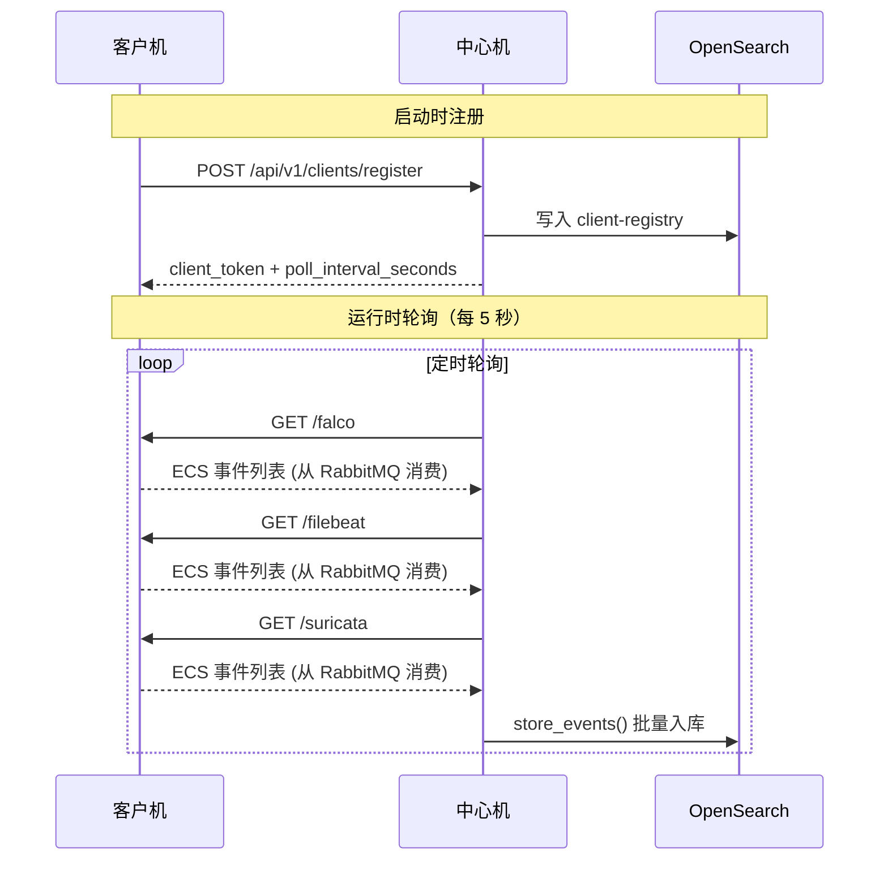

# 客户机 ↔ 中心机接口规范（v1）

## 0. 文档定位

本文只定义“客户机与中心机之间”的接口与协议：

- 中心机提供客户机注册接口（记录 `listen_url/host/capabilities` 等元数据）；
- 中心机定时轮询客户机拉取数据；
- 客户机侧以 RabbitMQ 队列作为采集缓冲。

字段口径见 `81-ECS字段规范.md`；中心机侧轮询与入库的实现说明见 `../../50-详细设计/中心机/61-注册与轮询.md` 与 `../../50-详细设计/中心机/62-OpenSearch存储与索引治理.md`。

## 1. 总体约定（固定）

### 1.1 API 路径与内容类型

- 中心机 API 版本固定为 `v1`，体现在路径 `/api/v1/...`。
- 客户机侧拉取接口为简化实现，不带版本前缀，固定为：`GET /falco` / `GET /filebeat` / `GET /suricata`。
- 所有请求与响应的 `Content-Type` 固定为 `application/json; charset=utf-8`。

### 1.2 鉴权

v1 客户机拉取接口不做鉴权。

> 说明：中心机注册接口仍返回 `client_token` 字段，当前仅用于中心机侧登记/展示；客户机拉取接口不会校验该 token。

### 1.3 幂等与去重

- 事件幂等键为 `event.id`（见 `81-ECS字段规范.md`）。
- 拉取增量由 RabbitMQ 队列语义保证：客户机拉取时会从对应队列中取出消息并 `ack`，消息不会在后续拉取中再次出现。
- 因此 v1 不再使用 `cursor` 作为拉取幂等机制。

### 1.4 交互时序



> **关键理解：**
> - 客户机启动时主动注册到中心机
> - 中心机以固定周期（5 秒）轮询拉取所有数据源
> - RabbitMQ 队列保证增量语义（消费后消息不再出现）
> - 中心机将拉取到的事件批量写入 OpenSearch

---

## 2. 中心机接口：客户机注册

### 2.1 `POST /api/v1/clients/register`

#### Request Body（固定结构）

```json
{
  "client_id": "client-victim-01",
  "client_version": "0.1.0",
  "listen_url": "http://10.0.0.11:8888",
  "host": {
    "id": "h-1111111111111111",
    "name": "victim-01"
  },
  "capabilities": {
    "filebeat": true,
    "falco": true,
    "suricata": true
  }
}
```

约束：

- `listen_url` 必须以 `http://` 或 `https://` 开头；
- `client_id` 必须稳定不变；
- `host.id` 与 `host.name` 必须稳定不变；
- `capabilities` 必须如实反映客户机侧可提供的三类数据源。

#### Response Body（固定结构）

```json
{
  "status": "ok",
  "client_token": "ata_xxx",
  "poll_interval_seconds": 5,
  "server_time": "2026-01-13T12:00:00.000Z"
}
```

约束：

- `poll_interval_seconds` 必须等于中心机环境变量 `CENTER_POLL_INTERVAL_SECONDS` 的实际取值；
- 中心机必须把注册信息写入 OpenSearch `client-registry`（若 OpenSearch 不可用，则注册接口返回错误，不做任何运行时降级）。

## 3. 客户机接口：中心机轮询拉取

客户机侧不再维护本地数据库缓冲；三路数据均进入 RabbitMQ 队列，由拉取接口负责“从队列取出并返回”。

### 3.1 `GET /falco`

返回并消费 Falco 队列中的所有消息（队列名由客户机环境变量 `FALCO_QUEUE`/`RABBITMQ_QUEUE` 决定，默认 `data.falco`）。

#### Response Body（固定结构）

```json
{
  "total": 2,
  "data": [
    { "ecs": { "version": "9.2.0" }, "event": { "id": "evt-..." } },
    { "ecs": { "version": "9.2.0" }, "event": { "id": "evt-..." } }
  ]
}
```

### 3.2 `GET /filebeat`

返回并消费 Filebeat/Sigma 队列中的所有消息（默认 `data.filebeat`）。

响应结构同 3.1。

### 3.3 `GET /suricata`

返回并消费 Suricata 队列中的所有消息（默认 `data.suricata`）。

响应结构同 3.1。

约束（所有 3.x 拉取接口通用）：

- `data[]` 的每个元素必须为合法 JSON 对象（dict），允许两种字段形态：嵌套对象 / 点号扁平键（见 `81-ECS字段规范.md` 0.6）。
- 客户机侧对外返回前必须保证 **稳定 `event.id`**：
  - 当上游消息已包含 `event.id` 时透传；
  - 当缺失 `event.id` 时，按 `81-ECS字段规范.md` 0.5 规则生成：`evt-` + `sha1(raw_payload_bytes)[:16]`。
- 其余公共字段由中心机在入库前执行“最终规范化”（见 `../../50-详细设计/中心机/62-OpenSearch存储与索引治理.md` 与 `81-ECS字段规范.md`）：
  - 三时间字段补齐与 `event.ingested` 覆盖；
  - `ecs.version` 固定为 `9.2.0`；
  - `host.id` 缺失时由中心机按 `h-` + sha1(host.name)[:16] 生成；
  - `event.original` / `message` 缺失时写入空字符串；
  - `event.kind`/`event.dataset` 不合法的文档会在中心机入库前被丢弃。
- 拉取接口不接受 `cursor` / `limit` 参数；增量由队列语义保证。

## 4. 错误码与重试语义

### 4.1 客户机侧错误响应

```json
{
  "error": "..."
}
```

### 4.2 中心机侧错误响应（注册接口）

中心机注册接口的错误响应固定形态为：

```json
{
  "status": "error",
  "error": {
    "code": "BAD_REQUEST",
    "message": "..."
  }
}
```

### 4.3 重试语义（中心机侧）

中心机轮询失败时必须：

1) 将错误写入注册表 `poll.last_error`；  
2) 在下一次 tick 继续重试；  
3) 不得因为单个客户机失败阻塞其它客户机的拉取与后续流程。
