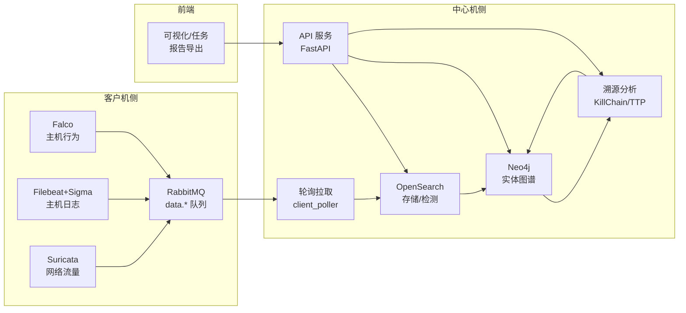
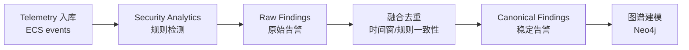
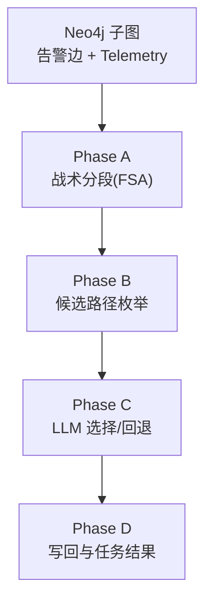

# 作品技术原理介绍

## 文档目的

本文件用于说明本项目从“多源采集”到“检测融合”再到“图谱溯源”的端到端技术原理，面向课程答辩的讲述与评分。

## 引用关系

- 字段口径与示例：见《详细设计报告》中的字段与数据规范章节
- 图谱规范：见《详细设计报告》中的图谱规范章节
- 接口规范：见《概要设计报告》与《详细设计报告》
- 概要设计：见《概要设计报告》
- 详细设计：见《详细设计报告》

## 0. 技术路线概览

本项目采用“多源遥测 -> 统一字段 -> Store-first 检测 -> 图谱化建模 -> 溯源算法 -> 可视化与报告”的技术路线，核心目标是让每条结论都能追溯到可验证的 `event.id` 证据链，同时支持主机行为、主机日志、网络流量三类输入的统一分析 [R1][R3][R4][R5][R6]。

图 0-1 展示系统端到端技术路线：



## 1. 多源采集与 ECS 归一化

主机行为、主机日志、网络流量是常见的三类安全遥测数据，具有覆盖面互补、证据链可交叉验证的优势 [R4][R5][R6][R7]。本项目在客户机侧分别接入 Falco、Filebeat(+Sigma)、Suricata，并统一转换为 ECS 子集字段（详见《详细设计报告》规范章节）。

表 1 给出三类数据源的对比：

| 数据源类别 | 典型数据                         | 采集组件         | 关键字段（示例）                             | 主要价值                   |
| ---------- | -------------------------------- | ---------------- | -------------------------------------------- | -------------------------- |
| 主机行为   | 进程创建、文件访问、网络 syscall | Falco            | `process.*` `file.*` `network.*`       | 细粒度行为链路、进程关系   |
| 主机日志   | 认证日志、系统日志、审计日志     | Filebeat + Sigma | `event.*` `user.*` `log.*`             | 账号与权限变更、持久化证据 |
| 网络流量   | DNS/HTTP/Flow/IDS 告警           | Suricata         | `source.*` `destination.*` `network.*` | 对外通信链路、C2 线索      |

### 1.1 Falco（主机行为）

Falco 基于内核事件或 eBPF 采集 syscall，适合捕获进程创建、文件访问、网络连接等主机行为 [R4]。本项目在 `client/sensor/falco/ecs-converter/` 将 Falco JSONL 输出转换为 ECS 字段，并投递至 RabbitMQ 的 `data.falco` 队列。

关键点：

- 以规则名和事件上下文生成 `event.id`，保证幂等写入
- 保留 `process.parent.*`、`process.executable` 等字段，支持进程链分析

### 1.2 Filebeat + Sigma（主机日志）

主机日志类遥测在业界常由 Wazuh/OSSEC 等 HIDS 处理 [R12]，本项目实现上采用 Filebeat 收集日志并结合 Sigma 规则做检测，达成等价的“主机日志 + 规则检测”能力 [R6][R7]。对应实现位于 `client/sensor/filebeat/`。

关键点：

- `event.dataset` 用于标识日志来源与规则集
- Sigma 告警转为 ECS Finding，统一进入检测融合流程

### 1.3 Suricata（网络流量）

Suricata 通过抓包与 IDS 规则生成 EVE JSON，覆盖 DNS/HTTP/Flow 等网络事件与告警 [R5]。本项目在 `client/sensor/suricata/exporter/` 中将 EVE JSON 转换为 ECS 并投递 `data.suricata` 队列。

关键点：

- 统一对 `source.*` / `destination.*` / `network.*` 建模
- 重点保留域名、协议、端口与告警签名

### 1.4 ECS 归一与 `event.id`

为保证多源可融合、可检索、可溯源，本项目统一遵循 ECS 子集字段规范 [R3]。关键字段如下：

| 字段                                | 说明         | 用途                         |
| ----------------------------------- | ------------ | ---------------------------- |
| `event.id`                        | 全局去重标识 | 幂等写入与证据引用           |
| `event.kind` / `event.category` | 事件类型     | 路由与检测                   |
| `event.dataset`                   | 数据源标识   | 区分 Falco/Filebeat/Suricata |
| `host.id` / `host.name`         | 主机身份     | 资产与图谱归并               |
| `process.*` / `file.*`          | 主机行为实体 | 进程树与文件链               |
| `source.*` / `destination.*`    | 网络通信     | C2 与横向移动                |

## 2. 传输缓冲与中心机轮询

客户机采用 RabbitMQ 作为本地缓冲层，中心机以固定周期轮询拉取增量数据，避免中心机与客户机强耦合 [R10]。队列消息在 `basic.get + ack` 后即被消费，保证“增量语义”。

表 2 为队列与接口对照：

| 队列              | 拉取接口          | 数据源         |
| ----------------- | ----------------- | -------------- |
| `data.falco`    | `GET /falco`    | Falco 主机行为 |
| `data.filebeat` | `GET /filebeat` | 主机日志       |
| `data.suricata` | `GET /suricata` | 网络流量       |

## 3. Store-first 检测与告警融合（OpenSearch）

中心机采用 OpenSearch 作为事件与告警的统一存储与检索引擎 [R8]。流程遵循 Store-first：先入库 Telemetry，再触发检测与融合生成 Findings，确保所有检测结论都有可回放的原始事件。

图 3-1 展示检测融合流程：



表 3 为索引与数据对象对应关系：

| 数据对象          | OpenSearch 索引（示例）  | 说明          |
| ----------------- | ------------------------ | ------------- |
| Telemetry         | `ecs-events-*`         | 统一 ECS 事件 |
| Raw Finding       | `findings-raw-*`       | 检测原始告警  |
| Canonical Finding | `findings-canonical-*` | 融合后告警    |
| Analysis Task     | `analysis-tasks-*`     | 溯源任务状态  |

## 4. 图谱建模与查询（Neo4j）

OpenSearch 擅长检索与统计，但溯源分析需要更强的“关系遍历与路径解释”。因此本项目将 Canonical Findings 与必要的 Telemetry 建模为实体关系图写入 Neo4j [R9]。

表 4 为 ECS 字段到图谱实体/关系的映射：

| ECS 字段/对象                    | 图谱实体   | 关系类型（示例）               |
| -------------------------------- | ---------- | ------------------------------ |
| `host.*`                       | Host       | Host -> Process（运行）        |
| `process.*`                    | Process    | Process -> File（访问）        |
| `file.*`                       | File       | Process -> File（创建/修改）   |
| `source.*` / `destination.*` | IP/Port    | Process -> IP（连接）          |
| `dns.*` / `url.*`            | Domain/URL | Process -> Domain（解析/访问） |

关键原则：

- 以 `event.id` 回写边属性，保证溯源证据可追溯
- 通过 `analysis.*` 字段写回溯源结果（高亮边、任务 ID）

## 5. 关联溯源算法（KillChain）

溯源任务由前端触发，中心机异步执行并写回结果。核心算法遵循“FSA 战术分段 -> 候选路径 -> LLM 选择 -> 写回解释”的流程 [R1][R2]。

图 5-1 展示 KillChain 分析流水线：



表 5 为算法阶段与输出：

| 阶段    | 输入       | 输出              | 目的           |
| ------- | ---------- | ----------------- | -------------- |
| Phase A | 告警边集合 | 战术段（Segment） | 识别攻击阶段   |
| Phase B | 段锚点     | 候选路径集合      | 连接阶段路径   |
| Phase C | 候选路径   | KillChain 结果    | 选择最合理链路 |
| Phase D | KillChain  | 图谱写回/任务文档 | 可视化与报告   |

本项目以 MITRE ATT&CK 的战术维度作为分段依据，并引入回退机制保障在无 LLM 或低置信场景下仍可产出稳定结果。

## 6. TTP 相似度匹配（组织归因）

系统从 Canonical Findings 提取 `threat.tactic.id` 与 `threat.technique.id`，与 MITRE ATT&CK CTI 离线数据进行相似度匹配 [R1][R2]。实现上采用 TF-IDF 向量化与余弦相似度：

```
sim(A, B) = (A dot B) / (|A| * |B|)
```

输出 Top-3 相似组织及关键 techniques，作为溯源解释的补充证据。

## 7. 前端可视化与报告导出

前端采用 Next.js App Router，实现图谱渲染、任务管理、进度轮询与报告导出（接口定义见《概要设计报告》《详细设计报告》）。

主要能力：

- 图谱按时间窗拉取，突出告警边与溯源路径
- 任务面板展示任务状态与溯源结论
- 报告导出输出时间线摘要、关键证据与 TTP 归因

## 8. 质量与一致性保障

表 6 总结关键工程策略：

| 策略         | 说明              | 目的           |
| ------------ | ----------------- | -------------- |
| 幂等写入     | `event.id` 去重 | 防止重复入库   |
| 单定时器轮询 | 严格顺序执行      | 避免数据漂移   |
| 固定时间窗   | 统一查询边界      | 结果可复现     |
| 统一字段规范 | ECS 子集          | 跨源融合一致性 |
| 写回边属性   | `analysis.*`    | 前后端一致展示 |

## 9. 项目实现绑定点

- 客户机采集：`client/sensor/falco/` `client/sensor/filebeat/` `client/sensor/suricata/`
- 队列与拉取 API：`client/backend/`
- 中心机轮询与存储：`backend/app/services/client_poller.py` `backend/app/services/opensearch/`
- 图谱建模与查询：`backend/app/services/neo4j/`
- KillChain/TTP：`backend/app/services/analyze/`
- 前端展示与导出：`frontend/app/` `frontend/components/`

## 10. 参考资料与链接

- [R1] MITRE ATT&CK: https://attack.mitre.org/
- [R2] MITRE CTI (STIX Bundle): https://github.com/mitre/cti
- [R3] Elastic Common Schema (ECS): https://www.elastic.co/guide/en/ecs/current/index.html
- [R4] Falco Documentation: https://falco.org/docs/
- [R5] Suricata Documentation: https://docs.suricata.io/
- [R6] Filebeat Documentation: https://www.elastic.co/guide/en/beats/filebeat/current/index.html
- [R7] Sigma Rules: https://sigmahq.io/
- [R8] OpenSearch Security Analytics: https://opensearch.org/docs/latest/security-analytics/
- [R9] Neo4j Documentation: https://neo4j.com/docs/
- [R10] RabbitMQ Documentation: https://www.rabbitmq.com/documentation.html
- [R11] OpenSearch Project: https://opensearch.org/docs/latest/
- [R12] Wazuh Documentation: https://documentation.wazuh.com/
